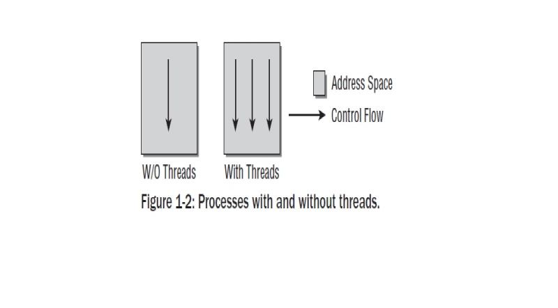

Chapter 1:Introduction and Overview
===================================

 본책을 읽기 위해서는 C 프로그래밍에 대한 기본 지식이 있어야 한다. 커널은 C 프로그래밍의
 진보된 기술을 사용하고 무엇보다도 C GNU 컴파일러를 사용하기때문이다.
 Appendix C에는 훌륭한 프로그래머조차도 친숙하지 않은 파이너 포인터 C를 기술하였다.
 컴퓨터 구조들에 대한 기본 지식은 시스템 하드웨어와(특히 CPU) 직접적으로 필수적으로 상호작용을
 하는 리눅스로서는 유용하게 될것이다.
 그리고 여기에 주제들과 관련된 많은 도입 내용들이 부수적으로 추가되었고, 일부는 참고 섹센에
 두었다.
 좀더 깊이가 있는 CPU를 다룰때( 대부분 IA-32,AMD64를 다뤘고 이 구조는 리눅스에서 가장 최우선으로
 아키텍처로 삼고 있다) 좀더 상세한 관련된 하드웨어를 설명하였다.
 일상적인 삶에서 유비쿼터스하지 않은 메카니즘을 설명할때,그 뒤에 숨어 있는 일반적인 개념들을
 설명하게 될것이다. 따라서 독자들은 그 특별한 특성들이 유저스페이스로 사용되는지에 대해서는 참고로
 읽어야 될것이다.
 이 장에서는 커널의 다양한 영역의 모습들과 다음장에서 다루게 될 각 하위시스템의 좀더 심도있는 관찰에 앞서
 기본적 관계를 다르게 될것이다.

 커널은 빠르게 진화되어왔기때문에 자연스럽게 드는 의문은 어떤 버젼을 이 책에서 다루었느냐이다.
 나는 이책에서 2008년 1월에 릴리즈된 커널 2.6.24를 기준으로 다루었다.
 커널 발전의 다양한 본성은 앞으로 독자들이 읽을때쯤의 새로운 버젼의 커널을 암시할 것이다.
 일정부분은 바뀌게 될것이다. 이것은 회피할 수 없는것이며 이렇게 되지 않았다면 리눅스는 사장되고
 지루한 시스템이 될것이다. 어떤 부분은 변한 반면 기본적으로 컨셉들은 변하지 않을것이다.
 특히나 커널 2.6.24는 이전 버젼과는 확연히 다르게 기본적인 변화들이 있었다.
 개발자들은 이러한 부분들을 너무 많이 성토하지 말길 바란다.

1.1 Task of the Kernel
------------------------
   순수한 기술적 레벨에서 커널은 하드웨어와 소프트웨어의 중간단계이다.
   이것의 목적은 어플리케이션에서의 요청을 하드웨어로 전달하고 시스템의 콤퍼넌트와
   드라이버의 번지수를 지정하는 하위레벨 드라이버로서 동작한다.
   그럼에도 불구하고 또다른 커널을 보는 재미 있는 점이 있다.

  * 커널은 어플리케이션 관점에서 상위레벨에 있는 컴퓨터를 추상화할 수 있는 진보된 기계로
    간주될 수 있다. 예를 들면 커널이 하드디스크를 주소로 할때 그 명령이 어떤 경로를 통해
    디스크로 보내져야 하는지 데이터가 존재하는곳인 디스크에서 메모리로 데이터를
    복사할수 있는 경로를 결정해야 한다. 반면 어플리케이션은 그 데이터가 전달되야 하는
    명령을 발행할 필요만 있다.
    어떻게 이것이 실행되는지는 어플리케이션과는 상관이 없다.상세한것은 커널에 의해 추상화
    되어진다.어플리케이션 프로그램은 하드웨어 자체과 접촉하지 않는다.그들이 알고 있는
    하이러키에서 가장 낮은 레벨을 표현하는 커널만이 접촉을 한다.
    따라서 진보된 기계라고 말할 수 있다.

  * 리소스 매니저로서 커널을 본다는것은 여러 프로그램들이 시스템내에서 동시에 실행된다는것을
    정당화하는 것이다. 이러한 경우에 커널은 동시간대에 시스템을 통합에 신뢰성을 주면서
    다양한 시스템 프로세서간 CPU 타임,디스크 공간,네트웍 연결등에 대한 가능한
    리소스를 공유하는 인스턴스이다.

  * 커널의 또다른 관점은 일련의 시스템에 관련된 명령어들을 제공하는 라이브러리 관점에서
    본다는 것이다. 일반적으로 알듯이,시스템콜은 컴퓨터에 요청을 보낼때 사용되어 진다.
    스탠다드 C 라이브러리 도움말에 의하면, 이러한 것들은 어플리케이션들은 동일한 방법으로
    생성된 일반적인 함수내지 다른 함수로 나타나게 된다.

1.2 Implementation Strategies
-------------------------------
  여기에는  운영시스템의 근간이 되는 두가지 패러다임이 있다.

    - Microkernles
      이것들은 유일한 기본 함수들로서 커널의 중앙부에 구현된다. 모든 다른 함수들은 명확히
      정의된 통신 인터페이스를 통해 중앙부의 커널과 통신하는 자발적인 프로세스들을 대표하게
      된다. 예를 들면 다양한 파일시스템,메모리관리 등이다.( 물론,마이크로 커널안에서 그것
      자체로 시스템과 통신을 컨트롤하는 메모리 관리의 가장 근간이다 어쨋든 시스템콜 레벨을
      다루는것은 외부 서버들에서 구현되어진다.)
      이론적으로 이것은 개별적 부분들이 서로 각각 명확하게 분리되어 있기때문에 매우 우아한
      접근이 된다. 이것은 프로그래머들에게 "클린" 프로그램 기술을 사용하도록 종용하게 된다.
      이러한 접근의 다른 잇점은 다양한 확장성과 러닝타임에 중요한 콤퍼넌트를 스왑할 수 있는
      능력이다.
      그러나 부수적인 CPU 타임을 소유하는것은 컴포턴트들간의 복잡한 통신을 지원할 필요가 있게
      된다.
      마이크로 커널이 현재까지 다양하고 활동적인 연구의 주제로 존재해왔을지라도 그것 자체로
      실제로 만들어지지는 않았다.

    - Monolithic Kernels
      여기에는 보완적이고 전통적인 컨셉이 있다. 여기 커널의 모든 코드- 메모리 관리,파일시스템
      ,디바이스 드라이버같은 서브시스템을 포함하여- 는 하나의 화일로 구성되어진다.
      각 함수들은 커널의 다른 파트에 접근이 가능하다. 이것은 많은 프로그래밍이 많은 주의를
      기울이지 않으면 노력이 필요한 폐쇄된  코드로 결과를 낳을 수 있다.

   현시점에서 Monolithic 커널이 Microkernel 보다 성능상 더 크기때문에 리눅스는 아직도 이러한
   패러다임에따라 구현되어 진다.
   어쨋든, 하나의 중요한 점이 소개되어진다.
   시스템이 로드되고 실행되는 동안 추가되고 삭제되어질 수 있는 커널 코드를 가지는 모듈은
   커널의 모든 범위의 함수들에 다이나믹하게 추가를 지원하게 된다. 따라서 Monolithic 커널의
   단점을 보완하게 된다.
   이것은 커널과 모듈의 핫플러깅과 다이나믹 로딩을 구현하는것을 승인하는 유저랜드와 통신을
   통해 많은 힘겹게 도움을 준다.

1.3 Elements of the Kernel
-----------------------------

 이 장에서는 커널의 다양한 구성요서를 간략한 설명을 제공한다. 그리고 다음장에서 좀더 자세히 설명할
 영역의 아웃트라인을 설명한다.
 획일적인 접근에도 불구하고 리눅스는 놀랍게도 아주 잘 구조화되어 있다.
 그렇지만,그 각각의 엘리먼트들은 상호작용을 한다는것은 필연적이다. 그들은 데이터 구조체를 서로
 공유하고 엄격히 분리된 시스템에서 필요로 될지도 모르는 그 이상으 함수들을 통해 서로가 상호작용을
 하고 있다.
 다음장에서는 내가 앞으로의 참고는 최소화 하고자 하는 노력임에도 불구하고
 커널의 다른 요소들에게  따라서 다른 장에서도 잦은 참고를 하게 되는 내용을 다룬다.
 여기서 각 개별 구성요소를 소개하고 전체적으로 그 역할과 그 위치를 알려주고자 한다.

 다음 그림 Fig1-1은 완전한 리눅스 시스템을 구성하는 레이어들의 대략적인 그림, 그리고 그 하위
 중요 시스템을 표시하였다.
 그림에서는 표시하지 않았지만 각각의 하위 시스템은 다양한 부수적인 방법으로 상호 작용을 한다는
 것을 명심하길 바란다.

  .. image:: ./images/Fig1-1.png

1.3.1 Processes, Task Switching, and Scheduling
~~~~~~~~~~~~~~~~~~~~~~~~~~~~~~~~~~~~~~~~~~~~~~~
   유닉스내에엇 돌아가는 어플리케이션들,서버들,다른 프로그램들은 전통적으로 프로세스를 참고한다.
   각 프로세스는 CPU의 가상 메모리 공간내에 주소값을 할당 받는다.
   각 프로세스의 주소값은 그 프로세스가 서로를 인식 못할만큼 전적으로 독립적이다.
   서로의 프로세스가 관여하는한 시스템의 유일한 프로세스 되는것 같은 인상을 가진다.
   만약 프로세스들이 서로 데이터 교환을 하고자 하면, 예를 들면 특별한 메카니즘이
   사용되어져야 한다.

   리눅스는 멀티 태스킹 시스템이기때문에 여러 프로세스들이 동시 실행되어지는것을 지원한다.
   시스템에 있는 CPU 만큼 많은 프로세스들이 동시간대에 실행될 수 있다.
   동시 프로세싱의 인상을 줄 짧은 시간에 프로세스들간 스위칭을 커널은 수행한다.

     - 1
       커널은 CPU의 도움을 얻어 태스크 스위칭의 기술적 상세함의 의무가 있다.
       각 개별 프로세스는 CPU가 항상 가용하다는 암시가 주워져야 한다.
       이것은 CPU 리소스가 해제되거나 프로세스가 아이들 상태로 가기전에 프로세스의
       모든 상태 의존적인 요소들을 저장함으로서 달성된다.
       프로세스가 재가동 될때 정확히 저장된 상태가 복원된다.
       프로세스들간의 스위칭은 태스크 스위칭으로 알려져 있다.

     - 2
       커널은 어떻게 CPU 타임이 존재하는 프로세스들간에 공유되는지 결정해야 한다.
       중요한 프로세스는 CPU 타임의 많은 부분을 ,덜 중요한 프소세스는 좀더 적게 주워진다.
       어떤 프로세스가 얼마나 오랫동안 실행되어져야 하는것을 결정하는것을 스케줄링이라 한다.

1.3.2 Unix Processes
~~~~~~~~~~~~~~~~~~~~~

  리눅스는 각 프로세스가 부모 프로세스에 의존적인 계층 스키마를 가지고 있다.
  커널은 시스템 초기화 동작에 대한 책임을 지고 있는 처음 프로세서로 init 프로그램을 개시한다.
  그리고 로그인 프롬프트를 표시하거나 그래픽 로그인 인터페이스를 표시한다.
  Init은 따라서 모든 프로세스가 기원이 되는 근원이다.
  pstree 프로그램에 의해 그래픽으로 보여진것처럼, 트리의 브랜치가 더 나아가거나 내려오는
  트리구조의 맨 상단에 있다.

  .. code-block:: console

    $ pstree

 .. image:: ./images/Fig1-1_00000.png

  어떻게 이런 트리가 확장해가느냐는 새로운 프로세스가 어떻게 생성되어가느냐에 아주 밀접하게 연관이 있다.
  이러한 목적으로 유닉스는 fork 와 exec라는 메카니즘을 사용한다.

  - 1. fork
       부모 프로세스의 PID값만 유일하게 다른 현재 프로세스의 정확한 복사본을 만든다. 시스템 콜이 실행된후
       시스템에는 동일한 액션을 취하는 두개의 프로세스가 존재한다.초기 프로세스의 초기 메모리 내용이 복사가
       된다- 최소한 프로그램의 관점에서.  리눅스는 잘 알려진 기술로서 다른 부모 또는 자식 프로세스가 페이지에
       쓰고자할때까지의 복사 동작과 다른 좀더 효과적인 동작인 copy on write 가 있다 - read-only 접근만이
       둘에 대한 동일 페이지를 만족시킬 수 있을 것이다.
       fork를 사용한 가장 가능한 시나리오는, 예를 들자면 ,유저가 두번째 창의 부라우저를 오픈할때이다.
       상응하는 옵션이 선택되면 브라우저는 코드를 복사하는 fork를 실행하고 자식 프로세스에서 새로운 윈도우를
       만들기위해 적당한 동작을 시작한다.
 - 2. exec
       존재하는 콘테츠속으로 새로운 프로그램을 로드하고 실행하는것이다. 이전 프로그램에서 예약된 메모리 페이지는
       사라지고 그들의 콘테츠들은 새로운 데이터로 대체된다. 새로운 프로그램은 실행을 시작한다.

Threads
~~~~~~~~~
   프로세스들은 커널에 의해서 제공되는 유일한 프로그램 실행포맷은 아니다. 무거운 프로세스들과 더불어-
   전통적인 유닉스 프로세스들의 또다른 이름- 트레드라는 것이 있다. 이것은 가벼운 프로세스들로 대표된다.
   그것들은 한동안 회자되어왔고 기본적으로 하나의 프로세스는 모두 동일한 데이타와 리소스를 가지는 여러개의
   트레드로 구성되었을지도 모르지만 프로그램 코드를 통해 다른 루트를 가지고 있을지도 모르겠다.
   트레드라는 컨셉은 많은 현재의 프로그램 언어에 도입되었고-예를 들면 자바.간략히 정리하면 하나의 프로세스는
   실행프로그램으로 보여질 수 있다. 반면 하나의 트레드는 프로그램 함수 또는 메인 프로그램과 병행해서 실행되는
   루틴이다.
   보통 브라우저는 병행 인스턴스를 생성하기 위해  여러개의 fork 와 exec 호출 실행을 해야만 한다; 이러한 것들은
   이미지들을 로딩하는 것이나 어떤 종류의 통신 메카니즘을 통해 메인 프로그램에 필요한 데이터를 만드는데 사용되어
   진다.
   트레드들은 이러한 상황을 다루기 쉽게 만든다. 브라우저는 이미지 로당할 루트를 정의하고 루틴은 여러가닥을(각각 다른
   대입변수를 가진)가진 트레드로 시작된다.
   트레드와 메인프로그램은 메인프로램에서 존재하면서 자동으로 받게되는 동일한 주소값과 데이터를 공유하기때문에
   어떤 통신을 위한 노력이 필요없다. 다만 예외적으로 트레드가 동일한 주소값을 접근하면서 상호 겹치는것을 방지하기
   위한 것은 있다.
   Figure 1-2 트레트가 있고 없는 프로그램의 차이를 나타낸다.

