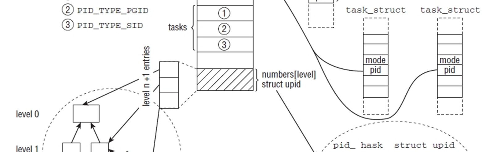

Chapter 2 : Process Management and Scheduling
################################################

현대의 모든 운영 시스템은 동시에 여러개의 프로세스를 실행시킬 수 있다- 최소한 이것은 유저가 얻을 수 있는 감동이다.
만약 시스템이 단일 프로세서를 가지고 있다면, 주어진 시간에 단지 하나의 프로그램만 실행시킬 수 있다. 다중 프로세서
시스템에서는 병렬로 실제로 실행할수 있는 프로세서의 갯수는 물리적 CPU의 숫자에 의해 결정된다.

커널과 프로세서는 멀티태스킹의 환상을 만든다- 병렬로 여러개의 동작을 수행할 수 있는 능력-빠른 시간안에 시스템에
돌아가는 다른 어플리케이션간의 반복된 스위칭을 통해. 스위칭 간격이 짧기때문에,유저는 비활성의 짧은 개입 시간을
주의하지 못한다.

이러한 시스템 관리는 커널이 해결해야 할 몇가지 이슈들이 있다, 그것들중에 가장 중요한 것은 다음과 같다.

   - 어플리케이션은 이것이 명시적으로 원하지 않게되면 다른것과 인터페이스 하지 말아야 한다. 예를 들면 , 어플리케이션
     A에서 발생한 에러는 어플리케이션 B에 파급되지 말아야 한다. 리눅스는 멀티유저 시스템이기때문에,프로그램들은
     다른 프로그램의 메모리 영역을 읽고 수정할 수 없도록 되어야 한다. 다른말로, 그것은 다른 유저의 사적 데이터를
     접근하기가 극단적으로 쉽다는 것이다.

   - CPU 시간은 다양한 어플리케이션간 가능한 공정하게 공유되어져야 한다. 반면, 어떤 프로그램은 다른것들보다 좀더 중요한
     것으로 간주되어 진다.

나는 첫번째 요구사항을-메모리 보호-3장에서 다룬다. 이 장에서는 프로세스들간 CPU 타임을 공유하고 스위칭하기 위하여
커널이 도입하는 방법들에 관심을 기울였다. 이런 이중적인 태스크는 각자 상대적으로 독립적으로 수행될 2개의 파트로
쪼개진다.

   - 커널은 얼마나 많은 시간을 개별 프로세스에 기여해야 하는지 그리고 어떤때 다음 프로세스로 스위칭해야 되는지
     결정해야만 한다. 이것은 어떤 프로세스가 실제로 다음순인가에 대한 질문을 낳게 한다.이러한 종류의 결정은
     플랫폼 의존적이지 않다.

   - 커널이 프로세스 A에서 프로세스 B로 스위칭할때,B 실행환경을 실행하는 것은 프로세서 리소스가 철회되었을때와
      동일해야 한다는 것을 확인해야 한다. 예를들면,프로세서 레지스터의 내용물과 가상 주소 공간의 구조와 동일해야만
      한다.
      이런 후자 태스크는 프로세서 타입에 지극히 의존적이어야 한다.그것은 C 로서만 구현될 수 없고 순수 어셈블러의
      도움이 필요로 한다.

양쪽의 태스크는 스케줄러라고 불리는 커널 하위시스템의 역할이다. 할당된 CPU 타임이 어떻게 프로세스간 스위칭을 위해 필요한
태스크 스위칭 메카니즘으로부터 완전히 분리된 스케줄러 정책에 의해 결정되는지이다.

2.1 Process Priorities
==========================

모든 프로세스가 동등하게 중요한 것은 아니다. 프로세스 우선권에 추가하여,대부분의 독자들은 이것에는 친숙하지만, 여기에는
다른 요구를 만족할만한 색다른 중요한 클래스들이 있다. 우선 대략적인 구별로, 프로세스들은 실시간 프로세스와 비실시간
프로세스로 구분지을 수 있다.

   - 엄격한 실시간 프로세스들은 어떤 태스크가 완료되어지기까지 엄격한 시간 제한을 가지게 되어 있다.항공기 운행 컨트롤
     명령을 컴퓨터에 의해 실행된다면,그런 명령들은 가능한 빨리 주어진 시간안에 예측되어져야만 한다. 예를 들면,만약 비행기가
     착륙시도중이며 파일럿이 코를 풀고 싶으면, 컴퓨터가 몇초후에 명령들을 예측한다면 목적에 맞지 않다. 이시간까지,항공기는
     코를 먼저 풀고 지상에 착륙되어져야 한다. 엄격한 실시간 프로세스들의 중요한 특성은 그것들이 주어진 시간안에
     실행되어져야만 하는것이다. 이것은 타임 프레임이 특별히 짧다는 것을 암시하지는 않는다. 대신에 시스템은 비호의적이거나
     역행하는 상황이 성행할때일지라도어떤 시간 프레임이 결코 초과되지 않아야 된다는 것을 확신해줘야 한다.

     리눅스는 적어도 바닐라 커널에서는 엄격한 실시간 프로세싱을 지원하지 않는다. 이러한 기능을 제공하는 RTLlinx,Xenomai,
     RATI같은 수정된 버젼도 있다. 리눅스 커널은 이러한 접근에 있어서 분리된 프로세스로 운영된다. 그리고 덜 중요한
     소프트웨어로 다루게 된다. 반면 실시간 일은 커널밖에서 행해진다. 커널은 실시간이 필요한 액션들이 수행되지 않을경우
     에만 수행된다.

     리눅스가 시스템 효율에 최적화되어 있고 가능한 빨리 일반적 케이스를 다루려고 노력하기 때문에, 충분한 응답 시간이
     성취하기 매우 어렵다. 그럼에도 불구하고 모든 커널의 잠복을 줄이기 위해 지난 수년동안, 말하자면 요청을 만드는 것과
     그것을 이행하는것 간에 소비된 시간,많은 노력이 만들어져왔다.그런 노력은 선점할 수 있는 커널 메카니즘,실시간 뮤텍스
     ,이책에서 논하는 새로운 완전한 정당한 스케줄러를 포함하고 있다.

   - 소프트 실시간 프로세스들은 엄격 실시간 프로세스들의 약간 완화된 형태이다. 즉시 응답이 아직도 요구될지라도, 그것은
     그것들이 도착하는데 좀 늦어진다고 세상이 끝나는것은 아니다. 소프트 실시간 프로세스의 예제는 CD에 쓰기동작이다.
     데이터가 계속적인 스트림으로 미디어에 써져야 하기때문에 데이터는 일정속도로 CD 라이터에 의해 받아져야만 한다.
     시스템 로딩이 너무 높으면 데이터 스트림은 잠시 방해를 받을지도 모른다.이것은 CD가 깨지는  것보다 훨씬 덜 과감하게
     CD를 쓸수 없게 만든다. 그럼에도 불구하고 쓰기 프로세스는 모든 다른 프로세스보다 더 필요하다면 CPU 타임을 항상
     보장해줘야 한다.

   - 대부분의 프로세스는 특별한 시간 제약을 갖지않고 그들에게 우선권을 부여함으로써 좀 더 중요하던지 덜 중요하던지 하는
     뷴류를 할 수 있는 일반적인 프로세스이다.
     예를 들면, 오랜 컴파일러 실행 또는 숫자 계산은 유저가 알수 없을만큼 1~2초정도 연산이 방해되어진다면 중요하지 않기때문에
     무척 낮은 우선권을 가진다. 반대로,비활성된 어플리케이션은 유저가 악명높게 참을성이 없기때문에 유저 커맨드에 가능한
     빨리 응답해야 한다.

CPU 시간의 할당은 Figure2-1 처럼 좀더 간략한 형태로 그려질 수 있다. 프로세스들은 타임 조각에 흩어져 있다.그리고 그들에게
할당된 조각 공간은 그들의 상대적인 중요성에 따른다. 시스템에서 시간 흐름은 원은 회전에 따르고 CPU는 원의 원주에 스캐너처럼
표현된다. 넷 이펙트라는것은 중요한 프로세스가 덜 중요한 프로세스들보다 CPU 타임을 좀더 확보한다는 것이다.

.. image:: ./img/fig2_1.png

이러한 구조에서,선점적인 멀티태스킹으로 알려진, 각 프로세스는 그것이 실행될 동안 특정 시간을 할당 받는다.일단 이 기간이
지나면, 커널은 프로세스로부터 컨트롤을 회수한다. 그리고 이전에 실행된 마지막 태스크에 상관없이 다른 프로세스가 실행되도록
한다.그것의 실행 환경은 -기본적으로 모든 CPU 레지스터와 페이지 테이블- 물론 결과가 사라지지 않도록 그리고 프로세스
환경이 또다시 돌아왔을때 완전히 회복될 수 있도록 저장된다. 시간 조락의 길이ㅣ는 프로세스의 중요성에 따라 변한다.( 그리고
그것에 우선권이 할당된다). Figure 2-1은 개별적 프로세스에 다른 사이즈의 세그먼트를 할당함으로써 이것을 보여 준것이다.

이러한 간략화된 모델은 몇개의 중요한 이슈들에는 고려되지 않는다. 예를 들면, 프로세스들은 그들이 실행할 것이 없다면
어떤 시간에는 실행할 준비가 안되어 있을지 모르겠다. 가능한 CPU 시간을 적당하게 사용하는것이 기본이기때문에 , 그러한
프로세스들은 실행을 못하게 되어져야만 한다. 이것은 모든 프로세스는 항상 실행을 준비하고 있어야 된다고 가정되기때문에
Figure2-1에서는 확실하지 않다. 또한 관과해야할 사실은 리눅스는 다른 스케줄링 클래스를 지원한다는것이다. ( 완전히 프로세스
들간 정당한 스케줄링 그리고 실시간 스케줄링),그리고 이것들은 스케줄링동안 고려되어져야만 한다. 거기에는 실행대기중인
중요한 프로세스들로 현재 프로세스를 대체하는 옵션이 없다.

프로세스 스케줄링은 커널 개발자들간에 커널에 대한 매우 열정적이고 흥미진지한 토의를 하게 한다,특히 가장 가능한 알고리즘을
선택하게될때이다. 하나의 스케줄러의 질적인 부분을 위해서 양적인 방법을 찾는것은 매우 어려운-가능하지 않지만- 태스크이다.
그것은 또한 리눅스 시스템이 당면한 많은 다른 업무량에 의해 표출된 요구사항을 스케줄러가 맞추기 위해서는 도전적인
태스크이다: 자동제어를 위한 작은 임베디드 시스템은 대형 컴퓨터보다는 좀 다른 요구사항을 갖는다,반면 이런것들은
멀티미디어 시스템들과는 상당히 틀리다. 사실 스케줄러 코드는 최근에 2개의 완전히 새로썼다.

   1. 2.5시리즈 개발동안, 소위 O(1) 스케줄러는 이전 스케줄러로 대체되었다.이 스케줄러의 특별한 특징은 시스템에서 동작하는
   프로세스의 갯수에 상관없이 일정시간에 업무를 수행할 수 있다는 것이다.그 디자인은 이전에 채택된 스케줄링 아키텍처를
   근본적으로 깨뜨렸다.

   2. 완전한 페어 스케줄러는 커널 2.6.23 개발동안 포함되었다. 새로운 코드는 인터렉티드 태스크가 빨리 응답할 수 있도록
   이전 스케줄러에서 요구되었던 많은 발견적 교수법을 포기함으로서 이전 원리로부터 완전한 거리감을 주었다는 것이다.
   이 스케줄러의 중요한 특성은 가능한 근접하게 이상적인 페어 스케줄링을 닮으려고 노력하는 것이다.
   부가적으로, 그것은 단지 개별적인 태스크를 계획하지는 않고 보다 일반적인 스케줄잉 엔티티로 동작한다.
   이것은,예를 들면,모든 다른 유저들의 프로세스들간에 가용 시간을 분배하도록 한다.
   나는 이 스케줄러의 구현을 아래에 상세하게 논한다.

우리가 어떻게 스케줄링이 커널에서 구현되었는지를 관심갖기전에,하나으 프로세스가 가질지도 모르는 그 상태를 논하는것이
유용하다.

2.2 Process Life Cycle
=========================

하나의 프로세스는 항상 실행할 준비를 하고 있는것은 아니다.때때로,컨트롤밖에 있는 외부 소스로부터 이벤트를 기다려야만
한다- 예를들면,텍스트 에디터에서 키보드 입력. 이벤트가 발생할때까지, 프로세스는 동작할 수 없다.

스케줄러는 태스크간 스위칭을 할때 시스템에서 모든 프로세스의 상태를 알아야 한다; 그것은 명백하게 아무것도 하지 않는
프로세스에 CPU 타임을 할당한다는 의미는 아니다. 개별 프로세스 상태간 변이는 중요하다. 예를 들면, 하나의 프로세스가
병렬 디바이스로부터 데이터를 기다리고 있다면, 그것은 스케줄러가 일단 그 데이터를 받게되면 프로세스 상태를 대기에서
실행으로 바꾸는 역할을 가지고 있다.

하나의 프로세스는 다음 상태중 하나를 가지고 있다:

   - Running - 그 프로세스는 순간 실행된다.
   - Waiting - 그 프로세스는 실행할 수 있지만 CPU가 다른 프로세스에 할당되었기때문에 허락되지 않는다.
               스케줄러는 원한다면 다음 태스크 스위칭에서  프로세스를 선택할 수 있다
   - Sleeping - 그 프로세스는 잠자고 있으며 다른 외부적인 이벤트를 기다리고 있기때문에 실행할 수 없다.
                그 스케줄러는 다음 태스크 스위칭에서 그 프로세스를 선택할 수 없다.

시스템은 모든 프로세스들을 하나의 프로세스 테이블에 저장한다. - 그것들이 실행하던지,잠자고 있던지,대기하고 있던지 상관
없이, 어쨌든,잠자고 있는 프로세스들은 그것들이 실행 준비가 되지 않았다는것을 알 수 있도록 특별히 표시되어진다.
(섹션 2.3에 이것이 어떻게 구현되었는지 볼수 있다). 거기에는 또한 잠자고 있는 프로세스들을 적당한 시간에-예를 들면
그 프로세스가 일어나기를 바라고 있는 외부 이벤트가 있을때-깨울수 있도록 그룹화할 수 있는 많은 큐들이 있다.

Figure2-2는 몇개의 프로세스 상태와 변이를 보여준다.

.. image:: ./img/fig2_2.png

누적된 실행 프로세스들과 다양한 변이으 실험을 시작해 봅시다;그 프로세스는 실행할 준비가 되었지만 CPU가 다른 프로세스에
할당되어 있기때문에 허락되지 않는다.(그 상태는 따라서 대기상태이다). 그것은 스케줄러가 CPU 시간을 허락할때까지 이 상태로
남아있다.일단 이것이 발생하면,이 상태는 실행단계로 변화된다(path 4).

스케줄러가 그 프로세스로부터 CPU 리소스를 철회하기를 결정할때-나는 짧게 그 이유를 다룬다- 그 프로세스의 상태는 실행에서
대기상태로 변화하고 사이클은 새롭게 시작된다.거기에는 사실상 그것들이 신호에 의해서 방해되어질 수 있는지 없는지에 따라
달라지는 2개의 잠자는 상태가 있다. 순간, 이러한 차이점은 중요하지 않고,우리가 그 구현을 좀더 면밀히 조사할때 관련성이
있다.

만약 프로세스가 이벤트를 기다려야만 한다면,그 상태는 실행에서 슬리핑 상태로 변한다(path 1).어쨌든,그것은 슬리핑에서 실행단계로
바로 변화할 수 없다; 일단 대기하고 있던 이벤트가 발생하기만 하면,프로세스는 대기 상태(path 3)로 돌아가고 일반적인 사이클로
돌아간다.

일단 프로그램 실행이 종료가되면(예를들면, 사용자가 그 프로그램을 종료한다),그 프로세스는 실행단계에서 정지상태로 변한다
(path 5)

위에서는 언급되지 않은 특별한 프로세스는 좀비 상태이다. 이름이 말하듯이, 그러한 프로세스들은 존재하지 않지만 아직도
다소 살아있다. 실제로 그것들은 그들의 리소스가 다시 실행될 수 없고 결코 발생되지 않도록 이미 해제되었기때문에
죽는다(RAM, 병렬연결등). 어쨌든, 프로세스 테이블에서 그것들의 출입이 있기때문에 아직도 살아있다.

어떻게해서 좀비가 나올까? 그 이유는 유닉스하에 있는 프로세스 생성 종료 구조에 있다.  하나의 프로그램은 2개의 이벤트가
발생할때 종료된다- 첫째 그 프로그램은 다른 프로세스에 의해 또는 유저에 의해  종료되어져야만 한다(이것은 보통 정상적으로
프로세스를 종료시키는 SIGTERM또는 SIGKILL을 보냄으로써 이루어진다); 두번째로, 그 프로세스의 기원인 부모 프로세스는 자식
프로세스가 종료될때 wait4 시스템 콜을 활성화 하거나 이미 활성화 시켜야 한다. 이것은 부모 프로세스는 자식 프로세스의
종료를 인식하고 있다는 것을 커널에게 확인시켜 주는 것이다. 시스템 콜은 자식 프로세스에 의해서 점유되어지는 리소스를
커널이 해제하도록 해준다.

좀비는 두번째(wait4)가 아니고 첫번째 상태가 적용될때(그 프로그램이 종료되었을때) 발생된다. 하나의 프로세스는 종료와
프로세스 테이블에서 자신의 데이터를 제거하는 사이에 아주 짧게 좀비 상태로 항상 변한다.어떠한 경우에 (예를 들면
부모 프로세스가 나쁘게 프로그램되어 있고 wait 콜을 발행하지 않을때), 좀비는 확고히 자기 자신을 프로세스 테이블에
적재할 수 있고 다음 리부팅때까지 그곳에 남아 있다. 이것은 ps 나 top같은 프로세스 툴의 결과를 읽어봄으로써 볼수 있다.
이것은 커널에서 아주 작은 공간을 차지하는 남아있는 데이타로서 문제가 거의 되지 않는다.

2.2.1 Preemptive Multitasking
--------------------------------

리눅스 프로세스 관리의 구조는 2개의 심도있는 프로세스 상태 옵션을 필요로 한다- 유저 모드와 커널모드. 이런것들은
모든 근래의 CPU들은 적어도 2개의 다른 실행모드를 가진다는 사실을 대변한다. 다른 하나는 다양한 제한 조건을 가지는반면
다른 하나는 무한한 권한을 가진다- 예를들면,어떤 메모리 영역에 접근은 제한되어질 수 있다. 이러한 차이점은  기존의 프로세스
들을 유지하고 그것들을 시스템의 다른 부분으로부터 방해받지 못하도록 하는 폐쇄된 새장을 만드는것에 중요한 선결조건이다.

보통 커널은 자기 자신으 데이터를 접근하고 시스템에 있는 다른 어플리케이션을 방해할 수 없는 유저모드에 있다-그것은 보통
커널 주변에 다른 프로그램이 있다는것조차 알리지 않는다.

하나의 프로세스가 시스템 데이터나 함수를 접근하고자 한다면(후자는 모든 프로세스들간에 공유되어지는 리소스들을 관리한다
,예를들면, 파일시스템 공간),그것은 커널모드로 변환되어야 한다. 명확하게, 이것은 컨트롤에 리고 명확하게 정의된 경로를 통해
의해서만 단지 가능하다-그렇지 않으면 모든 성립된 보호 메카니즘은 넘쳐나게 될것이다.1장에서 시스템 콜은 모드간 전환할 수
있는 유일한 방법이라고 짧게 언급했다. 13장에서는 그러한 콜에 대한 구현을 심도있게 논할것이다.

유저모드에서 커널모드로 전환하는 2번째 방법은 인터럽트에 의한 것이다-전환은 자동적으로 발생된다. 유저 어플리케이션에 의해
의도적으로 발생되는 시스템 콜과는 다르게 , 인터럽트들은 다소 임의적으로 발생한다. 일반적으로 인터럽트를 다룰때 필요로하는
앱션들은 인터럽트가 발생했을때의 프로세스 실행과는 상관이 없다. 예를들면,인터럽트는 외부 블럭 디바이스가 데이터를 RAM으로
변환할때, 그리고 이러한 데이터는  시스템에서 실행되고 있는 어떤 프로세스를 위해서 의도적일지도 모를지라도, 발생된다.
유사하게, 수신 네트웍 패키지들은 인터럽트의 방법으로 알려진다. 또한, 그것은 현재 실행되는 프로세스를 위해서 의도적이지는
않은것 같다.이러한 이유로, 리눅스는 실행되는 프로세스가 전적으로 그것들을 인식하지 못하도록하는 방법으로 이러한 행동들을
수행한다.

커널의 선점적인 스케줄링 모델은  그 프로세스의 상태가 그것의 다른 상태에 의해서 방해될지 모른다는 것을 결정하는 구조를
만들어야 한다.

   - 일반적인 프로세스들은 항상 방해될지도 모르겠다-다른 프로세스들에 의해서조차도. 중요한 프로세스가 실행될때-예를들면,
     어떤 저자가 오랫동안 기다리는 키보드 입력을 기다릴때- 스케줄러는 현재 프로세스가 잘 실행되고 있더라도 그 프로세스를
     바로 실행시킬지 결정할 수 있다. 이러한 종류의 선점은 좋은 상호 작용과 낮은 시스템 잠재에 중요한 공헌을 한다.

   - 그 시스템이 커널에 있고 시스템 콜을 수행하고 있다면,시스템에 있는 어떤 다른 프로세스도 CPU 시간을 회수할 단초를 줄
     수 없다. 그 스케줄러는 그것이 다른 프로세스를 선택할 수 있기전에 시스템 콜의 실행이 종료될때까지 기다리게 되어진다.
     어쨌든, 그 시스템 콜은 인터럽트에 의해서 연기되어질 수 있다.

   - 인터럽트들은 유저모드와 커널모드에서 프로세스들을 연기시킬 수 있다. 그것들은 가능한 빨리 그것들이 생성된후에
     그것들을 다루는것이 필수이기때문에 높은 우선권을 가진다.

커널 선점으로 알려진 한가지 옵션이 커널 2.5를 개발하는동안 커널에 추가되었다. 이 옵션은 , 이것이 급하게 필요하다면,커널
모드에서 시스템 콜의 실행동안조차도 다른 프로세스들로 전환되는것을 지원한다(그러나 인터럽트 동안은 아니다). 커널이
시스템 콜을  가능한 빨리 실행하도록 시도하더라도, 필요한 그 시간은 연속된 데이터 스트리밍에 의존하는 어떤 어플리케이션에
대해 너무 오래일지도 모르겠다. 커널 선점은 그러한 대기 시간을 줄여줄 수 있고 좀더 부드러운 프로그램 실행을 확신해준다.
어쨌든, 이러한것은 많은 데이터 구조들이 단일 프로세서 시스템에서조차도 동시 발생되는 접근을 보호할 필요성이 있기때문에
증가되는 커널의 복잡성의 비용에 있다.

2.3 Process Representation
==============================

프로세스와 프로그램에 관련된 리눅스 커널의 모든 알고리즘은 task_struct라고 이름불려지고 include/sched.h에 정의된
데이터 구조에 구성되어진다. 이것은 시스템에 있어서 중요 구조중에 하나이다. 스케줄러 구현에 관해서 다루는것으로 넘어가기전에
어떻게 리눅스가 프로세스를 관리하는지 시험하는것이 필수이다.

태스크 구조는 아래에서 다룰 커널의 하위 시스템과 그 프로세스를 연결하는 수많은 요소들을 포함한다. 나는 그래서 그것들의
상세 지식없이는 어떤 요소의 중요성을 설명하기 어렵기때문에 이후 장을 종종 참조한다.

태스크 구조는 아래와 같다- 간단한 형태로서

.. code-block:: console

    <sched.h>
    struct task_struct {
        volatile long state; /* -1 unrunnable, 0 runnable, >0 stopped */
        void *stack;
        atomic_t usage;
        unsigned long flags; /* per process flags, defined below */
        unsigned long ptrace;
        int lock_depth; /* BKL lock depth */
        int prio, static_prio, normal_prio;
        struct list_head run_list;
        const struct sched_class *sched_class;
        struct sched_entity se;
        unsigned short ioprio;
        unsigned long policy;
        cpumask_t cpus_allowed;
        unsigned int time_slice;
    #if defined(CONFIG_SCHEDSTATS) || defined(CONFIG_TASK_DELAY_ACCT)
        struct sched_info sched_info;
    #endif
        struct list_head tasks;
        /*
        * ptrace_list/ptrace_children forms the list of my children
        * that were stolen by a ptracer.
        */
        struct list_head ptrace_children;

        struct list_head ptrace_list;
        struct mm_struct *mm, *active_mm;
    /* task state */
        struct linux_binfmt *binfmt;
        long exit_state;
        int exit_code, exit_signal;
        int pdeath_signal; /* The signal sent when the parent dies */
        unsigned int personality;
        unsigned did_exec:1;
        pid_t pid;
        pid_t tgid;
        /*
        * pointers to (original) parent process, youngest child, younger sibling,
        * older sibling, respectively. (p->father can be replaced with
        * p->parent->pid)
        */
        struct task_struct *real_parent; /* real parent process (when being debugged) */
        struct task_struct *parent; /* parent process */
        /*
        * children/sibling forms the list of my children plus the
        * tasks I’m ptracing.
        */
        struct list_head children; /* list of my children */
        struct list_head sibling; /* linkage in my parent’s children list */
        struct task_struct *group_leader; /* threadgroup leader */
        /* PID/PID hash table linkage. */
        struct pid_link pids[PIDTYPE_MAX];
        struct list_head thread_group;
        struct completion *vfork_done; /* for vfork() */
        int __user *set_child_tid; /* CLONE_CHILD_SETTID */
        int __user *clear_child_tid; /* CLONE_CHILD_CLEARTID */
        unsigned long rt_priority;
        cputime_t utime, stime, utimescaled, stimescaled;;
        unsigned long nvcsw, nivcsw; /* context switch counts */
        struct timespec start_time; /* monotonic time */
        struct timespec real_start_time; /* boot based time */
        /* mm fault and swap info: this can arguably be seen as either
        mm-specific or thread-specific */
        unsigned long min_flt, maj_flt;
        cputime_t it_prof_expires, it_virt_expires;
        unsigned long long it_sched_expires;
        struct list_head cpu_timers[3];
    /* process credentials */
        uid_t uid,euid,suid,fsuid;
        gid_t gid,egid,sgid,fsgid;
        struct group_info *group_info;
        kernel_cap_t cap_effective, cap_inheritable, cap_permitted;
        unsigned keep_capabilities:1;
        struct user_struct *user;
        char comm[TASK_COMM_LEN]; /* executable name excluding path
        - access with [gs]et_task_comm (which lock
        it with task_lock())
        - initialized normally by flush_old_exec */
    /* file system info */
        int link_count, total_link_count;
    /* ipc stuff */
        struct sysv_sem sysvsem;
    /* CPU-specific state of this task */
        struct thread_struct thread;
    /* filesystem information */
        struct fs_struct *fs;
    /* open file information */
        struct files_struct *files;
    /* namespace */
        struct nsproxy *nsproxy;
    /* signal handlers */
        struct signal_struct *signal;
        struct sighand_struct *sighand;
        sigset_t blocked, real_blocked;
        sigset_t saved_sigmask; /* To be restored with TIF_RESTORE_SIGMASK */
        struct sigpending pending;
        unsigned long sas_ss_sp;
        size_t sas_ss_size;
        int (*notifier)(void *priv);
        void *notifier_data;
        sigset_t *notifier_mask;
    #ifdef CONFIG_SECURITY
        void *security;
    #endif
    /* Thread group tracking */
        u32 parent_exec_id;
        u32 self_exec_id;
    /* journalling filesystem info */
        void *journal_info;
    /* VM state */
        struct reclaim_state *reclaim_state;
        struct backing_dev_info *backing_dev_info;
        struct io_context *io_context;
        unsigned long ptrace_message;
        siginfo_t *last_siginfo; /* For ptrace use. */
        ...
    };

인정하건데, 이러한 구조에 있는 많은 정보를 요약하는것은 어렵다. 어쨌든, 구조 내용물은 섹션으로 쪼갤 수 있고, 그것들의
각각은 그 프로세스의 특별한 모습을 표현한다.

   - 대기중인 신호,사용되어진 바이너리 포맷, 프로세스 인식자(pid),보모 그리고 다른 관계된 프로세스들의 포인터들,
     우선권 그리고 프로그램 실행에 있어서 시간 정보와 같은 실행 정보와 상태

   - 가상 메모리에 할당된 정보

   - 유저 그리고 그룹 ID, 능력들등과 같은 프로세스 보안들. 시스템 콜은 이러한 데이터들을 요청하는데 사용되어질 수 있다.
     나는 이러한 것들을 특별한 하위 시스템을 설명할때 좀더 상세하게 다룬다.

   - 사용되어지는 파일들:프로그램 코드를 가지는 바이너리 파일뿐 아니라 반드시 저장해야만 하는 프로세스에 의해 다뤄져야
      하는 모든 파일들에 대한 파일 시스템 정보

   - 프로세스의 CPU 특화된 실행시간 데이타를 기록할 트레드 정보(그 구조에서 남아있는 부분은 사용되어지는 하드웨어에
     의존적이지 않다)

   - 다른 어플리케이션과 동작할때 필요로 하는 상호 프로세스 통신에 대한 정보

   - 수신 신호에 대응하기 위한 그 프로세스에 의해서 사용되어지는 신호 핸들러

태스크 구조의 많은 멤버들은 단순한 변수들이 아니며  검사되어지는 다른 데이타 구조에 포인터이다.그리고 이러한 것들은
다음장에서 다루게 될것이다. 현재 장에서는 프로세스 관리 구현에 중요한  task_struct 몇가지 요소만  고려한다.

state는 하나의 프로세스의 현재 상태를 특화하고 다음 값들을 허용한다(이러한 것들은  <sched.sh>에 정의된 사전 프로세서
변수들이다):

   - TASK_RUNNING 는 태스크가 실행중에 있다는것을 의미한다. 이것은 CPU가 실제로 할당되었다는 것을 의미하지 않는다.
     태스크는 스케줄러에 의해 선택되어질때까지 대기할 수 있다. 이러한 상태는 그 프로세스가 실제로 실행하기 위해
     준비되어 있고 다른 외부 이벤트를 위해 기다리고 있지 않다는것을 확신시켜준다.

   - TASK_INTERRUPTIBLE은 어떤 이벤트나 다른것을 위해서 대기하고 있는 잠자는 프로세스의 세트이다. 커널이 이벤트가 발생된
     프로세스에 신호를 보낼때, 그것은 스케줄러가에 의해서 선택되어지는 순간 실행을 재시작할 지도 모르는 TASK_RUNNING 상태에
     위치하게 된다.

   - TASK_UNINTERRUPTIBLE은 커널 명령을 할수 없는 잠자는 프로세스를 위해서 사용되어진다. 그것들은 커널 자체에 의해서만
     동작되고 외부 신호에 의해서는 동작하지 않을 수 있다.

   - TASK_STOPPED는 그 프로세스가 ,예를 들면 디버거에 의해서, 의도적으로 멈춰졌다는것을 표시한다.

   - TASK_TRACED는 그 자체로는 프로세스 상태는 아니다.- 정상적으로 멈춘 태스크로부터 현재 트레이스 되어질 수 있는
     멈춰진 태스크를 구별하기 위해서 사용되어진다.

다음의 변수들은  struct task_struct의 태스크 상태분야뿐 아니라 exit_state에 사용되어진다,특히 현존하는 프로세스들에
사용되어진다.

   - EXIT_ZOMBIE 는 위에서 언급한 좀비 상태이다.

   - EXIT_DEAD 는 적당한 wait 시스템 콜이 생성된후에 그리고 태스크가 완전히 시스템으로부터 제거되기 전까지의 상태이다.
     이러한 상태는 다중 트레드가  동일 태스크를 위해서 wait 콜을 생성할때 중요하다.

리눅스는 프로세스들에 어떤 시스템 리소스 사용 한계치를 표기하기 위하여 resource limit(rlimit) 메카니즘을 제공한다.
이러한 메카니즘은 그 요소가 struct rlimit 타입인 task_struct에서 rlim 어레이를 사용한다.

.. code-block:: console

    <resource.h>
        struct rlimit {
        unsigned long rlim_cur;
        unsigned long rlim_max;
        }

정의는 의도적으로 다른 리소스 타입을 수용할 수 있게 일반적이다.

   - rlim_cur 는 그 프로세스의 현재 리소스 한계이다.이것은 soft limit로도 간주된다.
   - rlim_max  그 제한에 대한 최대 허용값이다. 이것은 hard limit로도 간주된다.

setrlimit 시스템 콜은 현재 한계를 증가하거나 감소시키는데 사용된다. 어쨌든, rlim_max에 명기된 값은 넘어가지 않을 수 있다.
getrlimits는 현재 한계를 체크하는데 사용되어진다.

제한할 수 있는 리소스는 rlim 어레이에서 그들의 위치를 참조함으로써 구별할 수 있다. 이것은 왜 커널이 리소스와 위치에
관련된 프리프로세서 상수를 정의하는지 이유이다. Table2-1에 그 가능한 변수들과 의미를 정리하였다. 시스템 프로그래밍에 관한
책은 실제로 다양한 제한적 사용을 상세히 다루었다 그리고 setrlimit 메뉴얼 페이지는 모든 제한을 좀더 상세하게 다루었다.

.. code-block:: console

    리눅스는 특별한 유닉스 시스템과의 바이너리 호환성을 만들기때문에 정수값은 아키텍처마다 다르다.

그 제한은 커널의 매우 다른 부분과 연관이 있기때문에,그 제한이 상응하는 하위 시스템에서 관찰되어지고 있는지 체크해야만
한다. 이것은 왜 rlimit 시간과 시간을 또 이 책의 후반부에서 만나게 되는지 이유다.
리소스 타입이 제한범위내에서 사용되어진다면 (거의 대부분의 리소스에 대한 기본 세칭),RLIM_INFINITY는 rlim_max의 값으로
사용되어진다. 다른 것들중에 예외들은 :

   - 열린 파일의 숫자(RLIMIT_NOFILE, 1,024 가 디폴트이다)
   - 유저당 최대 프로세스 갯수(RLIMIT_NPROC), 이것은 max_threads/2 로 정의된다. 만약 20개의 트레드에 대한 최소 가능한
     메모리 사용이 주어진다면,max_threads는 그 값이 얼마나 많은 트레드들이 가용한 RAM의 8/1이 트레드 정보를 관리하는데만
     사용하게끔 생성되어질지도 모른다라고 표시하는 전역변수이다.

init 태스트의 부트 시간 제한은 include/asm-generic-resource.h에 서 INIT_RLIMITS 로 정의되어 있다.

아직도 이책이 쓰여질때 아직도 개발중이었던 커널 2.6.25는 현재의 rlimit값을 검사하도록 허락하는 proc 파일시스템에서
하나의 프로세스당 하나의 파일만 포함할 것이다.

.. code-block:: console

    wolfgang@meitner> cat /proc/self/limits
    Limit Soft Limit Hard Limit Units
    45
    Chapter 2: Process Management and Scheduling
    Max cpu time unlimited unlimited ms
    Max file size unlimited unlimited bytes
    Max data size unlimited unlimited bytes
    Max stack size 8388608 unlimited bytes
    Max core file size 0 unlimited bytes
    Max resident set unlimited unlimited bytes
    Max processes unlimited unlimited processes
    Max open files 1024 1024 files
    Max locked memory unlimited unlimited bytes
    Max address space unlimited unlimited bytes
    Max file locks unlimited unlimited locks
    Max pending signals unlimited unlimited signals
    Max msgqueue size unlimited unlimited bytes
    Max nice priority 0 0
    Max realtime priority 0 0
    Max realtime timeout unlimited unlimited us

.. image:: ./img/table2_1.png

정보를 만드는 대부분으 코드는 항상 커널 2.6.24에 표시된다 , 그러나 /proc과 관련된 최종 연결은 후속 커널 버젼에서 유일하게
만들어질것다.

2.3.1 Process Types
---------------------

전통적인 유닉스 프로세스는  바이너리 코드와 발생순서적인 트레드(컴퓨터는 코드를 통해 단일 경로를 따른다,다른 경로는
동시간대레 실행되지 않는다) 그리고 어플리케이션에 할당된 리소스 셋- 예를 들면, 메모리,파일,등등-등으로 구성된 하나의
어플리케이션이다.
새로운 프로세스들은 fork나 exec 시스템 호출을 통해 생성된다.

   - fork는 현재 프로세스와 동일한 프로세스를 생성한다; 이러한 복사를 차일드 프로세스라고 한다. 원본 프로세스의 모든
     리소스를은 시스템 호출후에 거기에 동일한 별개의 원본 프로세스의 복사본이 있도록 적당한 방법으로 복사되어진다.
     이러한 복사본은 어찌됐든 연결되지 않고 ,예를들면,동일한 오픈 파일셋을 가지고 동일한 작업 디렉토리를 가지고 메모리에
     동일 데이터를(각자 데이터의 자신복제로) 가진다

   - exec는 실행 가능한 바이너리 파일로부터 로딩된 다른 어플리케이션으로 실행 프로세스를 대체한다. 다른말로 하면,새로운
     프로그램이 로드된다. exec는 새로운 프로세스를 생성하지 않기때문에, 이전 프로그램은 일단 fork를 사용해서 복사되어져야만
     하고 이때 exec는 시스템에서 추가적인 어플리케이션을 생성하기 위해 불려진다.

리눅스는 항상  모든 유닉스의 정취와 아주 거슬러 올라간 시간에 가능했던 위에서 언급한 두개의 호출에 추가해서  복사
시스템틀 제공한다. 원칙적으로, clone은 fork와 동일한 방법으로 동작한다, 그러나 새로운 프로세스는 그 부모 프로세스들과
독립되지 않고 그것과 일정부분 리소스를 공유할 수 있다. 어떤 리소스들이 공유되어지고 어떤것은 복사되어질 지가 가능하다.
예를들면,메모리에 있는 데이터, 오픈 파일, 또는 부모 프로세스의 인스톨되어진 신호 핸들러등이다.

clone은 트레드를 구현하는데 사용되어진다. 어쨌든, 시스템 호출은 자체적으로 이것을 하기에 충분하지 않다. 라이브러리들은
완벽한 구현을 위해서  유저스페이스에 항상 필요로 되어진다. 그러한 라이브러리들의 예로는 Linuxthreads 와 Next Generation
Posix Threads 이다.

2.3.2 Namespaces
--------------------------

네임스페이스는 다른 모습으로 실행중인 시스템의 전체적인 특성을 우리가 볼수 있도록 해주는 가상화의 작은 버젼을 제공한다.
그 메카니즘은 솔라리스에서 좀비와 비슷하거나 FreeBSB에서의 jail 메카니즘과 같다.  그 컨셉을 본후에 네임스페이 프레임워크가
제공하는 구조를 논하겠다.

Concept
~~~~~~~~~~~~~~~~~~~~~~~~~~~

전통적으로 많은 리소스들은 다른 유닉스 변종에서뿐만 아니라 리눅스에서 전체적으로 관리되어진다. 예를 들면, 시스템에 있는
모든 프로세스들은  PIDs의 전체 리스트가 커널에 의해서 관리되어져야만 한다는 것을 암시하는 그들의 PID로 관례적으로
구분되어질 수 있다.비슷하게, uname 시스템 호출에(시스템 이름과 커널에 관한 정보) 의해서 반환되는 그 시스템에 간한 정보는
모든 호출자들에게 동일하다. 유저 ID는 비슷한 방법으로 관리되어진다: 각 유저는 전체적으로 유일한 UID 숫자로 구분되어진다.

전역 식별자는 커널을 선택적으로 어떤 특권에 대해 수용하고 거부할 수 있도록 한다. UID 0번을 가진 루트유저는 기본적으로
어떤것도 할수 있도록 허락되어진다, 좀더 상위의 ID 유저들은 좀더 제한적이다.  PID n을 가진 유저는 유저 m=/n 에 속해있는
프로세스들을 죽일 수 없을지도 모르겠다. 어쨌든,이것은 유저로 하여금 서로를 볼수 없게 하지는 않는다. 유저 n 은 다른 유저
m이 시스템에서 또한 활성화되어있다는 것을 볼 수 있다. 이것은 문제가 없다: 유저들이 자가 자신들의 프로세스들만 가지고
조작거릴수 있는 한 , 거기에는 다른 유저들이 또한 가지고 있는 프로세스들을 관찰하도록 허락되어지지 않을 이유가 없다.

여기에 원치않을 수 있는 경우가 있다. 웹 프로바이더가  루트 접근을 포함해서 고객에서 리눅스 머신을 모두 접근 가능하고
할때를 고려해 보자. 전통적으로 이것은 비용적 비지니스인 하나의 고객당 하나의 머신을 할당하도록 요구되어 질것이다.
KVM 이나 VMWare에서 제공되어지는 가상화 환경을 사용하는것은 이러한 문제를 풀기위한 한 방법이다. 그러나 리소스를 잘
분배하지는 않는다: 하나의 분리된 커널은 그 머신에서 각 고객을 위해서 필요로 될것이다, 그리고 또한 주변을 둘러싸고 있는
유저랜드의 하나의 완전한 설치가 필요로 할것이다.

리소스를 좀덜 요구하는 다른 솔류션은 네임스페이스에 의해서 제공되어진다. 하나의 물리적 머신이 다중 커널을 병렬로실행할
수 있도록 하는 가상화 시스템을 사용하는것 대신에-다른 운영체제에서는 잘 될지는 모르지만, 단일 커널은  하나의 물리 머신에
동작한다. 그리고 모든 이전의 전역 리소스들은 네임스페이스로 축약된다. 이것은 프로세스 그룹을 컨테이너에 넣을수 있도록
허락한다. 그리고 하나의 컨테이너는 다른 컨테이너와 분리된다.  분리는 하나의 콘테이너 멤버들이 어떤 다른 컨테이너들의
연관성이 없도록 그렇게 되어질 수 있다. 그것은 또한 컨테이너들에게 그들의 생애주기의 어떤 면모를 공유함으로써 컨테이너
분리를 풀어주는게 가능하다. 예를들면, 컨테이너들은 그들의 PID 셋을 사용하도록 셋업되어질 수 있다. 그러나 아직도
각자의 파일시스템 일부를 공유한다.

네임스페이스는 필연적으로 시스템의 다른 뷰를 만든다. 모든 이전의 전역 리소스를은 콘테이너 데이터 구조에 싸여져야한 한다.
그리고 유일한 그 리소스의 집합들과 포함하는 네임스페이스는 전체적으로 유일하다.  그 리소스 자체로 주어진 컨테이너 안에
충분한반면, 그것은 그 컨테이너 밖에서 유일한 식별자를 제공하지는 않는다. 그러한 상황은 Figure 2-3에 주어진다.

세개의 네임스페이스가 시스템에 존재하는 경우를 생각해 보자. 네임스페이스는 구조적으로 관련이 있을 수 있고 나는 이런
경우를 여기에 다루겠다. 하나의 네임스페이스는 두개의 자식 네임프로세스로 전개될 수 있는 부모 네임스페이스이다.
컨테이너가  각자의 컨테이너가 단일 리눅스 시스템처럼 보여져야 하는 호스트 셋업에 사용되어진다고 가정하자.
그것들의 각자는 따라서 자기 자신만의 PID 0 을 가지는 init 태스크를 가진다. 그리고 다른 태스크의 PID는  순서를 증가시키는
데 할당된다. 양쪽의 자식 네임스페이스는 PID 0 를 가지는 init 태스크를 가지고 PID 2,3을 가지는 두개의 프로세서를 각각
가진다. 식별값을 가지는 PID가 시스템에서 중복돼서 나오기때문에 그 숫자는 전체적으로 독특하지 않다.

자식 컨테이너의 어떤것도 시스템에서 다른 컨테이너에 대한 개념을 가지고 있지 않은반면, 그 부모는 자식에 대해서 잘 정보가
전달되고 연속적으로 그들이 실행하는 모든 프로세스를 볼 수 있다. 그것들은 부모 프로세스에서 PID 4~9 번에 매핑되어 있다.
시스템에 9개으 프로세스가 있을지라도, 하나의 프로세스는 하나 이상의 PID와 관련을 가질 수 있기때문에 PID 15번은 그것들을
표현하기에 필요로 한다. "right" 하나는 그 프로세스가 관찰되어지는 컨텍스트에 의존한다.

네임스페이스는 그것들이 예를들면 아래에서 논하게될 UTS 네임스페이스와 같은 단순한 양으로 둘러싸여 있다면 비구조적일 수 있다.
이러한 경우에 부모와 자식의 네임스페이스간에는 어떤 연결도 없다.

단순한 형태로 있는 네임스페이스에 대한 지원은 chroot 시스템 콜 형태로 오랫동안 리눅스에서 가능해왔다는 것을 알자.

.. image:: ./img/fig2_3.png

이러한 방법은 파일시스템의 어떤 부분에 프로세스들을 제한하도록 허락하고 따라서 단순한 네임스페이스 메카니즘을 이다.
진짜 네임스페이스가 어쟀든  파일시스템에서 보여지는것 이상 많은 것을 제어하도록 허락한다.

새로운 네임스페이스는 2가지 방법으로 성립될 수 있다.

   1. 새로운 프로세는 fork 와 clone 시스템 콜을 가지고 생성될때, 특별한 옵션들이 네임스페이가 부모 프로세스와 공유되어질지
      또는 새로운 네임스페이스가 생성될지를 컨트롤 한다.

   2. unshare 시스템 콜은 부모 프로세스의 부분과 관련이 없다. 그리고 이것은 또한 네임스페이스를 가지고 있다. 좀더 알기
      위해서 unshare(2) 매뉴얼 페이지를 보라.

일단 하나의 프로세스가 상단에서의 두가지 메카니즘중에 하나를 사용해서 부모 네임스페이스로부터 끊어진다면,그 관점에서
바라본다면, 전역 특성을 변경하는 것은 부모 네임스페이스로 전파되지 않을 것이다. 그리고  적어도  단순한 양을 위해서
자식에 대한 부모 측면의 전파에 변화를 주지 않을 것이다. 상황은 공유하는 메카니즘이 가장 강력한 파일 시스템을 위해서
포함되어졌고 8장에서 논하게 될 과다한 가능성을 허락한다.

네임스페이스는 현재 표준 커널에서 실험적으로 표시된다. 커널의 모든 부분에서 네임스페이스를 인식시키게 하는 개발은
아직도 진행중이다. 커널 2.6.24 처럼, 기본 프레임워크는 어쨌든 셋업이고 제자리에 위치해 있다.
파일 Documentation/namespaces/compatibility-list.txt 은 구현의 현재 상태를 표시하는 몇가지 문제점에 관한 것을 제공한다.

Implementation
~~~~~~~~~~~~~~~~~~~~~~~~~~~

네임 스페이스의 구현은 2개의 컴포넌트를 필요로 한다: 단위 네임스페이스에 기초로하는 모든 이전 전역 컴포넌트를 싸고 있는
단위 하위시스템의 네임스페이스 구조들; 그것이 속해있는 개별 네임스페이스들을 가진 주어진 프로세스와 연관을 가진 메카니즘.
Figure2-4 이러한 상황을 보여준다.

.. image:: ./img/fig2_4.png

이전의 하위시스템의 전역 특성들은 네임스페이스로 싸여지고 각 프로세스는 네임스페이스의 특별한 선택과 연관이 있다.
네임스페이스를 인식하는 각 커널 하위 시스템은 단위 네임스페이스에 기초로 가능해야만 하는 모든 오브젝트들을 모으는
데이터 구조를 제공해야만 한다.  struct nsproxy 는 하우 시스템에 특화된 네임스페이스 랩퍼들의 포인터를 모으는 데 사용되어
진다.

.. code-block:: console

    <nsproxy.h>
        struct nsproxy {
        atomic_t count;
        struct uts_namespace *uts_ns;
        struct ipc_namespace *ipc_ns;
        struct mnt_namespace *mnt_ns;
        struct pid_namespace *pid_ns;
        struct user_namespace *user_ns;
        struct net *net_ns;
        };

현재 커널의 다음 영역은 네임스페이스를 인식하고 있다.

   - UTS 네임스페이스는 동작하고 있는 커널의 이름과 그 버젼,그리고 잠재하고 있는 아키텍처 타입을  포함하고 있다.
     UTS 는 Unix Timesharing System의 약자이다.

   - IPC에 관련된 정보는 struct ipc_namespace에 저장된다.

   - 마운트된 파일시스템을 보려면 struct mnt_namespace에 있다.
   - struct pid_namespace는 프로세스 식별자에 관한 정보를 제공한다.

   - struct user_namespace는 개별적 사용자들에게 제한된 리소스 사용을 허락하는 유저단위 정보를 갖는데 필요로 한다.
   - struct net_ns는 모든 네트웍 관련된 네임스페이스 변수를들 포함한다. 거기에는 어쨌든 이러한 영역을 12장에서 보게될
     네임스페이들을 완전히 인식시키기 위해서 많은 노력이 필요하다.

나는 관련된 하위 시스템을 논할때 개별 네임스페이스 컨테이너의 컨텐츠를 소개하고자 한다. 이장에서, 우리는 UTS 와 네임스페이스
에 관심을 갖게 될것이다. fork는 새로운 태스크가 생성될때 새로운 네임스페이스를 열도록 요구되기때문에 , 그러한 행동들을
컨트롤할 수 있는 적당한 플래그가 제공되어져야 한다.
하나의 플래그가 개별 네임스페이스를 위해 가능하다.

.. code-block:: console

    <sched.h>
    #define CLONE_NEWUTS 0x04000000 /* New utsname group? */
    #define CLONE_NEWIPC 0x08000000 /* New ipcs */
    #define CLONE_NEWUSER 0x10000000 /* New user namespace */
    #define CLONE_NEWPID 0x20000000 /* New pid namespace */
    #define CLONE_NEWNET 0x40000000 /* New network namespace */

 각 태스크는 자기 자신만의 네임스페이스 뷰와 관련이 있다.

.. code-block:: console

    <sched.h>
    struct task_struct {
    ...
    /* namespaces */
    struct nsproxy *nsproxy;
    ...
    }

포인터가 사용되기때문에,하위 네임스페이스의 집합은 다중 프로세스들간에 공유되어질 수 있다. 이러한 방법으로, 주어진
네임스페이스에 있는 변화들은 이러한 네임스페이스에 속해있는 모든 프로세스에 보여지게 될 것이다.

네임스페이스에 대한 지원은 네임스페이스 단위를 기초로 컴파일 타임에 가능하게 되어져야만 한다. 일반적인 네임스페이스의
지원은 어쨌든 항상 컴파일에 포함된다. 이것은 커널이 네임스페이스를 가지던 가지지 않던 시스템에서 다른 코드를 사용하지
못하도록 해준다. 특별히 다르다고 표시하지 않으면 모든 프로세스와 관련이 있는 디폴트 네임스페이스를 제공함으로써,
네임스페이스를 인식한 코드는 항상 사용되어질 수 있다, 그러나 결과는 모든 특성들이 전체적인 상황과 동일할 것이다. 그리고
어떤 활성화된 네임스페이스 지원이 컴파일에 포함되지 않으면 네임스페이스로 요약할 수 없다.

초기 전역 네임스페이스는 init_nsproxy로 정의되어 진다,그것은 초기의 단위시스템 네임스페이스의 오브제트들에 대한 포인터들을
유지한다.

.. code-block:: console

    <kernel/nsproxy.c>
    struct nsproxy init_nsproxy = INIT_NSPROXY(init_nsproxy);
    <init_task.h>
    #define INIT_NSPROXY(nsproxy) { \
    .pid_ns = &init_pid_ns, \
    .count = ATOMIC_INIT(1), \
    .uts_ns = &init_uts_ns, \
    .mnt_ns = NULL, \
    INIT_NET_NS(net_ns) \
    INIT_IPC_NS(ipc_ns) \
    .user_ns = &init_user_ns, \
    }

The UTS Namespace
~~~~~~~~~~~~~~~~~~~~~~~~~~~

UTS 네임스페이스는 이것이 단순한 양을 다루고 구조적인 조직을 필요로 하지 않기때문에 특별한 노력없이 다룰 수 있다.
모든 관련 정보는 다음 구조의 인스턴스에 모아진다.

.. code-block:: console

    <utsname.h>
    struct uts_namespace {
    struct kref kref;
    struct new_utsname name;
    };

kref는  커널에서 사용되어지는 struct uts_namespace 인스턴스가 얼마나 많은 곳에 위치해 있는지를 쫓기 위한 임베디드
참조 변수이다.( 1장에서 참조 카운팅을 다루기 위해 일반적인 프레임웍에 대한 정보를 제공한다는 것을 상기해라)
적당한 정보는 struct new_utsname 에 포함된다.

.. code-block:: console

    <utsname.h>
    struct new_utsname {
    char sysname[65];
    char nodename[65];
    char release[65];
    char version[65];
    char machine[65];
    char domainname[65];
    };

개별적 스트링은 시스템 이름,커널 릴리즈,머신 이름,등을 저장한다. 현재 값은 uname 툴을 사용해서 결정지을 수 있다.
그러나 또한 /proc/sys/kernel/ 로도 볼수 있다.

.. code-block:: console

    wolfgang@meitner> cat /proc/sys/kernel/ostype
    Linux
    wolfgang@meitner> cat /proc/sys/kernel/osrelease
    2.6.24

초기값은 init_uts_ns에 저장된다.

.. code-block:: console

    init/version.c
    struct uts_namespace init_uts_ns = {
    ...
        .name = {
        .sysname = UTS_SYSNAME,
        .nodename = UTS_NODENAME,
        .release = UTS_RELEASE,
        .version = UTS_VERSION,
        .machine = UTS_MACHINE,
        .domainname = UTS_DOMAINNAME,
        },
    };

전처리 변수들은 커널의 다양한 곳에 정의되어있다. UTS_RELEASE는 예를 들면 <utsrelease.h> 에 세트되어있다.
그것은 상위레벨의 Makefile에 의해 빌드 타임에 다양하게 생성된다.

UTS 구조의 어떤 부분은 변화될수 없다는 것을 알아라. 예를들면, linux 이상의 어떤것에 의해 sysname을 교환하고자 의미를
하지는 않는다. 어쨌든, 예를들면  machine 이름을 변경하는 것이 가능하다.

새로운 UTS 네임스페이스를 생성하는 것에 대해 커널은 어떻게 진행될까?  이것은 함수 copy_ustsname의 역할로 귀결된다.
그 함수는 프로세스가 fork되어질때 호출되어진다. CLONE_NEWUTS 플래그는 새로운 UTS namespace 가 생성되었다는 것을 표시한다.
이러한 경우에 uts_namespace의 이전 인스턴스의 복사가 생성된다. 그리고 상응하는 포인터가 현재 태스크의 nsproxy 인스턴스로
인스톨된다. 어떤 다른것도 필요하지 않다. 커널이 UTS 값이 읽히고 또는 셋팅될때마다 태스크 특성을 가진 uts_namespace 인스턴스에
항상 동작하도록 확인을 하기때문에, 현재 프로세스의 변화들은 부모에게 노출되지 않을것이다. 그리고 부모의 변화들은 자식에게
전파되지 않을 것이다.

The User Namespace
~~~~~~~~~~~~~~~~~~~~~~~~~~~

유저 스페이스는 데이터 구조 관리와 유사하게 다루어진다:세로운 유저 스페이스가 요청될때, 현재 유저스페이스의 복사는
생성되고 현재 태스크의 nsproxy 인스턴스와 관련이 있다. 어쨌든, 유저 스페이스의 자체만으로의 표현은 약간 복잡하다.

.. code-block:: console

    <user_namespace.h>
        struct user_namespace {
        struct kref kref;
        struct hlist_head uidhash_table[UIDHASH_SZ];
        struct user_struct *root_user;
    };

이전처럼, kref는 user_namespace가 얼마나 많은 영역에서 필요로 하는지 체크하는 참조 변수이다.
네임스페이스에 있는 각 유저들을 위해, struct user_struct 인스턴스는 개인적 리소스 소비를 기록한다, 그리고 개인적 인스턴스는
uidhash_table을 통해서 접근 가능하다.
user_struct의 정확한 정의는 우리들의 목적에는 관심이 없다. 유저가 가지고 있는  오픈 피일이나 프로세스들 숫자와 같이 어떤
통계적인 요소들이 그곳에 유지되고 있다는 것을 아는것으로 충분하다.
좀더 재이있는 것은 각 유저스페이스는 다른 유저스페이스로부터 완전히 분리된 각 유저들을 위한 리소스 사용량을 -루트유저 사용량도
포함하는 -계산하고 있다는 것이다. 이것은 네임스페이스가 복사될때 현재 유저와 루트유저를 위해서 새로운 user_struct가
생성되기때문에 가능하다.

.. code-block:: console

    kernel/user_namespace.c
        static struct user_namespace *clone_user_ns(struct user_namespace *old_ns)
        {
        struct user_namespace *ns;
        struct user_struct *new_user;
        ...
        ns = kmalloc(sizeof(struct user_namespace), GFP_KERNEL);
        ...
        ns->root_user = alloc_uid(ns, 0);
        /* Reset current->user with a new one */
        new_user = alloc_uid(ns, current->uid);
        switch_uid(new_user);
        return ns;
        }

alloc_uid는 아무것도 존재하지 않은면 현재 네임스페이스에서 주어진 UID을 가지고 유저를 위해 user_struct 인스턴스를 할당
하는 도움 함수이다. 일단 하나으 인스턴스가 루트유저와 현재유저를 위해서 셋업된다면, switch_uid는 새로운 user_struct가
지금부터 리소스들을 계산하는데 사용될것이라고 확인한다. 이것은  struct task_struct 유저 엘리먼트를 새로운 user_struct
인스턴스에 셋팅함으로써 동작한다.
유저네임스페이스 지원이 컴파일되지 않았다면, 네임스페이스의 복사는 널 함수이다라는 것을 명심하라: 디폴트 네임스페이스는
항상 사용된다.

2.3.3 Process Identification Numbers
======================================

유닉스 프로세스들은 항상 그들의 네임스페이스에서 그들을 유일하게 구분할 수 있는 숫자를 할당한다. 이러한 숫자를 줄여서
PID라고 불리운다.fork 또는 clone으로 생성된 각 프로세스는 커널에 의해서 새로운 유일한 PID를 자동으로 할당된다.

Process Identifiers
~~~~~~~~~~~~~~~~~~~~~~~~~~~

각 프로세스는 어쨌든, PID에 의해서만 특성을 지워지지않고 다른 구분자를 통해서도 특성화되어진다. 몇가지 타입들이 가능하다.

   - 트레드 그룹에 있는 모든 프로세스들은 일관된 TGID를 갖는다(예를들면, 아래에서 보게될 CLONE_THREAD를 가지고
     복사를 함으로써 생성되는 프로세스의 다른 프로세스 실행 컨텍스트). 프로세스가 트레드를 사용하지 않으면 PID 와
     TGID는 동일하다.

   - 그렇지 않으면, 개별 프로세스는 하나으 프로세스 그룹으로 연결될수 있다(setpgrp 시스템 콜을 사용함으로써). 그들의
     태스크 구조의 pgrp 엘리먼트는 모두 동일한 값, 말하자면, 프로세스 그룹 리더의 PID를 갖는다.
     프로세스 그룹들은 다양한 시스템 프로그래밍 어플리케이션에 유용한 그룹의 모든 멤버에게 신호를 보낼 수 있는 기능을
     가지고 있다.( 시스템 프로그래밍 문서를 보라 [SR05]). 파이프로 연결된 프로세스들은 프로세스 그룹에 포함된다는 것을
     명심해라.

   - 몇가지 프로세스 그룹은 하나으 세션에 포함될수 있다. 하나의 세션에 있는 모든 프로세스들은  태스크 구조의 세션
     엘리먼트에서 유지될수 있는 동일한 세션 ID를 가진다. SID는 setsid 시스템 콜을 사용해서 셋되어질 수 있다. 이것은
     터미널 프로그래잉에 사용되고 특별히 우리와는 상관이 없다.

네임스페이스들은 어떻게 PID들이 관리되어지는가에 좀더 복잡성을 준다.PID 네임스페이스는 계층으로 구성되어 있다. 새로운
네임스페이스가 생성될때, 이 네임스페이스에서 사용된 모든 PID는 부모 네임스페이스에 보여진다, 그러나 자식 네임스페이스는
부모 네임스페이스의 PID을 볼수 없다. 어쨌든 이것은 어떤 태스크들은 한개 이상의 PID로 구성되어진다는 것을 암시한다,말하자면,
그들은 네임스페이스당 하나만 볼 수 있다. 이것은 데이터 구조에 반영되어져야만 한다. 우리는 지역 과 전역 ID를 구분하여야만
한다.

   - Global ID는 커널 자체에 그리고 init 태스크가 부팅시간동안 시작되는 초기 네임스페이스에서만 있을때 가치가 있는 식별
     숫자이다.

   - Local ID는 특별한 네임스페이스에 속해있고 전체적으로 의미가 있지는 않다. 각 ID 타입은, 그것들이 속해 있는 네임스페이스
     안에서 유효하다. 그러나 인식 타입의 식별자는 다른 네임스페이스의 동일 ID 숫자로 나타날지 모르겠다.

전역 PID 와 TGID는 태스크 구조체에 직접 저장이 된다, 말하자면, pid 엘리먼트와  tgid 엘리먼트로:

.. code-block:: console

    <sched.h>
        struct task_struct {
        ...
        pid_t pid;
        pid_t tgid;
        ...
        }

둘다 __kernel_pid_t에 녹아 있는 pid_t 타입이다: 이것은,교대로, 각각 아키텍처로 정의되어야만 한다. 보통 int가 사용된다면,
그것은 2 ^32  다른 ID가 동시에 사용될 수 있다는 것을 의미한다.

세션과 프로세스 그룹 ID는 직접적으로 태스크 구조 자체에 포함되지 않고 신호 핸들링에 사용되는 구조체에 포함된다.
task_struct->signal->__session은 전역 SID를 의미한다, 반면 전역 PGID는 task_struct->signal->__pgrp에 저장된다.
보조적인 함수인 set_task_session 과 set_task_pgrp는 그 값을 변경하는데 제공된다.

Managing PIDs
~~~~~~~~~~~~~~~~~~~~~~~~~~~

이러한 두개의 필드에 추가하여, 커널은 모든 지역 단위네임스페이스 양뿐만 아니라 TID와 SID 같은 다른 구별자를 관리하는
방법을  찾는것이 필요하다.  이것은 몇개의 상호 연결된 데이터 구조가 필요로 하고 다음장에서 이야기할 수 많은 임의 함수들이
필요로 한다.

Data Structures

아래에 나는 임의의 프로세스 식별자를 업급하기 위하여 ID라는 것을 사용할 것이다.나는 이것이 필요로 하는곳에식별자 타입을
명확하게 구분하였다.(예를들면 TGID for "트레드 그룹 식별자")

pid 할당자라고 알려진 작은 하위 시스템은 새로운 ID  할당에 속도를 내는데 가능하다. 부수적으로, 커널은 ID 와 그 타입 참조로
하나의 프로세스의 태스크 구조를 발견하는 데 하락하도록 하는 임의의 함수와 ID의 커널 내재 표현과 유저 스페이스에 보여지는
수많은 값들 사이의 변환 함수들을 제공하는 데 필요할 것이다.

나는 ID들 자체를 표현하는 데이터 구조를 소개하기전에, 나는 어떻게 PID 네임스페이스가 표현되는지 논의할 필요가 있다.
우리의 목적에 필요로 하는 요소는 다음과 같다:

.. code-block:: console

    <pid_namespace.h>
        struct pid_namespace {
        ...
        struct task_struct *child_reaper;
        ...
        int level;
        struct pid_namespace *parent;
        };

실제로, 그 구조는 또한 독특한 ID 스트림을 만들기 위해 PID 할당자에 의해서 필요로 하는 요소를 포함하고 있다. 그러나
이것들은 지금 우리의  관심은 아니다. 관심있는 것은 다음 요소들이다:

   - 모든 PID 네임스페이스는 전체적인 그림에서 init에 의해서 취해지는 역할을 추정하는 태스크로 갖추어져 있다.
     init의 목적중에 하나는 고아가 된 태스크들을 위한 wait4를 호출하는 것이다. 그리고 이것은 네임스페이스 특화된
     init 변수들에 의해 행해져야 한다.  이러한 태스크의 태스트 구조에 대한 포인터는 child_reaper에 저장된다.

   - 부모는 부모의 네임스페이스에 대한 포인터이다, 그리고 level은 네임스페이스 구조에 깊이를 나타낸다. 초기 네임스페이스는
     레벨 0를 가진다, 이러한 네임스페이스의 자식은 레벨 1에 있다, 자식의 자식은 레벨 2에 있다. 레벨을 계산하는 것은
     높은 레벨에 있는 ID들은 하위 레벨에서도 보여야만 하기때문에 중요하다. 주어진 레벨 셋팅으로부터 , 커널은 얼마나 많은
     ID들이 태스크와 연관이 있어야만 하는지 추론할 수 있다.

네임스페이스는 구조적으로 관련이 있다는 것을 Figure2-3으로부터 상기하자. 이것은 상기 정의를 정리해준다.

PID 관리는 두개의 데이터 구조 주변에 집중해 있다: struct pid는 PID의 커널 내부적인 표현이다, 그리고 struct upid는
특별한 네임스페이스에 보여질 수 있는 정보를 표현한다. 두 구조의 정의는 아래와 같다:

.. code-block:: console

    <pid.h>
        struct upid {
        int nr;
        struct pid_namespace *ns;
        struct hlist_node pid_chain;
        };
        struct pid
        {
        atomic_t count;
        /* lists of tasks that use this pid */
        struct hlist_head tasks[PIDTYPE_MAX];
        int level;
        struct upid numbers[1];
        };

이러한 것들과 다른 데이터 구조들은 철처히 상호 연결되어있다 ,Figure 2-5는 내가 그 개별적인 컴포넌트를 논하기전에
그 상황에 대한 오버뷰를 제공한다.
struct upid로서는,nr 은 ID의 숫자값을 표현한다.ns는 그 값이 소유하고 있는 네임스페이스에 대한 포인터이다.
모든 upid 인스턴스는 순간적으로 발생하게 되는 해쉬 테이블에 유지된다. pid_chain은  커널의 표준 방법으로 해쉬 오버플로우
리스트를 구현하도록 허락한다.

struct pid의 정의는 참조 카운터인 count에 의해 처음부터 시작된다. tasks는 모든 ID 타입의 머리말을 표현하는 해쉬 리스트를
갖는 어레이이다. 이것은 하나의 ID가 여러개의 프로세스들을 위해서 사용되기때문에 필요하다. 주어진 ID를 공유하는 모든
task_struct 인스턴스는 이러한 리스트에 링크되어 있다. PIDTYPE_MAX ID 타입의 숫자를 표기한다.

.. code-block:: console

    <pid.h>
        enum pid_type
        {
        PIDTYPE_PID,
        PIDTYPE_PGID,
        PIDTYPE_SID,
        PIDTYPE_MAX
        };

트레트 그룹 ID는 이러한 집합에 포함되지 않았다는 것을 명심하라. 이것은 트레드 그룹 ID는 트레드 그룹의 PID에 의해
주어지기때문이다. 그래서 별도의 등장은 필요하지 않다.

프로세스는 다중 네임스페이스에 보여질 수 있다. 각 네임스페이스에 있는 지역 ID는 다를것이다. level은  그 프로세스가
얼마나 많은 네임스페이스에서 볼수 있는가를 표시한다.(다른말로, 이것은 네임스페이스 구조체에서 네임스페이스를 포함하는
깊이이다), 그리고 numbers는 각 레벨을 위한 upid 인스턴스를 포함한다. 그 어레이는 형식상 하나의 엘리먼트로 구성된다는 것을
명심해라, 그리고 이것은 하나의 프로세스가 전역 네임스페이스에서 유일하게 포함된다면 맞는것이다. 그 엘리먼트는  그 구조의
마지막에 있기때문에,부수적인 등장들이 간단히 좀더 공간을 할당함으로써 어레이에 추가가 될 수 있다.

하나의 식별자를 공유하는 모든 태스크 구조들은 task 라는 머릿말로 시작되는 리스트에 유지되기때문에, 리스트 엘리먼트는
struct task_struct에서 필요로 한다.

.. code-block:: console

    <sched.h>
        struct task_struct {
        ...
        /* PID/PID hash table linkage. */
        struct pid_link pids[PIDTYPE_MAX];
        ...
        };

부수적인 데이터 구조인 pid_link 는  struct pid 라고 머릿말을 가진 리스트에 태스크 구조의 링크를 허락한다.

.. code-block:: console

    <pid.h>
        struct pid_link
        {
        struct hlist_node node;
        struct pid *pid;
        };

pid는 그 태스크가 속해있는 하나의 pid 인스턴스에 대한 포인터를 가리킨다, 그리고 node는 리스트 엘리먼트로 사용된다.
해시테이블은  주어진 네임스페이스에 숫자로 된 PID값에 속해 있는 pid 인스턴스를 발견하는데 사용된다:

.. code-block:: console

    kernel/pid.c
    static struct hlist_head *pid_hash;

hlist_head는 두번 링크된 해쉬 리스트를 만들기 위해서 사용되어지는 커널의 표준 데이터 엘리먼트이다.
(Appendix C는 그러한 리스트 구조를 설명하고 그것들을 프로세싱하기 위한 부수적인 함수들을 소개한다)

pid_hash는 hist_heads의 어레이로서 사용된다. 엘리먼트의 숫자는 머신의 RAM 설정에 의해서 결정되고 2^4=16 과 2^12=4,096
사이에 놓여있다. pidhash_init은 apt 사이즈를 계산하고 필요한 저장공간을 할당한다.

struct pid 의 새로운 인스턴스가 할당되고 주어진 ID 타입인 type으로 셋업한다고 가정하자. 다음과 같은 태스크 구조에
추가된다.

.. code-block:: console

    kernel/pid.c
        int fastcall attach_pid(struct task_struct *task, enum pid_type type,
        struct pid *pid)
        {
        struct pid_link *link;
        link = &task->pids[type];
        link->pid = pid;
        hlist_add_head_rcu(&link->node, &pid->tasks[type]);
        return 0;
        }

하나의 연결은 두가지 방향으로 만들어진다: 태스크 구조는 task_struct->pids[type]->pid 를 통해서 pid 인스턴스에 접근할 수
있다.  pid 인스턴스를 시작으로, 태스크는  tasks[type] 리스트를 반복함으로써 발견되어질 수 있다. hlist_add_rcu 는
다른 커널 컴포넌트가 그 리스트를 동시에 복제할때 발생할 수 있는 경주상황에 대한 반복이 안전하게 되는 RCU 메카니즘( 5장을 보라)
단위당 부수적으로 확신할 수 있는 리스트를 가로지르는 표준함수이다.

Functions

커널은 위에서 언급한 데이터 구조를 복제하고 스캔하는 수 많은 보조적인 함수들을 제공한다.기본적으로 커널은 두가지 태스크를
채울 수 있어야 한다.

   1. 지역 숫자 ID와  그에 상응하는 네임스페이스가 주어지면, 이러한 투풀로 언급되어진 태스크 구조를 발견하라.

   2. 태스크 구조가 주어지면, ID 타입과 네임스페이스는 지역 숫자 ID를 얻는다.

task_struct 인스턴스가 숫자의 ID로 변환되어져야 하는 상황을 일단 집중해 보자. 여기에는 2가지 스텝 프로세스가 있다:

   1.  task 구조와 연관있는 pid 인스턴스를 얻자. 임의의 함수 task_pid,task_tgid,task_pgrp,task_session은 다른 타입의
       ID를 위해서 제공되어진다. 이것은 PID에게 있어서는 단순하다.

.. code-block:: console

    <sched.h>
        static inline struct pid *task_pid(struct task_struct *task)
        {
        return task->pids[PIDTYPE_PID].pid;
        }
.

        TGID를 얻는것은 트레드 그룹 리더의 PID보다 다르지 않기때문에 똑같이 동작한다. 붙잡을려고 하는 엘리먼트는
        task->group_leader_pids[PIDTYPE_PID].pid 이다.

        프로세스 그룹 ID를 찾는것은 어레이 인덱스로서 PIDTYPE_PGID를 사용하는것이 필요하다. 어쨌든, 그것은 프로세스 그룹 리더의
        pid 인스턴스로부터 또다시 취해져야만 한다.

.. code-block:: console

    <sched.h>
        static inline struct pid *task_pgrp(struct task_struct *task)
        {
        return task->group_leader->pids[PIDTYPE_PGID].pid;
        }

.

   2. 일단 pid 인스턴스가 가능하다면, 숫자의 ID는  struct pid 에 있는 numbers 어레이에서 가능한 uid 정보를 읽혀질 수 있다

.. code-block:: console

    kernel/pid.c
        pid_t pid_nr_ns(struct pid *pid, struct pid_namespace *ns)
        {
        struct upid *upid;
        pid_t nr = 0;
        if (pid && ns->level <= pid->level) {
        upid = &pid->numbers[ns->level];
        if (upid->ns == ns)
        nr = upid->nr;
        }
        return nr;
        }
.
      부모으 네임스페이스는 자식 네임스페이스에서 PID를 볼 수 있기때문에 , 그러나 반대로는 안된다, 커널은 현재의 네임스페이스
      레벨이 지역 PID가 생성되는 레벨과 좀 낮거나 같아야함을 확인시켜야 한다.
      이것은 또한 커널이 전역 PID만에 관심을 가지는 것이 필요하다는것을 나타내는 중요한 것이다: 전역 네임스페이스에 있는
      모든 다른 ID 타입은 PID에 맵핑될것이다, 그래서 전역 TGID 또는 SID를 생성할 필요가 없다.

두번째 스텝에 있는 pid_nr_ns를 사용하는 대신에, 커널은 이러한 부수적인 함수들중에 하나를 채택해야 한다.

   -  pid_vnr 은 그 ID가 속해 있는 네임스페이스로부터 보여지는 지역 PID를 반환한다.
   -  pid_nr 은 init 프로세스에서 보여지는대로 전역 PID를 얻는다.

둘다 pid_nr_ns에 의존적이고 자동적으로 전역 PID로서 적당한 level:0 를 선택한다,그리고 지역적인것으로 pid->level을 선택한다.

커널은 언급한 스텝과 연관지어서 몇개의 도움 함수를 제공한다.

.. code-block:: console

    kernel/pid.c
        pid_t task_pid_nr_ns(struct task_struct *tsk, struct pid_namespace *ns)
        pid_t task_tgid_nr_ns(struct task_struct *tsk, struct pid_namespace *ns)
        pid_t task_pgrp_nr_ns(struct task_struct *tsk, struct pid_namespace *ns)
        pid_t task_session_nr_ns(struct task_struct *tsk, struct pid_namespace *ns)
.

그들의 의미는 함수 이름으로부터 확실히 알수 있다, 그래서 우리는 좀더 추가할 필요가 없다.

이제 커널이 어떻게 네임스페이스를 가진  숫자의 PID 를 pid 인스턴스로 변환하는지에 관심을 가져보자.  또다시 2개 스텝이
필요하다.

   1. 하나의 프로세스의 지역 숫자의 PID 와 관련 네임스페이스(PID의 유저스페이스의 표현)가 주어진 pid 인스턴스( PID 의 내부
      커널 표현)를 결정하기 위하여, 커널은 표준 해쉬 스키마를 채용해야한다: 첫째,pid_hash에 있는 어레이 인덱스는 PID와
      네임스페이스 포인터들로부터 계산되어진다, 그리고 그 해쉬 리스트는 원하는 엘리먼트가 발견될때까지 기다린다.

      kernel/pid.c
      struct pid * fastcall find_pid_ns(int nr, struct pid_namespace *ns)

      struct upid의 인스턴스들은 해쉬에 유지된다, 그러나 이런것들은 struct pid에 직접적으로 포함되기때문에, 커널은
      container_of 메카니즘이라는 것을 사용해서 원하는 정보를 얻는다.( Appendix C를 보라)

   2. pid_task는 리스트 pid->tasks[type]에서 대기중인 첫번째 task_struct 인스턴스를 해제한다.

The User Namespace
~~~~~~~~~~~~~~~~~~~~~~~~~~~

The User Namespace
~~~~~~~~~~~~~~~~~~~~~~~~~~~

Task Relationships
----------------------------------

2.4 ProcessManagement System Calls
===================================

Process Duplication
----------------------------------

Kernel Threads
----------------------------------

Starting New Programs
----------------------------------

Exiting Processes
----------------------------------

2.5 Implementation of the Scheduler
====================================

Overview
----------------------------------

Data Structures
----------------------------------

Dealing with Priorities
----------------------------------

Core Scheduler
----------------------------------

2.6 The Completely Fair Scheduling Class
=========================================

Data Structures
----------------------------------

CFS Operations
----------------------------------

Queue Manipulation
----------------------------------

Selecting the Next Task
----------------------------------

Handling the Periodic Tick
----------------------------------

Wake-up Preemption
----------------------------------

Handling New Tasks
----------------------------------

2.7 The Real-Time Scheduling Class
=====================================

Properties
----------------------------------

Data Structures
----------------------------------

Scheduler Operations
----------------------------------

2.8 Scheduler Enhancements
================================

SMP Scheduling
----------------------------------

Scheduling Domains and Control Groups
--------------------------------------

Kernel Preemption and Low Latency Efforts
-------------------------------------------

Summary
============
