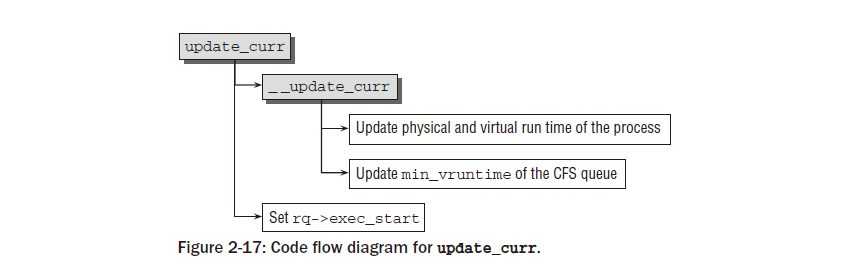
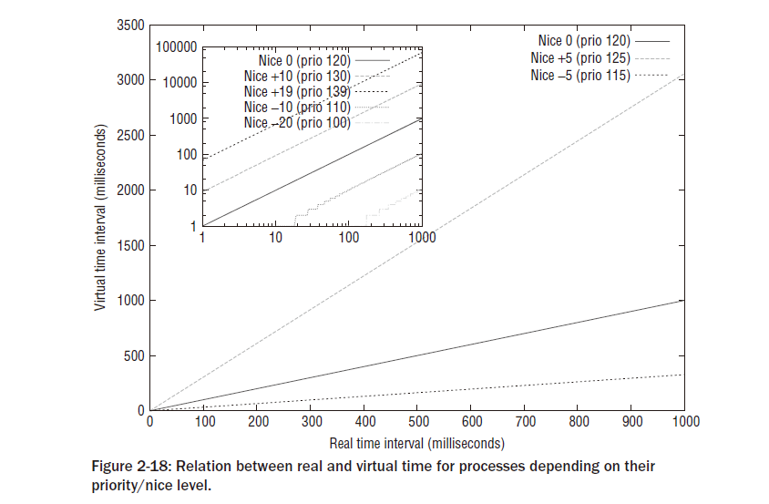
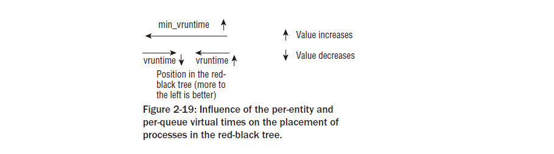
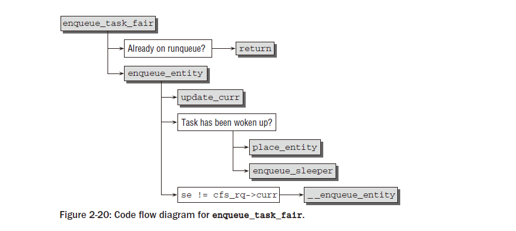
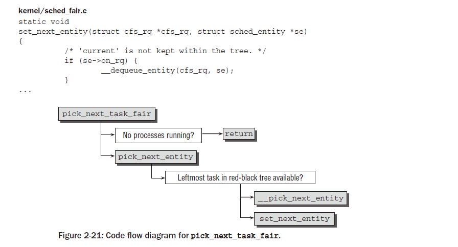
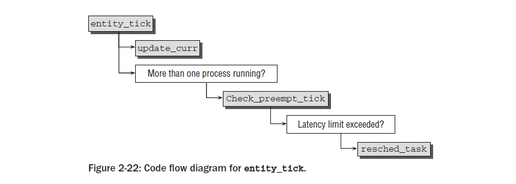
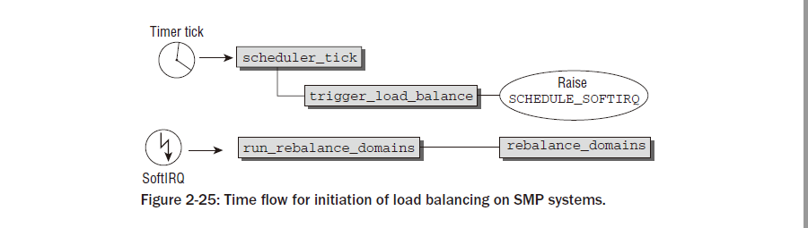
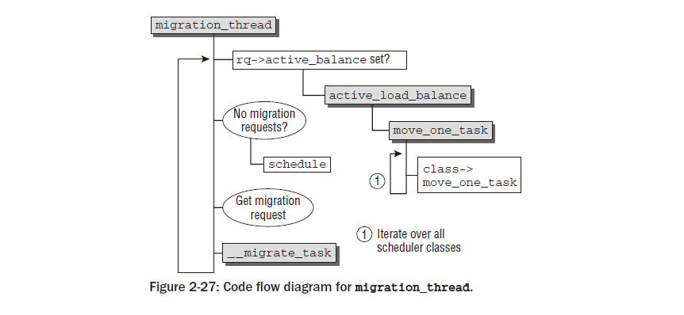
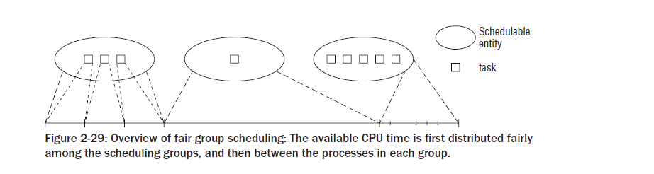

Chapter 2 : Process Management and Scheduling
################################################

현대의 모든 운영 시스템은 동시에 여러개의 프로세스를 실행시킬 수 있다- 최소한 이것은 유저가 얻을 수 있는 감동이다.
만약 시스템이 단일 프로세서를 가지고 있다면, 주어진 시간에 단지 하나의 프로그램만 실행시킬 수 있다. 다중 프로세서
시스템에서는 병렬로 실제로 실행할수 있는 프로세서의 갯수는 물리적 CPU의 숫자에 의해 결정된다.

커널과 프로세서는 멀티태스킹의 환상을 만든다- 병렬로 여러개의 동작을 수행할 수 있는 능력-빠른 시간안에 시스템에
돌아가는 다른 어플리케이션간의 반복된 스위칭을 통해. 스위칭 간격이 짧기때문에,유저는 비활성의 짧은 개입 시간을
주의하지 못한다.

이러한 시스템 관리는 커널이 해결해야 할 몇가지 이슈들이 있다, 그것들중에 가장 중요한 것은 다음과 같다.

   - 어플리케이션은 이것이 명시적으로 원하지 않게되면 다른것과 인터페이스 하지 말아야 한다. 예를 들면 , 어플리케이션
     A에서 발생한 에러는 어플리케이션 B에 파급되지 말아야 한다. 리눅스는 멀티유저 시스템이기때문에,프로그램들은
     다른 프로그램의 메모리 영역을 읽고 수정할 수 없도록 되어야 한다. 다른말로, 그것은 다른 유저의 사적 데이터를
     접근하기가 극단적으로 쉽다는 것이다.

   - CPU 시간은 다양한 어플리케이션간 가능한 공정하게 공유되어져야 한다. 반면, 어떤 프로그램은 다른것들보다 좀더 중요한
     것으로 간주되어 진다.

나는 첫번째 요구사항을-메모리 보호-3장에서 다룬다. 이 장에서는 프로세스들간 CPU 타임을 공유하고 스위칭하기 위하여
커널이 도입하는 방법들에 관심을 기울였다. 이런 이중적인 태스크는 각자 상대적으로 독립적으로 수행될 2개의 파트로
쪼개진다.

   - 커널은 얼마나 많은 시간을 개별 프로세스에 기여해야 하는지 그리고 어떤때 다음 프로세스로 스위칭해야 되는지
     결정해야만 한다. 이것은 어떤 프로세스가 실제로 다음순인가에 대한 질문을 낳게 한다.이러한 종류의 결정은
     플랫폼 의존적이지 않다.

   - 커널이 프로세스 A에서 프로세스 B로 스위칭할때,B 실행환경을 실행하는 것은 프로세서 리소스가 철회되었을때와
      동일해야 한다는 것을 확인해야 한다. 예를들면,프로세서 레지스터의 내용물과 가상 주소 공간의 구조와 동일해야만
      한다.
      이런 후자 태스크는 프로세서 타입에 지극히 의존적이어야 한다.그것은 C 로서만 구현될 수 없고 순수 어셈블러의
      도움이 필요로 한다.

양쪽의 태스크는 스케줄러라고 불리는 커널 하위시스템의 역할이다. 할당된 CPU 타임이 어떻게 프로세스간 스위칭을 위해 필요한
태스크 스위칭 메카니즘으로부터 완전히 분리된 스케줄러 정책에 의해 결정되는지이다.

2.1 Process Priorities
==========================

모든 프로세스가 동등하게 중요한 것은 아니다. 프로세스 우선권에 추가하여,대부분의 독자들은 이것에는 친숙하지만, 여기에는
다른 요구를 만족할만한 색다른 중요한 클래스들이 있다. 우선 대략적인 구별로, 프로세스들은 실시간 프로세스와 비실시간
프로세스로 구분지을 수 있다.

   - 엄격한 실시간 프로세스들은 어떤 태스크가 완료되어지기까지 엄격한 시간 제한을 가지게 되어 있다.항공기 운행 컨트롤
     명령을 컴퓨터에 의해 실행된다면,그런 명령들은 가능한 빨리 주어진 시간안에 예측되어져야만 한다. 예를 들면,만약 비행기가
     착륙시도중이며 파일럿이 코를 풀고 싶으면, 컴퓨터가 몇초후에 명령들을 예측한다면 목적에 맞지 않다. 이시간까지,항공기는
     코를 먼저 풀고 지상에 착륙되어져야 한다. 엄격한 실시간 프로세스들의 중요한 특성은 그것들이 주어진 시간안에
     실행되어져야만 하는것이다. 이것은 타임 프레임이 특별히 짧다는 것을 암시하지는 않는다. 대신에 시스템은 비호의적이거나
     역행하는 상황이 성행할때일지라도어떤 시간 프레임이 결코 초과되지 않아야 된다는 것을 확신해줘야 한다.

     리눅스는 적어도 바닐라 커널에서는 엄격한 실시간 프로세싱을 지원하지 않는다. 이러한 기능을 제공하는 RTLlinx,Xenomai,
     RATI같은 수정된 버젼도 있다. 리눅스 커널은 이러한 접근에 있어서 분리된 프로세스로 운영된다. 그리고 덜 중요한
     소프트웨어로 다루게 된다. 반면 실시간 일은 커널밖에서 행해진다. 커널은 실시간이 필요한 액션들이 수행되지 않을경우
     에만 수행된다.

     리눅스가 시스템 효율에 최적화되어 있고 가능한 빨리 일반적 케이스를 다루려고 노력하기 때문에, 충분한 응답 시간이
     성취하기 매우 어렵다. 그럼에도 불구하고 모든 커널의 잠복을 줄이기 위해 지난 수년동안, 말하자면 요청을 만드는 것과
     그것을 이행하는것 간에 소비된 시간,많은 노력이 만들어져왔다.그런 노력은 선점할 수 있는 커널 메카니즘,실시간 뮤텍스
     ,이책에서 논하는 새로운 완전한 정당한 스케줄러를 포함하고 있다.

   - 소프트 실시간 프로세스들은 엄격 실시간 프로세스들의 약간 완화된 형태이다. 즉시 응답이 아직도 요구될지라도, 그것은
     그것들이 도착하는데 좀 늦어진다고 세상이 끝나는것은 아니다. 소프트 실시간 프로세스의 예제는 CD에 쓰기동작이다.
     데이터가 계속적인 스트림으로 미디어에 써져야 하기때문에 데이터는 일정속도로 CD 라이터에 의해 받아져야만 한다.
     시스템 로딩이 너무 높으면 데이터 스트림은 잠시 방해를 받을지도 모른다.이것은 CD가 깨지는  것보다 훨씬 덜 과감하게
     CD를 쓸수 없게 만든다. 그럼에도 불구하고 쓰기 프로세스는 모든 다른 프로세스보다 더 필요하다면 CPU 타임을 항상
     보장해줘야 한다.

   - 대부분의 프로세스는 특별한 시간 제약을 갖지않고 그들에게 우선권을 부여함으로써 좀 더 중요하던지 덜 중요하던지 하는
     뷴류를 할 수 있는 일반적인 프로세스이다.
     예를 들면, 오랜 컴파일러 실행 또는 숫자 계산은 유저가 알수 없을만큼 1~2초정도 연산이 방해되어진다면 중요하지 않기때문에
     무척 낮은 우선권을 가진다. 반대로,비활성된 어플리케이션은 유저가 악명높게 참을성이 없기때문에 유저 커맨드에 가능한
     빨리 응답해야 한다.

CPU 시간의 할당은 Figure2-1 처럼 좀더 간략한 형태로 그려질 수 있다. 프로세스들은 타임 조각에 흩어져 있다.그리고 그들에게
할당된 조각 공간은 그들의 상대적인 중요성에 따른다. 시스템에서 시간 흐름은 원은 회전에 따르고 CPU는 원의 원주에 스캐너처럼
표현된다. 넷 이펙트라는것은 중요한 프로세스가 덜 중요한 프로세스들보다 CPU 타임을 좀더 확보한다는 것이다.

.. image:: ./img/fig2_1.png

이러한 구조에서,선점적인 멀티태스킹으로 알려진, 각 프로세스는 그것이 실행될 동안 특정 시간을 할당 받는다.일단 이 기간이
지나면, 커널은 프로세스로부터 컨트롤을 회수한다. 그리고 이전에 실행된 마지막 태스크에 상관없이 다른 프로세스가 실행되도록
한다.그것의 실행 환경은 -기본적으로 모든 CPU 레지스터와 페이지 테이블- 물론 결과가 사라지지 않도록 그리고 프로세스
환경이 또다시 돌아왔을때 완전히 회복될 수 있도록 저장된다. 시간 조락의 길이ㅣ는 프로세스의 중요성에 따라 변한다.( 그리고
그것에 우선권이 할당된다). Figure 2-1은 개별적 프로세스에 다른 사이즈의 세그먼트를 할당함으로써 이것을 보여 준것이다.

이러한 간략화된 모델은 몇개의 중요한 이슈들에는 고려되지 않는다. 예를 들면, 프로세스들은 그들이 실행할 것이 없다면
어떤 시간에는 실행할 준비가 안되어 있을지 모르겠다. 가능한 CPU 시간을 적당하게 사용하는것이 기본이기때문에 , 그러한
프로세스들은 실행을 못하게 되어져야만 한다. 이것은 모든 프로세스는 항상 실행을 준비하고 있어야 된다고 가정되기때문에
Figure2-1에서는 확실하지 않다. 또한 관과해야할 사실은 리눅스는 다른 스케줄링 클래스를 지원한다는것이다. ( 완전히 프로세스
들간 정당한 스케줄링 그리고 실시간 스케줄링),그리고 이것들은 스케줄링동안 고려되어져야만 한다. 거기에는 실행대기중인
중요한 프로세스들로 현재 프로세스를 대체하는 옵션이 없다.

프로세스 스케줄링은 커널 개발자들간에 커널에 대한 매우 열정적이고 흥미진지한 토의를 하게 한다,특히 가장 가능한 알고리즘을
선택하게될때이다. 하나의 스케줄러의 질적인 부분을 위해서 양적인 방법을 찾는것은 매우 어려운-가능하지 않지만- 태스크이다.
그것은 또한 리눅스 시스템이 당면한 많은 다른 업무량에 의해 표출된 요구사항을 스케줄러가 맞추기 위해서는 도전적인
태스크이다: 자동제어를 위한 작은 임베디드 시스템은 대형 컴퓨터보다는 좀 다른 요구사항을 갖는다,반면 이런것들은
멀티미디어 시스템들과는 상당히 틀리다. 사실 스케줄러 코드는 최근에 2개의 완전히 새로썼다.

   1. 2.5시리즈 개발동안, 소위 O(1) 스케줄러는 이전 스케줄러로 대체되었다.이 스케줄러의 특별한 특징은 시스템에서 동작하는
   프로세스의 갯수에 상관없이 일정시간에 업무를 수행할 수 있다는 것이다.그 디자인은 이전에 채택된 스케줄링 아키텍처를
   근본적으로 깨뜨렸다.

   2. 완전한 페어 스케줄러는 커널 2.6.23 개발동안 포함되었다. 새로운 코드는 인터렉티드 태스크가 빨리 응답할 수 있도록
   이전 스케줄러에서 요구되었던 많은 발견적 교수법을 포기함으로서 이전 원리로부터 완전한 거리감을 주었다는 것이다.
   이 스케줄러의 중요한 특성은 가능한 근접하게 이상적인 페어 스케줄링을 닮으려고 노력하는 것이다.
   부가적으로, 그것은 단지 개별적인 태스크를 계획하지는 않고 보다 일반적인 스케줄잉 엔티티로 동작한다.
   이것은,예를 들면,모든 다른 유저들의 프로세스들간에 가용 시간을 분배하도록 한다.
   나는 이 스케줄러의 구현을 아래에 상세하게 논한다.

우리가 어떻게 스케줄링이 커널에서 구현되었는지를 관심갖기전에,하나으 프로세스가 가질지도 모르는 그 상태를 논하는것이
유용하다.

2.2 Process Life Cycle
=========================

하나의 프로세스는 항상 실행할 준비를 하고 있는것은 아니다.때때로,컨트롤밖에 있는 외부 소스로부터 이벤트를 기다려야만
한다- 예를들면,텍스트 에디터에서 키보드 입력. 이벤트가 발생할때까지, 프로세스는 동작할 수 없다.

스케줄러는 태스크간 스위칭을 할때 시스템에서 모든 프로세스의 상태를 알아야 한다; 그것은 명백하게 아무것도 하지 않는
프로세스에 CPU 타임을 할당한다는 의미는 아니다. 개별 프로세스 상태간 변이는 중요하다. 예를 들면, 하나의 프로세스가
병렬 디바이스로부터 데이터를 기다리고 있다면, 그것은 스케줄러가 일단 그 데이터를 받게되면 프로세스 상태를 대기에서
실행으로 바꾸는 역할을 가지고 있다.

하나의 프로세스는 다음 상태중 하나를 가지고 있다:

   - Running - 그 프로세스는 순간 실행된다.
   - Waiting - 그 프로세스는 실행할 수 있지만 CPU가 다른 프로세스에 할당되었기때문에 허락되지 않는다.
               스케줄러는 원한다면 다음 태스크 스위칭에서  프로세스를 선택할 수 있다
   - Sleeping - 그 프로세스는 잠자고 있으며 다른 외부적인 이벤트를 기다리고 있기때문에 실행할 수 없다.
                그 스케줄러는 다음 태스크 스위칭에서 그 프로세스를 선택할 수 없다.

시스템은 모든 프로세스들을 하나의 프로세스 테이블에 저장한다. - 그것들이 실행하던지,잠자고 있던지,대기하고 있던지 상관
없이, 어쨌든,잠자고 있는 프로세스들은 그것들이 실행 준비가 되지 않았다는것을 알 수 있도록 특별히 표시되어진다.
(섹션 2.3에 이것이 어떻게 구현되었는지 볼수 있다). 거기에는 또한 잠자고 있는 프로세스들을 적당한 시간에-예를 들면
그 프로세스가 일어나기를 바라고 있는 외부 이벤트가 있을때-깨울수 있도록 그룹화할 수 있는 많은 큐들이 있다.

Figure2-2는 몇개의 프로세스 상태와 변이를 보여준다.

.. image:: ./img/fig2_2.png

누적된 실행 프로세스들과 다양한 변이으 실험을 시작해 봅시다;그 프로세스는 실행할 준비가 되었지만 CPU가 다른 프로세스에
할당되어 있기때문에 허락되지 않는다.(그 상태는 따라서 대기상태이다). 그것은 스케줄러가 CPU 시간을 허락할때까지 이 상태로
남아있다.일단 이것이 발생하면,이 상태는 실행단계로 변화된다(path 4).

스케줄러가 그 프로세스로부터 CPU 리소스를 철회하기를 결정할때-나는 짧게 그 이유를 다룬다- 그 프로세스의 상태는 실행에서
대기상태로 변화하고 사이클은 새롭게 시작된다.거기에는 사실상 그것들이 신호에 의해서 방해되어질 수 있는지 없는지에 따라
달라지는 2개의 잠자는 상태가 있다. 순간, 이러한 차이점은 중요하지 않고,우리가 그 구현을 좀더 면밀히 조사할때 관련성이
있다.

만약 프로세스가 이벤트를 기다려야만 한다면,그 상태는 실행에서 슬리핑 상태로 변한다(path 1).어쨌든,그것은 슬리핑에서 실행단계로
바로 변화할 수 없다; 일단 대기하고 있던 이벤트가 발생하기만 하면,프로세스는 대기 상태(path 3)로 돌아가고 일반적인 사이클로
돌아간다.

일단 프로그램 실행이 종료가되면(예를들면, 사용자가 그 프로그램을 종료한다),그 프로세스는 실행단계에서 정지상태로 변한다
(path 5)

위에서는 언급되지 않은 특별한 프로세스는 좀비 상태이다. 이름이 말하듯이, 그러한 프로세스들은 존재하지 않지만 아직도
다소 살아있다. 실제로 그것들은 그들의 리소스가 다시 실행될 수 없고 결코 발생되지 않도록 이미 해제되었기때문에
죽는다(RAM, 병렬연결등). 어쨌든, 프로세스 테이블에서 그것들의 출입이 있기때문에 아직도 살아있다.

어떻게해서 좀비가 나올까? 그 이유는 유닉스하에 있는 프로세스 생성 종료 구조에 있다.  하나의 프로그램은 2개의 이벤트가
발생할때 종료된다- 첫째 그 프로그램은 다른 프로세스에 의해 또는 유저에 의해  종료되어져야만 한다(이것은 보통 정상적으로
프로세스를 종료시키는 SIGTERM또는 SIGKILL을 보냄으로써 이루어진다); 두번째로, 그 프로세스의 기원인 부모 프로세스는 자식
프로세스가 종료될때 wait4 시스템 콜을 활성화 하거나 이미 활성화 시켜야 한다. 이것은 부모 프로세스는 자식 프로세스의
종료를 인식하고 있다는 것을 커널에게 확인시켜 주는 것이다. 시스템 콜은 자식 프로세스에 의해서 점유되어지는 리소스를
커널이 해제하도록 해준다.

좀비는 두번째(wait4)가 아니고 첫번째 상태가 적용될때(그 프로그램이 종료되었을때) 발생된다. 하나의 프로세스는 종료와
프로세스 테이블에서 자신의 데이터를 제거하는 사이에 아주 짧게 좀비 상태로 항상 변한다.어떠한 경우에 (예를 들면
부모 프로세스가 나쁘게 프로그램되어 있고 wait 콜을 발행하지 않을때), 좀비는 확고히 자기 자신을 프로세스 테이블에
적재할 수 있고 다음 리부팅때까지 그곳에 남아 있다. 이것은 ps 나 top같은 프로세스 툴의 결과를 읽어봄으로써 볼수 있다.
이것은 커널에서 아주 작은 공간을 차지하는 남아있는 데이타로서 문제가 거의 되지 않는다.

2.2.1 Preemptive Multitasking
--------------------------------

리눅스 프로세스 관리의 구조는 2개의 심도있는 프로세스 상태 옵션을 필요로 한다- 유저 모드와 커널모드. 이런것들은
모든 근래의 CPU들은 적어도 2개의 다른 실행모드를 가진다는 사실을 대변한다. 다른 하나는 다양한 제한 조건을 가지는반면
다른 하나는 무한한 권한을 가진다- 예를들면,어떤 메모리 영역에 접근은 제한되어질 수 있다. 이러한 차이점은  기존의 프로세스
들을 유지하고 그것들을 시스템의 다른 부분으로부터 방해받지 못하도록 하는 폐쇄된 새장을 만드는것에 중요한 선결조건이다.

보통 커널은 자기 자신으 데이터를 접근하고 시스템에 있는 다른 어플리케이션을 방해할 수 없는 유저모드에 있다-그것은 보통
커널 주변에 다른 프로그램이 있다는것조차 알리지 않는다.

하나의 프로세스가 시스템 데이터나 함수를 접근하고자 한다면(후자는 모든 프로세스들간에 공유되어지는 리소스들을 관리한다
,예를들면, 파일시스템 공간),그것은 커널모드로 변환되어야 한다. 명확하게, 이것은 컨트롤에 리고 명확하게 정의된 경로를 통해
의해서만 단지 가능하다-그렇지 않으면 모든 성립된 보호 메카니즘은 넘쳐나게 될것이다.1장에서 시스템 콜은 모드간 전환할 수
있는 유일한 방법이라고 짧게 언급했다. 13장에서는 그러한 콜에 대한 구현을 심도있게 논할것이다.

유저모드에서 커널모드로 전환하는 2번째 방법은 인터럽트에 의한 것이다-전환은 자동적으로 발생된다. 유저 어플리케이션에 의해
의도적으로 발생되는 시스템 콜과는 다르게 , 인터럽트들은 다소 임의적으로 발생한다. 일반적으로 인터럽트를 다룰때 필요로하는
앱션들은 인터럽트가 발생했을때의 프로세스 실행과는 상관이 없다. 예를들면,인터럽트는 외부 블럭 디바이스가 데이터를 RAM으로
변환할때, 그리고 이러한 데이터는  시스템에서 실행되고 있는 어떤 프로세스를 위해서 의도적일지도 모를지라도, 발생된다.
유사하게, 수신 네트웍 패키지들은 인터럽트의 방법으로 알려진다. 또한, 그것은 현재 실행되는 프로세스를 위해서 의도적이지는
않은것 같다.이러한 이유로, 리눅스는 실행되는 프로세스가 전적으로 그것들을 인식하지 못하도록하는 방법으로 이러한 행동들을
수행한다.

커널의 선점적인 스케줄링 모델은  그 프로세스의 상태가 그것의 다른 상태에 의해서 방해될지 모른다는 것을 결정하는 구조를
만들어야 한다.

   - 일반적인 프로세스들은 항상 방해될지도 모르겠다-다른 프로세스들에 의해서조차도. 중요한 프로세스가 실행될때-예를들면,
     어떤 저자가 오랫동안 기다리는 키보드 입력을 기다릴때- 스케줄러는 현재 프로세스가 잘 실행되고 있더라도 그 프로세스를
     바로 실행시킬지 결정할 수 있다. 이러한 종류의 선점은 좋은 상호 작용과 낮은 시스템 잠재에 중요한 공헌을 한다.

   - 그 시스템이 커널에 있고 시스템 콜을 수행하고 있다면,시스템에 있는 어떤 다른 프로세스도 CPU 시간을 회수할 단초를 줄
     수 없다. 그 스케줄러는 그것이 다른 프로세스를 선택할 수 있기전에 시스템 콜의 실행이 종료될때까지 기다리게 되어진다.
     어쨌든, 그 시스템 콜은 인터럽트에 의해서 연기되어질 수 있다.

   - 인터럽트들은 유저모드와 커널모드에서 프로세스들을 연기시킬 수 있다. 그것들은 가능한 빨리 그것들이 생성된후에
     그것들을 다루는것이 필수이기때문에 높은 우선권을 가진다.

커널 선점으로 알려진 한가지 옵션이 커널 2.5를 개발하는동안 커널에 추가되었다. 이 옵션은 , 이것이 급하게 필요하다면,커널
모드에서 시스템 콜의 실행동안조차도 다른 프로세스들로 전환되는것을 지원한다(그러나 인터럽트 동안은 아니다). 커널이
시스템 콜을  가능한 빨리 실행하도록 시도하더라도, 필요한 그 시간은 연속된 데이터 스트리밍에 의존하는 어떤 어플리케이션에
대해 너무 오래일지도 모르겠다. 커널 선점은 그러한 대기 시간을 줄여줄 수 있고 좀더 부드러운 프로그램 실행을 확신해준다.
어쨌든, 이러한것은 많은 데이터 구조들이 단일 프로세서 시스템에서조차도 동시 발생되는 접근을 보호할 필요성이 있기때문에
증가되는 커널의 복잡성의 비용에 있다.

2.3 Process Representation
==============================

프로세스와 프로그램에 관련된 리눅스 커널의 모든 알고리즘은 task_struct라고 이름불려지고 include/sched.h에 정의된
데이터 구조에 구성되어진다. 이것은 시스템에 있어서 중요 구조중에 하나이다. 스케줄러 구현에 관해서 다루는것으로 넘어가기전에
어떻게 리눅스가 프로세스를 관리하는지 시험하는것이 필수이다.

태스크 구조는 아래에서 다룰 커널의 하위 시스템과 그 프로세스를 연결하는 수많은 요소들을 포함한다. 나는 그래서 그것들의
상세 지식없이는 어떤 요소의 중요성을 설명하기 어렵기때문에 이후 장을 종종 참조한다.

태스크 구조는 아래와 같다- 간단한 형태로서

.. code-block:: console

    <sched.h>
    struct task_struct {
        volatile long state; /* -1 unrunnable, 0 runnable, >0 stopped */
        void *stack;
        atomic_t usage;
        unsigned long flags; /* per process flags, defined below */
        unsigned long ptrace;
        int lock_depth; /* BKL lock depth */
        int prio, static_prio, normal_prio;
        struct list_head run_list;
        const struct sched_class *sched_class;
        struct sched_entity se;
        unsigned short ioprio;
        unsigned long policy;
        cpumask_t cpus_allowed;
        unsigned int time_slice;
    #if defined(CONFIG_SCHEDSTATS) || defined(CONFIG_TASK_DELAY_ACCT)
        struct sched_info sched_info;
    #endif
        struct list_head tasks;
        /*
        * ptrace_list/ptrace_children forms the list of my children
        * that were stolen by a ptracer.
        */
        struct list_head ptrace_children;

        struct list_head ptrace_list;
        struct mm_struct *mm, *active_mm;
    /* task state */
        struct linux_binfmt *binfmt;
        long exit_state;
        int exit_code, exit_signal;
        int pdeath_signal; /* The signal sent when the parent dies */
        unsigned int personality;
        unsigned did_exec:1;
        pid_t pid;
        pid_t tgid;
        /*
        * pointers to (original) parent process, youngest child, younger sibling,
        * older sibling, respectively. (p->father can be replaced with
        * p->parent->pid)
        */
        struct task_struct *real_parent; /* real parent process (when being debugged) */
        struct task_struct *parent; /* parent process */
        /*
        * children/sibling forms the list of my children plus the
        * tasks I’m ptracing.
        */
        struct list_head children; /* list of my children */
        struct list_head sibling; /* linkage in my parent’s children list */
        struct task_struct *group_leader; /* threadgroup leader */
        /* PID/PID hash table linkage. */
        struct pid_link pids[PIDTYPE_MAX];
        struct list_head thread_group;
        struct completion *vfork_done; /* for vfork() */
        int __user *set_child_tid; /* CLONE_CHILD_SETTID */
        int __user *clear_child_tid; /* CLONE_CHILD_CLEARTID */
        unsigned long rt_priority;
        cputime_t utime, stime, utimescaled, stimescaled;;
        unsigned long nvcsw, nivcsw; /* context switch counts */
        struct timespec start_time; /* monotonic time */
        struct timespec real_start_time; /* boot based time */
        /* mm fault and swap info: this can arguably be seen as either
        mm-specific or thread-specific */
        unsigned long min_flt, maj_flt;
        cputime_t it_prof_expires, it_virt_expires;
        unsigned long long it_sched_expires;
        struct list_head cpu_timers[3];
    /* process credentials */
        uid_t uid,euid,suid,fsuid;
        gid_t gid,egid,sgid,fsgid;
        struct group_info *group_info;
        kernel_cap_t cap_effective, cap_inheritable, cap_permitted;
        unsigned keep_capabilities:1;
        struct user_struct *user;
        char comm[TASK_COMM_LEN]; /* executable name excluding path
        - access with [gs]et_task_comm (which lock
        it with task_lock())
        - initialized normally by flush_old_exec */
    /* file system info */
        int link_count, total_link_count;
    /* ipc stuff */
        struct sysv_sem sysvsem;
    /* CPU-specific state of this task */
        struct thread_struct thread;
    /* filesystem information */
        struct fs_struct *fs;
    /* open file information */
        struct files_struct *files;
    /* namespace */
        struct nsproxy *nsproxy;
    /* signal handlers */
        struct signal_struct *signal;
        struct sighand_struct *sighand;
        sigset_t blocked, real_blocked;
        sigset_t saved_sigmask; /* To be restored with TIF_RESTORE_SIGMASK */
        struct sigpending pending;
        unsigned long sas_ss_sp;
        size_t sas_ss_size;
        int (*notifier)(void *priv);
        void *notifier_data;
        sigset_t *notifier_mask;
    #ifdef CONFIG_SECURITY
        void *security;
    #endif
    /* Thread group tracking */
        u32 parent_exec_id;
        u32 self_exec_id;
    /* journalling filesystem info */
        void *journal_info;
    /* VM state */
        struct reclaim_state *reclaim_state;
        struct backing_dev_info *backing_dev_info;
        struct io_context *io_context;
        unsigned long ptrace_message;
        siginfo_t *last_siginfo; /* For ptrace use. */
        ...
    };

인정하건데, 이러한 구조에 있는 많은 정보를 요약하는것은 어렵다. 어쨌든, 구조 내용물은 섹션으로 쪼갤 수 있고, 그것들의
각각은 그 프로세스의 특별한 모습을 표현한다.

   - 대기중인 신호,사용되어진 바이너리 포맷, 프로세스 인식자(pid),보모 그리고 다른 관계된 프로세스들의 포인터들,
     우선권 그리고 프로그램 실행에 있어서 시간 정보와 같은 실행 정보와 상태

   - 가상 메모리에 할당된 정보

   - 유저 그리고 그룹 ID, 능력들등과 같은 프로세스 보안들. 시스템 콜은 이러한 데이터들을 요청하는데 사용되어질 수 있다.
     나는 이러한 것들을 특별한 하위 시스템을 설명할때 좀더 상세하게 다룬다.

   - 사용되어지는 파일들:프로그램 코드를 가지는 바이너리 파일뿐 아니라 반드시 저장해야만 하는 프로세스에 의해 다뤄져야
      하는 모든 파일들에 대한 파일 시스템 정보

   - 프로세스의 CPU 특화된 실행시간 데이타를 기록할 트레드 정보(그 구조에서 남아있는 부분은 사용되어지는 하드웨어에
     의존적이지 않다)

   - 다른 어플리케이션과 동작할때 필요로 하는 상호 프로세스 통신에 대한 정보

   - 수신 신호에 대응하기 위한 그 프로세스에 의해서 사용되어지는 신호 핸들러

태스크 구조의 많은 멤버들은 단순한 변수들이 아니며  검사되어지는 다른 데이타 구조에 포인터이다.그리고 이러한 것들은
다음장에서 다루게 될것이다. 현재 장에서는 프로세스 관리 구현에 중요한  task_struct 몇가지 요소만  고려한다.

state는 하나의 프로세스의 현재 상태를 특화하고 다음 값들을 허용한다(이러한 것들은  <sched.sh>에 정의된 사전 프로세서
변수들이다):

   - TASK_RUNNING 는 태스크가 실행중에 있다는것을 의미한다. 이것은 CPU가 실제로 할당되었다는 것을 의미하지 않는다.
     태스크는 스케줄러에 의해 선택되어질때까지 대기할 수 있다. 이러한 상태는 그 프로세스가 실제로 실행하기 위해
     준비되어 있고 다른 외부 이벤트를 위해 기다리고 있지 않다는것을 확신시켜준다.

   - TASK_INTERRUPTIBLE은 어떤 이벤트나 다른것을 위해서 대기하고 있는 잠자는 프로세스의 세트이다. 커널이 이벤트가 발생된
     프로세스에 신호를 보낼때, 그것은 스케줄러가에 의해서 선택되어지는 순간 실행을 재시작할 지도 모르는 TASK_RUNNING 상태에
     위치하게 된다.

   - TASK_UNINTERRUPTIBLE은 커널 명령을 할수 없는 잠자는 프로세스를 위해서 사용되어진다. 그것들은 커널 자체에 의해서만
     동작되고 외부 신호에 의해서는 동작하지 않을 수 있다.

   - TASK_STOPPED는 그 프로세스가 ,예를 들면 디버거에 의해서, 의도적으로 멈춰졌다는것을 표시한다.

   - TASK_TRACED는 그 자체로는 프로세스 상태는 아니다.- 정상적으로 멈춘 태스크로부터 현재 트레이스 되어질 수 있는
     멈춰진 태스크를 구별하기 위해서 사용되어진다.

다음의 변수들은  struct task_struct의 태스크 상태분야뿐 아니라 exit_state에 사용되어진다,특히 현존하는 프로세스들에
사용되어진다.

   - EXIT_ZOMBIE 는 위에서 언급한 좀비 상태이다.

   - EXIT_DEAD 는 적당한 wait 시스템 콜이 생성된후에 그리고 태스크가 완전히 시스템으로부터 제거되기 전까지의 상태이다.
     이러한 상태는 다중 트레드가  동일 태스크를 위해서 wait 콜을 생성할때 중요하다.

리눅스는 프로세스들에 어떤 시스템 리소스 사용 한계치를 표기하기 위하여 resource limit(rlimit) 메카니즘을 제공한다.
이러한 메카니즘은 그 요소가 struct rlimit 타입인 task_struct에서 rlim 어레이를 사용한다.

.. code-block:: console

    <resource.h>
        struct rlimit {
        unsigned long rlim_cur;
        unsigned long rlim_max;
        }

정의는 의도적으로 다른 리소스 타입을 수용할 수 있게 일반적이다.

   - rlim_cur 는 그 프로세스의 현재 리소스 한계이다.이것은 soft limit로도 간주된다.
   - rlim_max  그 제한에 대한 최대 허용값이다. 이것은 hard limit로도 간주된다.

setrlimit 시스템 콜은 현재 한계를 증가하거나 감소시키는데 사용된다. 어쨌든, rlim_max에 명기된 값은 넘어가지 않을 수 있다.
getrlimits는 현재 한계를 체크하는데 사용되어진다.

제한할 수 있는 리소스는 rlim 어레이에서 그들의 위치를 참조함으로써 구별할 수 있다. 이것은 왜 커널이 리소스와 위치에
관련된 프리프로세서 상수를 정의하는지 이유이다. Table2-1에 그 가능한 변수들과 의미를 정리하였다. 시스템 프로그래밍에 관한
책은 실제로 다양한 제한적 사용을 상세히 다루었다 그리고 setrlimit 메뉴얼 페이지는 모든 제한을 좀더 상세하게 다루었다.

.. code-block:: console

    리눅스는 특별한 유닉스 시스템과의 바이너리 호환성을 만들기때문에 정수값은 아키텍처마다 다르다.

그 제한은 커널의 매우 다른 부분과 연관이 있기때문에,그 제한이 상응하는 하위 시스템에서 관찰되어지고 있는지 체크해야만
한다. 이것은 왜 rlimit 시간과 시간을 또 이 책의 후반부에서 만나게 되는지 이유다.
리소스 타입이 제한범위내에서 사용되어진다면 (거의 대부분의 리소스에 대한 기본 세칭),RLIM_INFINITY는 rlim_max의 값으로
사용되어진다. 다른 것들중에 예외들은 :

   - 열린 파일의 숫자(RLIMIT_NOFILE, 1,024 가 디폴트이다)
   - 유저당 최대 프로세스 갯수(RLIMIT_NPROC), 이것은 max_threads/2 로 정의된다. 만약 20개의 트레드에 대한 최소 가능한
     메모리 사용이 주어진다면,max_threads는 그 값이 얼마나 많은 트레드들이 가용한 RAM의 8/1이 트레드 정보를 관리하는데만
     사용하게끔 생성되어질지도 모른다라고 표시하는 전역변수이다.

init 태스트의 부트 시간 제한은 include/asm-generic-resource.h에 서 INIT_RLIMITS 로 정의되어 있다.

아직도 이책이 쓰여질때 아직도 개발중이었던 커널 2.6.25는 현재의 rlimit값을 검사하도록 허락하는 proc 파일시스템에서
하나의 프로세스당 하나의 파일만 포함할 것이다.

.. code-block:: console

    wolfgang@meitner> cat /proc/self/limits
    Limit Soft Limit Hard Limit Units
    45
    Chapter 2: Process Management and Scheduling
    Max cpu time unlimited unlimited ms
    Max file size unlimited unlimited bytes
    Max data size unlimited unlimited bytes
    Max stack size 8388608 unlimited bytes
    Max core file size 0 unlimited bytes
    Max resident set unlimited unlimited bytes
    Max processes unlimited unlimited processes
    Max open files 1024 1024 files
    Max locked memory unlimited unlimited bytes
    Max address space unlimited unlimited bytes
    Max file locks unlimited unlimited locks
    Max pending signals unlimited unlimited signals
    Max msgqueue size unlimited unlimited bytes
    Max nice priority 0 0
    Max realtime priority 0 0
    Max realtime timeout unlimited unlimited us

.. image:: ./img/table2_1.png

정보를 만드는 대부분으 코드는 항상 커널 2.6.24에 표시된다 , 그러나 /proc과 관련된 최종 연결은 후속 커널 버젼에서 유일하게
만들어질것다.

2.3.1 Process Types
---------------------

전통적인 유닉스 프로세스는  바이너리 코드와 발생순서적인 트레드(컴퓨터는 코드를 통해 단일 경로를 따른다,다른 경로는
동시간대레 실행되지 않는다) 그리고 어플리케이션에 할당된 리소스 셋- 예를 들면, 메모리,파일,등등-등으로 구성된 하나의
어플리케이션이다.
새로운 프로세스들은 fork나 exec 시스템 호출을 통해 생성된다.

   - fork는 현재 프로세스와 동일한 프로세스를 생성한다; 이러한 복사를 차일드 프로세스라고 한다. 원본 프로세스의 모든
     리소스를은 시스템 호출후에 거기에 동일한 별개의 원본 프로세스의 복사본이 있도록 적당한 방법으로 복사되어진다.
     이러한 복사본은 어찌됐든 연결되지 않고 ,예를들면,동일한 오픈 파일셋을 가지고 동일한 작업 디렉토리를 가지고 메모리에
     동일 데이터를(각자 데이터의 자신복제로) 가진다

   - exec는 실행 가능한 바이너리 파일로부터 로딩된 다른 어플리케이션으로 실행 프로세스를 대체한다. 다른말로 하면,새로운
     프로그램이 로드된다. exec는 새로운 프로세스를 생성하지 않기때문에, 이전 프로그램은 일단 fork를 사용해서 복사되어져야만
     하고 이때 exec는 시스템에서 추가적인 어플리케이션을 생성하기 위해 불려진다.

리눅스는 항상  모든 유닉스의 정취와 아주 거슬러 올라간 시간에 가능했던 위에서 언급한 두개의 호출에 추가해서  복사
시스템틀 제공한다. 원칙적으로, clone은 fork와 동일한 방법으로 동작한다, 그러나 새로운 프로세스는 그 부모 프로세스들과
독립되지 않고 그것과 일정부분 리소스를 공유할 수 있다. 어떤 리소스들이 공유되어지고 어떤것은 복사되어질 지가 가능하다.
예를들면,메모리에 있는 데이터, 오픈 파일, 또는 부모 프로세스의 인스톨되어진 신호 핸들러등이다.

clone은 트레드를 구현하는데 사용되어진다. 어쨌든, 시스템 호출은 자체적으로 이것을 하기에 충분하지 않다. 라이브러리들은
완벽한 구현을 위해서  유저스페이스에 항상 필요로 되어진다. 그러한 라이브러리들의 예로는 Linuxthreads 와 Next Generation
Posix Threads 이다.

2.3.2 Namespaces
--------------------------

네임스페이스는 다른 모습으로 실행중인 시스템의 전체적인 특성을 우리가 볼수 있도록 해주는 가상화의 작은 버젼을 제공한다.
그 메카니즘은 솔라리스에서 좀비와 비슷하거나 FreeBSB에서의 jail 메카니즘과 같다.  그 컨셉을 본후에 네임스페이 프레임워크가
제공하는 구조를 논하겠다.

Concept
~~~~~~~~~~~~~~~~~~~~~~~~~~~

전통적으로 많은 리소스들은 다른 유닉스 변종에서뿐만 아니라 리눅스에서 전체적으로 관리되어진다. 예를 들면, 시스템에 있는
모든 프로세스들은  PIDs의 전체 리스트가 커널에 의해서 관리되어져야만 한다는 것을 암시하는 그들의 PID로 관례적으로
구분되어질 수 있다.비슷하게, uname 시스템 호출에(시스템 이름과 커널에 관한 정보) 의해서 반환되는 그 시스템에 간한 정보는
모든 호출자들에게 동일하다. 유저 ID는 비슷한 방법으로 관리되어진다: 각 유저는 전체적으로 유일한 UID 숫자로 구분되어진다.

전역 식별자는 커널을 선택적으로 어떤 특권에 대해 수용하고 거부할 수 있도록 한다. UID 0번을 가진 루트유저는 기본적으로
어떤것도 할수 있도록 허락되어진다, 좀더 상위의 ID 유저들은 좀더 제한적이다.  PID n을 가진 유저는 유저 m=/n 에 속해있는
프로세스들을 죽일 수 없을지도 모르겠다. 어쨌든,이것은 유저로 하여금 서로를 볼수 없게 하지는 않는다. 유저 n 은 다른 유저
m이 시스템에서 또한 활성화되어있다는 것을 볼 수 있다. 이것은 문제가 없다: 유저들이 자가 자신들의 프로세스들만 가지고
조작거릴수 있는 한 , 거기에는 다른 유저들이 또한 가지고 있는 프로세스들을 관찰하도록 허락되어지지 않을 이유가 없다.

여기에 원치않을 수 있는 경우가 있다. 웹 프로바이더가  루트 접근을 포함해서 고객에서 리눅스 머신을 모두 접근 가능하고
할때를 고려해 보자. 전통적으로 이것은 비용적 비지니스인 하나의 고객당 하나의 머신을 할당하도록 요구되어 질것이다.
KVM 이나 VMWare에서 제공되어지는 가상화 환경을 사용하는것은 이러한 문제를 풀기위한 한 방법이다. 그러나 리소스를 잘
분배하지는 않는다: 하나의 분리된 커널은 그 머신에서 각 고객을 위해서 필요로 될것이다, 그리고 또한 주변을 둘러싸고 있는
유저랜드의 하나의 완전한 설치가 필요로 할것이다.

리소스를 좀덜 요구하는 다른 솔류션은 네임스페이스에 의해서 제공되어진다. 하나의 물리적 머신이 다중 커널을 병렬로실행할
수 있도록 하는 가상화 시스템을 사용하는것 대신에-다른 운영체제에서는 잘 될지는 모르지만, 단일 커널은  하나의 물리 머신에
동작한다. 그리고 모든 이전의 전역 리소스들은 네임스페이스로 축약된다. 이것은 프로세스 그룹을 컨테이너에 넣을수 있도록
허락한다. 그리고 하나의 컨테이너는 다른 컨테이너와 분리된다.  분리는 하나의 콘테이너 멤버들이 어떤 다른 컨테이너들의
연관성이 없도록 그렇게 되어질 수 있다. 그것은 또한 컨테이너들에게 그들의 생애주기의 어떤 면모를 공유함으로써 컨테이너
분리를 풀어주는게 가능하다. 예를들면, 컨테이너들은 그들의 PID 셋을 사용하도록 셋업되어질 수 있다. 그러나 아직도
각자의 파일시스템 일부를 공유한다.

네임스페이스는 필연적으로 시스템의 다른 뷰를 만든다. 모든 이전의 전역 리소스를은 콘테이너 데이터 구조에 싸여져야한 한다.
그리고 유일한 그 리소스의 집합들과 포함하는 네임스페이스는 전체적으로 유일하다.  그 리소스 자체로 주어진 컨테이너 안에
충분한반면, 그것은 그 컨테이너 밖에서 유일한 식별자를 제공하지는 않는다. 그러한 상황은 Figure 2-3에 주어진다.

세개의 네임스페이스가 시스템에 존재하는 경우를 생각해 보자. 네임스페이스는 구조적으로 관련이 있을 수 있고 나는 이런
경우를 여기에 다루겠다. 하나의 네임스페이스는 두개의 자식 네임프로세스로 전개될 수 있는 부모 네임스페이스이다.
컨테이너가  각자의 컨테이너가 단일 리눅스 시스템처럼 보여져야 하는 호스트 셋업에 사용되어진다고 가정하자.
그것들의 각자는 따라서 자기 자신만의 PID 0 을 가지는 init 태스크를 가진다. 그리고 다른 태스크의 PID는  순서를 증가시키는
데 할당된다. 양쪽의 자식 네임스페이스는 PID 0 를 가지는 init 태스크를 가지고 PID 2,3을 가지는 두개의 프로세서를 각각
가진다. 식별값을 가지는 PID가 시스템에서 중복돼서 나오기때문에 그 숫자는 전체적으로 독특하지 않다.

자식 컨테이너의 어떤것도 시스템에서 다른 컨테이너에 대한 개념을 가지고 있지 않은반면, 그 부모는 자식에 대해서 잘 정보가
전달되고 연속적으로 그들이 실행하는 모든 프로세스를 볼 수 있다. 그것들은 부모 프로세스에서 PID 4~9 번에 매핑되어 있다.
시스템에 9개으 프로세스가 있을지라도, 하나의 프로세스는 하나 이상의 PID와 관련을 가질 수 있기때문에 PID 15번은 그것들을
표현하기에 필요로 한다. "right" 하나는 그 프로세스가 관찰되어지는 컨텍스트에 의존한다.

네임스페이스는 그것들이 예를들면 아래에서 논하게될 UTS 네임스페이스와 같은 단순한 양으로 둘러싸여 있다면 비구조적일 수 있다.
이러한 경우에 부모와 자식의 네임스페이스간에는 어떤 연결도 없다.

단순한 형태로 있는 네임스페이스에 대한 지원은 chroot 시스템 콜 형태로 오랫동안 리눅스에서 가능해왔다는 것을 알자.

.. image:: ./img/fig2_3.png

이러한 방법은 파일시스템의 어떤 부분에 프로세스들을 제한하도록 허락하고 따라서 단순한 네임스페이스 메카니즘을 이다.
진짜 네임스페이스가 어쟀든  파일시스템에서 보여지는것 이상 많은 것을 제어하도록 허락한다.

새로운 네임스페이스는 2가지 방법으로 성립될 수 있다.

   1. 새로운 프로세는 fork 와 clone 시스템 콜을 가지고 생성될때, 특별한 옵션들이 네임스페이가 부모 프로세스와 공유되어질지
      또는 새로운 네임스페이스가 생성될지를 컨트롤 한다.

   2. unshare 시스템 콜은 부모 프로세스의 부분과 관련이 없다. 그리고 이것은 또한 네임스페이스를 가지고 있다. 좀더 알기
      위해서 unshare(2) 매뉴얼 페이지를 보라.

일단 하나의 프로세스가 상단에서의 두가지 메카니즘중에 하나를 사용해서 부모 네임스페이스로부터 끊어진다면,그 관점에서
바라본다면, 전역 특성을 변경하는 것은 부모 네임스페이스로 전파되지 않을 것이다. 그리고  적어도  단순한 양을 위해서
자식에 대한 부모 측면의 전파에 변화를 주지 않을 것이다. 상황은 공유하는 메카니즘이 가장 강력한 파일 시스템을 위해서
포함되어졌고 8장에서 논하게 될 과다한 가능성을 허락한다.

네임스페이스는 현재 표준 커널에서 실험적으로 표시된다. 커널의 모든 부분에서 네임스페이스를 인식시키게 하는 개발은
아직도 진행중이다. 커널 2.6.24 처럼, 기본 프레임워크는 어쨌든 셋업이고 제자리에 위치해 있다.
파일 Documentation/namespaces/compatibility-list.txt 은 구현의 현재 상태를 표시하는 몇가지 문제점에 관한 것을 제공한다.

Implementation
~~~~~~~~~~~~~~~~~~~~~~~~~~~

네임 스페이스의 구현은 2개의 컴포넌트를 필요로 한다: 단위 네임스페이스에 기초로하는 모든 이전 전역 컴포넌트를 싸고 있는
단위 하위시스템의 네임스페이스 구조들; 그것이 속해있는 개별 네임스페이스들을 가진 주어진 프로세스와 연관을 가진 메카니즘.
Figure2-4 이러한 상황을 보여준다.

.. image:: ./img/fig2_4.png

이전의 하위시스템의 전역 특성들은 네임스페이스로 싸여지고 각 프로세스는 네임스페이스의 특별한 선택과 연관이 있다.
네임스페이스를 인식하는 각 커널 하위 시스템은 단위 네임스페이스에 기초로 가능해야만 하는 모든 오브젝트들을 모으는
데이터 구조를 제공해야만 한다.  struct nsproxy 는 하우 시스템에 특화된 네임스페이스 랩퍼들의 포인터를 모으는 데 사용되어
진다.

.. code-block:: console

    <nsproxy.h>
        struct nsproxy {
        atomic_t count;
        struct uts_namespace *uts_ns;
        struct ipc_namespace *ipc_ns;
        struct mnt_namespace *mnt_ns;
        struct pid_namespace *pid_ns;
        struct user_namespace *user_ns;
        struct net *net_ns;
        };

현재 커널의 다음 영역은 네임스페이스를 인식하고 있다.

   - UTS 네임스페이스는 동작하고 있는 커널의 이름과 그 버젼,그리고 잠재하고 있는 아키텍처 타입을  포함하고 있다.
     UTS 는 Unix Timesharing System의 약자이다.

   - IPC에 관련된 정보는 struct ipc_namespace에 저장된다.

   - 마운트된 파일시스템을 보려면 struct mnt_namespace에 있다.
   - struct pid_namespace는 프로세스 식별자에 관한 정보를 제공한다.

   - struct user_namespace는 개별적 사용자들에게 제한된 리소스 사용을 허락하는 유저단위 정보를 갖는데 필요로 한다.
   - struct net_ns는 모든 네트웍 관련된 네임스페이스 변수를들 포함한다. 거기에는 어쨌든 이러한 영역을 12장에서 보게될
     네임스페이들을 완전히 인식시키기 위해서 많은 노력이 필요하다.

나는 관련된 하위 시스템을 논할때 개별 네임스페이스 컨테이너의 컨텐츠를 소개하고자 한다. 이장에서, 우리는 UTS 와 네임스페이스
에 관심을 갖게 될것이다. fork는 새로운 태스크가 생성될때 새로운 네임스페이스를 열도록 요구되기때문에 , 그러한 행동들을
컨트롤할 수 있는 적당한 플래그가 제공되어져야 한다.
하나의 플래그가 개별 네임스페이스를 위해 가능하다.

.. code-block:: console

    <sched.h>
    #define CLONE_NEWUTS 0x04000000 /* New utsname group? */
    #define CLONE_NEWIPC 0x08000000 /* New ipcs */
    #define CLONE_NEWUSER 0x10000000 /* New user namespace */
    #define CLONE_NEWPID 0x20000000 /* New pid namespace */
    #define CLONE_NEWNET 0x40000000 /* New network namespace */

 각 태스크는 자기 자신만의 네임스페이스 뷰와 관련이 있다.

.. code-block:: console

    <sched.h>
    struct task_struct {
    ...
    /* namespaces */
    struct nsproxy *nsproxy;
    ...
    }

포인터가 사용되기때문에,하위 네임스페이스의 집합은 다중 프로세스들간에 공유되어질 수 있다. 이러한 방법으로, 주어진
네임스페이스에 있는 변화들은 이러한 네임스페이스에 속해있는 모든 프로세스에 보여지게 될 것이다.

네임스페이스에 대한 지원은 네임스페이스 단위를 기초로 컴파일 타임에 가능하게 되어져야만 한다. 일반적인 네임스페이스의
지원은 어쨌든 항상 컴파일에 포함된다. 이것은 커널이 네임스페이스를 가지던 가지지 않던 시스템에서 다른 코드를 사용하지
못하도록 해준다. 특별히 다르다고 표시하지 않으면 모든 프로세스와 관련이 있는 디폴트 네임스페이스를 제공함으로써,
네임스페이스를 인식한 코드는 항상 사용되어질 수 있다, 그러나 결과는 모든 특성들이 전체적인 상황과 동일할 것이다. 그리고
어떤 활성화된 네임스페이스 지원이 컴파일에 포함되지 않으면 네임스페이스로 요약할 수 없다.

초기 전역 네임스페이스는 init_nsproxy로 정의되어 진다,그것은 초기의 단위시스템 네임스페이스의 오브제트들에 대한 포인터들을
유지한다.

.. code-block:: console

    <kernel/nsproxy.c>
    struct nsproxy init_nsproxy = INIT_NSPROXY(init_nsproxy);
    <init_task.h>
    #define INIT_NSPROXY(nsproxy) { \
    .pid_ns = &init_pid_ns, \
    .count = ATOMIC_INIT(1), \
    .uts_ns = &init_uts_ns, \
    .mnt_ns = NULL, \
    INIT_NET_NS(net_ns) \
    INIT_IPC_NS(ipc_ns) \
    .user_ns = &init_user_ns, \
    }

The UTS Namespace
~~~~~~~~~~~~~~~~~~~~~~~~~~~

UTS 네임스페이스는 이것이 단순한 양을 다루고 구조적인 조직을 필요로 하지 않기때문에 특별한 노력없이 다룰 수 있다.
모든 관련 정보는 다음 구조의 인스턴스에 모아진다.

.. code-block:: console

    <utsname.h>
    struct uts_namespace {
    struct kref kref;
    struct new_utsname name;
    };

kref는  커널에서 사용되어지는 struct uts_namespace 인스턴스가 얼마나 많은 곳에 위치해 있는지를 쫓기 위한 임베디드
참조 변수이다.( 1장에서 참조 카운팅을 다루기 위해 일반적인 프레임웍에 대한 정보를 제공한다는 것을 상기해라)
적당한 정보는 struct new_utsname 에 포함된다.

.. code-block:: console

    <utsname.h>
    struct new_utsname {
    char sysname[65];
    char nodename[65];
    char release[65];
    char version[65];
    char machine[65];
    char domainname[65];
    };

개별적 스트링은 시스템 이름,커널 릴리즈,머신 이름,등을 저장한다. 현재 값은 uname 툴을 사용해서 결정지을 수 있다.
그러나 또한 /proc/sys/kernel/ 로도 볼수 있다.

.. code-block:: console

    wolfgang@meitner> cat /proc/sys/kernel/ostype
    Linux
    wolfgang@meitner> cat /proc/sys/kernel/osrelease
    2.6.24

초기값은 init_uts_ns에 저장된다.

.. code-block:: console

    init/version.c
    struct uts_namespace init_uts_ns = {
    ...
        .name = {
        .sysname = UTS_SYSNAME,
        .nodename = UTS_NODENAME,
        .release = UTS_RELEASE,
        .version = UTS_VERSION,
        .machine = UTS_MACHINE,
        .domainname = UTS_DOMAINNAME,
        },
    };

전처리 변수들은 커널의 다양한 곳에 정의되어있다. UTS_RELEASE는 예를 들면 <utsrelease.h> 에 세트되어있다.
그것은 상위레벨의 Makefile에 의해 빌드 타임에 다양하게 생성된다.

UTS 구조의 어떤 부분은 변화될수 없다는 것을 알아라. 예를들면, linux 이상의 어떤것에 의해 sysname을 교환하고자 의미를
하지는 않는다. 어쨌든, 예를들면  machine 이름을 변경하는 것이 가능하다.

새로운 UTS 네임스페이스를 생성하는 것에 대해 커널은 어떻게 진행될까?  이것은 함수 copy_ustsname의 역할로 귀결된다.
그 함수는 프로세스가 fork되어질때 호출되어진다. CLONE_NEWUTS 플래그는 새로운 UTS namespace 가 생성되었다는 것을 표시한다.
이러한 경우에 uts_namespace의 이전 인스턴스의 복사가 생성된다. 그리고 상응하는 포인터가 현재 태스크의 nsproxy 인스턴스로
인스톨된다. 어떤 다른것도 필요하지 않다. 커널이 UTS 값이 읽히고 또는 셋팅될때마다 태스크 특성을 가진 uts_namespace 인스턴스에
항상 동작하도록 확인을 하기때문에, 현재 프로세스의 변화들은 부모에게 노출되지 않을것이다. 그리고 부모의 변화들은 자식에게
전파되지 않을 것이다.

The User Namespace
~~~~~~~~~~~~~~~~~~~~~~~~~~~

유저 스페이스는 데이터 구조 관리와 유사하게 다루어진다:세로운 유저 스페이스가 요청될때, 현재 유저스페이스의 복사는
생성되고 현재 태스크의 nsproxy 인스턴스와 관련이 있다. 어쨌든, 유저 스페이스의 자체만으로의 표현은 약간 복잡하다.

.. code-block:: console

    <user_namespace.h>
        struct user_namespace {
        struct kref kref;
        struct hlist_head uidhash_table[UIDHASH_SZ];
        struct user_struct *root_user;
    };

이전처럼, kref는 user_namespace가 얼마나 많은 영역에서 필요로 하는지 체크하는 참조 변수이다.
네임스페이스에 있는 각 유저들을 위해, struct user_struct 인스턴스는 개인적 리소스 소비를 기록한다, 그리고 개인적 인스턴스는
uidhash_table을 통해서 접근 가능하다.
user_struct의 정확한 정의는 우리들의 목적에는 관심이 없다. 유저가 가지고 있는  오픈 피일이나 프로세스들 숫자와 같이 어떤
통계적인 요소들이 그곳에 유지되고 있다는 것을 아는것으로 충분하다.
좀더 재이있는 것은 각 유저스페이스는 다른 유저스페이스로부터 완전히 분리된 각 유저들을 위한 리소스 사용량을 -루트유저 사용량도
포함하는 -계산하고 있다는 것이다. 이것은 네임스페이스가 복사될때 현재 유저와 루트유저를 위해서 새로운 user_struct가
생성되기때문에 가능하다.

.. code-block:: console

    kernel/user_namespace.c
        static struct user_namespace *clone_user_ns(struct user_namespace *old_ns)
        {
        struct user_namespace *ns;
        struct user_struct *new_user;
        ...
        ns = kmalloc(sizeof(struct user_namespace), GFP_KERNEL);
        ...
        ns->root_user = alloc_uid(ns, 0);
        /* Reset current->user with a new one */
        new_user = alloc_uid(ns, current->uid);
        switch_uid(new_user);
        return ns;
        }

alloc_uid는 아무것도 존재하지 않은면 현재 네임스페이스에서 주어진 UID을 가지고 유저를 위해 user_struct 인스턴스를 할당
하는 도움 함수이다. 일단 하나으 인스턴스가 루트유저와 현재유저를 위해서 셋업된다면, switch_uid는 새로운 user_struct가
지금부터 리소스들을 계산하는데 사용될것이라고 확인한다. 이것은  struct task_struct 유저 엘리먼트를 새로운 user_struct
인스턴스에 셋팅함으로써 동작한다.
유저네임스페이스 지원이 컴파일되지 않았다면, 네임스페이스의 복사는 널 함수이다라는 것을 명심하라: 디폴트 네임스페이스는
항상 사용된다.

2.3.3 Process Identification Numbers
======================================

유닉스 프로세스들은 항상 그들의 네임스페이스에서 그들을 유일하게 구분할 수 있는 숫자를 할당한다. 이러한 숫자를 줄여서
PID라고 불리운다.fork 또는 clone으로 생성된 각 프로세스는 커널에 의해서 새로운 유일한 PID를 자동으로 할당된다.

Process Identifiers
~~~~~~~~~~~~~~~~~~~~~~~~~~~

각 프로세스는 어쨌든, PID에 의해서만 특성을 지워지지않고 다른 구분자를 통해서도 특성화되어진다. 몇가지 타입들이 가능하다.

   - 트레드 그룹에 있는 모든 프로세스들은 일관된 TGID를 갖는다(예를들면, 아래에서 보게될 CLONE_THREAD를 가지고
     복사를 함으로써 생성되는 프로세스의 다른 프로세스 실행 컨텍스트). 프로세스가 트레드를 사용하지 않으면 PID 와
     TGID는 동일하다.

   - 그렇지 않으면, 개별 프로세스는 하나으 프로세스 그룹으로 연결될수 있다(setpgrp 시스템 콜을 사용함으로써). 그들의
     태스크 구조의 pgrp 엘리먼트는 모두 동일한 값, 말하자면, 프로세스 그룹 리더의 PID를 갖는다.
     프로세스 그룹들은 다양한 시스템 프로그래밍 어플리케이션에 유용한 그룹의 모든 멤버에게 신호를 보낼 수 있는 기능을
     가지고 있다.( 시스템 프로그래밍 문서를 보라 [SR05]). 파이프로 연결된 프로세스들은 프로세스 그룹에 포함된다는 것을
     명심해라.

   - 몇가지 프로세스 그룹은 하나으 세션에 포함될수 있다. 하나의 세션에 있는 모든 프로세스들은  태스크 구조의 세션
     엘리먼트에서 유지될수 있는 동일한 세션 ID를 가진다. SID는 setsid 시스템 콜을 사용해서 셋되어질 수 있다. 이것은
     터미널 프로그래잉에 사용되고 특별히 우리와는 상관이 없다.

네임스페이스들은 어떻게 PID들이 관리되어지는가에 좀더 복잡성을 준다.PID 네임스페이스는 계층으로 구성되어 있다. 새로운
네임스페이스가 생성될때, 이 네임스페이스에서 사용된 모든 PID는 부모 네임스페이스에 보여진다, 그러나 자식 네임스페이스는
부모 네임스페이스의 PID을 볼수 없다. 어쨌든 이것은 어떤 태스크들은 한개 이상의 PID로 구성되어진다는 것을 암시한다,말하자면,
그들은 네임스페이스당 하나만 볼 수 있다. 이것은 데이터 구조에 반영되어져야만 한다. 우리는 지역 과 전역 ID를 구분하여야만
한다.

   - Global ID는 커널 자체에 그리고 init 태스크가 부팅시간동안 시작되는 초기 네임스페이스에서만 있을때 가치가 있는 식별
     숫자이다.

   - Local ID는 특별한 네임스페이스에 속해있고 전체적으로 의미가 있지는 않다. 각 ID 타입은, 그것들이 속해 있는 네임스페이스
     안에서 유효하다. 그러나 인식 타입의 식별자는 다른 네임스페이스의 동일 ID 숫자로 나타날지 모르겠다.

전역 PID 와 TGID는 태스크 구조체에 직접 저장이 된다, 말하자면, pid 엘리먼트와  tgid 엘리먼트로:

.. code-block:: console

    <sched.h>
        struct task_struct {
        ...
        pid_t pid;
        pid_t tgid;
        ...
        }

둘다 __kernel_pid_t에 녹아 있는 pid_t 타입이다: 이것은,교대로, 각각 아키텍처로 정의되어야만 한다. 보통 int가 사용된다면,
그것은 2 ^32  다른 ID가 동시에 사용될 수 있다는 것을 의미한다.

세션과 프로세스 그룹 ID는 직접적으로 태스크 구조 자체에 포함되지 않고 신호 핸들링에 사용되는 구조체에 포함된다.
task_struct->signal->__session은 전역 SID를 의미한다, 반면 전역 PGID는 task_struct->signal->__pgrp에 저장된다.
보조적인 함수인 set_task_session 과 set_task_pgrp는 그 값을 변경하는데 제공된다.

Managing PIDs
~~~~~~~~~~~~~~~~~~~~~~~~~~~

이러한 두개의 필드에 추가하여, 커널은 모든 지역 단위네임스페이스 양뿐만 아니라 TID와 SID 같은 다른 구별자를 관리하는
방법을  찾는것이 필요하다.  이것은 몇개의 상호 연결된 데이터 구조가 필요로 하고 다음장에서 이야기할 수 많은 임의 함수들이
필요로 한다.

Data Structures

아래에 나는 임의의 프로세스 식별자를 업급하기 위하여 ID라는 것을 사용할 것이다.나는 이것이 필요로 하는곳에식별자 타입을
명확하게 구분하였다.(예를들면 TGID for "트레드 그룹 식별자")

pid 할당자라고 알려진 작은 하위 시스템은 새로운 ID  할당에 속도를 내는데 가능하다. 부수적으로, 커널은 ID 와 그 타입 참조로
하나의 프로세스의 태스크 구조를 발견하는 데 하락하도록 하는 임의의 함수와 ID의 커널 내재 표현과 유저 스페이스에 보여지는
수많은 값들 사이의 변환 함수들을 제공하는 데 필요할 것이다.

나는 ID들 자체를 표현하는 데이터 구조를 소개하기전에, 나는 어떻게 PID 네임스페이스가 표현되는지 논의할 필요가 있다.
우리의 목적에 필요로 하는 요소는 다음과 같다:

.. code-block:: console

    <pid_namespace.h>
        struct pid_namespace {
        ...
        struct task_struct *child_reaper;
        ...
        int level;
        struct pid_namespace *parent;
        };

실제로, 그 구조는 또한 독특한 ID 스트림을 만들기 위해 PID 할당자에 의해서 필요로 하는 요소를 포함하고 있다. 그러나
이것들은 지금 우리의  관심은 아니다. 관심있는 것은 다음 요소들이다:

   - 모든 PID 네임스페이스는 전체적인 그림에서 init에 의해서 취해지는 역할을 추정하는 태스크로 갖추어져 있다.
     init의 목적중에 하나는 고아가 된 태스크들을 위한 wait4를 호출하는 것이다. 그리고 이것은 네임스페이스 특화된
     init 변수들에 의해 행해져야 한다.  이러한 태스크의 태스트 구조에 대한 포인터는 child_reaper에 저장된다.

   - 부모는 부모의 네임스페이스에 대한 포인터이다, 그리고 level은 네임스페이스 구조에 깊이를 나타낸다. 초기 네임스페이스는
     레벨 0를 가진다, 이러한 네임스페이스의 자식은 레벨 1에 있다, 자식의 자식은 레벨 2에 있다. 레벨을 계산하는 것은
     높은 레벨에 있는 ID들은 하위 레벨에서도 보여야만 하기때문에 중요하다. 주어진 레벨 셋팅으로부터 , 커널은 얼마나 많은
     ID들이 태스크와 연관이 있어야만 하는지 추론할 수 있다.

네임스페이스는 구조적으로 관련이 있다는 것을 Figure2-3으로부터 상기하자. 이것은 상기 정의를 정리해준다.

PID 관리는 두개의 데이터 구조 주변에 집중해 있다: struct pid는 PID의 커널 내부적인 표현이다, 그리고 struct upid는
특별한 네임스페이스에 보여질 수 있는 정보를 표현한다. 두 구조의 정의는 아래와 같다:

.. code-block:: console

    <pid.h>
        struct upid {
        int nr;
        struct pid_namespace *ns;
        struct hlist_node pid_chain;
        };
        struct pid
        {
        atomic_t count;
        /* lists of tasks that use this pid */
        struct hlist_head tasks[PIDTYPE_MAX];
        int level;
        struct upid numbers[1];
        };

이러한 것들과 다른 데이터 구조들은 철처히 상호 연결되어있다 ,Figure 2-5는 내가 그 개별적인 컴포넌트를 논하기전에
그 상황에 대한 오버뷰를 제공한다.
struct upid로서는,nr 은 ID의 숫자값을 표현한다.ns는 그 값이 소유하고 있는 네임스페이스에 대한 포인터이다.
모든 upid 인스턴스는 순간적으로 발생하게 되는 해쉬 테이블에 유지된다. pid_chain은  커널의 표준 방법으로 해쉬 오버플로우
리스트를 구현하도록 허락한다.

struct pid의 정의는 참조 카운터인 count에 의해 처음부터 시작된다. tasks는 모든 ID 타입의 머리말을 표현하는 해쉬 리스트를
갖는 어레이이다. 이것은 하나의 ID가 여러개의 프로세스들을 위해서 사용되기때문에 필요하다. 주어진 ID를 공유하는 모든
task_struct 인스턴스는 이러한 리스트에 링크되어 있다. PIDTYPE_MAX ID 타입의 숫자를 표기한다.

.. code-block:: console

    <pid.h>
        enum pid_type
        {
        PIDTYPE_PID,
        PIDTYPE_PGID,
        PIDTYPE_SID,
        PIDTYPE_MAX
        };

.. image:: ./img/fig2_5.png

트레트 그룹 ID는 이러한 집합에 포함되지 않았다는 것을 명심하라. 이것은 트레드 그룹 ID는 트레드 그룹의 PID에 의해
주어지기때문이다. 그래서 별도의 등장은 필요하지 않다.

프로세스는 다중 네임스페이스에 보여질 수 있다. 각 네임스페이스에 있는 지역 ID는 다를것이다. level은  그 프로세스가
얼마나 많은 네임스페이스에서 볼수 있는가를 표시한다.(다른말로, 이것은 네임스페이스 구조체에서 네임스페이스를 포함하는
깊이이다), 그리고 numbers는 각 레벨을 위한 upid 인스턴스를 포함한다. 그 어레이는 형식상 하나의 엘리먼트로 구성된다는 것을
명심해라, 그리고 이것은 하나의 프로세스가 전역 네임스페이스에서 유일하게 포함된다면 맞는것이다. 그 엘리먼트는  그 구조의
마지막에 있기때문에,부수적인 등장들이 간단히 좀더 공간을 할당함으로써 어레이에 추가가 될 수 있다.

하나의 식별자를 공유하는 모든 태스크 구조들은 task 라는 머릿말로 시작되는 리스트에 유지되기때문에, 리스트 엘리먼트는
struct task_struct에서 필요로 한다.

.. code-block:: console

    <sched.h>
        struct task_struct {
        ...
        /* PID/PID hash table linkage. */
        struct pid_link pids[PIDTYPE_MAX];
        ...
        };

부수적인 데이터 구조인 pid_link 는  struct pid 라고 머릿말을 가진 리스트에 태스크 구조의 링크를 허락한다.

.. code-block:: console

    <pid.h>
        struct pid_link
        {
        struct hlist_node node;
        struct pid *pid;
        };

pid는 그 태스크가 속해있는 하나의 pid 인스턴스에 대한 포인터를 가리킨다, 그리고 node는 리스트 엘리먼트로 사용된다.
해시테이블은  주어진 네임스페이스에 숫자로 된 PID값에 속해 있는 pid 인스턴스를 발견하는데 사용된다:

.. code-block:: console

    kernel/pid.c
    static struct hlist_head *pid_hash;

hlist_head는 두번 링크된 해쉬 리스트를 만들기 위해서 사용되어지는 커널의 표준 데이터 엘리먼트이다.
(Appendix C는 그러한 리스트 구조를 설명하고 그것들을 프로세싱하기 위한 부수적인 함수들을 소개한다)

pid_hash는 hist_heads의 어레이로서 사용된다. 엘리먼트의 숫자는 머신의 RAM 설정에 의해서 결정되고 2^4=16 과 2^12=4,096
사이에 놓여있다. pidhash_init은 apt 사이즈를 계산하고 필요한 저장공간을 할당한다.

struct pid 의 새로운 인스턴스가 할당되고 주어진 ID 타입인 type으로 셋업한다고 가정하자. 다음과 같은 태스크 구조에
추가된다.

.. code-block:: console

    kernel/pid.c
        int fastcall attach_pid(struct task_struct *task, enum pid_type type,
        struct pid *pid)
        {
        struct pid_link *link;
        link = &task->pids[type];
        link->pid = pid;
        hlist_add_head_rcu(&link->node, &pid->tasks[type]);
        return 0;
        }

하나의 연결은 두가지 방향으로 만들어진다: 태스크 구조는 task_struct->pids[type]->pid 를 통해서 pid 인스턴스에 접근할 수
있다.  pid 인스턴스를 시작으로, 태스크는  tasks[type] 리스트를 반복함으로써 발견되어질 수 있다. hlist_add_rcu 는
다른 커널 컴포넌트가 그 리스트를 동시에 복제할때 발생할 수 있는 경주상황에 대한 반복이 안전하게 되는 RCU 메카니즘( 5장을 보라)
단위당 부수적으로 확신할 수 있는 리스트를 가로지르는 표준함수이다.

Functions

커널은 위에서 언급한 데이터 구조를 복제하고 스캔하는 수 많은 보조적인 함수들을 제공한다.기본적으로 커널은 두가지 태스크를
채울 수 있어야 한다.

   1. 지역 숫자 ID와  그에 상응하는 네임스페이스가 주어지면, 이러한 투풀로 언급되어진 태스크 구조를 발견하라.

   2. 태스크 구조가 주어지면, ID 타입과 네임스페이스는 지역 숫자 ID를 얻는다.

task_struct 인스턴스가 숫자의 ID로 변환되어져야 하는 상황을 일단 집중해 보자. 여기에는 2가지 스텝 프로세스가 있다:

   1.  task 구조와 연관있는 pid 인스턴스를 얻자. 임의의 함수 task_pid,task_tgid,task_pgrp,task_session은 다른 타입의
       ID를 위해서 제공되어진다. 이것은 PID에게 있어서는 단순하다.

.. code-block:: console

    <sched.h>
        static inline struct pid *task_pid(struct task_struct *task)
        {
        return task->pids[PIDTYPE_PID].pid;
        }
.

        TGID를 얻는것은 트레드 그룹 리더의 PID보다 다르지 않기때문에 똑같이 동작한다. 붙잡을려고 하는 엘리먼트는
        task->group_leader_pids[PIDTYPE_PID].pid 이다.

        프로세스 그룹 ID를 찾는것은 어레이 인덱스로서 PIDTYPE_PGID를 사용하는것이 필요하다. 어쨌든, 그것은 프로세스 그룹 리더의
        pid 인스턴스로부터 또다시 취해져야만 한다.

.. code-block:: console

    <sched.h>
        static inline struct pid *task_pgrp(struct task_struct *task)
        {
        return task->group_leader->pids[PIDTYPE_PGID].pid;
        }

.

   2. 일단 pid 인스턴스가 가능하다면, 숫자의 ID는  struct pid 에 있는 numbers 어레이에서 가능한 uid 정보를 읽혀질 수 있다

.. code-block:: console

    kernel/pid.c
        pid_t pid_nr_ns(struct pid *pid, struct pid_namespace *ns)
        {
        struct upid *upid;
        pid_t nr = 0;
        if (pid && ns->level <= pid->level) {
        upid = &pid->numbers[ns->level];
        if (upid->ns == ns)
        nr = upid->nr;
        }
        return nr;
        }
.
      부모으 네임스페이스는 자식 네임스페이스에서 PID를 볼 수 있기때문에 , 그러나 반대로는 안된다, 커널은 현재의 네임스페이스
      레벨이 지역 PID가 생성되는 레벨과 좀 낮거나 같아야함을 확인시켜야 한다.
      이것은 또한 커널이 전역 PID만에 관심을 가지는 것이 필요하다는것을 나타내는 중요한 것이다: 전역 네임스페이스에 있는
      모든 다른 ID 타입은 PID에 맵핑될것이다, 그래서 전역 TGID 또는 SID를 생성할 필요가 없다.

두번째 스텝에 있는 pid_nr_ns를 사용하는 대신에, 커널은 이러한 부수적인 함수들중에 하나를 채택해야 한다.

   -  pid_vnr 은 그 ID가 속해 있는 네임스페이스로부터 보여지는 지역 PID를 반환한다.
   -  pid_nr 은 init 프로세스에서 보여지는대로 전역 PID를 얻는다.

둘다 pid_nr_ns에 의존적이고 자동적으로 전역 PID로서 적당한 level:0 를 선택한다,그리고 지역적인것으로 pid->level을 선택한다.

커널은 언급한 스텝과 연관지어서 몇개의 도움 함수를 제공한다.

.. code-block:: console

    kernel/pid.c
        pid_t task_pid_nr_ns(struct task_struct *tsk, struct pid_namespace *ns)
        pid_t task_tgid_nr_ns(struct task_struct *tsk, struct pid_namespace *ns)
        pid_t task_pgrp_nr_ns(struct task_struct *tsk, struct pid_namespace *ns)
        pid_t task_session_nr_ns(struct task_struct *tsk, struct pid_namespace *ns)
.

그들의 의미는 함수 이름으로부터 확실히 알수 있다, 그래서 우리는 좀더 추가할 필요가 없다.

이제 커널이 어떻게 네임스페이스를 가진  숫자의 PID 를 pid 인스턴스로 변환하는지에 관심을 가져보자.  또다시 2개 스텝이
필요하다.

   1. 하나의 프로세스의 지역 숫자의 PID 와 관련 네임스페이스(PID의 유저스페이스의 표현)가 주어진 pid 인스턴스( PID 의 내부
      커널 표현)를 결정하기 위하여, 커널은 표준 해쉬 스키마를 채용해야한다: 첫째,pid_hash에 있는 어레이 인덱스는 PID와
      네임스페이스 포인터들로부터 계산되어진다, 그리고 그 해쉬 리스트는 원하는 엘리먼트가 발견될때까지 기다린다.

      kernel/pid.c
      struct pid * fastcall find_pid_ns(int nr, struct pid_namespace *ns)

      struct upid의 인스턴스들은 해쉬에 유지된다, 그러나 이런것들은 struct pid에 직접적으로 포함되기때문에, 커널은
      container_of 메카니즘이라는 것을 사용해서 원하는 정보를 얻는다.( Appendix C를 보라)

   2. pid_task는 리스트 pid->tasks[type]에서 대기중인 첫번째 task_struct 인스턴스를 해제한다.

이러한 2가지 스텝은 보조적인  함수 find_task_by_pid_type_ns에 의해서 수행된다:

       kernel/pid.c
       struct task_struct *find_task_by_pid_type_ns(int type, int nr,
       struct pid_namespace *ns)
       {
       return pid_task(find_pid_ns(nr, ns), type);
       }
어떤 단순한 보조적인 함수들은 일반적 find_task_by_pid_type_ns 에 만들어진다.

   - find_task_by_pid_ns(pid_t ni, struct pid_namespce *ns) 는 숫자으 PID가 주어진 task_struct 인스턴스와  그 태스크의
     네임스페이스를 찾는다.

   - find_task_by_vpid(pid_t vnr)은 그 지역 숫자 PID로 태스크를 찾는다.
   - find_task_by_pid(pid_t nr)은 전역 숫자 PID로 태스크를 찾는다.

find_tak_by_pid는 많은 프로세스 특화된 동작들이 (예를 들면 kill을 이용해서 신호를 보내는것) 그들의 PID로서 그들의 목표
프로세스를 구별하기때문에 커널 소스에서 많은 부분이 필요하다.

Generating Unique PIDs
~~~~~~~~~~~~~~~~~~~~~~~~~~~~~~~~

PID를 관리하는것 이외에도, 커널은 아직 할당되지 않은 독특한 PID들을 생성하는 메카니즘을 제공하는 역할을 한다.
이러한 경우에,독특한 숫자는 전통적인 유닉스 관점에서 단지 PID를 위해서만 생성되기때문에 다양한 PID 타입들간의 차이점은
인식되어질 수 있다. 모든 다른 식별자들은 PID로부터 도출될 수 있다, 뿐만아니라 우리는 아래의 fork 나 clone을 논할때
볼 수 있을것이다. 다음 섹션에서, PID 라는 용어는 일단 또다시 전통적인 유닉스 프로세스 식별자로 언급된다(PIDTYPE_PID).

어떤 PID가 할당되고 어떤것이 아직도 할당되지 않은지를 기록하기 위하여, 커널은 각 PID가 하나의 비트로 구별될 수 있는
커다란 비트맵을 사용한다. PID값은 그 비트맵에서 비트의 위치로부터 얻어진다.

비할당된 PID를 할당하는 것은 그 값이 0 인 비트맵에서 첫번째 비트를 찾는것에 기본적으로 제한되어있다:; 이 비트는 이때 1로
셋팅되어진다. 반대로, PID를 해제하는것은 그에 상응하는 비트를 1에서 0으로 바꿈으로써 구현된다. 이러한 동작들은 다음 함수를
이용해서 구현된다.

    kernel/pid.c
    static int alloc_pidmap(struct pid_namespace *pid_ns)

PID를 예약하기 위해서는, 그리고

    kernel/pid.c
    static fastcall void free_pidmap(struct pid_namespace *pid_ns, int pid)
PID를 해제하기 위해서는. 어떻게 그것이 구현되었는가는 여기서 우리에게는 관심밖이다. 그러나 기본적으로 그것들은 네임스페이스
단위를 기본으로 동작해야만 한다.

새로운 프로세스가 생성되었을때, 그것은 다중 네임스페이스에 보여질지도 모르겠다. 그것들의 각각에 대해 지역 PID를 생성되어야
만 한다. 이것은 alloc_pid로 다루어진다.

     kernel/pid.c
        struct pid *alloc_pid(struct pid_namespace *ns)
        {
        struct pid *pid;
        enum pid_type type;
        int i, nr;
        struct pid_namespace *tmp;
        struct upid *upid;
        ...
        tmp = ns;
        for (i = ns->level; i >= 0; i--) {
        nr = alloc_pidmap(tmp);
        ...
        pid->numbers[i].nr = nr;
        pid->numbers[i].ns = tmp;
        tmp = tmp->parent;
        }
        pid->level = ns->level;
        ...

프로세스가 생성된 네임스페이스 레벨에서 시작해서, 커널은 초기 그리고 전역 네임스페이스로 내려간다. 그리고 각각에 대해
지역 PID를 생성한다. struct pid에서 포함된 모든 upids는 새롭게 생성된 PID들로 채워진다. 각각 upid 인스턴스는
PID 해쉬에 위치해야만 한다.

    kernel/pid.c
        for (i = ns->level; i >= 0; i--) {
        upid = &pid->numbers[i];
        hlist_add_head_rcu(&upid->pid_chain,
        &pid_hash[pid_hashfn(upid->nr, upid->ns)]);
        }
        ...
        return pid;
        }

2.3.4 Task Relationships
----------------------------------

ID 링크의 결과로 생기는 관계에 추가해서, 커널은 유닉스 프로세스 생성 모델에 기초로 생성된 가족 관계를 관리할 책임을
가지고 있다. 다음 용어들이 이 장에서 사용된다:

   - 프로세스 A 가 프로세스 B을 생성하기 위하여 fork를 한다면, A는 부모 프로세스이고 B는 자식 프로세스이다.
     프로세스 B가 또다시 프로세스 C를 생성하기 위하여 fork를 한다면 ,A와 C의 관계는 조부 와 손자의 관계로 언급된다.
   - 프로세스 A가 자식 프로세스 B1,B2....등 여러개를 생성하는 fork를 여러번 한다면, ,Bi간의 관계는 sibling 관계로 알려
     져있다.

Figure 2-6은 가능한 가족 관계를 그림으로 표시하였다.

task_struct 태스크 데이터 구조는 이러한 관계를 돕는 2개의 리스크 헤드를 제공한다.

    <sched.h>
        struct task_struct {
        ...
        struct list_head children; /* list of my children */
        struct list_head sibling; /* linkage in my parent’s children list */
        ...
        }

   - 자식은 그 프로세스의 모든 자식 엘리먼트 리스트를 위해서 앞단에 있는 리스트이다.
   - siblings은 각자의 siblings을 연결하는데 사용된다.

.. image:: ./img/fig2_6.png

새로운 자식은 siblings 리스트의 앞단에 위치한다.이것은 발생순서대로의 일련의 fork가 재구성될수 있다는 것을 의미한다.

2.4 ProcessManagement System Calls
======================================

이장에서는, fork 와 exec 시스템 콜 패밀리 구현을 논하고자 한다. 보통,이러한 콜은 직접 어플리케이션에 의해서 발생되지
않으며 커널의 통신에 대한 응답으로 -C 표준 라이브러리-중간 단계 레이어를 통해서 호출된다.

이런 방법은 아키텍처마다 다른 유저 모드에서 커널 모드로의 전환에 사용된다. Appendix A에서, 이러한 두개의 모드를 전환하는데
사용되는 메카니즘을 자세히 다루고 어떻게 유저 스페이스와 커널 스페이스간의 교환을 설명한다. 이것은 1장에서 언급되었던
C 라이브러리에 의해서 만들어지는 프로그램 라이브러리로서 커널을 간주하는것이 충분하다는 것이다.

2.4.1 Process Duplication
----------------------------------

프로세스를 복사하기 위한 전통적인 유닉스 시스템 콜은 fork이다. 어쨌든, 이러한 목적으로 리눅스에 의해서 구현된 유일한
콜만은 아니다.- 사실 3개가 있다:

   1.  fork 는 그것은 자식 프로세스로서 실행하는 부모 프로세스의 모든 복사를 생성하기때문에 무거운 콜이다.
       이러한 콜과 연관된 노력을 감소하기위하여, 아래에 기술된,리눅스는 copy-on-write 기술을 사용한다.

   2. vfork는 fork 와 비슷하지만 부모 프로세스의 복사를 만들지는 않는다. 대신에 그것은 부모와 자식간에 데이터를 공유한다.
      이것은 많은 양의 CPU 타임을 줄여준다(만약에 그 프로세스들의 하나가 공유 데이터를 조작하려고 한다면, 다른것들은 자동으로
      고지할 것이다)
      vfork는 단시 생성된 자식 프로세스가 새로운 프로그램을 로드하는 execve 시스템 콜을 실행하는 상황을 위해서 디자인 되었다.
      커널은 또한 부모 프로세스가 자식 프로세스가 종료되거나 새로운 프로그램을 시작할때까지 블락되어야 함을 보장해줘야만
      한다.
      vfork 매뉴얼 페이지를 인용하면, 리눅스가  과거로부터의 망령을 부활시키는 것은 불행한 일이다.
      fork는 copy-on-write를 사용하기때문에, vfork의 빠른 아규먼트는 더 이상 중요하지 않다, 그리고 그 용도는 회피 되어져야만
      한다.

   3. clone은 트레드를 생성하고 어떤 엘리먼트가 부모와 자식 프로세스간 공유되어야 하는지 그리고 어떤것이 복사되어야 하는지
      정확하게 만들어지도록 결정권을 가진다.

Copy on Write
~~~~~~~~~~~~~~~~~~~~~~~~~~~~~~~~

커널은 fork가 실행될때 부모 프로세스의 모든 데이터를 복사하는것으로부터 보호하기 위하여 copy-on-write(COW) 기술을 사용한다.
이러한 기술은 프로세스들은 유일하게 메모리에 있는 그들의 페이지의 일부만을 사용한다는 사실을 활용한다.
fork가 콜될때, 커널은 보통 자식 프로세스를 위해서 그 부모 프로세스의 각 메모리 페이지를 정확하게 복사 한다.
이것은 부정적인 효과를 가진다:

   1. 많은 양의 RAM 과 보기드문 리소스를 사용한다.
   2. 복사 동작은 오랜시간이 걸린다.

부정적인 영향은 어플맄이션이 프로세스 복사후에 즉시 exec를 사용하여 새로운 프로그램을 로드할때 좀더 커진다. 이것은
확실히, 연속된 복사 동작은 프로세스 주소값이 재초기화 될대 완전히 넘쳐나고 복사된 데이터는 더이상 필요하지 않다.

커널은 트릭을 사용함으로써 이러한 문제들을 피해갈 수 있다. 그 프로세스의 전 주소 영역이 아니라 페이지 테이블만 복사 되어
진다. 이런것들은 1장에서 잠시 얘기되었던 그리고 3,4장에서 상세히 다룰 가상 주소 공간과 물리적 페이지들간 링크를 만든다.
부모와 자식 프로세스들간의 주소 공간은 동일한 물리적 페이지를 포인팅한다.

물론, 부모와 자식 프로세스들은 각자 다른 페이지를 수정하도록 허락되어지지 않아야 한다, 이것은 왜 읽기 권할을 표시하는
양쪽 프로세스들의 페이지 테이들이 그 페이지들에 허락되는 이유이다- 그들이 정상적인 환경하에서도 쓰여질 수 있는 상황에서
조차도.

양쪽 프로세스들이 메모리에 있는 그들의 페이지에 읽기 권한을 유일하게 가진다면, 양쪽간에 공유되는 데이터는 어떤 변화를
만들어질 수 없기때문에 문제가 되지 않는다.

그들의 프로세스들중 하나가 가능한 빨리 복사된 페이지에 쓰고자 할때, 그 프로세서는 커널에 해한 접근 에러를 리포팅한다.
(이러한 종류의 에러들은 page faults 라고 불리운다). 커널은 그 페이지가 읽기 쓰기 접근 권한이 되어질 수 있는지 또는
읽기 모드만인지 확인하기 위하여  부수적인 메모리 관리 데이터 구조를 참조한다.(4장을 보라)- 만약 후자가 진실이면,
segmentation fault는 그 프로세스에 리포팅되어져야만 한다. 4장에서 볼수 있듯이, 페이지 폴트 핸들러의 구현은 다른 면들,
스왑-아웃된 페이지들,이 고려되어져야 하기때문에 좀더 복잡하다.

사실 그 페이지가 COW 페이지다라는 것을 커널이 인식하도록 쓰기 권한이 있을지라도 페이지 테이블의 입구에 있는 상황은
페이지가 읽기만 가능하다는 것을 표시한다. 따라서 그 프로세스에 예외적으로 할당된 그 페이지으 복사본을 만든다.
- 그리고 아마도 쓰기 동작으로 사용될지 모르겠다. 복사 동작이 어떻게 구현되었느냐는 메모리 관리는 확장된 기술 지식이
필요하므로 4장까지는 다루지 않겠다.

Executing System Calls
~~~~~~~~~~~~~~~~~~~~~~~~~~~~~~~~

fork,vfork,clone 시스템 콜들의 시작점은 sys_for,sysvfor,sys_clone 함수이다. 그들의 정의는 그들의 변수들이 다양한
아키텍처에서 다른 유저 스페이스와 커널 스페이스간 전달되기때문에 아키텍처 의존적이다.
(좀 더 정보를 위해서 13장을 보라). 위에 있는 함수들의 태스크는 프로세스들의 레지스터들로부터 유저 스페이스에 의해서
제공되는 정보를 추출하고 프로세스 복사 역할을 하는 아키텍처 독립적인 do_work 함수를 호출하기 위한 것이다.
그 함수의 포로토타입은 다음과 같다.

    kernel/fork.c
        long do_fork(unsigned long clone_flags,
        unsigned long stack_start,
        struct pt_regs *regs,
        unsigned long stack_size,
        int __user *parent_tidptr,
        int __user *child_tidptr)

그 함수는 다음의 전달자를 필요로 한다:

   - 복사 특성을 표히사는 clone_flags.  하위 바이트는 자식 프로세스가 종료할때 부모에게 보내지는 신호 숫자이다.상위 바이트는
     아래에서 논하는 다양한 상수들을 가지고 있다.

   - 사용되어지는 유저모드 스택(start_stack)의 시작 주소값

   - raw 포맷으로 호출 파라미터를 쥐고 있는 레지스터 셋의 포인터. 사용되어지는 데이터 타입은 아키텍처 특화된 struct pt_regs
     구조이다, 이것은 시스템 콜이 실행될때 커널 스택에 그들이 저장되는 순서로 모든 레지스터를 쥐고 있다.(Appendix A에
     좀 더 정보가 제공된다)

   - 유저 모드 스택의 사이즈(stack_size).이러한 파라미터는 불필요하고 0으로 셋팅된다.
   - 부모와 자식 프로세스들의 TID를 쥐고 있는 유저스페이스에서의 주소값에 대한 두개의 포인터들(parent_tidptr,child_tidptr)
     그것들은 NPTL(Native Posix Threads Library) 라이브러리들의 트레드 구현을 위해서 필요하다. 그들의 으미는 아래 설명한다.

다른 fork 변수들은 플래그 샛팅으로 기본적으로 구분되어진다. 대부분의 아키텍처에서, 전통적인 fork 콜은 IA-32 프로세서에서
같은 방법으로 구현된다.

    arch/x86/kernel/process_32.c
        asmlinkage int sys_fork(struct pt_regs regs)
        {
        return do_fork(SIGCHLD, regs.esp, &regs, 0, NULL, NULL);
        }

사용되는 유일한 플래그는 SIGCHLD이다. 이것은 SIGCHLD는 자식 프로세스가 종료되면 부모 프로세스에게 정보를 제공한다는 것이다.
초기에, 동일 스택( 그 시작 주소가 IA-32 시스템의 esp 레지스터에  저장되는) 부모와 자식 프로세스들을 위해서 사용된다.
어쨌든, COW 메카니즘은 그것이 복사되어지고 쓰여진다면 각 프로세스를 위해서 스택의 복사를 만든다.

do_work 가 성공적이면, 새롭게 생성된 PID 시스템의 결과로서 반환된다. 그렇지 않으면, 에러 코드가 반환된다.

sys_vfork 의 구현은 부수적인 플래그가 사용된다는 점에서 sys_fork의 그것과는 약간 틀리다.

sys_clone은 do_fork가 다음처럼 호출되는 차이점을 가지는 위에 콜처럼에서처럼 유사한 방법으로 구현된다.

    arch/x86/kernel/process_32.c
            asmlinkage int sys_clone(struct pt_regs regs)
            {
            unsigned long clone_flags;
            unsigned long newsp;
            int __user *parent_tidptr, *child_tidptr;
            clone_flags = regs.ebx;
            newsp = regs.ecx;
            parent_tidptr = (int __user *)regs.edx;
            child_tidptr = (int __user *)regs.edi;
            if (!newsp)
            newsp = regs.esp;
            return do_fork(clone_flags, newsp, &regs, 0, parent_tidptr, child_tidptr);
            }

clone 플래그는 더이상 영원히 셋팅되지 않는다. 그러나 다양한 레지스터에서 파라미터로서  시스템 콜에 전달되어질 수 있다.
따라서, 그 함수의 첫번째 부분은 이러한 파라미터들을 추출하는 것을 다루는 것이다. 또한 부모 프로세스의 스택은 복사되지
않는다. 대신, 새로운 주소가(newsp) 그것을 위해 특화되어질 수 있다.( 이것은  부모 프로세스의  주소값을 공유하지만 이러한
주소 공간에서 그들만의 스택을 사용하는 트레드를 생성하도록 요구되어진다.) 유저 스페이스에 있는 두개의 포인터들
(parent_tidptr,child_tidptr) 은 트레드 라이브러리와 통신을 할 목적으로 특화되어진다. 그것들의 의미는 2.4.1 섹션에 논한다.

Implementation of do_work
~~~~~~~~~~~~~~~~~~~~~~~~~~~~~~~~

모든 3개의 fork 메카니즘은 kernel/fork.c에서 do_work로 종결된다.( 아키텍처 독립적인 함수), 그 코드 플로우 다이어그램은
Figure 2-7에 보여진다.

do_work는 copy_process의 호출로 시작된다, 그것은 새로운 프로세스를 생성하는 실제적 작업을 수행하고 플래그로 특화된
부모 프로세스의 데이터를 재사용한다. 일단 자식 프로세스가 생성되면, 커널은 다음의 최종 동작을 수행해야만 한다.

.. image:: ./img/fig2_7.png

   - fork는 새로운 태스크의 PID를 반환하기때문에 그것은 획득되어져야만 한다. 이것은 CLONE_NEWPID 플래그가 셋팅되어지면
     fork 동작은 새로운 PID 네임스페이스를 열수 있기때문에 복잡하다. 만약에 이것이 그런 경우라면, task_pid_nr_ns는
     부모 네임스페이스에서,말하자면, fork를 생성한 프로세스의 네임스페이스, 새로운 프로세스를 위해서 선택되어진 PID를
     얻는 것이 필요하다.

     PID 네임스페이스가 변경되지 않는다면, task_pid_vnr을 호출하는 것은 이전 그리고 새로운 프로세스들이 동일한 네임스페이스
     에서 살아 있을 것이기때문에 지역 PID를 얻는것으로 충분하다.

     kernel/fork.c
     nr = (clone_flags & CLONE_NEWPID) ?
     task_pid_nr_ns(p, current->nsproxy->pid_ns) :
     task_pid_vnr(p);

   - 새로운 프로세스가 Ptrace로 모니터 된다면( 13장을 보라), SIGSTOP 신호가 그 데이터를 조사하기 위하여 디버거를 허락하는
     생성이 있은후에 바로 프로세스에게 보내진다.

   - 자식 프로세스는 wake_up_new_task를 사용해서 작업된다: 다른말로 한다면, 태스크 구조가 스케줄러 큐에 추가가 된다.
     스케줄러는 또한 새롭게 시작된 태스크를 특별히 관리할 기회를 갖는다, 이런 태스크는,예를 들면,새로운 태스크를 바로
     실행할 수 있는 기회를 주는 정책을 구현하기 위하여 허락된다. 그러나 또한 프로세스들이  모든 CPU 타임을 소비하도록
     계속해서 포크 못하도록 한다.

     자식 프로세스가 부모 프로세스 이전에 실행하기 시작한다면, 이것은 대단히 복사 노력들을 감소시킬 수 있다, 특히 자식
     프로세스가 포크후에 exec 호출을 발생한다면. 어쨌든, 스케줄러 테이터 구조에서 하나의 프로세스를 대기열에 추가하는것은
     그 자식 프로세스가 즉시 실행을 시작하는것을  의미하지 않고 오히려 스케줄러에 의한 선택을 위해 가용하다는 것을 명심해라.

   - vfork 메카니즘이 사용된다면( 커널은 CLONE_VFORK 플래그가 셋 되어진다는 사실로서 이것을 인지한다), 그 자식 프로세스의
     상호 보완 메카니즘이 가능해져야만 한다. 자식 프로세스 태스크 구조의 vfork_done 구성요소는 이러한 목적으로 사용된다.
     wait_for_completions 함수의 도움으로, 그 부모 프로세스는 자식프로세스가 존재할때까지 이러한 변수에 슬립을 준다.
     하나의 프로세스가 종결될때( 또는 새로운 어플리케이션이 execve로 시작될때), 커널은 자동으로 complete(vfork_done)을
     호출한다. 이것은 그곳에 슬립중인 모든 프로세스를 깨운다. 14장에서 좀더 상세하게 상호 보완에 대한 구현을 다룬다.

     이러한 접근을 수용함으로써, 커널은 vfork 를 사용해서 생성된 자식 프로세스의 부모 프로세스가 자식 프로세스가 존재하거나
     새로운 프로세스가 실행될때까지 비활성화로 남아 있게 된다는 것을 증명한다. 부모 프로세스의 잠시적인 비 활동성은 또한
     양 프로세스가 서로를 방해하지 않고 서로의 주소 공간을 복사하지 않는다는 것을 증명하게 된다.

Copying Process
~~~~~~~~~~~~~~~~~~~~~~~~~~~~~~~~

do_fork 에서 작업의 많은 부분이 copy_process 함수에 의해서 행해진다. 이것의 코드 플로우 다이어그램은 Figure 2-8에 보여진다.
그 함수는 3가지 시스템 콜인 fork,vfork,clone에 대한 중요 작업을 다루어야 한다는 것을 명심하라.

.. image:: ./img/fig2_8.png

커널은 많은 수의 특별하고 매우 특화된 상황을 다뤄야 하기때문에, 무수히 많은 상세함에서 중요함을 잃지 않도록 함수의 약간
단순화된 버젼으로 우리의 설명을 제한해 두자.

많은 숫자의 플래그들이 프로세스 복사 동작을 컨트롤한다. 그들은 clone 맨페이지에 아주 문서화가 잘 되어 있다.그것들을
여기서 되풀이 하는 대신에, 나는 그것을 좀더 들여다 보길 권고한다.- 또는 그런 문제로,리눅스 시스템 프로그래밍에서 좋은
코딩. 좀더 재미있는 것은 의식하지 못하는 몇개의 플래그 조합이 있다는 것이다. 그리고 커널은 이것들을 잡아내야 한다.
예를들면, 새로운 네임스페이스 생성(CLONE_NEWNS)을 요청하는것을 이해하지 못한다. 반면, 또한 모든 부모의 파일시스템 정보를
(CLONE_FS)를 공유하고자 하는 열망을 표현한다. 이러한 조합을 찾아 내는것과 에러 코드를 반환하는 것은 어렵지 않다.

    kernel/fork.c
    static struct task_struct *copy_process(unsigned long clone_flags,
                                            unsigned long stack_start,
                                            struct pt_regs *regs,
                                            unsigned long stack_size,
                                            int __user *child_tidptr,
                                            struct pid *pid)
    {
        int retval;
        struct task_struct *p;
        int cgroup_callbacks_done = 0;
        if ((clone_flags & (CLONE_NEWNS|CLONE_FS)) == (CLONE_NEWNS|CLONE_FS))
        return ERR_PTR(-EINVAL);
    ...

여기가 또한  리눅스가 종종 동작이 성공적이면 포인터를 반환해야 하고 실패하면 에러코드를 반환해야 한다는 도입을 회상하기에
좋은 곳이다. 불행하게도, C 언어는 유일하게 한 함수당 하나의 직접적인 반환 값을 허락한다. 그래서 가능한 에러들의 정보들은
포인터에 포함되어져야 한다. 포인터들이 일반적으로 메모리에서 임의의 위치를 지적할 수 있는 반면,  리눅스에 의해서 지원되는
모든 아키텍처는  가상 주소 0번지에서 적어도 의미있는 정보가 살아있지 않은 4 KiB까지 이어지는 가상 주소 공간에 어떤 영역을
가지고 있다. 커널은 그래서 에러 코드를 표현하기 위하여 이러한 포인터 범위를 재사용 할 수 있다. fork의 반환값이 이전에
언급된 영역안에서 하나의 주소값을 설정한다면,그 호출은 실패이다. 그리고 그 이유는 수많은 포인터 값으로 결정되어질 수 있기
때문이다. ERR_PTR은 수많은 상수-EINVAL 부호화를 포인터로 수행하는 보조 매크로이다.

좀더 상세 플래그 체크가 필요로 된다:

   - 트레드가 CLONE_THREAD로 생성될때, 신호 공유는 CLONE_SIGHAND로 활성화되어야만 한다. 트레드 그룹에 있는 개별적 트레드들은
     신호에 의해서 주소값되어질 수 없다.

   - 공유된 신호 핸들러는 가상 주소 공간이 부모와 자식(CLONE_VM)간에 공유되어진다면 유일하게 제공되어질 수 있다.
     타의적인 생각은 트레는 따라서 부모와 주소 공간을 공유해야만 한다는 것을 표출한다.

일단 커널이 플래그 셋이 자체로서 반박되지 않도록 성립된다면, dup_task_struct 는 부모 프로세스의 태스크 구조의 동일한
복사본을 생성하는데 사용된다. 새로운 자식의 task_struct 인스턴스는 해제가 발생되는 커널의 메모리의 어떤 지점에 할당 될
수 있다.( 3장을 보면, 그곳에 이런 목적으로 사용된 할당 메카니즘이 설명되어 있다).

부모와 자식의 태스크 구조는 하나의 엘리먼트로서 유일하게 다르다: 새로운 커널모드 스택은 새로운 프로세스로서 할당된다.
그것에 대한 하나의 포인터로서 task_struct->stack 에 저장된다. 보통은 스택은 thread_info를 가진 유니온에 저장된다.
그것은 트레드에 관련된 모든 필요로 하는 프로세서 특화된 하위 레벨을 대한 정보를 쥐고 있다.

    <sched.h>
        union thread_union {
        struct thread_info thread_info;
        unsigned long stack[THREAD_SIZE/sizeof(long)];
        };

원론적으로, 개별적 아키텍처는 어쨌든 그들이 프리 프로세서 변수 __HAVE_THREAD_FUNCTIONS 을 셋팅함으로써 커널에게 신호를
준다면 stack 포인터에서 그들이 좋아하는 무엇이든 저장하는건 자유이다.
이런경우에, 그들은 task_thread_info와 task_stack_page 의 그들 자신만의 구현을 제공해야만 한다. 이것은 트레드 정보와
주어진 task_struct 인스턴스를 위한 커널 모드 스택을 얻는것을 허락한다. 부수적으로, 그들은 stack에 대한 종착점을 만들기
위해 dup_task_struct에서 호출된 setup_thread_stack 함수를 구현해야만 한다.  현재 IA-64 와 m68k 은 커널의 기본 방법에
의존하지 않는다.

대부분의 아키텍처들에서, 하나 또는 두개의 메모리 페이지가 thread_union 인스턴스를 쥐기 위하여 사용된다. IA-32의 경우에는
두개의 페이지가 기본 셋팅이다, 그래서 가용한 커널 스택 사이즈는  부분이 thread_info 인스턴스에 의해서 점유되어지기때문에
8 KiB보다는 약간 작다. 설정옵션인 4KSTACKS 는 4 KiB까지 스택 사이즈가 줄어들고 하나의 페이지로 됨을 명심하라. 이것은
프로세스당 하나의 페이지가 저장되기때문에 많은 수의 프로세스들이 그 시스템에서 동작되기만 하면 잇점이 있다.
반대로, "stack hogs"로 되는 경향이 있는, 예를들면, 많은 스택 공간을 사용하는, 외부 드라이버와 문제점을 야기시킬 수 있다.
표준 배포의 일부인 커널의 모든 중앙부는 4KiB 스택 사이즈와 아주 유연하게 동작되도록 디자인 되어 있다, 그러나 바이너리
만의 드라이버가 필요로 한다면 문제는 일어날 수 있다( 그리고 불행하게도 과거에 가졌다),그것은 종종 가용 스택 공간을 잡동사니
로 채우는 경향이 있다.

thread_info는 아키텍처 특화된 어셈블리 코드에 의해서 접근되어질 필요가 있는 프로세스 데이터를 쥐고 있다. 구조가 프로세서마다
다르게 정의되어 있을지라도, 그 컨텐츠는 대부분의 시스템에서 다음과 같이 유사하다.

    <asm-arch/thread_info.h>
        struct thread_info {
                struct task_struct *task; /* main task structure */
                struct exec_domain *exec_domain; /* execution domain */
                unsigned long flags; /* low level flags */
                unsigned long status; /* thread-synchronous flags */
                __u32 cpu; /* current CPU */
                int preempt_count; /* 0 => preemptable, <0 => BUG */
                mm_segment_t addr_limit; /* thread address space */
                struct restart_block restart_block;
        }

   - 태스크는 프로세스의 task_struct 인스턴스에 대한 포인터이다.
   - exec_domain은  하나의 머신 타입에서 다른 ABIs(Application Binary Interface) 가 구현될 수 있는 execution domains 을
     구현하는데 사용된다.(예를들면 64bit모드에 있는 AMD64 시스템에 32bit 어플리케이션을 구동하는것)

   - flags는 다양한 프로세스 특화된 플래그를 가질 수 있다, 그것들중에 2개는 특히 우리에게 관심이 있다:

     * TIF_SIGPENDING 은 프로세스가 펜딩 시그널을 가질때만 셋된다.
     * TIF_NEED_RESCHED는 프로세스는 스케줄러에 의해 다른 프로세스들과 교체 해야거나 해야할 것을 알려준다.

     다른 가능한 변수- 약간은 하드웨어 특화된-어쨌든 드물게 쓰이지만 asm-ar/thread_info.h 에 있다.

    - cpu는 하나의 프로세스가 단지 실행할 CPU의 숫자를 특화한다.( 멀티 프로세서 시스템에서는 중요함-싱글 프로세서에서
       결정하기는 쉬운)

    - preemt_count는 커널 선점을 위한, 2.8.3장에서 다룰, 필요한 하나의 카운터이다.

    - add_limit은 하나의 프로세스가 사용할지 모르는 가상 주소 공간에서 주소값되어지는 곳에 특화되어 있다.
      이미 언급했듯이,일반 프로세스들의 제한이 있다. 그러나 커널 트레드는 커널만 가능한 영역을 포함해서
      모든 가상 주소 공간을 접근할지도 모르겠다.( 이것은 얼마나 많은 램을  하나의 프로세스가 할당할지도 모른다는 제한의
      종류를 표현하는것은 아니다.) 도입분에서 유저 와 커널 주소 공간 사이의 분리에 대해서 다룬것을 회상하라. 그리고 이것은
      4장에서 자세히 다루게 될 것이다.

    - restart_block은 시그널 메카니즘을 구현하는데 필요하다(5장을 보라)

Figure 2-9 는 task_struct,thread_info과 커널 스택과의 관계를 보여준다. 커널의 특별한 컴포넌트가 너무 많은 스택 공간을
사용할때, 커널 스택은 트레드 정보와 충돌하게 될것이다, 그리고 이것은 심각한 오류를 유발하게 될것이다.그와는 별도로,
이것은 긴급 스택 트레이스가 프린트될때 잘못된 정보를 제공할 수 있다, 그래서 커널은 주어진 주소값이 스택의 가치있는 부분안
에서 또는 다른 곳에서 결정할 수 있는 함수 kstack_end 함수를 제공한다.

.. image:: ./img/fig2_9.png

dup_task_struct는 부모 프로세스의 task_struct 와 thread_info 인스턴스 컨텐츠를 복사한다. 그러나 스택 포인터는 새로운
thread_info 인스턴스에 셋팅되어진다. 이것은 부모와 자식 프로세스들의 태스크 구조가 스택포인터를 제외하고 이러한 점에서
완전히 동일하다는 것을 의미한다. 자식은 어쨌든,copy_process 과정으로 수정되어질 수 있을 것이다.

또한 모든 아키텍처에서 함수 또는 매크로로 정의 되어지는 current 와 current_thread_info 이름이라고 불리는 두개 심볼이 있다.
그들의 으미는 다음과 같다:

   - current_thread_info는  현재 실행되고 있는 프로세스의 thread_info 인스턴스에 대한 포인터를 전달한다. 주소값은
     인스턴스가 항상 스택의 맨 위에 위치해 있기때문에 커널 스택 포인터로부터 결정되어질 수 있다. 별도의 커널 스택이
     각 프로세스를 위해 사용되기때문에 스택 할당에 대한 프로세스는 유일하다.

   - current는 현재 프로세스의 task_struct 인스턴스의 주소값을 특화한다. 이러한 함수는 소소에서 종종 나타난다. 그 주소값은
     get_thread_info 를 사용해서 결정되어질 수 있다: current=current_thread_info()->task

copy_proces로 돌아가보자. dup_task_struct 가 이어진 후에, 커널은 특별한 유저에게 허락된 최대 프로세스 갯수가 새로운 태스크
의 생성을 초과하는지 체크한다.

    kernel/fork.c
        if (atomic_read(&p->user->processes) >=
        p->signal->rlim[RLIMIT_NPROC].rlim_cur) {
        if (!capable(CAP_SYS_ADMIN) && !capable(CAP_SYS_RESOURCE) &&
        p->user != current->nsproxy->user_ns->root_user)
        goto bad_fork_free;
        }
        ...

현재 프로세스를 소유한 유저를 위한 단위 리소스 카운터들은 task_struct->user를 통해 접근 가능한 user_struct 인스턴스에
보관된다. 그리고 현재 특별한 유저에 의해서 쥐고 있는 프로세스 갯수는 user_struct->processes에 저장된다. 만약에 이러한 값이
rlimit에 의해서 셋팅되어지는 한계값을 넘는다면, 태스크 생성은 취소된다- 그렇지 않으면 현재 유저는 특별한 능력들에 할당된다
(CAP_SYS_ADMIN or CAP_SYS_RESOURCE) 또는 현재 유저는 루트 유저이다. 루트 유저에 대한 체크는 재미있다: 각 PID 네임스페이스는
자기 자신만의 루트 유저들 가지고 있다는 것을 위에서부터 돌이켜 보자.이것은 위에서 체크에서 고려가 되어져야만 한다.

만약 리소스 제한이 프로세스 생성을 제한하지 않는다면, 인터페이스 함수 sched_fork 는 스케줄러에게 새로운 태스크에 대한 것들을
셋업하는 기회를 주기 위해서 호출된다. 커널 2.6.23 에서 CFQ 스케줄러를 소개하기 전에 이것은 부모의 남아 있는 시간 조각이
부모와 자식간에 흩어져야만 하기때문에 좀더 복잡하다. 새로운 스케줄러는 더이상 시간 조각을 요구하지 않기때문에, 일들이 좀더
단순화된다. 필수적으로,루틴들은 통계학적인 필드들을 초기화하고 멀티 프로세서 시스템에서 아마도 필요하다면 CPU들간의
가용한 프로세스들을 재조정 한다.부수적으로 , 태스크 상태는 TASK_RUNNING으로 셋되어진다- 이것은 새로운 프로세스가 사실은
실행되고 있지 않으므로 맞지는 않는다. 어쨌든, 이것은 커널의 어떤 부분이 프로세스 상태를 비가동에서 가동으로 변경하고자
하는것을 못하게 한다. 셋업하기 전에 새로운 프로세스는 완전히 종료된다.

많은 수의 copy_xyz 루틴들은 특별한 커널의 하위 시스템의 리소스를 복사하고 공유하기 위하여 호출된다. 태스크 구조는 공유할 수
있거나 복사할 수 있는 리소스를 묘사하기 위한 데이터 구조의 인스턴에 대한 포인터를 포함한다.  자식의 태스크 구조는 부모
태스크 구조의 정확한 복사로서 시작되기때문에, 양ㅉ고은 동일한 리소스 특화된 인스턴스에 초기부터 포인트 된다.
이것은 Figure2-10에 묘사되어 있다.

우리는 2개의 리소스를 가지고 있다고 가정하자: res_ab 와 res_def. 초기에  부모와 자식 프로세스의 태스크 구조에서 상응하는
포인터들은 메모리에서 리소스 특회된 데이터 구조의 동일 인스턴스에 포인트 된다.

CLONE_ABC 셋팅되면,양쪽 프로세스는 res_abc를 공유할 것이다. 이것은 이미 그 경우이다, 그러나 부수적으로 그 인스턴스의
참조 카운터를 관련 있는 메모리 공간을 빨리 해제하지 못하기 위해서 증가시킬 필요가 있다- 메모리는 그것이 더이상 프로세스에
의해서 사용되지 않을때만 메모리 관리에 포기할지도 모르겠다. 부모나 자식이 공유 리소스를 수정한다면, 변화는 양쪽 프로세스에
보여질 것이다.

CLONE_ABC가 셋팅되지 않으면, res_abc의 복사는 자식 프로세스를 위해서 생성된다, 새로운 복사의 리소스 카운터는 1로 초기화된다.
결론적으로, 부모나 자식이 리소스를 수정하면, 변화들은 이런 경우에 있는 다른 프로세스에 전파되지 않을 것이다.

일반적인 룰로서, CLONE 플래그가 더 적으면 적을수록, 해야할 일이 더 적어진다. 어쨌든, 이것은 부모와 자식 프로세스들에게
그들의 데이터 구조를 상호 조작하기 위하여 좀 더 기회를 제공한다- 그리고 이것은 프로그래밍 어플리케이션일 경우에
고려되어져야만 한다.

.. image:: ./img/fig2_10.png

리소스가 복사 되어질 수 있는지 복사 되어져야만 하는지 결정하는 것은 수많은 헬퍼 루틴에 의해서 행해진다 - 하나는 리소스를
위한 것이다. 다양한 copy_xyz 함수의 구현을 여기서 논하는 것은 나의 의도가 아니다, 다만 그 효과만 아래에 정리한다.
내가 다음장에서 상세하게 각각의 하위 시스템을 설명할때 모든 프로세스 컴퍼넌트와 관련있는 데이터 구조를 소개할 것이다.

   - copy_semundo 는 COPY_SYSVSEM 이 셋되면 부모 프로세스의 System V 세마포어를 사용한다.
   - copy_files는 CLONE_FILES가 셋되면 부모 프로세스의 파일 디스크립터를 사용한다.그렇지 않으면, 새로운 files 구조가 부모
     프로세스로서 동일 정보를 포함하도록 생성된다. 이러한 정보는 초기 구조와는 독립적으로 조정될 수 있다.

   - copy_fs는 CLONE_FS가 셋되면 부모 프로세스의 파일 시스템 컨텍스트(task_struct->fs)를 사용한다. 이것은 예를 들면
     루트 디렉토리와 현재 동작 디렉토리를 쥐고 있는 fs_struct 타입 구조이다.( 상세한 것은 8장을 보라)

   - copy_sighand는  CLONE_SIGHAND 또는 CLONE_THREAD가 셋되면 부모 프로세스(task_struct->sighand) 의 시그널 핸들러를
     사용한다.

   - copy_signal은  CLONE_THREAD가 셋되면 부모 프로세스와 함께 시그널 핸들링의 비 핸들러 특화된 부분을 사용한다.(5장을 보라)

   - cop_mm은  COPY_MM이 셋되면 부모 프로세스와 자식 프로세스가 동일 주소 공간을 공유하도록 한다. 이러한 경우에, 양쪽
     프로세스는 task_struct->mm이 포인팅할 mm_struct(4장을 보라)의 동일 인스턴스를 사용한다.
     copy_mm이 셋되지 않으면,부모 프로세스의 모든 주소 공간이 복사되었다는 것을 의미한다. 커널은 사실 페이지 테이블 복사
     를 만들지만 페이지의 실제 컨텐츠를 복사하지는 않는다. 이것은 두개의 프로세스중에 하나만이 페이지들중에 하나만 쓸수
     있을때만 COW 메카니즘을 사용해서 행해진다.

   - copy_namespace는 특별한 콜 의미론을 가진다. 그것은 자식 프로세스를 위한 네임스페이스를 셋업하는데 사용된다.
     몇개의 CLONE_NEWxyz 플래그가 그 네임스페이스가 부모와 공유되는 자식 프로세스를 컨트롤한다는 것을 상기하라.
     어쨌든, 그 의미론은 모든 다른 플래그에 반대가 된다: CLONE_NEWxyz 이 특화가 되지 않으면, 특화된 네임스페이스는 부모와
     공유를 한다.그렇지 않으면, 새로운 네임스페이스가 생성된다. copy_namespace는 각자 가능한 네임스페이스의 복사 과정을
     생성하는 디스패처이다. 개별적 복사 루틴은,어쨌든,그것들이 기본적으로 데이터를 복사하거나 참조 카운터 관리의 수단으로
     공유되어지는 이미 존재하는 인스턴스를 만들기때문에 그렇게 중요하지는 않다,그래서 나는 상세한 구현을 다루지 않을 것이다.

   - copy_thread 는 이곳에서 설명한 모든 다른 copy 동작들과 비교해서- 프로세스의 트레드 특화된 데이터를 복사하는 아키텍처
     특화된 함수이다.

.. code-block:: console

    트레트 특화됐다라는 용어는 ClONE 플래그나 동작이 단지 트레드만을 위해서이고 모든 프로세스를 위해서가 아니라는 사실에
    참조되지 않는다.그것은 단지 아키텍처 특화된 실행 컨텍스트에 기여하는 모든 데이터가 복사된다는 의미이다( 트레드라는
    말은 커널에서 한가지 이상의 의미가 있다)

...

    중요한 것은 task_struct->thread 엘리먼트를 채우는 것이다. 이것은 그 정의가 아키텍처 의존적인  thread_struct type의
    구조이다. 그것은 태스크간 저급 스위칭을 하는 동안 프로세스의  컨텐츠를 저장하고 복원하기 위하여 커널에서 필요로 하는
    모든 레지스터를 가지고 있다.
    다양한 CPU들에 대한 친숙한 지식은 개별적 thread_struct 구조의 레이아웃을 이해하는게 필요로 한다는 것이다. 이러한 구조에
    대한 모든 설명은 이책의 범위를 벗어난다. 어쨌든, Appendix A 는 몇개의 시스템에 대한 구조의 컨텐츠에 대한 정보를 포함한다.

copy_process로 돌아가서, 커널은 부모와 자식간에 틀린 다양한 태스크 구조의 요소들로 채워져야만 한다. 이것들은 다음을 포함한다

   - task_struct에 포함된 다양한 리스트 엘리먼트들, 예를 들면 sibling 또는 children
   - 인터벌 타이머 엘리먼트 cpu_timers( 15장을 보라)
   - 15장에서 다루게 될 펜딩 시스널의 리스트

이전에 설명했던 메카니즘을 가지고 태스크에 대한 새로운 pid 인스턴스를 할당한후에, 그것들은 태스크 구조에 저장된다.
트레드를 위해서는, 트레드 그룹 ID는 포킹 프로세스의 그것과 동일하다.

    kernel/fork.c
        p->pid = pid_nr(pid);
        p->tgid = p->pid;
        if (clone_flags & CLONE_THREAD)
        p->tgid = current->tgid;
        ...

pid_nr 은 주어진 pid 인스턴스의 전역 변수 PID를 계산한다는 것을 상기하라.
보통의 프로세스들은,부모 프로세스는 포킹 프로세스이다. 이것은 트레드와의 차이점이다: 그것들은 생성된 프로세스 안에서
두번째 실행 라인으로서 보여지기때문에, 그들의 부모는 부모의 부모이다. 이것은 말보다는 코드가 쉽다:

    kernel/fork.c
        if (clone_flags & (CLONE_PARENT|CLONE_THREAD))
        p->real_parent = current->real_parent;
        else
        p->real_parent = current;
        p->parent = p->real_parent;

트레드가 아닌 보통으 프로세스들은 CLONE_PARENT를 셋팅함으로써 동일한 행동을 불러 일으킬 수 있다. 또다른 조치는
트레드를 위해 필요하다: 보통의 프로세스 트레드 그룹 리더는 프로세스 그 자체이다. 트레드로서, 그룹 리더는 현재 프로세스의
그룹 리더이다.

    kernel/fork.c
        add_parent(p);
        if (thread_group_leader(p)) {
        if (clone_flags & CLONE_NEWPID)
        p->nsproxy->pid_ns->child_reaper = p;
        set_task_pgrp(p, task_pgrp_nr(current));
        set_task_session(p, task_session_nr(current));
        attach_pid(p, PIDTYPE_PGID, task_pgrp(current));
        attach_pid(p, PIDTYPE_SID, task_session(current));
        }
        attach_pid(p, PIDTYPE_PID, pid);
        ...
        return p;
        }

thread_group_leader 는 단지 새로운 프로세스의 pid와 tgid가 동일한지에 대해서만 체크한다. 그렇다면, 그 프로세스는 트레드
그룹의 리더이다. 이런 경우,어떤 조금의 작업이 필요하다:

   - 글로벌 네임스페이스가 아닌 프로세스 네임스페이스에서 프로세스들은 그들만의 init 태스크를 가진다. 새로운 PID 네임스페이스
     가 CLONE_NEWPID를 셋팅함으로호 열린다면, 이런 역할은 clone으로 불리는 태스크에 의해서 추정되어져야만 한다.

   - 새로운 프로세스가 현재 태스크 그룹과 세션에 추가되어져야 한다. 이것은 좋은 용도로 위에서 언급한 함수들의 몇개를
     도출하도록 허락한다.

마지막으로 PID 자체는 ID 네트웍에 추가된다. 이것은 새로운 프로세스의 생성을 초래한다.

Special Points When Generating Threads
~~~~~~~~~~~~~~~~~~~~~~~~~~~~~~~~~~~~~~~~~~~~~

유저스페이스 트레드 라이브러리는 새로운 트레드를 생성하기 위하여 clone 시스템 콜을 사용한다. 이 콜은 copy_process에서
특별한 효과를 생산하는 플래그를 지원한다. 단순함을 위해서, 나는 이러한 플래그들을 생략했다. 어쨌든, 리눅스 커널에서
전통적인 프로세스와 트레드간의 차이점은 상대적으로 유동적이고 두개의 용어는 종종 동의러로 사용된다는 것을 명심하라
(트레드는 위에서 얘기한대로 프로세스의 아키텍처 의존적인 부분을 의미하는데 종종 쓰인다). 이장에서, 멀티 트레드 기능을
구현하기 위하여 유저 트레드 라이브러리들에 의해서 사용되어지는 플래그들에 집중했다.

   - CLONE_PARENT_SETTID는 clone 콜에서 특화된 유저스페이스에서의 포인터로 생성된 트레드의 PID를 복사한다.

     kernel/fork.c
            if (clone_flags & CLONE_PARENT_SETTID)
            put_user(nr, parent_tidptr);

     복사 동작은 새로운 트레드의 태스크 구조가 초기화되기전까지 그리고 그 데이터가 복사 동작으로 생성되기전까지 do_work에서
     실행된다.

   - CLONE_CHILD_SETTID는 새로운 프로세스의 태스크 구조에 저장되는 clone에 전달되는 좀더 심화있는 유저스페이스 포인터를
     발생한다.

     kernel/fork.c
            p->set_child_tid = (clone_flags & CLONE_CHILD_SETTID) ? child_tidptr : NULL;

     새로운 프로세스가 처음으로 실행되었을때 호출되는 schedule_tail 함수는 현재 PID를 이 주소값에 복사한다.

     kernel/schedule.c
            asmlinkage void schedule_tail(struct task_struct *prev)
            {
            ...
            if (current->set_child_tid)
            put_user(task_pid_vnr(current), current->set_child_tid);
            ...
            }

   - CLONE_CHILD_CLEARTID는 유저스페이스 포인터인 child_tidptr이 태스크 구조에 저장되는 copy_process에서 초기 효과를 가진다.
     그러나 여기서는 다른 엘리먼트이다.

     kernel/fork.c
            p->clear_child_tid = (clone_flags & CLONE_CHILD_CLEARTID) ? child_tidptr: NULL;

     그 프로세스가 종료될때,clear_child_tid 에 정의된 주소값에 0가 쓰여진다.

     kernel/fork.c
            void mm_release(struct task_struct *tsk, struct mm_struct *mm)
            {
            if (tsk->clear_child_tid
            && atomic_read(&mm->mm_users) > 1) {
            u32 __user * tidptr = tsk->clear_child_tid;
            tsk->clear_child_tid = NULL;
            put_user(0, tidptr);
            sys_futex(tidptr, FUTEX_WAKE, 1, NULL, NULL, 0);
            }
            ...
            }
     부가적으로,sys_futex,빠른 유저스페이스 뮤텍스는 이러한 이벤트, 말하자면 트레드의 마지막에, 기다리고 있는 프로세스들을
     깨우는데 사용된다.

상기의 플래그들은 트레드들이 커널에서 생성되고 소멸될때 체크하기 위하여 유저스페이스안에서 사용될 수 있다.
CLONE_CHILD_SETID 와 CLONE_PARENT_SETID는 트레드가 생성될때 체크하기 위하여 사용된다; CLONE_CHILD_CLEARTID는 커널에서
유저스페이스로 트레드가 소멸시 정보를 전달하기 위하여 사용된다.
이러한 체크는 멀티 프로세스 시스템에서 병렬로 수행된다.

2.4.2 Kerne Threads
----------------------------------

커널 트레드는 커널 자체적으로 시작되는 프로세스들이다. 그것들은 독립된 프로세스들에 커널 함수를 대표하고 시스템에 있는
다른 프로세스들에 병렬로 그곳에서 실행된다.( 사실은, 커널 자체으 실행에 병렬이다). 커널 트레드는 종종 커널 데몬으로 참조된다.
그것들은 다음 태스크를 수행하는데 사용된다.

   - 그 페이지들의 근원이 되는 곳의 블락 디바이스들과 조정된 메모리 페이지들이 주기적으로 싱크를 맞추는 것
   - 그것들이 드물게 사용된다면 스왑 영역에 메모리 페이지를 쓰는 것
   -  지연된 액션들을 관리하는 것
   -  파일 시스템을 위해서 트랜젝션 저널을 구현하는 것

기본적으로 커널 타입은 2종류가 있다

   - Tpye 1 - 특별한 액션을 취하기 위하여 커널에 의해 요청되기까지 트레드는 시작되고 대기한다.
   - Type 2 - 일단 시작되면, 트레드는 주기적 간격으로 실행되고 특별한 리소스의 사용을 점검한다, 그리고 과도하거나 제한값
     아래로 떨어질때 액션을 취한다.

kernel_thread 함수는 커널 트레드를 시작하는데 호출된다. 그 정의는 아키텍처 특화되어 있다, 그러나 항상 동일한 프로토타입을
사용한다.

    <asm-arch/processor.h>
            int kernel_thread(int (*fn)(void *), void * arg, unsigned long flags)

fn 포인터와 함께 전달되는 그 함수는 생성된 트레드에서 실행된다. arg로 명명된 전달자는 자동적으로 그 함수에 전달된다.
CLONE 플래그는 flags로 명명되어질 수 있다.

kernel_thread으 처음 태스크는 레지스터가 적당한 값으로 제공되어지는 pt_regs 인스턴스를 만드는 것이다.
이것은 일반적인 fork 시스템 콜의 경우일것이다. 그때 친숙한 do_fork 함수가 호출된다.

    p = do_fork(flags | CLONE_VM | CLONE_UNTRACED, 0, &regs, 0, NULL, NULL);

커널 트레드는 커널 자체로 생성되기때문에, 두개의 특별한 포인트들이 언급되어져야만 한다.

   1. 그것들은 CPU의 유저모드가 아니라 슈퍼바이져 모드에서 실행된다( 1장 참조)
   2. 그것들은 가상 유저 영역이 아니라 가상 주소 공간의 커널 부분만 단지 접속할지도 모른다( TASK_SIZE 위에 있는 모든 주소값)

mm_structs에 있는 두개의 포인터들은 태스크 구조에서 포함되어 있다는 것을 상기하라.

    <sched.h>
            struct task_struct {
            ...
            struct mm_struct *mm, *active_mm;
            ...
            }

하나의 시스템의 모든 가상 주소 공간은 대부분의 머신에서 두 부분으로 분리되어 있다: 하위쪽 부분은 유저랜드 프로그램에
의해서 접속될 수 있다, 그리고 윗쪽 부분은 커널을 위해서 남겨져 있다. 커널이  시스템 콜을 전달하기 위하여 유저랜드 프로그램
덕분으로 실행될때, 예를 들면, 가상 주소 공간의 유저스페이스 부분은 mm에 의해 포인트 되어지는 mm_struct 인스턴스에 의해
설명될 수 있다. (이러한 구조의 정확한 컨텐츠는 현재로서 관련이 없다, 그러나 4장에서 논할것이다)
매번 커널이 컨텍스트 스위치를 수행할때마다, 가상 주소 공간의 유저랜드 공간은 과거에 실행되던 프로세스와 매칭 시키기 위하여
교체되어야만 한다.

이것은 체적화를 위한 여지를 제공한다,이것은 lazy TLB handling 이란 이름으로 지속된다:커널 트레드가 어떠한 특별한 유저랜드
프로세스와 관련이 없기때문에,커널은 가상 주소 공간의 유저랜드 부분을 재조정할 필요가 없고 단지 이전 셋팅을 제자리에 놓을 수
있다. 어떤 유저랜드 프로세스가 커널 트레드 이전에 실행되어질 수 있기때문에, 유저스페이스 부분의 컨텐츠는 기본적으로
임의적이다, 커널 트레드는 그것을 수정하지 말아야 한다. 유저 스페이스 부분은 접근되어지 말아햐 된다는 것을 지적하기 위하여
mm은 NULL 포인터로 셋된다. 어쨌든,커널은 현재 유저 스페이스에서 포함되는 것을 알아야 하기때문에, mm_struct를 묘사하고 있는
포인터는 active_mm 에 저장되어 있다.

왜 프로세스들은 lazy TLB 프로세스들이라고 불리는 mm 포인터 없을까?  커널 트레드 이후에 실행되는 프로세스가 이전에 실행되는
프로세스라는 것을 상상해라. 이러한 경우에, 커널은 유저스페이스 주소값 테이블을 수정할 필요가 없다. 그리고 변환 색인 버퍼에
있는 정보는 아직도 가치가 있다. 하나의 스위치는 단지 이전의 다른 유저랜드 프로세스가 커널 트레드 이후에 실행될때만 필요로
된다.

커널 트레드는 두가지 방법중에 하나로 구현되어질 수 있다. 좀 오래된 변형은- 아직도 커널의 어떤 영역에서 쓰이고 있는- 커널
트레드에 직접ㅈ거으로 함수를 전달하는 것이다. 그 함수는 daemonize를 호출하면서 커널이 데몬으로의 변환을 돕는 역할을 한다.
이 결과는 다음과 같다.

   1. 그 함수는  다른것들이 그 트레드가 종료될때까지 핀되어져 있기때문에 커널 트레드가 그 자식 으로서 시작되는 유저 프로세스의
     모든 리소스를 해제한다( 예를 들면, 메모리 컨텍스트,파일 디스크립더, 등)- 이것은 데몬들이 보통 시스템이 다운될때까지
     동작하기때문에 바람직하지 않다. 각 데몬은 단지 커널의 주소값에서만 동작하기때문에, 그것은 이러한 리소스들을 필요로조차
     하지 않는다.

   2. demonize는 수신 신호를 차단한다

   3. init은 그 데몬의 부모 프로세스로서 사용된다.

커널 트레드를 생성할 수 있는 좀더 근래의 가능성은 임의의 함수인 kthread_create 이다

    kernel/kthread.c
            struct task_struct *kthread_create(int (*threadfn)(void *data),
            void *data,
            const char namefmt[],
            ...)

그 함수는 namefmt에 의해 주어진 이름을 갖고 새로운 커널 트레드를 생성한다. 처음부터, 그 트레드는 멈추게 될것이다.
그것을 시작하기 위해서, wake_up_process가 사용될 필요가 있다. 이것이 후에, threadfn 에 의해서 주어진 트레드 함수는
전달자로서 data를 가지고 호출될 것이다.

또다른 것으로, 마이크로 kthread_run 는 새로운 트레드를 생성하기 위하여 kthread_create를 호출할 것이다. 그러나 즉시
그것을 깨울 것이다.  커널 트레드는 kthread_create 대신에 kthread_create_cpu를 사용함으로써 특별한 CPU에 묶이게 될 수 있다.

커널 트레드는 시스템 프로세스 리스트에 나타나지만 평범한 프로세스들로부터 그것들을 구별하는 ps 아웃풋으로 네모난 브라켓에
둘러 싸여 있다.

    wolfgang@meitner> ps fax
        PID TTY STAT TIME COMMAND
        2 ? S< 0:00 [kthreadd]
        3 ? S< 0:00 _ [migration/0]
        4 ? S< 0:00 _ [ksoftirqd/0]
        5 ? S< 0:00 _ [migration/1]
        6 ? S< 0:00 _ [ksoftirqd/1]
        ...
        52 ? S< 0:00 _ [kblockd/3]
        55 ? S< 0:00 _ [kacpid]
        56 ? S< 0:00 _ [kacpi_notify]
        ...

커널 트레드가 특별한 CPU에 묶여있다면, CPU 숫자는 슬래쉬 뒤에 표시되어진다.

2.4.3 Starting New Programs
----------------------------------
새로운 프로그램들은 기존의 프로그램을 새로운 코드로 교체함으로써 시작된다. 리눅스는 이러한 목적으로 execve 라는 시스템
콜을 제공한다.

Implementation of execve
~~~~~~~~~~~~~~~~~~~~~~~~~~~~~~~~~~~~~~~~~~~~~
시스템 콜의 시작점은 아키텍처 의존적인 sys_execve 함수이다.  이 함수는  시스템 독립적인 do_execve 루틴에 그 작업을 할당
한다.

    kernel/exec.c
        int do_execve(char * filename,
        char __user *__user *argv,
        char __user *__user *envp,
        struct pt_regs * regs)

전달자로 셋업되어진 레지스터 및 실행 파일 뿐만 아니라 그 전달자의 포인터와 프로그램의 환경이 시스템 프로그래밍으로 전달된다.
그 표시는 약간 어설프다 왜냐하면 argv 와 envp는 포인터들의 어레이들이기때문이다. 어레이에 있는 모든 포인터들과 마찬가지로
어레이 그 자체에 있는 포인터들은 가상 주소값의 유저 스페이스에 위치해 있다. 유저 스페이스 메모리가 커널로 부터 접근가능할때
몇가지 주의를 요한다는 것을 서두에 밝혔다 그리고 __user 라는 주석은 자동화된 툴들이 모든것들이 적당히 다루어지고 있는지
체크 하도록 허락한다는 것 또한 서두에서 밝혔다.

Figure 2-11 은 do_execve에 대한 코드 플로우 다이어그램을 나타낸다.

.. image:: ./img/fig2_11.png

첫째로, 실행될 파일은 열려지게된다; 다른말로- 8장에서 설명했듯이-커널은 관련된 이노드들 찾고 파일을 주소로 사용할 파일
디스크립터를 생성한다.

bprm_init은 그때 몇개의 관리자적인 태스크를 다룬다:mm_alloc은  프로세스 주소 공간을 관리하기 위하여 mm_struct의 새로운
인스턴스를 생성한다.  init_new_context는 인스턴스를 초기화하는 아키텍처 특화된 함수이다, 그리고 __bprm_mm_init은
초기 스택을 셋업한다.

다른 함수들로 계속 전달되는 새로운 프로세스의 다양한 파라미터터들은 ,단순화를 위해서, 타입 linux_binprm 의 구조와 연결되어
있다. prepare_binprm은 부모 프로세스 값을 제공하는데 사용된다: 나머지 데이터는 - 전달자 리스트- 그 구조에 인위적으로 복사된다.
prepare_binprm은 또한 SUID 와 SGID 비트를 다루는것을 주의하고 있다는 것을 명심하라.

    fs/exec.c
        int prepare_binprm(struct linux_binprm *bprm)
        {
        ...
        bprm->e_uid = current->euid;
        bprm->e_gid = current->egid;
        if(!(bprm->file->f_vfsmnt->mnt_flags & MNT_NOSUID)) {
        /* Set-uid? */
        if (mode & S_ISUID) {
        bprm->e_uid = inode->i_uid;
        }
        /* Set-gid? */
        /*
        * If setgid is set but no group execute bit then this
        * is a candidate for mandatory locking, not a setgid
        * executable.
        */
        if ((mode & (S_ISGID | S_IXGRP)) == (S_ISGID | S_IXGRP)) {
        bprm->e_gid = inode->i_gid;
        }
        }
        ...
        }

MNT_NOSUID가 파일이 기원을 가지고 있는 마운트를 위한 셋이 아니다라는 것을 확신한 후에, 커널은 SUID 또는 SGID 비트가 셋
되었는지 체크한다. 첫번째 경우는 다루기 쉽다: S_ISUID가 셋되면, 효과적인 UID는 이노드처럼 동일한 값을 얻는다.( 그렇지
않으면, 프로세스의 효과적인 UID가 사용된다). SGID의 경우는 동일하다, 그러나 커널은 추가적으로 실행 비드가 그룹으로 셋되어
져야 한다는 것을 확신해야 한다.

리눅스는 실행파일들을 위한 다양한 조직화된 포맷을 지원한다. 표준 포맷은 ELF(Executable and Linkable Format), 이것은
Appendix E에서 상세하게 설명한다. 다른 포맷들은 테이블 2-2에서 보듯이 다양한 형태가 있다.( 여기에는 커널에서 상응하는
linux_binfmt 인스턴스들의 이름들이 나열된다)

많은 바이너리 포맷들이 다른 아키텍처에서 사용될 수 있을지라도(ELf는 가능한 시스템 독립적인것으로 되기 위하여 명확하게
디자인 되었다), 이것은 특별한 바이너리 포맷을 가진 프로그램이 다양한 아키텍처에서 실행될 수 있을 것라는것을 의미하지는
않는다. 아직까지도 사용되고 있는 어셈블러  표현은 크게 프로세서마다 틀리다. 그리고 바이너리 포맷은 단지 하나의 프로그램의
다른 부분을 실행 파일로 그리고 메모리로 어떻게 구성되어지를 표현한다.

search_binary_handler는 특별한 파일을 위한 적당한 바이너리 포맷을 발견하기 위하여 do_execve 의 끝에 사용된다.  각각
포맷이 특별한 특성들로 참고적으로 조직되어질 수 있기때문에 검색은 가능하다. ( 보통 파일 시작점에 'magic number').
바이너리 포맷 핸들러는 새로운 프로그램의 데이터를 이전 주소 공간에 로딩하는 임무를 가지고 있다.  Appendix E는
ELF 포맷이 사용될때 이것을 하기위해 필요로 하는 스텝등을 묘사한다. 일반적으로, 바이너리 포맷 핸들러는 다음 액션들을
수행한다.

   - 이것은 이전 프로세스에 의해서 사용되는  모든 리소스를 해제한다.
   - 이것은 어플리케이션을 가상 주소 공간에 맵핑한다. 다음의 세크먼트들이 고려되어야 한다( 특화된 변수들은 태스크 구조의
     요소들이다. 그리고 바리너리 포맷 핸들러로 보정된 값을 셋팅한다)

   - 텍스트 세크먼트는 그 프로그램의 실행코드를 포함한다. start_code 와 end_code는 세크먼트가 거주하는 주소 공간에서 영역을
     표시한다.
   - 사전 초기화된 데이터( 컴파일 타임에 특정 값들로 공급된 변수들)는 start_data 와 end_data 사이에 위치하고 실행파일의
     상응하는 세크먼트로부터 매핑되어진다.
   - 다이나믹 메모리 할당에 사용되어지는 heap은 가상 주소 공간에 위치한다; start_brk 와 brk는 그 경계를 표시한다.
   - 스택의 위치는 start_stack에 의해 정의된다; 스택은 거의 모든 머신들에서 자동적으로 하향 성장한다.  유일한 예외는
     현재 PA-Risc 뿐이다. 스택 성장의 반대 방향은 컨피규레이션 심볼인  STACK_GROWSUP을 셋팅함으로써 아키텍처로 언급되어져야만
     한다.
   - 프로그램 전달자와 환경은 가상 주소 공간에 맵핑되어야 한다. 그리고 arg_start 와 arg_end , env_start 와 end_end 사이에
     위치해야 한다.

   - 프로세스의 시작 포인터와 다른 아키텍처 특화된 레지스터들은 프로그램의 메인 함수가 스케줄러가 프로세스를 선택했을때
     실행되도록 설정되어야 한다.

어떻게 ELF 포맷이 가상 주소 공간을 전달하는지는  섹션 4.2.1에 자세히 다룰것이다.

.. image:: ./img/table2_2.png

Interpreting Binary Formats
~~~~~~~~~~~~~~~~~~~~~~~~~~~~~~~~~~~~~~
각 바이너리 포맷은 다음의(간략화된) 데이터 구조의 인스턴스로서 커널에 표현된다.

    <binfmts.h>
        struct linux_binfmt {
        struct linux_binfmt * next;
        struct module *module;
        int (*load_binary)(struct linux_binprm *, struct pt_regs * regs);
        int (*load_shlib)(struct file *);
        int (*core_dump)(long signr, struct pt_regs * regs, struct file * file);
        unsigned long min_coredump; /* minimal dump size */
        };

각 바이너리 포맷은 세가지 함수를 제공한다:

    1. 보통의 프로그램을 로딩할 load_binary
    2. 공유 라이브러리를 ,말하자면 다이나믹 라이브러리, 로딩할 load_shlib
    3. 프로그램에 에러가 발생하면 코어 덤프를 만들 core_dump.  이 덤프는 연속적으로 문제 해결 목적으로 디버거를 사용해서
       분석되어질 수 있다. min_coredump는 코어덤프가 생성하게 될 코어파일 사이즈에 아래 경계이다( 보통, 이것은 싱글 메모리
       사이즈이다)

각 바이너리 포맷은 register_binfmt를 사용하여 커널에서 등록되어져야만 한다. 이 함수의 목적은 fs/exec.c로부터 리스트 헤드가
formats 전역 변수들로 표현되는 링크드 리스트에 새로운 바이너리 포맷을 추가하는 것이다. linux_binfmt 인스턴스는 그들의
다음 엘리먼트 도구로서 서로가 연결되어진다.

2.4.4 Exiting Processes
----------------------------------

프로세스들은 exit 시스템 콜로 종료되어져야 한다. 이것은 프로세스에 의해 사용되는 리소스를 시스템에 릴리즈 하는 기회를
커널에 제공한다.  이 콜의 시작점은 프로세스를 종료하기 위한 파라미터로서  에러 코드를 필요로 하는 sys_exit 함수이다.
그 정의는 아키텍처 독립적이고 kernel/exit.c에 존재한다. 그것의 구현은 그것이 즉시 그 작업을 do_exit로 전달하기 때문에
특별히 중요하지 않다.

이런 함수의 구현이 기본적으로 참조 카운터를 줄이는 것과 일단 참조 카운터가 0으로 되돌아갈때 메모리 영역이 메모리 관리로
반환되는 것으로 구성되었다는 것을 말하기 충분하다. 그리고 상응하는 구조는 시스템에서 어떤 프로세스에 의해서 더 이상
사용되지 않는다.

2.5 Implementation of the Scheduler
====================================

각 프로세스의 독특한 표현은 메모리에 쥐고 있다. 그리고 몇가지 구조들의 수단으로 다른 프로세스들과 연결된다.
이것은 스케줄러를 접하고 있는 상황이다, 그 태스크는 동시 발생적인 실행의 환상을 만들도록 프로그램들간 CPU 타임을 공유한다.
위에서 얘기했던대로, 이러한 태스크는 2가지 파트로 쪼개진다- 하나는 스케줄링 정책에 관련된것이고 다른것은 컨텍스트 스위칭이다.

2.5.1 Overview
----------------------------------

커널은 동시간대에 다른 태스크 우선권을 고려한다면 개인 프로세스들간 가능한 공정하게 CPU 타임을 공유하는 방법을 제공해야만
한다. 이것을 하기 위한 많은 방법들이 있다. 그리고 모든것은 그들의 pros 와 cons를 갖는다, 그것은 이곳에서 다루지 않겠다.
우리의 촛점은 리눅스 커널에 적용되는 솔류션이다.

schedule 함수는 스케줄링 동작을 이해하는데 시작점이다. 그것은 kernel/sched.c에 정의되어 있다. 그리고 커널 코드에서 아주
종종 호출되는 함수중에 하나이다. 스케줄러의 구현은 몇가지 요소들로 약간은 익숙하지 않다.

   - 다중 프로세서 시스템에서, 몇가지 상세함은 스케줄러는 자기 자신의 발 아래 있지 않도록 언급되어져야만 한다.
   - 우선권 스케줄러뿐만 아니라 포식스 표준 시스템에서 필요로 하는 다른 소프트 실시간 정책이 구현된다.
   - gotos는 최적화된 어셈블리 언어 코드를 생성하는데 사용된다. 이것은 C코드 전후방으로 점프한다. 그리고 구조화된 프로그래밍
     의 모든 원칙들에 카운터를 운영한다. 어쨌든, 이러한 모습은 이것이 상당한 주의를 가지고 사용되어진다면 유익할 수 있다
     그리고 그 스케줄러는 gotos를 센스있게 만드는 예제이다.

다음의 오버뷰에서, 나는 완전한 적당한 스케줄러를 고려하고 실시간 태스크를 방치하려고 한다. 나중에 그것들은 다시 다루겠다.
리눅스 스케줄러의 놀라운 특징은 타임 슬라이스 개념을 필요로 하지 않는다는 것이고, 적어도 전통적인 방법에서는 아니다.
전통적인 스케줄러는 시스템에서 각 프로세스를 위한 타임 슬라이스를 계산한다. 그리고 그들의 타임 슬라이스가 소진될때까지
그들을 실행하도록 한다.  모든 프로세스들의 모든 타임 슬라이스가 소진될때, 그것들은 또다시 계산되어질 필요가 있다.
현재 스케줄러는 ,대조적으로, 프로세스의 대기시간만 고려한다- 이것은 얼마나 오랫동안 런큐 주변에 자리잡고 있는냐는 것이고
실행되어질 준비가 되어 있냐는 것이다.  CPU 타임에 가장 필요한 태스크는 스케줄되어 있다.

스케줄러의 일반적 원리는 주어진 경쟁적 힘으로 시스템에서 각 태스크에게 최상의 정당성을 제공하는 것이다. 또는 다르게 생각하면
,그것은 어떤 태스크이던 부당하게 대우될 수 없다는 것을 확신시켜 주는 것이다. 지금 이것은 맞는 말일지 모르겠다, 그러나 CPU
타임 관점에서 정당하고 부당한것은 무슨 의미인가? 병렬로 임의의 수많은 태스크를 실행할 수 있는 이상적인 컴퓨터를 생각해 보자.
:만약 N개의 프로세스가 시스템에 존재한다면, 각각은 전체 계산 능력의 1/n을 얻는다. 그리고 모든 태스크는  실제로 물리적으로
병렬로 실행된다. 하나의 태스크가 그 작업을 완수하는데 10분 필요하다고 가정하자.  5개의 그러한 태스크가 완전한 CPU에 동시에
존재한다면 , 각각은 전체 계산 능력의 20%만 얻을 것이다. 이것은 10분 대신에 50분동안 유지될것이라는 것을 의미한다.
어쨌든 모든 5개의 태스크들은 정확하게 이 시간을 소비한 후에 그들의 작업을 마칠것이다. 그것들의 어느 것도 비활성화되지
않을 것이다.

이것은 실제 하드웨어에 명확하게 성취될 수 있는 것은 아니다: 시스템이 단지 하나의 CPU를 갖는다면, 대부분 하나의 프로세스는
동시에 동작될 수 있다. 멀티태스킹은 높은 빈도수를 가진 태스크들간에 전후방으로 스위칭함으로써 이룰 수 있다. 주파수를 스위칭
하는것보다 좀더 천천히 생각하는 유저들에게는, 이것은 병렬 실행의 환상을 만들어 준다. 그러나 실제는 이것은 그렇지 않다.
시스템에서 좀더 많은 CPU들이 그 상황을 향상시키고 작은 수의 태스크들을 완전한 병렬 실행을 허락하는 동안, 거기에는 항상
실행하고자 하는 프로세스들보다 좀더 적은 CPU 있을 상황이 있을 것이다. 그 문제는 새로운 문제를 야기 시킨다.

멀티태스킹이  또다른 프로세스 이후에 하나의 프로세스를 실행함으로써 시뮬레이션한다면, 현재 실행되고 있는 프로세스는
스케줄러에 의해서 선택되어지도록 그런 기다림을 선호할 것이다. 빈약한 기다림의 프로세스들은 부당하게 대우된다.
그 부당함이란것은 대기 시간에 대한 직접적으로 비례한다.
매시간 스케줄러가 호출되면, 그것은 태스크를 가장 대기시간이 긴 것으로 잡아놓고 CPU를 그것에 할당한다. 이것이 종종 충분히
발생하면, 어떤 커다란 부당함은 태스크를 위해서 축척될 것이다. 그리고 그 부당함은 시스템에 있는 모든 태스크들간에 분산될

것이다.

그림2-12 는 어떻게 스케줄러가 어떤 프로세스가 얼마나 오랫동안 대기하고 있는지 추적하는것을 보여준다.
실행가능한 프로세스들이 큐되어지므로, 그 구조는 실행큐로 알려져있다.

.. image:: ./img/fig2_12.png

모든 실행 가능한 태스크들은 레드-블랙 트리에서 시간순이다, 특히 그들의 대기 시간에 관련하여. 가장 많은 양의 시간동안
CPU를 기다리고 있는 태스크는 가장 좌측의 입구이다. 그리고 스케줄러에 의해 다음으로 고려될 것이다. 덜 오랬동안 기다렸던
태스크들은 왼쪽에서 오른쪽까지 트리에 저장된다.

레드-블랙 트리에 친숙하지 않다면, 이 데이터 구조는 그것이 포함하고 있는 출입구들의 효과적인 관리를 허락한다고 아는 것으로
충분하다. 그리고 찾기,추가,삭제 동작을 위해 필요한 시간은 트리에 존재하는 많은 프로세스들을 가지고 유일하게 적당하게
올라가게 될것이다. 레드-블랙 트리는 커널의 표준 데이터 구조로서 가능하다. Appendix C는 그것에 대해 좀 더 다루도록 하겠다.
부수적으로,그러한 트리에 대한 논의는 데이터 구조를 다루는 모든 책에서 발견될 수 있다.

레드-블랙 트리와는 별개로, 실행 큐는 버철 클락으로 셋업되어 있다. 시간은 실제 시간보다 시계에서 좀더 느리게 간다. 그리고
정확한 스피드는 스케줄러에 의해서 선택되어지기 위해서 현재 기다리고 있는 프로세스 갯수에 의존적이다.
네개의 프로세스가 큐에 있다고 가정하자. 가상 클락이 실제 클락의 1/4 속도로 실행될 것이다. 이것은 기다리고 있는 프로세스가
얼마나 많은 CPU 타임을 계산 능력이 완전히 정당하게 공유되어질 수 있다면 얻을 수 있는지에 대해 결정하는 근거가 된다.
실제 시간에 20초 동안 실행큐에 기다리고 있는 것은 가상 시간에서 5초에 이른다. 5초동안 실행하는 4개의 태스크는 실제 시간으로
20초동안 CPU가 점유하도록 유지할 것이다.

프로세스의 대기 시간은 wait_runtime에 저장되는 동안 실행큐의 가상 시간이 fair_clock으로 주워졌다고 가정하자. 레드-블랙
트리에 있는 태스크를 소팅하기 위하여, 커널은 fair_clock- wait_runtime 의 차이를 이용한다. fair_clock이 스케줄링이 완전히
공평하게 된다면 하나의 태스크가 얻게 될 CPU 시간을 위한 측정수단인 반면, wait_runtime은 실제 시스템의 불완전으로 야기되는
불공평함을 직접 측정하는 수단이다.

하나의 태스크가 실행하도록 허락되었을때, 실행되고 있는 동안의 간격은 wait_runtime으로부터 추출된다.
이러한 방법으로, 그것은 시간 순 트리의 어떤 지점에서 오른쪽으로 움직일것이다. 다른 프로세스는 왼쪽 가장 끝단의 하나가
될것이다.- 이것은 실행되도록 계속적으로 선택되어질것이다. 어쨌든, fair_clock에 있는 가상 클락은 태스크가 실행될때 증가
하게 될것이다. 이것은 완전히 정당한 시스템에서 태스크가 받을 수 있는 CPU  타임의 공유는 실시간 CPU에서 실행하면서 소비되는
시간을 줄어줄것이라는 것을 효과적으로 의미한다.
이것은 부당함의 절감을 늦추게 한다. wait_runtime을 줄인다는 것은 태스크에 의해서 받을 수 있는 많은 부당함을 줄인다는 것과
동일하다. 그러나 커널은  부당함을 낮추기 위해서 사용된 시간의 일정 부분을 어쨌든 완전히 공정한 세계에서 그 프로세스에 귀속
된다는 것을 잊지 말아야 한다. 네개의 프로세스가 하나의 프로세스가 20초 실시간동안 대기하고 있는  실행 큐에 있다고 또다시
가정해 보자. 지금 10초동안 실행되도록 허락되어진다:wait_runtime 후자의 10초이다, 그러나  그 프로세스는 어쟀든 소비되는
이 시간의  10/4=2 초를 얻을것이기때문에,단지 효과적인 8배수 단위만이 실행큐에서 잠재적으로 새로운 포지션을 설명할 것이다.

불행하게도, 이러한 전략은 많은 실세계 이슈들에 의해서 복잡해진다.

   - 태스크에 대한 다른 우선권 레벨이 고려되어져야 하고, 좀더 중요한 프로세스들은 덜 중요한 프로세스들보다 좀더 CPU 타임의
     공유를 얻어야만 한다.

   - 태스크들은 컨텍스트 스위치는, 말하자면 하나의 태스크에서 다른 태스트로 변하는, 어떤 오버헤드를 가지고 있기때문에
     너무 종종 스위치되이지지 말아야 한다. 스위칭이 너무 종종 발생하게 되면, 효과적인 작업을 위해 가능한 태스크 교환으로
     많은 시간이 소비된다.
     다른말로, 태스크 스위치에 의해 소비되는 시간은 많은 부당함의 값들이 이러한 경우에 축척될 수 있기 때문에 너무 길지
     않아야 된다. 오랫동안 실행되고 있는 태스크를 그냥 놔둔다는 것은 멀티미디어 시스템에서 요구되어지는 것보다 좀 더
     크게 잠복기를 유도할 수 있다.

우리는 다음 논의에서 어떻게 스케줄러가 이러한 문제들에 태클을 거는지 보게 될것이다.
스케줄링 결정을 이해하는 가장 좋은 방법은 컴파일때 스케줄러 통계를 활성화 시키는 것이다. 이것은 스케줄러의 현재 상태의
모든 모습 정보를 호함하는  /proc/sched_dubug 화일을 생성할 것이다.
마지막으로 , Decumentataion 디렉토리는 스케줄러의 다향한 면모에 관련된 파일들을 포함하고 있음을 주시하라. 어쨌든, 그것들의
몇몇은 이전의 O(1) 스케줄러과 관련이 있고 따라서 옛날것이라는 것을 명심해라.

2.5.2 Data Structures
----------------------------------

스케줄러는 시스템에서 프로세스들을 소팅하고 관리하가 위하여 일련의 데이터 구조를 사용한다. 스케줄러가 동작하는 방법은
이러한 데이터 구조의 디자인과 밀접하게 관련이 되어 있다. 몇개으 컴포넌트들은 여러가지 방법으로 서로 상호작용을 한다
Figure2-13은 이러한 연결의 첫번째 오버뷰이다.

스케줄링은 두가지 방법으로 활성화될 수 있다:  하나의 태스크가 슬립에 빠지거나 다른 이유로 CPU를 양보하게 되면 직접적으로,
또는 일정 주파수로 실행되고 때때로 스위칭 태스크가 필요한지 체크하는 주기적 메카니즘으로
나는 이 두가지 컴퍼넌트를 generic scheduler 또는 core scheduler 라고 다음에서 언급하였다. 기본적으로 일반적 스케줄러는
두개의 다른 컴포컨트와 상호작용하는 분배자이다.

   1. 스케줄링 클래스는 어떤 태스크가 다음 실행할 것인지 결정하는데 사용된다. 커널으니 다른 스케줄링 정책을 지원한다.
      (완전한 정의로운 스케줄링, 실시간 스케줄링,할것이 없을때의 아이들 태스크의 스케줄링), 그리고 스케줄링 클래스는
      이러한 정책들을 모듈식의 방법으로 구현하도록 허락한다. 하나의 클래스로부터의 코드는 다른 클래스로부터의 코드와
      상호작용할 필요가 없다.
      스케줄러가 호출되면, 어떤 태스크가 다음에 실행될지를 예상하는 스케줄러 클래스를 요구한다.
   2. 하나의 태스크가 실행되도록 선택되어진후, 낮은 레벨의 태스크 스위치는 실행되어져야만 한다. 이것은 근원적인 CPU들과
      밀접한 상호작용을 요구한다.

.. image:: ./img/fig2_13.png

모든 태스크는 스케줄링 클래스들의 하나에 정확히 속해 있다. 그리고 모든 스케줄링 클래스는 그들의 태스크를 관리하는 책임을
가지고 있다. 일반적 스케줄러는 그 자체로 태스크를 관리하는데 참여하고 있지 않다; 이것은 완전히 스케줄링 클래스들을 대표하게
된다.

Elements in the Task Structure
~~~~~~~~~~~~~~~~~~~~~~~~~~~~~~~~~~~~~

각 프로세스의 태스크 구조에서 몇개의 스케줄잉 관련된 엘리먼트는 있다.

    <sched.h>
        struct task_struct {
        ...
        int prio, static_prio, normal_prio;
        unsigned int rt_priority;
        struct list_head run_list;
        const struct sched_class *sched_class;
        struct sched_entity se;
        unsigned int policy;
        cpumask_t cpus_allowed;
        unsigned int time_slice;
        ...
        }

   - 하나의 시스템에 있는 모든 프로세스들이 동등하게 중요한것은 아니다: 덜 긴급한 태스크들은 덜 관심을 받는다, 반면
     중요한 작업은 가능한 발리 처리되어야 한다. 특별한 태스크의 중요성을 결정하기 위하여, 그것은 상태적인 우선권을 가지고
     있다.

     어쨌든, 태스크 구조는 프로세스의 우선권을 표시하기 위하여 3가지 엘리먼트를 채용한다: prio 와 normal_prio 는 변동적
     우선권을 표시한다,static_prio는 프로세스의 정적 우선권을 표시한다. static priority는 그것이 시작되었을때 프로세스에
     할당되는 우선권이다. 그것은 nice 와 sched_setscheduler 시스템 콜로 조정될 수 있다, 그러나 프로세스 실행 타임동안
     다른것들은 일정하게 남아있다.

     normal_priority는 프로세스의 정적 우선권과 스케줄링 정책에 기초를 하고 계산되어진 우선권을 표시한다. 동일한 정적
     우선권은 따라서 어떤 프로세스가 일반적 또는 실시간 프로세스인가에 의존하는 서로 다른 일반적 우선권의 결과를 낳게
     될것이다. 하나의 프로세스가 포크를 하면, 자식 프로세스는 일반적 우선권을 상속받게 될 것이다.

     어쨌든, 스케줄러에 의해서 고려되어지는 우선권은 prio에 유지되고 있다. 3번째 엘리먼트는  커널이 하나의
     프로세스의 우선권을 잠시 활성화시키는 상황에서 상황이 발생하기때문에, 필요로 한다. 이러한 변화들은 영구적이지 않기
     때문에, 정적이고 일반적인 우선권은 이것에 의해서 영향 끼치지 않는다. 어떻게 3개의 우선권이 서로 의존적인지는 약간은
     미묘하다, 그리고 나는 이것을 아래에 상세히 다룬다.

   - rt_priority는 실시간 프로세스의 우선권을 표시한다. 이것은 이전에 논의한 값들을 대체하지는 않는다는 것을 주목하라.
     가장 낮은 실시간 우선권은 0 값을 가진다, 반면 높은 우선권은 99를 갖는다. 높은 값일수록 높은 우선권에 대응된다.
     이곳에서 사용된 관습은 좋은 값을 위해 사용된 관습과 차이가 있다.

   - sched_class는 그 프로세스가 포함하는 스케줄러 클래스를 표시한다.
   - 스케줄러는 프로세스들을 스케줄링하는데 제한되지 않는다, 그러나 더 많은 독립체들과 일할 수 있다. 이것은 그룹 스케줄링을
     구현하도록 허락해준다. 이러한 방법으로, 가용한 CPU 시간은 일반적인 프로세스 그룹들간에 분산되어질 수 있다.( 예를 들면,
     모든 프로세스들은 그들의 자신들의 것에따라 그룹화할 수 있다). 그리고 할당된 시간은 그룹들 안에서 또다시 분산되어질 수
     있다.
     이러한 일반성은 스케줄러가 직접적으로 프로세스들에 동작하지 않고 스케줄 가능한 독립체들과 동작하는것이 필요하다.
     독립체들은 sched_entity의 인스턴스로 표시되어진다.

     가장 심플한 경우는, 스케줄링은 프로세스당 레벨로 수행되고 이것은 초기부터 집중했던 케이스이다.  스케줄러가 스케줄이
     가능한 독립체에서 동작하도록 디자인되어 있기때문에, 각자 프로세스는 하나의 독립체처럼 보여야만 한다. 따라서 se
     는 스케줄러가 각자의 태스크 구조에서 동작하는 sched_entity 인스턴스를 내재하고 있다.

   - policy는 프로세스에 적용된 스케줄링 정책을 쥐고 있다. 리눅스는 5개의 가능한 값을 지원한다:

     SCHED_NORMAL은 우리의 설명이 집중된 일반적 프로세스들을 위해서 사용된다. 그것들은 완전히 공정한 스케줄러에 의해서
      다루어 진다. SCHED_BATCH 와 SCHED_IDLE는 완전한 공정 스케줄러에 의해서 다루어 지지만 좀 덜 중요한 태스크에 사용될
      수 있다. SCHED_BATCH는 상호작용적이지 않는 CPU 강조적인 배치 프로세스들을 위한 것이다.  이러한 타입의 태스크들은
      스케줄링 결정에는 선호되지 않는다: 그것들은 CF 스케줄러에 의해서 다루어지는 다른 프로세스들을 결코 선점하지 못한다.
      그리고 상호동작적인 태스크들을 방해하지 않을 것이다. 그 클래스는 하나의 태스크의 정적인 우선권이 nice로 감소되어지
      지 않도록 하는 상황에는 적합하지 않고  그 태스크가 그럼에도 불구하고 시스템의 상호작용에 영향을 주지 말아야 되는
      상황에 적합하다.

      SCHED_IDLE 태스크는 스케줄링 결정에 거의 중요하지 않을 것이다. 그러나 이번은 그것들의 상대적인 무게감이 항상 최소이기
      때문일것이다. ( 이것은 어떻게 커널이 그들의 우선권을 반영하는 태스크 무게를 계산하는지를 논할때 명료해 질 것이다)

   - SCHED_RR 과 SCHED_FIFO 는 소프트 실시간 프로세스들을 구현하기 위하여 사용된다. SCHED_RR은 라운드 로빈 방법을 구현한다.
     반면, SCHED_FIFO 는 firt in,firt out 방법을 사용한다. 이런것들은 완전히 공정한 스케줄러 클래스에 의해서 다루어 지지
     않는다, 그러나 실시간 스케줄러 클래스에 의해서 다루어진다, 이것은 섹션 2.7에서 상세하게 다룬다.

     임의의 함수 rt_policy는 주어진 스케줄링 정책이 실시간 클래스에(SCHED_RR 과 SCHED_FIFO) 소유되는지 않되는지를
     결정하는 데 사용된다. task_rt_policy는 주어진 태스크에 대한 특성등을 고려한다.

    kernel/sched.c
        static inline int rt_policy(int policy)
        static inline int task_has_rt_policy(struct task_struct *p)
   - cpus_allowed는  하나의 프로세스가 실행될수 있는 CPU들을 제한하는 멀티프로세스 시스템에 사용된는 비트필드이다.

   - run_list 와 time_slice는 라운드 로빈 실시간 스케줄러를 위해서 필요하다, 그러나 완전히 공정한 스케줄러를 위해서는
     아니다. run_list 실행 리스트에서 그 프로세스를 잡고 있는 사용되는 리스트 헤드이다. 반면, time_slice는 그 프로세스가
     그 CPU를 사용할 동안 남아있는 시간 양자를 표시한다.

위에서 언급한 TIF_NEED_RESCHED 플래그는 특별한 스케줄러 엘리먼트는 태스크 구조에 쥐고 있는만큼 스케줄러에게 있어 중요하다.
이 플래그가 활성화 프로세스를 위해서 셋되면, 스케줄러는 CPU가 그 프로세스로부터 복귀될것이라는 것을 안다.-자발적이던 또는
타의적이던- 그리고 새로운 프로세스를 할당한다.

Scheduler Classes
~~~~~~~~~~~~~~~~~~~~~~

스케줄러 클래스는 일반적인 스케줄러와 개별적 스케줄링 방법간에 연결을 제공한다. 그것들은 특별한 데이터 구조에 모아진
몇개의 함수 포인터들로 표현이 된다. 글로벌 스케줄러에 의해서 요청되어질 수 있는 각 동작은 하나의 포인터로 표현될 수 있다.
이것은 다른 스케줄러 클래스의 내부 동작에 관한 어떤 지식 없이도 일반적인 스케줄러 생성을 허락한다.

멀티프로세서 시스템을 위해 필요한 확장성 없이도, (다시 이후에 설명하겠다) , 그 구조는 다음과 같다:

    <sched.h>
        struct sched_class {
        const struct sched_class *next;
        void (*enqueue_task) (struct rq *rq, struct task_struct *p, int wakeup);
        void (*dequeue_task) (struct rq *rq, struct task_struct *p, int sleep);
        void (*yield_task) (struct rq *rq);
        void (*check_preempt_curr) (struct rq *rq, struct task_struct *p);
        struct task_struct * (*pick_next_task) (struct rq *rq);
        void (*put_prev_task) (struct rq *rq, struct task_struct *p);
        void (*set_curr_task) (struct rq *rq);
        void (*task_tick) (struct rq *rq, struct task_struct *p);
        void (*task_new) (struct rq *rq, struct task_struct *p);
        };

struct_sched_class의 인스턴스는 각 스케줄링 클래스를 위해서 제공되어져야 한다. 스케줄링 클래스는 평평한 구조체에 관련이
있다.: 실시간 프로세스들은 가장 중요하다, 그래서 그들은 완전한 공정 프로세스들 앞전에 다루어지고 그것은 교대로 거기에 더
좋은 것이 없을때 CPU에 활성화를 주는 아이들 태스크에 선호를 준다. 다음의 엘리먼트는 설명한 순서에서 다른 스케줄링 클래스
의 sched_class 인스턴스를 연결한다. 이러한 계층은 이미 컴파일 타임에 셋업된다는 것을 명심하라: 거기에는 실행 시간에
다이나믹하게 새로운 스케줄러 클래스들을 추가하는 메카니즘이 없다.

각 스케줄잉 클래스에 의해서 제공되어질 수 있는 동작은 다음과 같다:

   - enqueue_task 는 실행큐에 새로운 프로세스를 추가해야 한다. 이것은 하나의 프로세스가 슬리핑에서 실행단계로 변경할 때
     발생한다.

   - dequeue_task는 인버스 동작을 제공한다: 그것은 하나의 프로세스를 실행큐에서 뺀다. 자연적으로, 이것은 하나의 프로세스가
     실행에서 비실행 단계로 스위칭할때 발생한다, 또는 커널이 다른 이유로 실행큐에서 뺄때 발생한다- 예를들면, 그 우선권이
     변할 필요가 있기때문이다.

     run queue가 사용될지라도, 개별적 스케줄링 클래스는 단순큐에 그들의 프로세스들을 표현할 필요가 없다. 사실, 완전한
     공정 스케줄러가 이러한 목적으로 레드-블랙 트리를 사용한다는 것을 다시한번 상기하라.

   - 하나의 프로세스가 그 프로세서의 컨트롤을 자발적으로 포기하고자 할때,그것은 sched_yield 시스템 콜을 사용할 수 있다.
     이것은 yield_task를 커널에서 호출될 수 있도록 촉발시킨다.

   - check_preempt_curr은  이것이 필요하다면 새롭게 일깨워진 태스크를 가진 현재 태스크를 선점하는데 사용된다.
     그 함수가 새로운 태스크가 wake_up_new_task로 깨워졌을때 호출된다.

   - pick_next_task는 실행되기를 기다리는 다음 태스크를 선택한다, 반면 put_prev_task는 현재 실행중인 태스크가 다른 것으로
     교체되긴전에 호출된다. 이러한 동작은 engueue_task나 dequeue_task같은 실행 큐를 태스크로부터 붙이고 떼는 것과는 동일
     하지 않다. 대신에, 그것들은 하나의 태스크에 할당된 CPU를 멀리 떨어지도록 하는 책임을 가지고 있다. 다른 태스크간에
     스위칭은 어쨌든 낮은 레벨의 컨텍스트 스위치를 수행함이 필요하다.

   - set_curr_task는 하나의 태스크의 스케줄링 정책이 변경될때 호출된다. 여기에는 또한 그함수를 호출하는 다른 영역이 있따.
     그러나 그것들은 우리의 목적에는 관련이 없다.

   - task_tick은 그것이 활성화될때마다 주기적 스케줄러에 의해 호출된다.
   - new_task는 fork 시스템 콜과 스케줄러간에 연결을 셋업하는것을 허락한다. 매 새로운 태스크가 생성될때, 스케줄러는 new_task
     로 이것에 관해 알려진다.

표준함수인 activate_task 와 deactivate_task는 앞서 언급한 함수들을 호출함으로써 태스크를 큐에 올리고 내리기 위해서 제공
된다.부수적으로, 그들은 커널 통계를 최신으로 유지한다.

    kernel/sched.c
        static void enqueue_task(struct rq *rq, struct task_struct *p, int wakeup)
        static void dequeue_task(struct rq *rq, struct task_struct *p, int sleep)

하나의 프로세스가 실행큐에 등록됐을때, 임베디드된 sched_entity 인스턴스의 on_rq 엘리먼트는 1로 셋되고 , 그렇지 않으면 0으로
셋된다.

이것들과 더블러, 커널은 주어진 태스크와 관련이 있는 스케줄링 클래스의 check_preempt_curr 방법을 호출하기 위하여 편리한
방법인 check_preempt_curr를 정의한다.

    kernel/sched.c
        static inline void check_preempt_curr(struct rq *rq, struct task_struct *p)

유저랜드 어플리케이션은 스케줄링 클래스들과 직접적으로 상호작용을 하지 않는다. 그것들은 단지 변수 SCHED_xyz를 위에서 정의한
것처럼 알고 있다. 이것은 이러한 변수들과 가용한 스케줄링 클래스들간의 적당한 매핑을 주는 커널의 업무이다. SCHED_NORMAL,
SCHED_BATCH,SCHED_IDLE은 fair_sched_class에 맵핑되어 있다, 반면 SCHED_RR 과 SCHED_FIFO는 rt_sched_class 와 관련이 있다.
fair_sched_class 와 rt_sched_class는 각각 완전히 정당하고 실시간 스케줄러를 나타내는 sched_class 의 인스턴스들이다.
이러한 인스턴스들의 컨텐츠는 각각의 스케줄러 클래스를 상세하게 다룰때 보여지게 될것이다.

Run Queues
~~~~~~~~~~~~~~~~~~~~~~~~~~~~~

활성화된 프로세스들을 관리하는데 사용되는 핵심 스케줄러의 가운데 데이터 구조는 run queue로 알려진다. 각 CPU는 각자의
런큐를 가지고 있다, 그리고 각 활성 프로세드는 단지 하나의 런큐에만 나타난다. 그것은 동시에 몇개의 CPU에서 하나의 프로세스를
실행하는것이 가능하지 않다.

런큐는 전역 스케줄러의 많은 액션들을 위한 시작점이다. 어쨌든, 프로세스들은 런큐의 일반적 엘리먼트들에 의해서 직접 관리되지
않음을 주의해라. 이것은 개별적 스케줄러 클래스에 대한 책임을 가지고 있고 클래스 특화된 서브 런큐는 따라서 매 런 큐에
탑재되어 있다.

런큐는 다음 데이터 구조를 사용함으로써 구현된다. 문제들을 단순화하기 위하여, 나는  런큐 동작에 직접적으로 영향을 주지 않는
몇개의 통계적 엘리먼트들을 삭제했다. 그리고 그 엘리먼트들을 멀티프로세서 시스템에서 필요로 한것들이다.

    kernel/sched.c
        struct rq {
        unsigned long nr_running;
        #define CPU_LOAD_IDX_MAX 5
        unsigned long cpu_load[CPU_LOAD_IDX_MAX];
        ...
        struct load_weight load;
        struct cfs_rq cfs;
        struct rt_rq rt;
        struct task_struct *curr, *idle;
        u64 clock;
        ...
        };

   - nr_running 규체서 실행가능한 프로세스들의 숫자를 표시한다-그들의 우선권이나 스케줄링 클래스에 상관없이
   - load는 런큐에서 현재 로드에 대한 측정치를 제공한다. 큐로드는 필수적으로 큐에서 현재 활성화된 프로세스들의 숫자에
     비례한다, 반면 각 프로세스는 부가적으로 그들의 우선권에 의해 좌지우지 된다. 가상 단위 런큐의 속도는 이러한 정보에
     기초를 하고 있다. 로드와 다른 관련있는 양을 계산하는것이 스케줄링 알고리즘에서 중요한 컴포넌트이기때문에 , 나는
     2.5.3 섹션을 포함하고 있는 메카니즘을 상세하게 설명하는데 할애하였다.

   - cpu_load는 load의 행동들을 과거에 이르기까지 추적을 허용한다.
   - cfs 와 rf는 각각 완전히 공정하고 실시간 스케줄러를 위한 내재된 서브 런큐들이다.
   - curr는 현재 동작하고 있는 프로세스의 태스크 구조를 표시하고 있다.
   - idle은 어떤 다른 실행 가능한 프로세스들이 가용하지 않을때 호출되는 아이들 프로세스의 태스크 구조를 표시한다- 아이들
      트레드
   - clock 과 prev_raw_clock은 단위 런큐 시계를 구현하는데 사용된다. clock의 값은 주기적인 스케줄러가 호출될때마다 업데이트
     된다.부가적으로, 커널은 새로운 태스크가 wakeup_new_task에서 깨어날때  런큐를 조정하는 스케줄러에 있는 많은 곳으로부터
     호출되는 표준 update_rq_clock 함수를 제공한다.

모든 시스템의 런큐는 runqueues 어레이에 쥐고 있다, 이것은 시스템에 있는 각 CPU에 대한 엘리먼트를 포함한다.
단일 프로세서 시스템에서, 거기에는 단지 하나의 런큐가 필요로하기때문에 물론 하나의 엘리먼트만 있다.

    kernel/sched.c
        static DEFINE_PER_CPU_SHARED_ALIGNED(struct rq, runqueues);

커널은 또한 편리한 매크로들의 숫자를 정의한다, 이것들은 자체 설명이다.

    kernel/sched.c
        #define cpu_rq(cpu) (&per_cpu(runqueues, (cpu)))
        #define this_rq() (&__get_cpu_var(runqueues))
        #define task_rq(p) cpu_rq(task_cpu(p))
        #define cpu_curr(cpu) (cpu_rq(cpu)->curr)

Scheduling Entities
~~~~~~~~~~~~~~~~~~~~~~~~~~~~~~

스케줄러는 태스크들보다 좀더 일반적인 엔티티들과 동작할 수 있기때문에, 적당한 데이터 구조는 그러한 엔티디를 서술하는데
필요하다. 그것은 다음과 같다:

    <sched.h>
        struct sched_entity {
        struct load_weight load; /* for load-balancing */
        struct rb_node run_node;
        unsigned int on_rq;
        u64 exec_start;
        u64 sum_exec_runtime;
        u64 vruntime;
        u64 prev_sum_exec_runtime;
        ...
        }

그 구조는 스케줄러 통계에 대한 지원이 커널에서 컴파일되었다면 많은 통계적 엘리먼트를 포함할 수 있다. 그리고 그룹 스케줄링이
가능하면 좀더 많은 엘리먼트들 가질 수 있다. 우리가 여기서 관심있는 부분은 ,어쨌든, 당신이 위에서 본것들로 압축된다.
그 개별적 엘리먼트의 의미는 다음과 같다:

   - load는 큐의 모든 로드에 기여하는 각 엔티티를 위한 무게를 표시한다. 로딩 무게들 계산하는 것은 CFS를 위해 필요한 가상
      시계의 속도가 그것에 의존되기때문에 스케줄러의 중요한 임무이다.그래서 섹션 2.5.3에서 자세히 다룬다.

   - run_node는 엔티디를 레드-블랙 트리에 저자할 수 있도록 허락하는 표준 트리 엘리먼트이다.
   - on_rq는 그 엔티티가 현재 런큐에 스케줄되었는지 아닌지를 표시한다.
   - 프로세스가 실행중일때,소비된 CPU 타임은 완전한 공정 스케줄러를 위해서 기록되는것이 필요하다. sum_exec_runtime은
     이러한 목적을 위해서 사용된다. 런타임을 추적하는것은 축척해서 update_curr에 행해진다. 그 함수는 스케줄러의 많은
     부분으로부터 호출된다,예를들면, 새로운 태스크가 준비되었을때, 또는 주기적인 튐으로부터 호출된다. 각 호출에, 현재 시간
     과 exec_start 사이의 차이점이 계산되어지고 exec_start가 현재 시간에 업데이트 된다. 차이 간격은 sum_exec_runtime에
     추가된다.
     프로세스 실행동안 가상 시계에 소비되는 시간의 양은 vruntime에 카운팅된다.

   - 하나의 프로세스가 CPU를 떠날때,그것의 현재 sum_exec_runtime 값은 prev_exec_rumtime에 저장된다. 그 데이터는 프로세스의
     선점 컨텍스트에세 필요로 될것이다. prev_exec_runtime에 sum_exec_runtime 값을 저장하는것은 sum_exec-_runtime이 리셋된다는
     것을 의미하지는 않는다. 이전값은 유지되고, sum_exec_runtime은 계속해서 단조롭게 증가한다.

각 task_struct는 sched_entity 의 인스턴스를 내부적으로 가지고 있기때문에, 하나의 태스크는 스케줄이 가능한 엔티티이다.
어쨌든, 반대의 상황은 일반적으로 맞지 않는다: 스케줄이 가능한 엔티디는 반드시 태스크가 될 필요가 없다. 어쨌든 다음장에서
태스크  스케줄링에서 유일하게 우리가 관심을 가지게 된다. 그래서 지금부터 스케줄링 엔티티 와 태스크를 동일시 할 수 있다.
일반적으로는 맞지 않는다는 것을 명심하라.

2.5.3  Dealing with Priorities 
----------------------------------

우선권들은 현혹적으로 유저스페이스 관점에서 간단하다: 결국에는 , 그것들은 숫자들의 나열이다. 내재 커널 실상은 불행하게도
다소 다르다, 그리고 비교적 많은 노력이 우선권과 동작하기 위해서 필요하다.

Kernel Representation of Priorities
~~~~~~~~~~~~~~~~~~~~~~~~~~~~~~~~~~~~~~

하나의 프로세스의 정적인 우선권은 nice라는 명령어로 유저스페이스에 셋 되어질 수 있다, 이 명령은 내부적으로 nice 시스템
콜을 호출한다. 프로세스의 나이스 값은 -20 과 +19 사이이다. 낮은 값은 높은 우선권을 의미한다. 왜 선택되어진 이러한 이상한
범위가 역사에서 뒤덮게 되어지는가?

커널은 좀더 단순한 내부적으로 우선권을 표현하는것을 포함하는 범위인 0 에서 139 를 사용한다. 역시, 낮은 값은 높은 우선권을
의미한다. 0에서 99까지는 실시간 프로세스들을 위해서 예약되어진다. 나이스 값은[-20,+19] Figure 2-14에서 보여지는것처럼
100에서 139까지 매핑되어진다. 실시간 프로세스들은 따라서 항상 보통 프로세스들이 가질 수 있는 것보다 좀더 높은 우선권을
가진다.

.. image:: ./img/fig2_14.png

다음의 매크로들은 실시간 프로세스들의 최대 우선권을 표시하는 다른 형태의 표현들간에 변환을 하는데 사용되어진다.
그리고 MAX_PRIO는 보통의 프로세스들의 위한 최대 우선권 값이다.

    <sched.h>
        #define MAX_USER_RT_PRIO 100
        #define MAX_RT_PRIO MAX_USER_RT_PRIO
        #define MAX_PRIO (MAX_RT_PRIO + 40)
        #define DEFAULT_PRIO (MAX_RT_PRIO + 20)
    kernel/sched.c
        #define NICE_TO_PRIO(nice) (MAX_RT_PRIO + (nice) + 20)
        #define PRIO_TO_NICE(prio) ((prio) - MAX_RT_PRIO - 20)
        #define TASK_NICE(p) PRIO_TO_NICE((p)->static_prio)

Computing Priorities
~~~~~~~~~~~~~~~~~~~~~~~~~~~~~~~

하나의 프로세스의 정적인 우선권을 고려하는 것이 충분하지 않지만 세가지 우선권은 고려되어져야만 한다는 것을 상기하라:
동적 우선권(task_struct->prio), 보통 우선권(task_struct->normal_prio), 정적 우선권(task_struct->static_prio). 이러한 우선권
은 다양한 방법으로 서로에게 관련이 있다 그리고 다음에서 어떻게 그러한가 설명한다.

static_prio는 그 계산의 시작점이다. 이미 셋되어져 있고 커널이 다른 우선권을 계산하고자 한다고 가정하다.  이것은 일련으로
행해진다.
    p->prio=effectiv_prio(p);

임의의 함수인 effective_prio는 다음 동작을 수행한다:

    kernel/sched.c
        static int effective_prio(struct task_struct *p)
        {
        p->normal_prio = normal_prio(p);
        /*
        * If we are RT tasks or we were boosted to RT priority,
        * keep the priority unchanged. Otherwise, update priority
        * to the normal priority:
        */
        if (!rt_prio(p->prio))
        return p->normal_prio;
        return p->prio;
        }

무엇보다도,보통의 우선권은 계산되어지고 normal_priority에 저장된다. 이러한 사이드 이펙트는 prio 와 normal_prio를
단일 함수 호출로 셋팅하는 것을 허락한다.  또다른 도움 함수는, rt_prio는 보통 우선권이 말하자면, RT_RT_PRIO 보다 더 적은
실시간 범위에 있는지 체크한다. 그 체크는 어떤 스케줄링 클래스에는 관련이 없고 우선권의 숫자적 값에만 관련이 있다는 것을
명심하라.

지금까지 우리는 실시간 스케줄링에 의존적이지 않은 보통의 프로세스들을 다루었다고 가정하자. 이러한 경우에 ,normal_prio
는 단지 정적 우선권을 반환한다. 그 효과는 간단하다: 모든 트리 우선권 값은 동일한 값을 ,말하자면, 정적 우선권의 값을 가진다.

사물들은 실시간 태스크에 있어서는 좀 다르다. 어떻게 보통의 우선권이 계산되어지는지 관찰해 보자:

    kernel/sched.c
        static inline int normal_prio(struct task_struct *p)
        {
        int prio;
        if (task_has_rt_policy(p))
        prio = MAX_RT_PRIO-1 - p->rt_priority;
        else
        prio = __normal_prio(p);
        return prio;
        }

보통의 우선권은 일반적 태스크와 실시간 태스크에 있어서 다르게 계산되어질 필요가 있다. __normal_prio에서 수행되어진 계산은
단지 보통의 태스크에만 의미가 있다. 실시간 태스크들은,대신에, 그들의 rt_priority 셋팅에 기초를 한 보통의 우선권을 계산한다.
rt_priority의 높은 값은 높은 실시간 우선권을 표시하기때문에, 이것은 우선권들의 커널 내부적인 표현에 카운터를 센다, 여기서는
낮은 값은 높은 우선권을 가진다. 적당한 내부 커널 우선권은 따라서 MAX_RT_PRIO-1-p->rt_priority 에 의해 주어진다.
이번은 실시간 태스크의 검출은 ,effective_prio와 대조적으로, 어떤 우선권에 기초하지 않는다는 것을 명심하라, 그러나
task_struct에 셋되어진 스케줄링 정책에 기초한다는 것을 명심하라.

__normal_priority는 무엇을 하는가? 그 함수는 실제로 단순하다; 그것은 단지 정적인 우선권을 반환한다.

    kernel/sched.c
        static inline int __normal_prio(struct task_struct *p)
        {
        return p->static_prio;
        }

지금 왜 예외적인 함수가 이러한 목적으로 사용되는지 의문을 가질수 있다. 거기에는 역사적 이유가 있다:
이전 스케줄러에서 보통의 우선권을 계산한다는 것은 아주 까다로운 일이다. 상호작용적인 태스크들은 검출되어져야만 하고
그들의 우선권이 장려되어져야한다, 반면 비상호작용적인 태스크를은 시스템의 좋은 상호작용 행동을 얻기 위하여 처벌되어져야
한다. 이것은 그 일을 잘 하는 수많은 체험적인 계산들이 필요하다.- 또는 그것에 실패하거나. 새로운 스케줄러는 ,감사하게도,
그러한 마술적인 계산을 더이상 요구하지 않는다.

어쨌든, 하나의 질문이 남는다: 왜 커널은 task_has_rt_policy를 사용하는 대신에 우선권의 숫자값을 가진 effective_prio에서
실시간 체크를 기초로 하는가?  이것은 실시간 우선권에 임시로 부스팅되어질 수 있는 비 실시간 태스크를 위한 것이다.
이것은 RT-Mutexes가 사용될때 발생된다.
마지막으로, Table 2-3은 다른 타입의 태스크들을 위한 계산 결과를 요약한다.

.. image:: ./img/table2_3.png

p->prio 는 새로 생성된 태스크가  wake_up_new_task로 깨워질때,그리고 정적 우선권이 nice 시스템 콜을 사용해서 변환될때
위에서 보여진 방법으로 셋된다.

하나의 프로세스가 자식을 생성할때, 현재의 정적 우선권은 그 부모로부터 상속받을 것이라는 것을 명심해라.
그 자식의 다이나믹 우선권은,말하자면, task_struct->prio, 부모의 보통 우선권에 셋한다.
이것은 RT-Mutexes로부터 얻어지는 우선권 힘은 자식 프로세스에 전달되지 않는다는 것을 확신한다.

Computing Load Weights
~~~~~~~~~~~~~~~~~~~~~~~~~~~~~~~~~~~~~~~~~

하나의 태스크의 중요성은 그것의 우선권에 의해서만 특화될뿐 아니라 , task_struct->se 에  저장된 하중에 의해서도 특화된다.
load.set_load_weight는 프로세스 타입과 그것의 정적 우선권에 의존하는 하중을 계산하는 책임을 가지고 있다.

하중은  load_weight 데이터 구조에 포함된다:

    <sched.h>
        struct load_weight {
        unsigned long weight, inv_weight;
        };

커널은 그 차체 로드를 유지할 뿐 아니라, 무게로 영역을 수행할 수 있는 또다른 양을 유지한다.

일반적인 생각은 하나의 레벨 다운으로  우선권을 변화시키는 모든 프로세스들은 CPU 파워를 10% 이상 얻는다는 것이다, 반면 한
레벨을 높이는 변화는 CPU 파워를 10% 적게 얻는다는 것이다. 이러한 정책을 강화하기 위하여, 커널은 우선권을 무게값으로
변환한다.  우선 테이블을 보자:

    kernel/sched.c
        static const int prio_to_weight[40] = {
        /* -20 */ 88761, 71755, 56483, 46273, 36291,
        /* -15 */ 29154, 23254, 18705, 14949, 11916,
        /* -10 */ 9548, 7620, 6100, 4904, 3906,
        /* -5 */ 3121, 2501, 1991, 1586, 1277,
        /* 0 */ 1024, 820, 655, 526, 423,
        /* 5 */ 335, 272, 215, 172, 137,
        /* 10 */ 110, 87, 70, 56, 45,
        /* 15 */ 36, 29, 23, 18, 15,
        };

그 어레이는 커널에서 사용된거처럼 범위[0,39] 사이의 각 나이스 레벨을 위한 엔트리를 포함한다. 엔트리간의 승수는 1.25이다.
왜 이것이 필요로 하는가를 보기위하여, 다음과 같은 예제를 생각하자. 두개의 프로세스 A,B 가 나이스 레벨 0에서 실행되고,
그래서 각자 CPU를 동일하게 공유한다,말하자면 50%.  나이스 0 태스크에 대한 비중은 테이블에서 유출할수 있는것처럼 1024이다.
각 태스크에 대한 공유는 1024/1024+1024=0.5 이고 ,말하자면,예상대로 50%가 된다.
태스크 B가 하나의 우선권 레벨에 의해 리나이스 된다면, 그것은 CPU 공유를 10% 덜 갖게 될것이다. 다른말로는, 이것은
모든 CPU 타임을 A가 55% 얻을 것이고 B는  45% 얻을 것이다라는 것을 의미한다. 1만큼 우선권을 증가시키는 것은 그것의 비중을
감소시키게 된다, 이것은 1024/1.25 =820 대략 이다.  CPU 공유 A는 따라서 1024/1024+1024=0.55 이고 , 반면 B는 820/1024+820
=0.45 가 된다- 요구하는대로 10%의 차이가 있다.

.. image:: ./img/fig2_15.png

변환을 수행하는 코드는 항상 실시간 태스크들을 고려할 필요가 있다. 이것들은 일반 태스크의 2배의 무게를 얻을 것이다.
SCHED_IDLE 태스크들은 ,반대로, 아주 작은 무게를 받을 것이다.

        kernel/sched.c
            #define WEIGHT_IDLEPRIO 2
            #define WMULT_IDLEPRIO (1 << 31)

            static void set_load_weight(struct task_struct *p)
            {
            if (task_has_rt_policy(p)) {
                p->se.load.weight = prio_to_weight[0] * 2;
                p->se.load.inv_weight = prio_to_wmult[0] >> 1;
            return;
            }
            /*
            * SCHED_IDLE tasks get minimal weight:
            */
            if (p->policy == SCHED_IDLE) {
            p->se.load.weight = WEIGHT_IDLEPRIO;
            p->se.load.inv_weight = WMULT_IDLEPRIO;
            return;
            }
            p->se.load.weight = prio_to_weight[p->static_prio - MAX_RT_PRIO];
            p->se.load.inv_weight = prio_to_wmult[p->static_prio - MAX_RT_PRIO];
            }

커널은 단지 자기 자신의 무게를 계산할 뿐아니라, 분기를 위한 값을 저장한다. 단위 우선권당 10% CPU 타임을 허용하는 것은
무게의 잠재적 행동으로 유도한다는 것을 명심하라. 이것은 Figure 2-15 에 명시되었다. 그림에서 윗쪽 삽화는 보통의 우선권의
제한된 영역을 위한 그래프이다. 아랫족 삽화는 y축에 로그 비례를 채택했다.  그함수는 보통에서 실시간 프로세스들의 변환점에서
비연속적이다라는 것을 명심하라.

프로세스들뿐아니라 실행 큐들은 로드 무게와 연관되어있다는 것을 명심하라. 하나의 프로세스는 실행큐에 추가가 될때마다,
커널은 inc_nr_running을 호출한다. 이것은 런큐가 얼마나 많은 프로세스들을 실행하고 있는가를 체크한다는 것일뿐아니라,
프로세스의 무게를 실행의 무게에 추가한다는 것을 확신시켜 준다.

        kernel/sched.c
            static inline void update_load_add(struct load_weight *lw, unsigned long inc)
            {
            lw->weight += inc;
            }
            static inline void inc_load(struct rq *rq, const struct task_struct *p)
            {
            update_load_add(&rq->load, p->se.load.weight);
            }
            static void inc_nr_running(struct task_struct *p, struct rq *rq)
            {
            rq->nr_running++;
            inc_load(rq, p);
            }

관련함수( dec_nr_running,dec_load, update_load_sub) 는 프로세스가 실행큐에서 제거가 될때 호출된다.

2.5.4 Core Scheduler
----------------------------------

위에서 언급했듯이, 스케줄러 구현은 두개의 함수에 기초를 한다- 주기적인 스케줄러와 메인 스케줄러 함수. 이것들은 CPU 타임을
가용한 프로세스들의 우선권에 기초를 하여 분산을 한다. 이것은 왜 모든 방법들이 우선권 스케줄링으로 언급되는지 이유이다.
이것이 일반적인 어휘일지라도, 나는 우선권 스케줄링을 어떻게 구현하는지 이곳에서 논한다.

The Periodic Scheduler
~~~~~~~~~~~~~~~~~~~~~~~~~~~~~~~~~~~~~~~~~~

주기적인 스케줄런느 scheduler_tick에서 구현되어진다. 그 함수는 자동적으로 시스템 액티비티가 계속 실행중이면 주파수 hz을
가진 커널에 의해 호출된다. 어떠한 프로세스들도 스케줄되길 기다리지 않는다면, 틱은 예를 들면 랩탑이나 임베디드 시스템처럼
아주 적은 리소스를 가지는 컴퓨터에 파워를 절량갛기 위하여 커질 수 있다. 주기적 액션에 대한 메카니즘은 15장에서 논할것이다.
그 함수는 2개의 근본적인 태스크를 가진다.

   1. 모든 시스템과 개별적 프로세스들에 관련된 커널 스케줄링에 특화된 통계를 관리하는 것. 수행되는 중요한 액션들은 증가
      카운터를 포함하고 이것은 우리에게 중요하지 않다.
   2. 현재 프로세스에 책임을 가지고 있는 스케줄링 클래스의 주기적인 스케줄링 방법을 활성화 하는것.

        kernel/sched.c
            void scheduler_tick(void)
            {
            int cpu = smp_processor_id();
            struct rq *rq = cpu_rq(cpu);
            struct task_struct *curr = rq->curr;
            ...
            __update_rq_clock(rq)
            update_cpu_load(rq);

그 함수의 첫번째 부분은 런큐 시계를 업데이트 하는것을 다룬다. 이것은 __update_rq_clock을 대표하며 기본적으로
현재의 struct_rq 인스턴스의 clock 타임 스탬프를 앞선다. 그 함수는 하드웨어 클락의 몇가지 이상한 점을 다뤄야만 한다.
그러나 이런것들은 우리의 목적과는 상관이 없다. update_cpu_load 는 런큐의 cpu_load[]  히스토리 어레이를 업데이트 하는것을
다룬다.

2.6 The Completely Fair Scheduling Class
=========================================
완전한 쌍 스케줄러에 관한 모든 필요로 하는 중요 스케줄러 정보는 fair_sched_class 안에 있다.
    kernel/sched_fair.c
    static const struct sched_class fair_sched_class = {
        .next = &idle_sched_class,
        .enqueue_task = enqueue_task_fair,
        .dequeue_task = dequeue_task_fair,
        .yield_task = yield_task_fair,
        .check_preempt_curr = check_preempt_wakeup,
        .pick_next_task = pick_next_task_fair,
        .put_prev_task = put_prev_task_fair,
        ...
        .set_curr_task = set_curr_task_fair,
        .task_tick = task_tick_fair,
        .task_new = task_new_fair,
    };

이전장에서 메인 스케줄러에서 이런 함수들이 호출된다는것을 논의했고 다음으로 어떻게 CFS를 구현하는지
점검하게 될것이다.

Data Structures
----------------------------------
우선 CFS가 어떻게 큐를 실행하는지 설명할 필요가 있다. 하나의 인스턴스가 각각의 CPU가 메인 스케줄러를
실행한다는 것을 상기하자.

    kernel/sched.c
        struct cfs_rq {
        struct load_weight load;
        unsigned long nr_running;
        u64 min_vruntime;
        struct rb_root tasks_timeline;
        struct rb_node *rb_leftmost;
        struct sched_entity *curr;
    }

개별 요소들은 다음 의미를 가지고 있다.

    ❑ nr_running은 큐에서 실행할 수 있는 프로세스의 숫자를 센다. load는 그 모든것들의 누적 로드
       값을 유지한다.  이미 2.5.3장에서 로드 누적이란것을 접했음을 상기하자.

    ❑ min_vruntime은 큐에 있는 모든 프로세스들의 최소 가상 실행 시간을 추적한다.
        이러한 값들은 실행큐에 관련이 있는 가상 시계를 구현하는데 기초한다.

CFS Operations
----------------------------------
이제  CF  스케줄러가  제공하는  스케줄링  방법이  어떻게  구현되는지  살펴보겠습니다.

Queue Manipulation
----------------------------------
나는  서문에서  완전히  공정한  스케줄링  알고리즘이  완전히  공정한  시스템의  CPU에서  대기  프로세스가  소비할  수  있는  시간을  측정하는  가상  시계에  의존한다는  점을  논의했습니다.  그러나  데이터  구조의  어느  곳에서도  가상  시계를  찾을  수  없습니다!  모든  프로세스와  관련된  부하  가중치와  결합된  기존  실시간  클럭에서  필요한  모든  정보를  추론할  수  있기  때문입니다.  가상  시계와  관련된  모든  계산은  주기적  스케줄러를  포함하여  시스템의  다양한  위치에서  호출되는  update_curr  에서  수행됩니다.
그림  2-17의  코드  흐름  다이어그램은  함수가  수행하는  작업에  대한  개요를  제공합니다.

Selecting the Next Task
----------------------------------
우선,  이  함수는  실행  큐의  현재  실행  프로세스를  결정하고  또한  각  스케줄러  틱에서  업데이트되는  메인  스케줄러  실행  큐의  실제  시계  값을  얻습니다.
(rq_of는  struct  rq의  인스턴스를  결정하는  보조  함수  입니다 .  CFS  실행  대기열과  연결됨):
static void update_curr(struct cfs_rq *cfs_rq)
{
    struct sched_entity *curr = cfs_rq->curr;
    u64 now = rq_of(cfs_rq)->clock;
    unsigned long delta_exec;
    if (unlikely(!curr))
        return;

Handling the Periodic Tick
----------------------------------
현재  실행  큐에서  실행  중인  프로세스가  없다면  분명히  아무  것도  할  수  없습니다.  그렇지  않으면  커널은  로드  통계의
마지막  업데이트와  지금  사이의  시간  차이를  계산하고  나머지  작업을  __update_curr에  위임합니다.
kernel/sched_fair.c
    delta_exec = (unsigned long)(now - curr->exec_start);
        __update_curr(cfs_rq, curr, delta_exec);
    curr->exec_start = now;
}
이  정보를  기반으로  __update_curr는  현재  프로세스가  CPU에서  실행하는  데  소비한  물리적  및  가상  시간을  업데이트해야  합니다.
물리적인  시간으로는  간단합니다.  이전에  계산된  시간에  시차를  추가하면  됩니다.
kernel/sched_fair.c
static inline void
    __update_curr(struct cfs_rq *cfs_rq, struct sched_entity *curr,
        unsigned long delta_exec)
    {
        unsigned long delta_exec_weighted;
        u64 vruntime;
        curr->sum_exec_runtime += delta_exec;
        ...
흥미로운  점은  존재하지  않는  가상  시계가  주어진  정보를  사용하여  어떻게  에뮬레이트되는지입니다.
다시  한  번,  커널은  영리하며  일반적인  경우에  시간을  절약합니다.
nice  레벨  0에서  실행되는  프로세스의  경우  가상  시간과  물리적  시간은  정의상  동일합니다.
다른  우선순위가  사용되는  경우  프로세스의  로드  가중치에  따라  시간에  가중치를  부여해야  합니다
(프로세스  우선순위와  로드  가중치가  어떻게  연결되는지  섹션  2.5.3에서  논의했음을  기억하세요).
kernel/sched_fair.c
    delta_exec_weighted = delta_exec;
        if (unlikely(curr->load.weight != NICE_0_LOAD)) {
            delta_exec_weighted = calc_delta_fair(delta_exec_weighted,
            &curr->load);
        }
        curr->vruntime += delta_exec_weighted;
    ...

일부  반올림  및  오버플로  검사를  무시하고  calc_delta_fair가  수행하는  작업은
다음  공식으로  제공된  값을  계산하는  것입니다.

delta_exec_weighted = delta_exec × NICE_0_LOAD
                                    curr->load.weight

위에서  언급한  역  가중치  값은  이  계산에  유용하게  사용될  수  있습니다.
우선  순위가  높은(예:  낮은  nice  값)  더  중요한  작업은  더  큰  가중치를  가지  므로  해당  작업에  고려되는  가상  런타임은  더  작아집니다.
그림  2-18은  다양한  우선순위에  대한  실제  시간과  가상  시간  간의  연결을  보여줍니다.
또한  공식을  통해  우선  순위가  120인  nice  0  작업에  대해  가상  시간과  물리적  시간이  동일  하다는  것을  알  수  있습니다 .
즉,  current->load.weight  가  NICE_0_LOAD  인  경우입니다.
그림  2-18의  삽화는  더  넓은  범위의  우선순위를  보여주기  위해  이중  로그  플롯을  사용한다는  점에  유의하십시오.

마지막으로  커널은  min_vruntime을  설정해야  합니다.  값이  단조롭게  증가하도록  주의해야  합니다.

kernel/sched_fair.c
/*
* maintain cfs_rq->min_vruntime to be a monotonically increasing
* value tracking the leftmost vruntime in the tree.
*/
if (first_fair(cfs_rq)) {
    vruntime = min_vruntime(curr->vruntime,
        __pick_next_entity(cfs_rq)->vruntime);
    } else
        vruntime = curr->vruntime;

        cfs_rq->min_vruntime =
        max_vruntime(cfs_rq->min_vruntime, vruntime);
    }
first_fair  는  트리에  가장  왼쪽  요소가  있는지,  즉  프로세스가  있는지  확인하는  도우미  함수입니다.
트리에서  예약이  되기를  기다리고  있습니다.  그렇다면  커널은  가장  작은  vruntime을  얻습니다.
트리의  요소.  트리의  가장  왼쪽  요소가  비어  있어서  트리에  없으면  가상  런타임은대신  현재  프로세스가  사용됩니다.
큐당  min_vruntime이  단조롭게  증가하도록  하려면커널은  두  값  중  더  큰  값으로  설정합니다.
즉,  큐당  min_vruntime은  다음과  같은  경우에만  업데이트됩니다.트리에  있는  요소  중  하나의  vruntime  이  초과됩니다 .
이  정책을  통해  커널은  다음을  보장합니다. min_vrtime은  증가만  할  수  있고  감소할  수는  없습니다.

완전히  공정한  스케줄러의  중요한  점  중  하나는  레드-블랙  트리의  정렬  프로세스가  다음  키를  기반으로  한다는  것입니다.

kernel/sched_fair.c
static inline s64 entity_key(struct cfs_rq *cfs_rq, struct sched_entity *se)
{
    return se->vruntime - cfs_rq->min_vruntime;
}
키가  작은  요소는  더  왼쪽에  배치되므로  더  빠르게  예약됩니다.
이러한  방식으로  커널은  두  가지  적대적인  메커니즘을  구현합니다

1.  프로세스가  실행  중일  때  vruntime  은  꾸준히  증가하여  마침내  오른쪽으로  이동합니다.
레드-블랙  트리의  병동.
vruntime은  더  중요한  프로세스에  대해  더  느리게  증가하고  오른쪽으로  더  느리게
이동하므로  필요에  따라  덜  중요한  프로세스보다  예약될  기회가  더  큽니다.
2.  프로세스가  휴면  상태인  경우  해당  vruntime은  변경되지  않은  상태로  유지됩니다.  큐별로
min_vruntime은  그  동안  증가합니다(단조적이라는  점을  기억하세요!).
키가  작아지기  때문에  잠에서  깨어난  후  슬리퍼는  더  왼쪽에  배치됩니다 .

실제로  두  효과는  자연스럽게  동시에  발생하지만  해석에는  영향을  미치지  않습니다.
그림  2-19는  레드-블랙  트리의  다양한  이동  메커니즘을  그래픽으로  보여줍니다.

Latency Tracking
커널에는  좋은  스케줄링  대기  시간,  즉  모든  실행  가능한  작업이  적어도  한  번  실행되어야  하는
간격에  대한  내장된  개념이  있습니다.29  이는 /proc/sys/  를  통해  제어할  수  있는  sysctl_sched_latency  에  제공됩니다.
kernel/sched_latency_ns  및  기본값은  각각  20,000,000ns(나노초)  및  20ms(밀리초)입니다.
두  번째  제어  매개변수인  sched_nr_latency는  한  대기  시간  동안  최대로  처리되는  활성  프로세스의  수를  제어합니다.
활성  프로세스  수가  이  한도보다  커지면  대기  시간이  선형적으로  연장됩니다.
sched_nr_latency는 /proc/sys/kernel/sched_min_granularity_ns를  통해  설정할  수  있는
sysctl_sched_min_granularity  를  통해  간접적으로  제어할  수  있습니다 .
기본값은  4,000,000ns,  즉  4ms이고  sched_nr_latency  는
값  중  하나가  변경될  때마다  sysctl_sched_latency/sysctl_sched_min_granularity  로  계산됩니다 .
__sched_  period는  대기  시간의  길이를  결정합니다.  이는  일반적으로  sysctl_sched_latency  이지만  더  많은  프로세스가  실행되면  선형적으로  연장됩니다.
이  경우  기간은  다음과  같다.
sched_latency× nr_running
                sched_nr_latency
하나의  대기  시간  동안  활성  프로세스  간의  시간  분배는  각  작업의  상대적  가중치를  고려하여  수행됩니다.
예약  가능한  엔터티로  표시되는  특정  프로세스의  슬라이스  길이는  다음과  같이  계산됩니다.
kernel/sched_fair.c

static u64 sched_slice(struct cfs_rq *cfs_rq, struct sched_entity *se)
{
    u64 slice = __sched_period(cfs_rq->nr_running);
    slice *= se->load.weight;
    do_div(slice, cfs_rq->load.weight);
    return slice;
    }

실행  큐  로드  가중치는  큐에  있는  모든  활성  프로세스의  로드  가중치를  누적한다는  점을  기억하세요.
결과  시간  조각은  실시간으로  제공되지만 커널은  때때로  가상  시간으로  이에  상응하는  것을  알아야  할  수도  있습니다.

kernel/sched_fair.c
static u64 __sched_vslice(unsigned long rq_weight, unsigned long nr_running)
{
    u64 vslice = __sched_period(nr_running);
    vslice *= NICE_0_LOAD;
    do_div(vslice, rq_weight);
    return vslice;
}
static u64 sched_vslice(struct cfs_rq *cfs_rq)
{
    return __sched_vslice(cfs_rq->load.weight, cfs_rq->nr_running);
}

주어진  가중치를  가진  프로세스의  실시간  간격  시간은  다음과  같습니다.
time × NICE_0_LOAD
        weight
이는  대기  시간  간격  부분을  전송하는  데에도  사용됩니다.이제  전역  스케줄러와  상호  작용하기  위해
CFS에서  구현해야  하는  다양한  방법을  논의할  수  있는  모든  것이  준비되었습니다.

2.6.3 Queue Manipulation
----------------------------------
실행  큐에서  요소를  이동하는  데에는  enqueue_task_fair  및  dequeue_task_fair라는  두  가지  함수를  사용할  수  있습니다.
먼저  실행  큐에  새  작업을  배치하는  데  집중하겠습니다.
일반  실행  큐에  대한  포인터와  문제의  작업  구조  외에도  이  함수는  wakeup이라는  매개변수를  하나  더  받아들입니다.
이를  통해  대기열에  추가된  작업이  최근에  깨어나서  실행  상태로  변경되었는지  (이  경우  wakeup  은  1)  또는  이전에
실행  가능했는지  (그때  wakeup  은  0)  지정할  수  있습니다.
enqueue_task_fair  의  코드  흐름  다이어그램은  그림  2-20에  나와  있습니다.

struct  sched_entity  의  on_rq  요소  에  의해  신호된  대로  작업이  이미  실행  큐에  있는  경우  아무  작업도  수행할
필요가  없습니다.  그렇지  않으면  작업이  enqueue_entity에  위임됩니다.  여기서  커널은  updater_curr를  사용하여  통계를
업데이트할  기회를  얻습니다.
작업이  최근에  실행된  경우  가상  런타임은  여전히  유효하며  (현재  실행  중이  아닌  한)  __enqueue_entity를  사용하여
레드-블랙  트리에  직접  포함될  수  있습니다 .  이  함수는  레드-블랙  트리를  처리하기  위해  몇  가지  메커니즘이  필요하지만
커널의  표준  방법에  의존할  수  있으므로(자세한  내용은  부록  C  참조)  그다지  흥미롭지  않습니다.  중요한  점은  프로세스가
적절한  위치에  배치된다는  것입니다.  그러나  이는  프로세스의  vruntime  필드를  설정하고  대기열에  대해  커널이  수행하는
지속적인  min_vruntime  업데이트  를  통해  이전에  이미  보장되었습니다 .
프로세스가  이전에  절전  모드였던  경우  먼저  place_entity30  에서  프로세스의  가상  런타임이  조정됩니다 .

kernel/sched_fair.c
static void
place_entity(struct cfs_rq *cfs_rq, struct sched_entity *se, int initial)

{
    u64 vruntime;
    vruntime = cfs_rq->min_vruntime;
    if (initial)
    vruntime += sched_vslice_add(cfs_rq, se);
    if (!initial) {
        vruntime -= sysctl_sched_latency;
        vruntime = max_vruntime(se->vruntime, vruntime);
    }
    se->vruntime = vruntime;
}

이  함수는  초기  값에  따라  두  가지  경우를  구분합니다 .  이  매개변수는  새  작업이  시스템에  추가된  경우에만  설정되지만
여기서는  그렇지  않습니다.  초기  값  은  0입니다( 아래  task_new_fair에  대해  논의할  때  다른  경우로  다시  돌아오겠습니다 ).
커널은  현재  대기  시간  내에  모든  활성  프로세스를  적어도  한  번  실행하기로  약속했기  때문에  대기열의  min_vruntime
을  기본  가상  시간으로  사용하고  sysctl_sched_latency를  빼면  새로  깨어난  프로세스가  대기  시간  이후에만  실행되도록
보장됩니다.  현재  대기  시간이  종료되었습니다.
그러나  큰  se_vruntime  값  으로  표시된  것처럼  Sleeper가  큰  불공평성을  축적한  경우  커널은  이를  존중해야  합니다.
se->vruntime이  이전에  계산된  차이보다  크면  프로세스의  vruntime  으로  유지되어  레드-블랙  트리에서  왼쪽에  배치됩니다.  큰  vruntime  값은  일찍  예약하는  것이  좋습니다.
enqueue_entity  로  돌아가  보겠습니다 .  place_entity가  프로세스에  대한  적절한  가상
런타임을  결정한  후  __enqueue_entity를  사용하여  레드-블랙  트리에  배치됩니다.
나는  이것이  작업을  레드-블랙  트리로  정렬하기  위해  커널의  표준  방법을  사용하는  순전히  기계적인  기능이라는  것을
이미  언급했습니다.

2.6.4 Selecting the Next Task
----------------------------------
실행할  다음  작업  선택은  pick_next_task_fair에서  수행됩니다.  코드  흐름  다이어그램은  그림  2-21에  나와  있습니다.

빈  nr_running  카운터  로  표시되는  것처럼  현재  대기열에서  실행할  수  있는  작업이  없으면  수행할  작업이  거의  없으며
함수가  즉시  반환될  수  있습니다.  그렇지  않으면  작업이  pick_next_entity에  위임됩니다 .
트리에서  가장  왼쪽  작업을  사용할  수  있는  경우  first_fair  도우미  함수를  사용하여  즉시  확인할  수  있으며
__pick_next_entity는  레드-블랙  트리에서  sched_entity  인스턴스를  추출합니다 .
이는  레드-블랙  트리가  sched_entitys  에  포함된  rb_node
인스턴스를  관리하기  때문에  컨테이너_of  메커니즘을  사용하여  수행됩니다 .
이제  작업이  선택되었지만  이를  실행  중인  작업으로  표시하려면  추가  작업이  필요합니다.
이는  set_next_entity에  의해  처리됩니다 .

현재  실행  중인  프로세스는  실행  큐에  보관되지  않으므로  __dequeue_entity는  이를  레드-블랙  트리에서  제거하고
현재  작업이  가장  왼쪽에  있는  작업인  경우  가장  왼쪽  포인터를  다음  가장  왼쪽  작업으로  설정합니다.
우리의  경우  프로세스는  확실히  실행  대기열에  있었지만  set_next_entity가  다른  위치에서  호출되는  경우에는
그럴  필요가  없습니다.
프로세스가  더  이상  레드-블랙  트리에  포함되지  않더라도  프로세스와  실행  큐  사이의  연결은  끊어지지  않습니다.
curr가  이제  실행  중인  것으로  표시하기  때문입니다.
kernel/sched_fair.c
cfs_rq->curr = se;
    se->prev_sum_exec_runtime = se->sum_exec_runtime;
}

프로세스가  현재  활성  상태이기  때문에  CPU에서  소비된  실제  시간은  sum_exec_runtime  에  부과되므로  커널은
prev_sum_exec_runtime의  이전  설정을  유지합니다.
sum_exec_runtime  은  프로세스에서  재설정  되지  않습니다 .
따라서  sum_exec_runtime  -  prev_sum_  exec_runtime  의  차이는  CPU에서  실행하는  데  소요된  실제  시간을  나타냅니다.

2.6.5 Handling the Periodic Tick
----------------------------------
앞서  언급한  차이점은  주기적인  틱을  처리할  때  중요합니다.  공식적으로  책임  있는  기능은  task_tick_fair
이지만  실제  작업은  entity_tick에서  수행됩니다.  그림  2-22는  코드  흐름도를  보여줍니다.

우선  통계는  항상  그렇듯이  update_curr를  사용하여  업데이트됩니다.  큐의  nr_running  카운터가  큐에서  실행할
수  있는  프로세스가  두  개  미만임을  나타내는  경우  아무  작업도  수행할  필요가  없습니다.프로세스가  선점되어야  한다면
이를  선점  할  수  있는  다른  프로세스가  최소한 하나  이상  있어야  합니다.
그렇지  않으면  check_preempt_tick에  대한  결정이  남습니다 .

kernel/sched_fair.c
static void
check_preempt_tick(struct cfs_rq *cfs_rq, struct sched_entity *curr)
{
    unsigned long ideal_runtime, delta_exec;
    ideal_runtime = sched_slice(cfs_rq, curr);
    delta_exec = curr->sum_exec_runtime - curr->prev_sum_exec_runtime;
    if (delta_exec > ideal_runtime)
    resched_task(rq_of(cfs_rq)->curr);
}
이  기능의  목적은  대기  시간  공유에  지정된  것보다  더  오랫동안  프로세스가  실행되지  않도록  하는  것입니다.
실시간으로  이  공유  길이는  sched_slice에서  계산되며,  프로세스가  CPU에서  실행되는  동안의  실시간  간격은  위에서
설명한  대로  sum_exec_runtime  -  prev_sum_exec_runtime  에  의해  제공됩니다.  따라서  선점  결정은  쉽습니다.
작업이  원하는  시간  간격보다  오랫동안  실행된  경우  resched_task를  사용하여  일정  변경이  요청됩니다.
이는  작업  구조에  TIF_NEED_RESCHED  플래그를  설정하고  코어  스케줄러는  다음  적절한  순간에  일정  변경을  시작합니다.

2.6.6 Wake-up Preemption
----------------------------------
try_to_wake_up  및  wake_up_new_task  에서  작업이  깨어나면  커널은  check_preempt_curr를  사용하여
새  작업이  현재  실행  중인  작업을  선점할  수  있는지  확인합니다.  핵심  스케줄러는  이  프로세스에  관여하지  않습니다.
완전히  공정하게  처리된  작업의  경우  check_  preempt_wakeup  함수가  원하는  검사를  수행합니다.

새로  깨어난  작업은  반드시  완전히  공정한  스케줄러에  의해  처리될  필요는  없습니다.
새  작업이  실시간  작업인  경우  실시간  작업이  항상  CFS  작업을  선점하므로  일정  변경이  즉시  요청됩니다.

kernel/sched_fair.c
static void check_preempt_wakeup(struct rq *rq, struct task_struct *p)
{
    struct task_struct *curr = rq->curr;
    struct cfs_rq *cfs_rq = task_cfs_rq(curr);
    struct sched_entity *se = &curr->se, *pse = &p->se;
    unsigned long gran;
    if (unlikely(rt_prio(p->prio))) {
        update_rq_clock(rq);
        update_curr(cfs_rq);
        resched_task(curr);
        return;
    }
...

가장  편리한  경우는  SCHED_BATCH  작업입니다.  정의에  따라  다른  작업을  선점하지  않습니다.

kernel/sched.c
if (unlikely(p->policy == SCHED_BATCH))
return;
...

실행  중인  작업이  새  작업에  의해  선점되면  커널은  이전  작업이  최소한  특정  최소  시간  동안  실행되었는지  확인합니다.
최소값은  이전에  우리  경로와  교차했던  sysctl_sched_  wakeup_granularity  에  유지됩니다.
기본적으로  4ms로  설정되어  있음을  기억하세요.
이는  실시간을  의미하므로  필요한  경우  커널은  먼저  이를  가상  시간으로  변환해야  합니다.

kernel/sched_fair.c
    gran = sysctl_sched_wakeup_granularity;
    if (unlikely(se->load.weight != NICE_0_LOAD))
        gran = calc_delta_fair(gran, &se->load);
...
현재  실행  중인  작업의  가상  런타임(스케줄링  엔터티  se로  표시됨)
이  새  작업의  가상  런타임에  세분성  안전성을  더한  것보다  큰  경우  일정  조정이  요청됩니다.
kernel/sched_fair.c
if (pse->vruntime + gran < se->vruntime)
    resched_task(curr);
}
추가된  ''버퍼''  시간은  작업이  너무  자주  전환되지  않도록  하여  실제  작업을  수행하는  대신  컨텍스트
전환에  너무  많은  시간이  소비되지  않도록  합니다.

2.6.7 Handling New Tasks
----------------------------------
우리가  고려해야  할  완전히  공정한  스케줄러의  마지막  작업은  새  작업이  생성될  때  호출되는  후크  함수인  task_new_fair입니다.
함수의  동작은  다음을  사용하여  제어할  수  있습니다.

매개변수  sysctl_sched_child_runs_first.
이름에서  알  수  있듯이  새로  생성된  하위  프로세스가  상위  프로세스보다  먼저  실행되어야  하는지  여부를  결정합니다.
이는  일반적으로  유익하며,  특히  자식이  나중에  exec  시스템  호출을  수행하는  경우  더욱  그렇습니다.
기본  설정은  1이지만 /proc/sys/kernel/sched_child_runs_first를  통해  변경할  수  있습니다.
처음에  이  함수는  update_curr  를  사용하여  일반적인  통계  업데이트를  수행한  다음  이전에  논의한
place_entity를  사용합니다.

kernel/sched_fair.c
static void task_new_fair(struct rq *rq, struct task_struct *p)
{
    struct cfs_rq *cfs_rq = task_cfs_rq(p);
    struct sched_entity *se = &p->se, *curr = cfs_rq->curr;
    int this_cpu = smp_processor_id();
    update_curr(cfs_rq);
    place_entity(cfs_rq, se, 1);
...

그러나  이  경우  place_entity  는  초기  값을  1로  설정  하여  호출되며  이는  sched_vslice_add  를  사용하여
초기  vruntime을  계산하는  것과  같습니다 .  이는  프로세스에  속하지만  가상  시간으로  변환되는  대기  시간  간격의
일부를  결정한다는  점을  기억하세요.
이는  프로세스에  대한  스케줄러의  초기  부채입니다.
kernel/sched_fair.c
if (sysctl_sched_child_runs_first && curr->vruntime < se->vruntime) {
    swap(curr->vruntime, se->vruntime);
    }
    enqueue_task_fair(rq, p, 0);
    resched_task(rq->curr);
}
부모의  가상  런타임( curr로  표시됨)  이  자식의  가상  런타임보다  작다면  이는  부모가  자식보다  먼저  실행된다는  의미입니다.
작은  가상  실행  시간은  레드-블랙  트리의  왼쪽  위치를  선호한다는  점을  기억하세요.
.  자식이  부모보다  먼저  실행되어야  한다면  두  가지의  가상  실행  시간을  바꿔야  합니다.
그  후  하위  항목은  평소와  같이  실행  대기열에  추가되고  일정  변경이  요청됩니다.

2.7 The Real-Time Scheduling Class
=====================================

POSIX  표준에  따라  Linux는  '일반'  프로세스  외에  두  가지  실시간  스케줄링  클래스를  지원합니다.
스케줄러의  구조를  통해  코어  스케줄러를  변경하지  않고도  실시간  프로세스를  커널에  통합할  수  있습니다.
이는  스케줄링  클래스의  결정적인  장점입니다.31
지금은  오래  전에  논의된  사실  중  일부를  회상하기에  좋은  장소입니다.
실시간  프로세스는  일반  프로세스보다  우선순위가  높다는  사실로  식별할  수  있습니다.
따라서  그림  2-14에  표시된  것처럼  static_prio  값은  항상  일반  프로세스보다  낮습니다 .
rt_task  매크로는  다음과  같습니다 .

주어진  작업이  실시간  프로세스인지  여부를  우선순위를  검사하여  확인하기  위해  제공되며,  task_has_rt_policy는
프로세스가  실시간  스케줄링  정책과  연결되어  있는지  확인합니다.

2.7.1 Properties
----------------------------------
실시간  프로세스는  한  가지  본질적인  측면에서  일반  프로세스와  다릅니다.
실시간  프로세스가  시스템에  존재하고  실행  가능한  경우  우선  순위가  더  높은  다른  실시간  프로세스가  없는  한
스케줄러에  의해  항상  선택됩니다.
사용  가능한  두  가지  실시간  클래스는  다음과  같이  다릅니다.
운드  로빈  프로세스  (SCHED_RR)  에는  일반  프로세스인  경우  실행  시  값이  감소하는  타임  슬라이스가  있습니다.
모든  시간  할당량이  만료되면  값은  초기  값으로  재설정되지만  프로세스는  대기열  끝에  배치됩니다.
이렇게  하면  동일한  우선순위를  가진  여러  SCHED_RR  프로세스가  있는  경우  항상  차례로  실행됩니다.
입선출  프로세스  (SCHED_FIFO)  에는  시간  분할이  없으며  일단  선택되면  원하는  만큼  실행이  허용됩니다.

잘못  프로그래밍된  실시간  프로세스로  인해  시스템을  사용할  수  없게  될  수  있다는  것은  명백합니다.
필요한  것은  루프  본체가  절대로  잠들지  않는  무한  루프뿐입니다.
따라서  실시간  애플리케이션을  작성할  때는  각별한  주의가  필요합니다.

2.7.2 Data Structures
----------------------------------
실시간  작업에  대한  예약  클래스는  다음과  같이  정의됩니다.

kernel/sched-rt.c
const struct sched_class rt_sched_class = {
        .next = &fair_sched_class,
        .enqueue_task = enqueue_task_rt,
        .dequeue_task = dequeue_task_rt,
        .yield_task = yield_task_rt,
        .check_preempt_curr = check_preempt_curr_rt,
        .pick_next_task = pick_next_task_rt,
        .put_prev_task = put_prev_task_rt,
        .set_curr_task = set_curr_task_rt,
        .task_tick = task_tick_rt,
};

코어  실행  큐에는  struct  rt_rq  의  내장  인스턴스로  실시간  작업을  위한  하위  실행  큐도  포함되어  있습니다 .

kernel/sched.c
struct rq {
...
t_rq rt;
...
}

실행  대기열은  매우  간단합니다.  연결  목록이면  충분합니다.
kernel/sched.c
struct rt_prio_array {
    DECLARE_BITMAP(bitmap, MAX_RT_PRIO+1); /* include 1 bit for delimiter */
    struct list_head queue[MAX_RT_PRIO];
};
struct rt_rq {
    struct rt_prio_array active;
};
동일한  우선순위를  가진  모든  실시간  작업은  active.queue[prio]로  시작하는  연결된  목록에  보관되며,
목록  작업이  존재하는  비트맵  active.bitmap  신호는  설정된  비트로  표시됩니다.  목록에  작업이  없으면  비트가
설정되지  않습니다.  그림  2-23에서는  상황을  보여줍니다.

.. image:: ./img/fig2_23.png

실시간  스케줄러  클래스에  대한  update_cur  의  아날로그는  update_curr_rt입니다.
이  함수는  현재  프로세스가  sum_exec_runtime의  CPU에서  실행하는  데  소비한  시간을  추적합니다 .
모든  계산은  실시간으로  수행됩니다.
가상  시간은  필요하지  않습니다.  이것은  일을  많이  단순화시킵니다.

2.7.3 Scheduler Operations
----------------------------------
작업을  큐에  넣거나  빼는  것은  간단합니다.  작업은  array->queue  +  p->prio에  의해  선택된  적절한  목록에  배치되거나
각각  제거되며,  적어도  하나의  작업이  존재하는  경우  비트맵의  해당  비트가  설정되거나  제거됩니다.
대기열에  작업이  남아  있지  않은  경우.  새  작업은  항상  각  목록  끝에  대기열에  추가됩니다.
두  가지  흥미로운  작업은  다음  작업을  선택하는  방법과  선점을  처리하는  방법입니다.
다음  작업  선택을  먼저  처리하는  pick_next_task_rt를  고려하세요 .
코드  흐름  다이어그램은  그림  2-24에  나와  있습니다.

sched_find_first_bit는  active.bitmap  에서  첫  번째  세트  비트를  찾는  표준  함수입니다 .
즉,  더  높은  실시간  우선순위(커널  내  우선순위가  낮아짐)가  더  낮은  실시간  우선순위보다  먼저  처리된다는  의미입니다.
선택한  목록의  첫  번째  작업이  제거되고  se.exec_start가  실행  대기열의  현재  실시간  시계  값으로  설정됩니다.
이것이  필요한  전부입니다.
주기적  틱의  구현도  마찬가지로  간단합니다.  SCHED_FIFO  작업은  처리하기  가장  쉽습니다.
원하는  만큼  실행할  수  있으며  항복  시스템  호출을  사용하여  명시적으로  다른  작업에  제어권을  전달해야  합니다.

kernel/sched.c
static void task_tick_rt(struct rq *rq, struct task_struct *p)
{
    update_curr_rt(rq);
    /*
    * RR tasks need a special form of timeslice management.
    * FIFO tasks have no timeslices.
    */
    if (p->policy != SCHED_RR)
        return;
...

현재  프로세스가  라운드  로빈  프로세스인  경우  해당  시간  조각이  감소됩니다.
시간  할당량을  아직  초과하지  않은  경우  더  이상  수행할  작업이  없습니다.
프로세스가  계속  실행될  수  있습니다.
카운터가  0으로  돌아가면  해당  값은  DEF_TIMESLICE  로  갱신되며  이는  100  *  HZ /  1000,
즉  100ms  로  설정됩니다 .
작업이  목록의  유일한  작업이  아닌  경우  끝까지  다시  대기열에  추가됩니다.
set_tsk_need_resched  로  TIF_NEED_RESCHED
플래그를  설정하여  평소와  같이  일정  변경이  요청됩니다 .

kernel/sched-rt.c
    if (--p->time_slice)
        return;
    p->time_slice = DEF_TIMESLICE;
        /*
        * Requeue to the end of queue if we are not the only element
        * on the queue:
        */
    if (p->run_list.prev != p->run_list.next) {
        requeue_task_rt(rq, p);
        set_tsk_need_resched(p);
    }
}
프로세스를  실시간  프로세스로  변환하려면  sched_setscheduler  시스템  호출을  사용해야  합니다.
이  호출은  다음과  같은  간단한  작업만  수행하므로  자세히  설명하지  않습니다.

 deactivate_task를  사용하여  현재  대기열에서  프로세스를  제거합니다 .  작업  데이
터  구조에서  실시간  우선순위와  스케줄링  클래스를  설정합니다.
작업을  다시  활성화합니다.
프로세스가  이전에  어떤  실행  큐에도  없었다면  스케줄링  클래스와  새  우선순위  값만  설정하면  됩니다.  비활성화  및  재활성화는  필요하지  않습니다.
스케줄러  클래스  또는  우선  순위  변경은  sched_setscheduler  시스템  호출이  루트  권한(또는  CAP_SYS_NICE  기능)이  있는  프로세스에  의해
수행되는  경우에만  제약  없이  가능합니다.  그렇지  않으면  다음  조건이  적용됩니다.

스케줄링  클래스는  SCHED_NORMAL  에서  SCHED_BATCH  로  또는  그  반대로만  변경할  수  있습니다.
SCHED_FIFO  로의  변경은  불가능합니다.
􀀁  호출자의  EUID와  UID  또는  EUID가  동일한  프로세스의  우선순위만  변경할  수  있습니다.  또한  우선순위는  감소
할  수만  있고  증가할  수는  없습니다.

2.8 Scheduler Enhancements
================================
지금까지  우리는  실시간  시스템에서의  스케줄링만  고려했습니다.  당연히  Linux가  약간  더  나을  수  있습니다.
다중  CPU  지원  외에도  커널은  다음  섹션에서  설명하는  스케줄링과  관련된  몇  가지  다른  향상된  기능도  제공합니다.
그러나  이러한  개선  사항으로  인해  스케줄러가  훨씬  더  복잡해졌으므로  기본  원칙을  밝히는
단순화된  상황을  주로  고려할  것이지만  모든  경계  사례와  스케줄링  이상한  점을  설명하지는  않습니다.

2.8.1 SMP Scheduling
----------------------------------
다중  프로세서  시스템에서  커널은  좋은  스케줄링을  보장하기  위해  몇  가지  추가  문제를  고려해야  합니다.
CPU  로드는  사용  가능한  프로세서를  통해  최대한  공정하게  공유되어야  합니다. 거의  만들지  않는다.
한  프로세서가  세  개의  동시  애플리케이션을  담당하고  다른  프로세서는  유휴  작업만  처리하는지  감지합니다.
스템의  특정  프로세서에  대한  작업  선호도  를  선택할  수  있어야  합니다.  이를  통해  예를  들어  계산  집약적인  애플리케
션을  4-CPU  시스템의  처음  3개  CPU에  바인딩하고  나머지(대화형)  프로세스는  네  번째  CPU에서  실행하는  것이  가능합니다.

커널은  한  CPU에서  다른  CPU로  프로세스를  마이그레이션할  수  있어야  합니다.  그러나  이  옵션은  성능을  심각하게  저하시
킬  수  있으므로  주의해서  사용해야  합니다.  CPU  캐시는  소규모  SMP  시스템에서  가장  큰  문제입니다.
매우  큰  시스템  의  경우  CPU는  말  그대로  이전에  사용된  메모리에서  몇  미터  떨어진  곳에  위치할  수  있으므로
이에  대한  액세스  비용이  매우  많이  듭니다.

특정  CPU에  대한  작업의  선호도는  위에  지정된  작업  구조의  cpus_allowed  요소에  정의됩니다.
Linux는  이  할당을  변경하기  위해  sched_setaffinity  시스템  호출을  제공합니다.

Extensions to the Data Structures
--------------------------------------
각  스케줄러  클래스가  제공해야  하는  스케줄링  방법은  SMP  시스템의  두  가지  추가  기능으로  강화됩니다.
<sched.h>
struct sched_class {
...
#ifdef CONFIG_SMP
    unsigned long (*load_balance) (struct rq *this_rq, int this_cpu,
        struct rq *busiest, unsigned long max_load_move,
        struct sched_domain *sd, enum cpu_idle_type idle,
        int *all_pinned, int *this_best_prio);
    int (*move_one_task) (struct rq *this_rq, int this_cpu,
        struct rq *busiest, struct sched_domain *sd,
        enum cpu_idle_type idle);
#endif
...
}

그러나  이름에도  불구하고  해당  기능은  로드  밸런싱을  직접적으로  담당하지  않습니다.
커널이  재조정이  필요하다고  판단할  때마다  코어  스케줄러  코드에  의해  호출됩니다.
그런  다음  스케줄러  클래스별  함수는  일반  코드가  잠재적인  후보인  모든  프로세스를  통과하여  다른  대기열로
이동할  수  있도록  하는  반복자를  설정합니다.  그러나  개별  스케줄러  클래스의  내부  구조는  일반  코드에
노출되어서는  안  됩니다 .
반복자의.  load_balance는  일반  함수  load_balance를  사용  하고  move_one_task는  iter_move_one_task를  사용합니다 .
기능은  다양한  용도로  사용됩니다.
iter_move_one_task는  바쁜  실행  대기열에서  가장  바쁜  작업  하나를  선택하여  현재  CPU의  실행  대기열로  이동합니
다.  􀀁  load_balance는  가장
바쁜  실행  대기열에서  현재  CPU로  여러  작업을  배포할  수  있지만  max_load_move에  지정된  것보다  더  많은  로드를  이동해
서는  안  됩니다.

로드  밸런싱은  어떻게  시작됩니까?  SMP  시스템에서  Scheduler_tick  주기적  스케줄러  함수는  위에서  설명한  대로  모든  시스템에  필요한  작업이  완료되면  Trigger_load_balance  함수를  호출합니다.  이는  SCHEDULE_SOFTIRQ  SoftIRQ(하드웨어  인터럽트에  대한  소프트웨어  아날로그,  자세한  내용은  14장  참조)를  발생시켜  run_rebalance_domains가  정해진  시간에  실행되도록  보장합니다.  이  함수는  최종적으로  rebalance_domains를  호출하여  현재  CPU에  대한  로드  밸런싱을  호출합니다 .
시간  흐름은  그림  2-25에  나와  있습니다.

재조정을  수행하려면  커널에  추가  정보가  필요합니다.  따라서  실행  큐는  SMP  시스템의  추가  필드로  확장됩니다.
kernel/sched.c
struct rq {
...
#ifdef CONFIG_SMP
struct sched_domain *sd;
    /* For active balancing */
    int active_balance;
    int push_cpu;
    /* cpu of this runqueue: */
    int cpu;
    struct task_struct *migration_thread;
    struct list_head migration_queue;
#endif
...
}

실행  큐는  CPU별로  다르므로  CPU는  실행  큐가  속한  프로세서를  나타냅니다.
커널은  마이그레이션  요청이  게시될  수  있는  실행  대기열당  하나  의  마이그레이션  스레드를  제공합니다.
이는  migration_queue  목록에  보관됩니다 .  이러한  요청은  일반적으로  스케줄러  자체에서  시작되지만  프로세스가
특정  CPU  집합으로  제한되어  현재  실행  중인  CPU에서  더  이상  실행해서는  안  되는  경우  필요할  수도  있습니다.
커널은  주기적으로  실행  큐의  균형을  맞추려고  시도하지만  이것이  실행  큐에  대해  만족스럽지  못한  경우  활성  균형
조정을  사용해야  합니다.  필요한  경우  active_balance는  0이  아닌  값으로  설정되고,  CPU는  활성  균형  조정  요청이
시작되는  프로세서를  기록합니다.
또한  모든  실행  대기열은  예약  도메인으로  구성됩니다.  이를  통해  물리적으로  서로  인접한  CPU를  그룹화하거나  공통
캐시를  공유하여  프로세스가  CPU  사이에서  이동하는  것이  바람직합니다.
그러나  '일반'  SMP  시스템에서는  모든  프로세서가  하나의  스케줄링  도메인에  포함됩니다.
따라서  이  구조에  대해  자세히  설명하지는  않지만 /proc/sys/kernel/cpuX/domainY를  통해  설정할  수  있는
수많은  매개  변수가  포함되어  있다는  점만  언급하겠습니다 .
여기에는  로드  밸런싱이  시작된  후의  최소  및  최대  시간  간격,  재조정할  대기열의  최소  불균형  등이  포함됩니다.
게다가  구조는  런타임에  설정되고  해당되는  필드도  관리합니다.

커널이  마지막  균형  조정  작업이  수행된  시기와  다음  작업이  언제  수행되는지  추적할  수  있도록  허용합니다.
그렇다면  load_balance는  무엇을  하는가?  이  함수는  마지막  재조정  작업  이후  충분한  시간이  경과했는지
확인하고  필요한  경우  load_balance를  호출하여  새로운  재조정  주기를  시작합니다 .
이  함수의  코드  흐름도는  그림  2-26에  나와  있습니다.  SMP  스케줄러는  필수  작업에  대한  보기를  방해하는
매우  많은  특수  사례를  처리해야  하기  때문에  단순화된  버전을  설명합니다.

.. image:: ./img/fig2_26.png

우선,  함수는  어떤  대기열이  가장  많은  작업을  수행하는지  식별해야  합니다.
이  작업은  특정  실행  대기열에  대해  호출되는  find_busiest_queue  에  위임됩니다 .
이  함수는  모든  프로세서(또는  더  정확하게는  현재  스케줄링  그룹에  있는  모든  프로세서)의  대기열을  반복하고
로드  가중치를  비교합니다.  가장  바쁜  큐는  마지막에  발견된  값이  가장  큰  큐입니다.
find_busiest_queue가  매우  바쁜  대기열을  식별  하고  이  대기열에서  하나  이상의  작업이  실행  중인  경우
(로드  밸런싱이  그다지  의미가  없음)  move_tasks를  사용하여  적절한  수의  작업이  현재  대기열로  마이그레이션됩니다 .
그러면  이  함수는  스케줄러  클래스별  load_balance  메서드를  호출합니다.
잠재적인  마이그레이션  후보를  선택할  때  커널은  문제의  프로세스가
재  실행  중이  아니거나  방금  실행을  마쳤습니다.  이  사실로  인해  실행이  취소될  수  있기  때문입니다.
현재  프로세스  데이터로  채워진  CPU  캐시의  이점.
􀀁  CPU  친화력을  바탕으로  현재  대기열과  연관된  프로세서에서  실행될  수  있습니다.

균형  조정이  실패하면(예:  원격  대기열의  모든  작업이  더  높은  커널  내부  우선  순위  값,
즉  낮은  nice  우선  순위를  갖기  때문에)  가장  바쁜  실행  대기열을  담당하는  마이그레이션  스레드가  깨어납니다.
지금  시도한  방법보다  약간  더  공격적인  활성  로드  밸런싱이  수행되도록  하기  위해  load_balance는
가장  바쁜  실행  대기열의  active_balance  플래그를  설정  하고  rq->cpu  에서  요청이  시작된  CPU도  기록합니다 .

The Migration Thread
--------------------------------------
마이그레이션  스레드는  두  가지  목적으로  사용됩니다.
즉,  스케줄러에서  발생한  마이그레이션  요청을  이행해야  하며  활성  균형  조정을  구현하는  데  사용됩니다.
이는  migration_thread를  실행하는  커널  스레드에서  처리됩니다 .  함수의  코드  흐름  다이어그램은
 그림  2-27에  나와  있습니다.

migration_thread는  무한  루프를  실행하고  할  일이  없으면  절전  모드로  전환됩니다.
먼저,  이  함수는  Active  Balancing이  필요한지  확인하고,  이  경우  이  요청을  충족시키기  위해
active_load_balance를  호출합니다.
이  함수는  현재  실행  큐에서  활성  밸런싱  요청을  시작한  CPU의  실행  큐로  하나의  작업을  이동하려고  시도합니다.
이  목적으로  move_one_task를  사용하며 ,  결국  모든  스케줄러  클래스  중  하나가  성공할  때까지  모든  스케줄러
클래스의  스케줄러  클래스별  move_one_task  함수를  호출하게  됩니다.  이러한  함수는  load_balance보다  더
공격적으로  프로세스를  이동하려고  시도합니다.
예를  들어  앞서  언급한  우선순위  비교를  수행하지  않으므로  성공할  가능성이  더  높습니다.
활성  로드  밸런싱이  완료되면  마이그레이션  스레드는  스케줄러의  마이그레이션  요청이  migration_req  목록에  보류
중인지  확인합니다.
사용  가능한  것이  없으면  스레드  일정을  변경할  수  있습니다.
그렇지  않으면  스케줄러  클래스와의  추가  상호  작용  없이  원하는  프로세스  이동을  직접  수행하는  __  migration_task를
통해  요청이  이행됩니다 .

Core Scheduler Changes
-------------------------------------
위에서  설명한  추가  사항  외에도  SMP  시스템의  코어  스케줄러에는  기존  방법에  대한  일부  변경이  필요합니다.
수많은  작은  세부  사항이  곳곳에서  변경되지만  단일  프로세서  시스템과  비교했을  때  가장  중요한  차이점은  다음과  같습니다.

exec  시스템  호출  로  새  프로세스가  시작되면  스케줄러가  작업을  CPU  간에  이동할  수  있는  좋은  기회가  발생합니다.
당연히  아직  실행되지  않았기  때문에  작업을  다른  CPU로  옮겨서  CPU  캐시에  부정적인  영향을  미칠  수는  없습니다.  sched_exec  는  exec  시스템  호출  에  의해  호출되는  후크  함수  이며  코드  흐름도는  그림  2-28에  나와  있습니다.  sched_balance_self는  현재  가장  적게  로드된  CPU(프로세스  실행도  허용되는  CPU)를  선택합니다.  이것이  현재  CPU가  아닌  경우  sched_  migration_task는  sched_  migration_task를  사용하여  마이그레
이션  스레드에  그에  따른  마이그레이션  요청을  전달합니다 .

완전히  공정한  스케줄러의  스케줄링  세분성은  CPU  수에  따라  확장됩니다.
시스템에  프로세서가  많을수록  사용할  수  있는  단위가  더  커집니다.
sysctl_sched_min_  에  대한  sysctl_sched_min_granularity  및  sysctl_sched_latency  모두
세분성  에는  보정  계수  1  +  log2(nr_cpus)를  곱합니다.  여기서  nr_cpus는  사용  가능한  CPU  수를  나타냅니다.
그러나  200ms를  초과해서는  안  됩니다.
sysctl_sched_  wakeup_granularity  도  인수만큼  증가하지만  위에서  제한되지는  않습니다.

2.8.2 Scheduling Domains and Control Groups
--------------------------------------------

스케줄러  코드에  대한  이전  논의에서  스케줄러가  프로세스를  직접  처리하지  않고  예약  가능한  엔터티를  처리하는  상황을  자주  접했습니다.
이를  통해  그룹  스케줄링을  구현할  수  있습니다.
프로세스는  서로  다른  그룹에  배치되고  스케줄러는  먼저  이러한  그룹  간에  공평한  다음  그룹의  모든  프로세스  간에  공평합니다.
예를  들어,  이를  통해  각  사용자에게  사용  가능한  CPU  시간의  동일한  공유를  부여할  수  있습니다.
스케줄러가  각  사용자에게  할당되는  시간을  결정하면  결정된  간격이  사용자  프로세스  간에  공정하게  분배됩니다.
이는  자연스럽게  사용자가  실행하는  프로세스가  많을수록  각  프로세스가  차지하는  CPU  공유가  줄어드는  것을  의미합니다.
그러나  사용자의  총  시간은  프로세스  수의  영향을  받지  않습니다.
사용자  간의  작업을  그룹화하는  것이  유일한  가능성은  아닙니다.
커널은  또한  특수  파일  시스템  cgroup을  통해  여러  계층으로  정렬할  수도  있는  임의의  작업  모음을
생성할  수  있는  제어  그룹을  제공합니다.  상황은  그림  2-29에  설명되어  있습니다.

커널  내의  계층적  상황을  반영하기  위해  struct  sched_entity는  이  계층  구조를  표현할  수  있는  요소로  확장됩니다.
<sched.h>
struct sched_entity {
...
#ifdef CONFIG_FAIR_GROUP_SCHED
struct sched_entity *parent;
...
#endif
...
}

모든  스케줄링  클래스  관련  작업에서는  이러한  스케줄링  개체의  하위  구조를  고려해야  합니다.
예를  들어  완전히  공정한  스케줄러에  작업을  대기열에  추가하는  코드가  실제로  어떻게  보이는지  생각해  보세요.

kernel/sched_fair.c
static void enqueue_task_fair(struct rq *rq, struct task_struct *p, int wakeup)
{
    struct cfs_rq *cfs_rq;
    struct sched_entity *se = &p->se;
    for_each_sched_entity(se) {
    if (se->on_rq)
    break;
    cfs_rq = cfs_rq_of(se);
    enqueue_entity(cfs_rq, se, wakeup);
    wakeup = 1;
    }
}

for_each_sched_entity는  sched_entity  의  상위  요소  에  의해  정의된  스케줄링  계층  구조를  순회하며  각  엔터티는  실행  큐에  추가됩니다.
for_each_sched_entity  는  그룹  예약  지원이  선택되지  않은  경우  루프  본문에  포함된  코드를  정확히  한  번  실행하는  간단한  루프로
해결되므로  이전  논의에서  설명한  동작이  다시  회복됩니다.

2.8.3 Kernel Preemption and Low Latency Efforts
------------------------------------------------
이제  특히  멀티미디어  환경에서  시스템의  보다  원활한  경험을  가능하게  하는  커널  선점에  대해  살펴보겠습니다.
커널이  수행하는  낮은  대기  시간  노력은  밀접하게  관련되어  있으며  이에  대해서는  나중에  설명하겠습니다.

Kernel Preemption
------------------
위에서  설명한  것처럼  스케줄러는  시스템  호출  후  사용자  모드로  돌아가기  전이나  커널의  지정된  특정  지점에서  호출됩니다.
 이렇게  하면  사용자  프로세스와  달리  커널이  명시적으로  원하지  않는  한  중단될  수  없습니다.
 커널이  상대적으로  긴  작업을  수행  중인  경우  이러한  동작은  문제가  될  수  있습니다.
 이는  파일  시스템이나  메모리  관리  관련  작업의  경우일  수  있습니다.  커널은  오랜  시간  동안  특정  프로세스를
 대신하여  실행되고  있으며  그  동안  다른  프로세스는  실행되지  않습니다.
 이로  인해  시스템  대기  시간이  악화되어  사용자가  '느린'  응답을  경험하게  될  수  있습니다.
 너무  오랫동안  CPU  시간이  거부되면  멀티미디어  응용  프로그램에서  비디오  및  오디오  끊김이  발생할  수도  있습니다.
이러한  문제는  커널  선점을  지원하는  커널을  컴파일하여  해결할  수  있습니다 .
이를  통해  사용자  공간  응용  프로그램뿐만  아니라  우선  순위가  높은  프로세스에  수행할  작업이  있는  경우  커널도
중단될  수  있습니다.  커널  선점과  다른  사용자  영역  작업에  의한  사용자  영역  선점은  서로  다른  개념이라는
점을  명심하세요!
커널  선점은  커널  2.5  개발  중에  추가되었습니다.  커널을  선점형으로  만드는  데  필요한  변경
사항이  놀라울  정도로  적음에도  불구하고  이  메커니즘은  사용자  공간에서  실행되는  작업을  선점하는
것만큼  구현하기가  쉽지  않습니다.  커널이  단일  작업(예:  데이터  구조  조작)으로  특정  작업을  완료할
수  없는  경우  경쟁  조건이  발생하여  시스템이  일관성을  잃게  될  수  있습니다.  5장에서  설명한  다중
프로세서  시스템에서도  동일한  문제가  발생합니다.

따라서  커널은  모든  지점에서  중단될  수  없습니다.
다행스럽게도  이러한  점의  대부분은  SMP  구현을  통해  이미  식별되었으며  이  정보를  재사용하여
커널  선점을  구현할  수  있습니다.
한  번에  하나의  프로세서에서만  액세스할  수  있는  커널의  문제가  있는  부분은  소위  스핀록에  의해  보호됩니다.
위험한(중요라고도  함)  영역에  도달한  첫  번째  프로세서가  잠금을  획득하고  해당  영역이  액세스되면  잠금을  해제합니다.
다시  떠났다.  그  동안  해당  영역에  액세스하려는  다른  프로세서는  첫  번째  사용자가  잠금을  해제할  때까지  기다려야  합니다.  그래야만  자물쇠를  획득하고  위험  지역에  들어갈  수  있습니다.
커널을  선점할  수  있다면  단일  프로세서  시스템이라도  SMP  시스템처럼  동작합니다.  커널이  선점되었을  때  중요한
영역  내에서  작동하고  있다는  점을  고려하십시오.
다음  작업도  커널  모드에서  작동하며  불행하게도  동일한  중요  영역에  액세스하려고  합니다.
이는  두  개의  프로세서가  중요  영역에서  동시에  작동하는  것과  실질적으로  동일하므로  방지해야  합니다.
커널이  중요  영역  내에  있을  때마다  커널  선점을  비활성화해야  합니다.
커널은  선점  가능  여부를  어떻게  추적합니까?  시스템의  각  작업에는  struct  thread_info의  아키텍처별
인스턴스가  장착되어  있다는  점을  기억하세요.  구조에는  선점  카운터도  포함됩니다.

<asm-arch/thread_info.h>
struct thread_info {
...
int preempt_count; /* 0 => preemptable, <0 => BUG */
...
}

이  요소의  값은  커널이  현재  중단될  수  있는  위치에  있는지  여부를  결정합니다.
preempt_count  가  0  이면  커널이  중단될  수  있고,  그렇지  않으면  중단되지  않습니다.
값은  직접  조작해서는  안  되며,  카운터를  각각  감소시키고  증가시키는  보조  기능  dec_preempt_count
및  inc_preempt_count를  통해서만  조작해야  합니다 .  inc_preempt_count  는  커널이  선점이  금지된
중요한  영역에  들어갈  때마다  호출됩니다.  이  영역이  종료되면  dec_  preempt_count는  선점  카운터의
값을  1씩  감소시킵니다.  커널이  다른  경로,  특히  중첩  경로를  통해  일부  중요한  영역에  들어갈  수
있기  때문에  간단한  부울  변수는  preempt_count에  충분하지  않습니다 .  여러  위험  영역이  차례대로
진입하는  경우  커널이  다시  선점될  수  있기  전에  해당  영역이  모두  남아  있는지  확인해야  합니다 .
dec_preempt_count  및  inc_preempt_count  호출은  SMP  시스템의  동기화  작업에  통합되었습니다(5장  참조) .
어떤  경우든  커널의  모든  관련  지점에  이미  존재하므로  선점  메커니즘은  기존  인프라를  재사용하여
이를  최대한  활용할  수  있습니다.
선점  처리를  위해  몇  가지  추가  루틴이  제공됩니다.
peempt_disable은  inc_preempt_count를  호출하여  선점을  비활성화합니다 .  또한  컴파일러는  선점  메커니즘에
문제를  일으킬  수  있는  특정  메모리  최적화를  피하도록  지시받습니다.

peempt_check_resched는  스케줄링이  필요한지  확인하고  필요한  경우  그렇게  합니다.  􀀁
preempt_enable은  커널  선점을  활성화하고  preempt_check_resched를  사용하여  일정  조정이  필요한지  나중에  추
가로  확인합니다 .
􀀁  preempt_disable_no_resched는  선점을  비활성화하지만  일정을  변경하지는  않습니다.

커널의  일부  지점에서는  일반적인  SMP  동기화  방법을  통한  보호만으로는  충분하지  않습니다.
예를  들어  CPU별  변수가  수정될  때  이런  일이  발생합니다.
실제  SMP  시스템에서는  정의에  따라  하나의  프로세서만  변수와  함께  작동할  수  있기  때문에
이는  어떤  형태의  보호도  필요하지  않습니다.  시스템의  다른  모든  CPU는  자체  인스턴스를  가지며
현재  프로세서의  인스턴스를  조작할  필요가  없습니다.  그러나  커널  선점을  사용하면  동일한  프로세서에
있는  두  개의  서로  다른  코드  경로가  준동시에  변수에  액세스할  수  있으므로  두  개의  독립
프로세서가  값을  조작하는  것과  동일한  결과를  얻을  수  있습니다.  따라서  이러한  상황에서는
preempt_disable  및  preempt_disable  을  수동으로  활성화하여  선점을  명시적으로  비활성화해야  합니다 .

그러나  소개에서  언급한  get_cpu  및  put_cpu  함수는  커널  선점을  자동으로  비활성화하므로
이  메커니즘을  사용하여  CPU별  변수에  액세스하는  경우  추가  예방  조치가  필요하지  않습니다.

커널은  선점이  필요한지  어떻게  알  수  있나요?
우선,  프로세스가  CPU  시간을  얻기  위해  기다리고  있음을  알리기  위해  TIF_NEED_RESCHED  플래그를  설정해야  합니다.
이는  preempt_  check_resched에  의해  적용됩니다.
<preempt.h>
#define preempt_check_resched() \
do { \
if (unlikely(test_thread_flag(TIF_NEED_RESCHED))) \
preempt_schedule(); \
} while (0)

선점이  비활성화된  후  다시  활성화되면  함수가  호출된다는  점을  기억하세요.
따라서  프로세스가  현재  실행  중인  커널  코드를  선점하려는지  확인하는  것이  좋습니다.
이  경우  스케줄러의  다음  루틴  호출을  기다리지  않고  가능한  한  빨리  수행되어야  합니다.
선점  메커니즘의  핵심  기능은  preempt_schedule입니다.  TIF_NEED_RESCHED  에  표시된  대로
커널이  선점되기를  바라는  단순한  욕구가  아직  이것이  가능하다는  것을  보장하지는  않습니다 .
커널이  현재  여전히  중요한  영역  내에  있을  수  있으며  방해받아서는  안  된다는  점을  상기하십시오.
이는  preempt_reschedule로  확인됩니다 .

kernel/sched.c
asmlinkage void __sched preempt_schedule(void)
{
    struct thread_info *ti = current_thread_info();
    /*
    * If there is a non-zero preempt_count or interrupts are disabled,
    * we do not want to preempt the current task. Just return..
    */
    if (unlikely(ti->preempt_count || irqs_disabled()))
    return;
...

선점  카운터가  0보다  크면  선점은  여전히  비활성화되어  결과적으로  커널이  중단되지  않을  수  있습니다.
즉,  함수가  즉시  종료됩니다.  단일  작업으로  처리가  완료되어야  하는  중요한  지점에서  커널이  하드웨어  IRQ를
비활성화한  경우에도  선점은  불가능합니다.
irqs_disabled는  인터럽트가  비활성화되었는지  여부를  확인하고  비활성화된  경우  커널을  선점해서는  안  됩니다.

선점이  가능한  경우  다음  단계가  필요합니다.

kernel/sched.c
do {
add_preempt_count(PREEMPT_ACTIVE);
schedule();
sub_preempt_count(PREEMPT_ACTIVE);
/*
* Check again in case we missed a preemption opportunity
* between schedule and now.
*/
} while (unlikely(test_thread_flag(TIF_NEED_RESCHED)));

스케줄러가  호출되기  전에  선점  카운터  값은  PREEMPT_ACTIVE로  설정됩니다.
이는  그림  2-30에  설명된  것처럼  일반  선점  카운터  증가에  의해  영향을  받지  않을  정도로
큰  값을  갖는  선점  카운터에  플래그  비트를  설정합니다.
이는  스케줄링이  일반적인  방법으로  호출된  것이  아니라  커널  선점의  결과로  호출되었음을  스케줄  함수에  나타냅니다.
커널이  다시  예약된  후  코드  흐름은  현재  작업으로  돌아갑니다.
선점  작업이  그  사이에  실행되므로  일정  시간이  경과한  후  플래그  비트가  다시  제거됩니다.

이전에는  일정  에  대한  이  플래그의  의미를  무시했기  때문에  이제  이에  대해  논의해야  합니다.
스케줄러는  현재  실행  가능한  상태가  아닌  경우  deactivate_task를  사용하여  작업을  비활성화한다는  점을  기억하세요 .
 실제로  PREEMPT_ACTIVE가  선점  카운
터에  설정된  경우  볼  수  있듯이  선점  메커니즘을  통해  스케줄링이  시작된  경우  이  작업을  건너뜁니다.

kernel/sched.c
asmlinkage void __sched schedule(void) {
...
if (prev->state && !(preempt_count() & PREEMPT_ACTIVE)) {
if (unlikely((prev->state & TASK_INTERRUPTIBLE) &&
unlikely(signal_pending(prev)))) {
prev->state = TASK_RUNNING;
} else {
deactivate_task(rq, prev, 1);
}
}
...
}
이렇게  하면  현재  작업을  비활성화하는  번거로움  없이  다음  작업을  최대한  빨리  선택할  수  있습니다.
우선순위가  높은  작업이  예약  대기  중인  경우  스케줄러  클래스에  의해  선택되어  실행이  허용됩니다.

이  방법은  커널  선점을  트리거하는  한  가지  방법일  뿐입니다.  선점을  활성화할  수  있는  또  다른
방법은  하드웨어  IRQ가  서비스된  이후입니다.
프로세서가  IRQ를  처리한  후  커널  모드로  돌아가면(사용자  모드로  돌아가는  것은  영향을  받지  않음)  아키텍처별
어셈블러  루틴은  선점  카운터의  값이  0인지,  즉  선점이  허용되는지  여부와  일정  변경  여부를  확인합니다.
플래그는  preempt_schedule과  동일하게  설정됩니다 .  두  조건이  모두  충족되면  스케줄러가  호출됩니다.
이번에는  preempt_schedule_irq를  통해  선점  요청이  IRQ  컨텍스트에서  시작되었음을  나타냅니다.
이  함수와  preempt_schedule  의  근본적인  차이점은  동시  IRQ에  대한  재귀  호출을  방지하기  위해  IRQ가
비활성화된  상태에서  preempt_schedule_irq가  호출된다는  것입니다 .
이  섹션에  설명된  방법의  결과로  선점이  활성화된  커널은  일반  커널보다  더  빠르게  프로세스를  더  긴급한
프로세스로  교체할  수  있습니다.

Low Latency
------------------
당연히  커널은  커널  선점이  활성화되지  않은  경우에도  좋은  대기  시간을  제공하는  데  관심이  있습니다.
예를  들어  이는  네트워크  서버에서  중요할  수  있습니다.  이러한  환경에서는  커널  선점으로  인한  오버헤드가
바람직하지  않지만  그럼에도  불구하고  커널은  합리적인  속도로  중요한  이벤트에  응답해야  합니다.
예를  들어  데몬이  처리해야  하는  네트워크  요청이  들어오는  경우  일부  데이터베이스에서  과도한  I/O  작업을
수행하여  이  요청이  지나치게  오래  지연되어서는  안  됩니다.  나는  이  문제를  줄이기  위해  커널이  제공하는
여러  가지  방법,  즉  CFS의  지연  시간  예약  및  커널  선점에  대해  이미  논의했습니다.
5장에서  설명한  실시간  뮤텍스도  문제  해결에  도움이  되지만  도움이  될  수  있는  스케줄링  관련  작업이  하나  더  있습니다.
기본적으로  커널에서의  긴  작업은  시스템을  완전히  점유해서는  안  됩니다.  대신,  다른  프로세스가  실행될  준비가  되었는지
수시로  확인하고  스케줄러를  호출하여  프로세스를  선택해야  합니다.  이  메커니즘은  커널  선점과  독립적이며  커널이
명시적인  선점  지원  없이  구축된  경우에도  대기  시간을  줄여줍니다.
조건부  일정  조정을  시작하는  함수는  cond_resched입니다.  다음과  같이  구현됩니다.

kernel/sched.c
int __sched cond_resched(void)
{
if (need_resched() && !(preempt_count() & PREEMPT_ACTIVE))
__cond_resched();
return 1;
}
return 0;
}

need_resched는  TIF_NEED_RESCHED  플래그가  설정되어  있는지  확인  하고  코드는  커널이  현재  이미  선점되지  않았는지
따라서  일정  조정이  허용되는지  추가로  확인합니다.
두  조건이  모두  충족되면  __cond_resched가  스케줄러를  호출하는  데  필요한  세부  정보를  처리합니다.
cond_resched를  어떻게  사용할  수  있나요?  예를  들어,  커널이  주어진  메모리  매핑과  관련된  메모리  페이지를
읽는  경우를  생각해  보세요.  이는  필요한  모든  데이터를  읽은  후  종료되는  무한  루프에서  수행될  수  있습니다.
for (;;)
/* Read in data */
    if (exit_condition)
        continue;

많은  수의  읽기  작업이  필요한  경우  상당한  시간이  소요될  수  있습니다.
프로세스는  커널  공간에서  실행되기  때문에  커널  선점이  활성화되지  않은  사용자  공간의  경우처럼  스케줄러에  의해
선택  취소되지  않습니다.
이는  모든  루프  반복에서  cond_resched를  호출하여  개선할  수  있습니다 .
for (;;)
cond_resched();
/* Read in data */
    if (exit_condition)
        continue;

가장  오래  실행되는  함수를  찾기  위해  커널을  주의  깊게  감사했으며  cond_resched  에  대한  호출이  적절한
위치에  배치되었습니다.  이는  명시적인  커널  선점  없이도  더  높은  응답성을  보장합니다.
Unix  커널의  오랜  전통에  따라  Linux는  중단  가능  및  중단  불가능한  절전  모드에  대한  작업  상태를
지원해  왔습니다.
그러나  2.6.25  개발  주기  동안  또  다른  상태가  추가되었습니다.
이  상태의  작업은  절전  모드이며  치명적이지  않은  신호에  반응하지 TASK_KILLABLE. 않지만  —
TASK_UNINTERRUPTIBLE  과  대조적으로  —  치명적인  신호에  의해  죽습니다.
이  글을  쓰는  시점에서,  종료  가능한  절전  모드에  대한  적절한  가능성을  제공하는  커널의  거의  모든  위치는
여전히  새로운  형식으로  변환되기를  기다리고  있습니다.
스케줄러는  커널  2.6.25  및  2.6.26을  개발하는  동안  비교적  많은  수의  정리를  확인했습니다.
이  기간  동안  추가된  새로운  기능은  실시간  그룹  예약입니다.
이는  이제  이  장에  소개된  그룹  일정  프레임워크를  통해  실시간  작업을  처리할  수도  있음을  의미합니다.
또한  스케줄러  문서는  전용  디렉터리  Documentation/scheduler/  로  이동되었으며  이전  O(1)
스케줄러를  문서화하는  사용되지  않는  파일은  제거되었습니다.
실시간  그룹  예약에  대한  문서는  Documentation/scheduler/sched-rt-group.txt에서  찾을  수  있습니다.

Summary
============
Linux는  다중  사용자  및  다중  작업  운영  체제이므로  여러  사용자의  다중  프로세스를  관리해야  합니다.
이  장에서는  프로세스가  Linux의  매우  중요하고  기본적인  추상화라는  것을  배웠습니다.
개별  프로세스를  나타내는  데  사용되는  데이터  구조는  커널의  거의  모든  하위  시스템과  연결되어  있습니다.
Linux가  Unix에서  상속된  전통적인  포크/exec  모델을  구현하여  상위  프로세스와  계층적으로  관련된  새로운
프로세스를  생성하는  방법을  살펴보았으며  네임스페이스  및  복제  시스템  의  형태로  기존  Unix  모델에  대한
Linux  특정  확장도  도입되었습니다.  부르다.
둘  다  프로세스가  시스템을  인식하는  방식과  상위  프로세스와  하위  프로세스  간에  공유되는  리소스를  미세  조정할  수  있습니다.  분리된  프로세스의  통신을  가능하게  하는  명시적  방법은  5장에서  설명합니다.
또한  스케줄러가  사용  가능한  계산  리소스를  프로세스  간에  배포하는  방법을  살펴보았습니다.  Linux는  플러그형
스케줄링  모듈을  지원하며  이는  완전히  공정하고  POSIX  소프트  실시간  스케줄링  정책을  구현하는  데  사용됩니다.
스케줄러는  언제  어떤  작업을  전환할지  결정하고  아키텍처별  루틴에  의해  강화되어  컨텍스트  전환을  적절하게  구현합니다.
마지막으로,  여러  CPU가  있는  시스템을  서비스하기  위해  스케줄러를  확장해야  하는  방법과  커널  선점  및  짧은
대기  시간  수정을  통해  Linux가  시간이  제한된  상황을  더  잘  처리할  수  있는  방법에  대해  논의했습니다
