Chapter 3 : Memory Management
################################################
메모리  관리는  커널에서  가장  복잡하면서도  동시에  가장  중요한  부분  중  하나입니다.
수행할  작업을  수행하려면  프로세서와  커널이  매우  긴밀하게  협력해야  하기  때문에  프로세서와  커널  간의  협력이
강력히  요구되는  것이  특징입니다.
1장에서는  메모리  관리  구현  시  커널이  사용하는  다양한  기술과  추상화에  대한  간략한  개요를  제공했습니다.
이  장에서는  구현의  기술적  측면을  자세히  검토합니다.
3.1 Overview
==========

메모리  관리  구현은  다양한  영역을  다룹니다.
메모리의  물리적  페이지  관리.
 􀀁  메모리를  큰  덩어리로  할당하는  버디  시스템입니다.
 􀀁  더  작은  메모리  청크를  할당하기  위한  slab,  slub  및  slob  할당자.
 􀀁  비연속적인  메모리  블록을  할당하는  vmalloc  메커니즘입니다.
 􀀁  프로세스의  주소  공간

우리가  알고  있듯이  프로세서의  가상  주소  공간은  일반적으로  Linux  커널에  의해  두  부분으로  나뉩니다.
아래쪽과  큰  부분은  사용자  프로세스에  사용  가능하고  위쪽  부분은  커널용으로  예약되어  있습니다.
하위  부분은  컨텍스트  전환(두  사용자  프로세스  간)  중에  수정되는  반면,
가상  주소  공간의  커널  부분은  항상  동일하게  유지됩니다.
IA-32  시스템에서  주소  공간은  일반적으로  사용자  프로세스와  커널  간에  3:1의  비율로  나뉩니다.
가상  주소  공간이  4GiB인  경우  사용자  공간에는  3GiB,  커널에는  1GiB를  사용할  수  있습니다.
이  비율은  관련  구성  옵션을  수정하여  변경할  수  있습니다.
그러나  이는  매우  특정한  구성  및  애플리케이션에만  이점이  있습니다.
추가  조사를  위해  지금은  비율을  3:1로  가정하지만  나중에  다른  비율로  다시  적용하겠습니다.
사용  가능한  물리적  메모리는  커널의  주소  공간에  매핑됩니다.
따라서  커널  영역  시작까지의  오프셋이  사용  가능한  RAM  크기를  초과하지  않는  가상  주소를  사용한
액세스는  자동으로  물리적  페이지  프레임과  연결됩니다.  메모리  때문에  실용적입니다.

이  체계가  채택되면  커널  영역의  할당은  항상  물리적  RAM에  배치됩니다.
그러나  한  가지  문제가  있습니다.  커널의  가상  주소  공간  부분은  반드시  CPU의  이론상  최대  주소  공간보다  작습니다.
커널  주소  공간에  매핑할  수  있는  것보다  더  많은  물리적  RAM이  있는  경우  커널은  '초과잉''  메모리를  관리하기
위해  highmem  방법을  사용해야  합니다.
IA-32  시스템에서는  최대  896MiB의  RAM을  직접  관리할  수  있습니다.
이  수치를  초과하는  것(최대  4GiB)은  highmem을  통해서만  처리될  수  있습니다.

4GiB  는  32비트  시스템  에서  처리할  수  있는  최대  메모리  크기입니다  (232  =  4GiB ).
트릭을  사용하는  경우  최신  IA-32  구현(Pentium  PRO  이상)은  PAE  모드가  활성화된  경우  최대  64GiB의  메모리를
관리할  수  있습니다.
PAE는  페이지  주소  확장을  나타내며  메모리  포인터에  대한  추가  비트를  제공합니다.
그러나  64GiB  전체  를  동시에  처리할  수는  없으며  각각  4GiB  의  섹션만  처리할  수  있습니다.
대부분의  메모리  관리  데이터  구조는  0  ~  1GiB  범위에서만  할당할  수  있으므로  최대  메모리  크기에는
실질적인  제한이  있으며  이는  64GiB  미만입니다 .
정확한  값은  커널  구성에  따라  다릅니다.  예를  들어,  highmem에  세  번째  수준의  페이지  테이블  항목을  할당하여
일반  영역의  로드를  줄이는  것이  가능합니다.
4GiB  를  초과하는  메모리를  갖춘  IA-32  시스템은  드물고  모든  실용적인  목적을  위해  IA-32를
대체한  64비트  아키텍처  AMD64가  이  문제에  대한  훨씬  깔끔한  솔루션을  제공하므로  두  번째  하이메모리에
대해서는  굳이  논의하지  않겠습니다.  여기  모드.

물리적  주소  지정이  더  작은  수의  비트(예:  48  또는  52)로  제한되어  있더라도  사용  가능한  주소  공간이  방대하기  때문에
64비트  시스템에서는  Highmem  모드가  필요하지  않습니다.  불과  몇  년  전만  해도  32비트  시스템의  주소  공간이
64비트  시스템의  한계에  도달하는  것은  단지  시간  문제인  것처럼  보일  것이라고  주장할  수  있었지만,
당분간은  16  EiB로  충분할  것  입니다 .  하지만  당신은  결코  알지  못합니다 ... .

highmem  페이지  사용은  커널  자체에서만  문제가  됩니다.
커널은  먼저  아래에  설명된  kmap  및  kunmap  함수를  호출하여  highmem  페이지를  사용하기  전에  가상  주소
공간에  매핑해야  합니다.  이는  일반  메모리  페이지에서는  필요하지  않습니다.
그러나  사용자  공간  프로세스의  경우  페이지가  항상  페이지  테이블을  통해  액세스되고  직접적으로  액세스되지
않기  때문에  페이지가  highmem  페이지인지  일반  페이지인지는  전혀  차이가  없습니다.

서로  다른  방식으로  물리적  메모리를  관리하는  두  가지  유형의  머신이  있습니다.

1.  UMA  시스템  (균일한  메모리  액세스)  은  사용  가능한  메모리를  연속적인  방식으로  구성합니다(작은  간격이  있을  수  있음).
대칭형  다중  프로세서  시스템의  각  프로세서는  각  메모리  영역에  동일하게  빠르게  액세스할  수  있습니다.
2.  NUMA  머신  (비균일  메모리  액세스)  은  항상  다중  프로세서  머신입니다.  특히  빠른  액세스를  지원하기  위해  시스템의  각
CPU에  로컬  RAM을  사용할  수  있습니다.  프로세서는  버스를  통해  연결되어  다른  CPU의  로컬  RAM에  대한  액세스를  지원합니다.  이는  당연히  로컬  RAM에  액세스하는  것보다  느립니다.
이러한  시스템의  예로는  IBM의  Alpha  기반  WildFire  서버와  NUMA-Q  시스템이  있습니다.

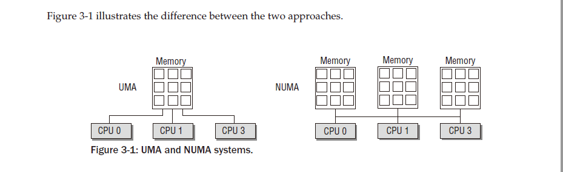

연속되지  않은  메모리를  사용하는  두  머신  유형을  혼합하는  것도  가능합니다.
이러한  혼합은  RAM이  연속적이지  않지만  큰  구멍이  있는  UMA  시스템을  나타냅니다.
여기서는  NUMA  구성의  원칙을  적용하여  커널에  대한  메모리  액세스를  더  간단하게  만드는  것이  도움이  되는  경우가  많습니다.  실제로  커널은  FLATMEM,  DISCONTIGMEM  및  SPARSEMEM의  세  가지  구성  옵션을  구별합니다. SPARSEMEM  과  DISCONTIGMEM은  실질적으로  동일한  목적을  수행하지만  개발자의  관점에서는  코드  품질이  다릅니다.  SPARSEMEM은  더  실험적이고  덜  안정적인  것으로  간주되지만  성능  최적화  기능을  제공합니다.  불연속  메모리는  더  안정적인  것으로  추정되지만  메모리  핫플러그와  같은  새로운  기능에는  준비가  되어  있지  않습니다.
다음  섹션에서는  이  메모리  구성  유형이  대부분의  구성에서  사용되고  일반적으로  커널  기본값이기도  하기  때문에  주로
FLATMEM  으로  제한합니다.  모든  메모리  모델이  실질적으로  동일한  데이터  구조를  사용하기  때문에  다른  옵션을  논의하지
않는다는  사실은  큰  손실이  아닙니다.
실제  NUMA  시스템은  구성  옵션  CONFIG_NUMA를  설정하며  메모리  관리  코드는  두  변형  간에  다릅니다.
플랫  메모리  모델은  NUMA  시스템에서는  적합하지  않으므로  연속되지  않고  희박한  메모리만  사용할  수  있습니다.
구성  옵션  NUMA_EMU를  사용하면  플랫  메모리가  있는  AMD64  시스템이  메모리를  가짜  NUMA  영역으로  분할하여
NUMA  시스템의  전체  복잡성을  누릴  수  있습니다.  이는  실제  NUMA  머신을  사용할  수  없는  경우  개발에  유용할
수  있습니다.  어떤  이유로든  비용이  많이  드는  경향이  있습니다.

이  책은  UMA  사례에  초점을  맞추고  CONFIG_NUMA를  고려하지  않습니다.
이는  NUMA  데이터  구조를  완전히  무시할  수  있다는  의미는  아닙니다.
UMA  시스템은  주소  공간에  큰  홀이  포함된  경우  구성  옵션  CONFIG_DISCONTIGMEM을  선택할  수  있으므로
NUMA  기술을  사용하지  않는  시스템에서도  둘  이상의  메모리  노드를  사용할  수  있습니다.

그림  3-2에는  메모리  레이아웃과  관련된  구성  옵션에  대한  다양한  선택  사항이  요약되어  있습니다.
다음  논의에서  용어  할당  순서를  자주  접하게  될  것입니다 .
메모리  영역에  포함된  페이지  수의  이진  로그를  나타냅니다.
순서  0  할당은  한  페이지,  순서  2  할당은  21  =  2  페이지,  순서  3  할당은  22  =  4  페이지로  구성됩니다.

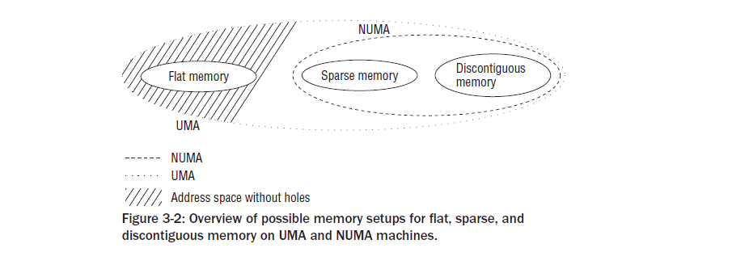

3.2 Organization in the (N)UMA Model
===================================
지원되는  다양한  아키텍처는  메모리  관리  방법에  따라  크게  다릅니다.
커널의  지능적인  설계와  어떤  경우에는  호환성  계층  사이에  있기  때문에  이러한  차이점은  너무  잘  숨겨져  일반
코드에서는  일반적으로  이를  무시할  수  있습니다.
1장에서  설명한  것처럼  주요  문제는  페이지  테이블의  간접  참조  수준  수가  다양하다는  것입니다.
두  번째  핵심  측면은  NUMA와  UMA  시스템으로의  분할입니다.

커널은  균일하고  균일하지  않은  메모리  액세스를  가진  시스템에  대해  동일한  데이터  구조를  사용하므로
개별  알고리즘은  다양한  형태의  메모리  배열을  거의  또는  전혀  구별할  필요가  없습니다.
UMA  시스템에서는  전체  시스템  메모리를  관리하는  데  도움이  되는  단일  NUMA  노드가  도입되었습니다.
메모리  관리의  다른  부분은  의사  NUMA  시스템으로  작업하고  있다고  믿게  됩니다.

3.2.1 Overview
------------------
커널에서  메모리를  구성하는  데  사용되는  데이터  구조를  살펴보기  전에  용어가  항상  이해하기  쉽지  않기  때문에
몇  가지  개념을  정의해야  합니다.  먼저  NUMA  시스템을  고려해  보겠습니다.
이를  통해  UMA  시스템으로  축소하는  것이  매우  쉽다는  것을  보여줄  수  있습니다.
그림  3-3은  아래에  설명된  메모리  분할을  그래픽으로  나타낸  것입니다(데이터  구조를  자세히  살펴보면  알  수  있듯이
상황은  다소  단순화되었습니다).
첫째,  RAM  메모리는  노드로  구분됩니다 .  노드는  시스템의  각  프로세서와  연관되어  있으며  커널에서  pg_data_t  의
인스턴스로  표시됩니다  (이러한  데이터  구조는  곧  정의됩니다).
각  노드는  메모리를  더  세분화하여  영역  으로  분할됩니다 .  예를  들어,  DMA  작업(ISA  장치의  경우)에  사용할
수  있는  메모리  영역에  대한  제한이  있습니다.
처음  16MiB만  적합합니다.  직접  매핑할  수  없는  highmem  영역도  있습니다.
이들  사이에는  보편적으로  사용되는  '일반'  메모리  영역이  있습니다.
따라서  노드는  최대  3개의  영역으로  구성됩니다.
커널은  이들을  구별하기  위해  다음과  같은  상수를  도입합니다.

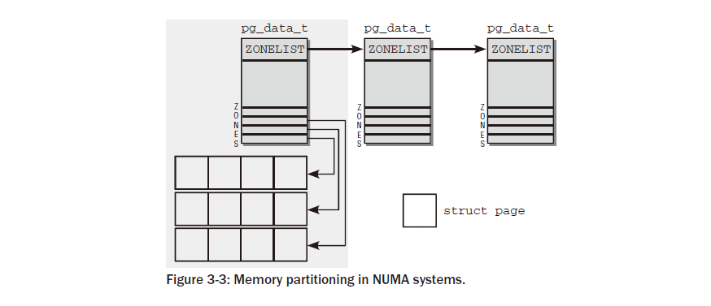

커널은  시스템의  모든  영역을  열거하기  위해  다음  상수를  도입합니다.

<mmzone.h>
enum zone_type {
#ifdef CONFIG_ZONE_DMA
ZONE_DMA,
#endif
#ifdef CONFIG_ZONE_DMA32
ZONE_DMA32,
#endif
ZONE_NORMAL,
#ifdef CONFIG_HIGHMEM
ZONE_HIGHMEM,
#endif
ZONE_MOVABLE,
MAX_NR_ZONES
};

DMA에  적합한  메모리의  경우  ZONE_DMA입니다 .  이  영역의  크기는  프로세서  유형에  따라  다릅니다.  IA-32  시스템에서
제한은  고대  ISA  장치에  의해  부과된  기존  16MiB  경계입니다.
그러나  더  현대적인  기계도  이로  인해  영향을  받을  수  있습니다.

32비트  주소  지정  가능  영역의  DMA  적합  메모리용  ZONE_DMA32 .  분명히  64비트  시스템의  두  DMA  대안  간에는  차이
점만  있습니다.  32비트  시스템에서는  이  영역이  비어  있습니다.  즉,  크기는  0MiB입니다.
예를  들어  Alphas  및  AMD64  시스템에서  이  영역의  범위는  0~4GiB입니다.

커널 세그먼트에  직접  매핑된  일반  메모리의  경우  ZONE_NORMAL입니다 .  이는  모든  아키텍처에  존재할  수  있다고  보장
되는  유일한  영역입니다.  그러나  해당  영역에  메모리가  반드시  장착되어야  한다는  보장은  없습니다.  예를  들어  AMD64  시스템에  2GiB  RAM이  있는
경우  모든  RAM은  ZONE_DMA32  에  속  하고  ZONE_NORMAL은  비어  있습니다.

ZONE_HIGHMEM은  커널  세그먼트  이상으로  확장되는  물리적  메모리용입니다.

컴파일  시간  구성에  따라  일부  영역을  고려할  필요가  없습니다.
예를  들어  64비트  시스템에는  높은  메모리  영역이  필요하지  않으며  DMA32  영역은
최대  4GiB의  메모리에만  액세스할  수  있는  32비트  주변  장치도  지원하는  64비트  시스템에만  필요합니다.

커널은  물리적  메모리의  조각화를  방지하기  위해  노력할  때  필요한  의사  영역  ZONE_MOVABLE을  추가로  정의합니다.
우리는  섹션  3.5.2에서  이  메커니즘을  자세히  살펴볼  것입니다.
MAX_NR_ZONES는  커널이  시스템에  존재하는  모든  영역을  반복하려는  경우  종료  마커  역할을  합니다.
각  영역은  해당  영역에  속하는  물리적  메모리  페이지( 커널에서  페이지  프레임  이라고  함)가  구성되는  배열과  연결됩니다 .
필요한  관리  데이터가  있는  구조체  페이지  의  인스턴스가  각  페이지  프레임에  할당됩니다.
노드는  커널이  노드를  탐색할  수  있도록  단일  연결  리스트에  보관됩니다.
성능상의  이유로  커널은  항상  현재  실행  중인  CPU와  연결된  NUMA  노드에서  프로세스의  메모리  할당을  수행하려고  시도합니다.
그러나  이것이  항상  가능한  것은  아닙니다.  예를  들어  노드가  이미  가득  찼을  수  있습니다.
이러한  상황에서는  각  노드가  대체  목록을  제공합니다(struct  zonelist의  도움으로 ).
목록에는  메모리  할당의  대안으로  사용할  수  있는  다른  노드(및  관련  영역)가  포함되어  있습니다.
목록에서  항목이  뒤로  갈수록  적합성이  떨어지는  것입니다.
UMA  시스템의  상황은  어떻습니까?  여기에는  노드가  하나만  있고  다른  노드는  없습니다.
이  노드는  그림에서  회색  배경으로  표시됩니다.  다른  모든  것은  변경되지  않습니다.

3.2.2 Data Structures
----------------------
이제  메모리  관리에  사용되는  다양한  데이터  구조  간의  관계를  설명했으므로  각각의  정의를  살펴보겠습니다.

Node Management
------------------
pg_data_t  는  노드를  나타내는  데  사용되는  기본  요소이며  다음과  같이  정의됩니다.

<mmzone.h>
typedef struct pglist_data {
    struct zone node_zones[MAX_NR_ZONES];
    struct zonelist node_zonelists[MAX_ZONELISTS];
    int nr_zones;
    struct page *node_mem_map;
    struct bootmem_data *bdata;
    unsigned long node_start_pfn;
    unsigned long node_present_pages; /* total number of physical pages */
    unsigned long node_spanned_pages; /* total size of physical page
    range, including holes */
    int node_id;
    struct pglist_data *pgdat_next;
    wait_queue_head_t kswapd_wait;
    struct task_struct *kswapd;
    int kswapd_max_order;
} pg_data_t;

node_zones  는  노드에  있는  영역의  데이터  구조를  보유하는  배열입니다.
node_zonelists는  현재  영역에  더  이상  사용  가능한  공간이  없는  경우  메모리  할당에  사용되는
순서대로  대체  노드와  해당  영역을  지정합니다.
노드의  서로  다른  영역  수는  nr_zones에  보관됩니다.
node_mem_map은  메모리의  모든  물리적  페이지를  설명하는  데  사용되는  페이지  인스턴스  배열에  대한  포인터입니다.
마디.  여기에는  노드에  있는  모든  영역의  페이지가  포함됩니다.
시스템  부팅  중에  메모리  관리가  초기화되기  전에도  커널에  메모리가  필요합니다.
초기화됩니다(메모리  관리를  초기화하려면  메모리도  예약되어야  함).
이  문제를  해결하기  위해  커널은  섹션  3.4.3에  설명된  부팅  메모리  할당자를  사용합니다.
bdata는  부팅  메모리  할당자를  특징짓는  데이터  구조의  인스턴스를  가리킵니다.
􀀁  node_start_pfn  은  NUMA  노드의  첫  번째  페이지  프레임의  논리  번호입니다.  그  페이지
시스템에  있는  모든  노드  의  프레임에는  연속적으로  번호가  지정되며  각  프레임에는  노드에만  고유한  것이  아니라
전역적으로  고유한  번호가  지정됩니다.  첫  번째  페이지  프레임이  0인  노드가  하나만  있기  때문
에  node_start_pfn  은  UMA  시스템에서  항상  0입니다.
node_present_pages는  영역의  페이지  프레임  수를  지정하고  node_spanned_pages는  페이지  프레임의  영역  크기를  지정합니다.
실제  페이지  프레임에  의해  지원되지  않는  영역에  구멍이  있을  수  있으므로  이  값은  반드시  node_present_pages  와
동일할  필요는  없습니다 .
node_id  는  전역  노드  식별자입니다.
시스템의  모든  NUMA  노드에는  번호가  매겨져  있습니다.
0부터.
􀀁  pgdat_next는  평소와  같이  끝이  표시된  단일  연결  목록에  시스템의  노드를  연결합니다.
널  포인터로.
􀀁  kswapd_wait는  영역  외부에서  프레임을  교환할  때  필요한  스왑  데몬에  대한  대기  대기열입니다
(이  내용은  18장에서  자세히  다룹니다).
kswapd는  영역을  담당하는  스왑  데몬의  작업  구조를  가리킵니다.  kswapd_max_order는
해제할  영역의  크기를  정의하기  위해  스와핑  하위  시스템의  구현에  사용되며  현재는  관심이  없습니다.

노드와  노드가  포함하는  영역과  그림  3-3에  표시된  대체  목록  간의  연결은  데이터  구조  시작  부분의  배열을  통해  설정됩니다.

이는  배열에  대한  일반적인  포인터가  아닙니다.  배열  데이터는  노드  구조  자체에  보관됩니다.

노드의  영역은  node_zones[MAX_NR_ZONES]에  보관됩니다.
노드에  더  적은  영역이  있는  경우에도  어레이에는  항상  3개의  항목이  있습니다.
후자의  경우  나머지  항목은  null  요소로  채워집니다.

노드  상태  관리  시스템에  노드가  두  개  이상  존재할  수  있는  경우  커널은  각  노드에  대한  상태
정보를  제공하는  비트맵을  유지합니다.
상태는  비트마스크를  사용하여  지정되며  다음  값이  가능합니다.
<nodemask.h>
enum node_states {
    N_POSSIBLE, /* The node could become online at some point */
    N_ONLINE, /* The node is online */
    N_NORMAL_MEMORY, /* The node has regular memory */
#ifdef CONFIG_HIGHMEM
    N_HIGH_MEMORY, /* The node has regular or high memory */
    #else
    N_HIGH_MEMORY = N_NORMAL_MEMORY,
    #endif
    N_CPU, /* The node has one or more cpus */
    NR_NODE_STATES
};

CPU  및  메모리  핫플러깅에는  N_POSSIBLE,  N_ONLINE  및  N_CPU  상태  가  필요하지만이  책에서는  기능을  고려하지  않습니다.
메모리  관리에  필수적인  플래그는  N_HIGH_MEMORY  입니다.
및  N_NORMAL_MEMORY.  첫  번째는  해당  영역에  다음과  같은  메모리가  장착되어  있다고  발표합니다.
일반  메모리이거나  높은  메모리일  수  있습니다.  N_NORMAL_MEMORY  는  높은  메모리가  아닌  메모리가  있는  경우에만  설정됩니다.
노드에서.비트  필드  또는  특정  노드의  비트를  각각  설정하거나  지우기  위해  두  가지  보조  기능이  제공됩니다.

<nodemask.h>
void node_set_state(int node, enum node_states state)
void node_clear_state(int node, enum node_states state)

또한  for_each_node_state(__node,  __state)  매크로는  모든  노드에  대한  반복을  허용합니다.
특정  상태에  있고  for_each_online_node(node)는  모든  활성  노드를  반복합니다.
커널이  단일  노드만  지원하도록  컴파일되면,  즉  플랫  메모리  모델을  사용하면  해당  노드는비트맵이
존재하지  않으며  이를  조작하는  함수는  단순히  수행하는  빈  작업으로  확인됩니다.
아무것도  아님.

Memory Zones
------------------
커널은  zones  구조를  사용하여  영역을  설명합니다.  이는  다음과  같이  정의됩니다:
<mmzone.h>
struct zone {
/* Fields commonly accessed by the page allocator */
unsigned long pages_min, pages_low, pages_high;
unsigned long lowmem_reserve[MAX_NR_ZONES];
struct per_cpu_pageset pageset[NR_CPUS];
/*
* free areas of different sizes
*/
spinlock_t lock;
struct free_area free_area[MAX_ORDER];
ZONE_PADDING(_pad1_)
/* Fields commonly accessed by the page reclaim scanner */
spinlock_t lru_lock;
struct list_head active_list;
struct list_head inactive_list;
unsigned long nr_scan_active;
unsigned long nr_scan_inactive;
unsigned long pages_scanned; /* since last reclaim */
unsigned long flags; /* zone flags, see below */
/* Zone statistics */
atomic_long_t vm_stat[NR_VM_ZONE_STAT_ITEMS];
int prev_priority;
ZONE_PADDING(_pad2_)
/* Rarely used or read-mostly fields */
wait_queue_head_t * wait_table;
unsigned long wait_table_hash_nr_entries;
unsigned long wait_table_bits;
/* Discontig memory support fields. */
struct pglist_data *zone_pgdat;
unsigned long zone_start_pfn;
unsigned long spanned_pages; /* total size, including holes */
unsigned long present_pages; /* amount of memory (excluding holes) */
/*
* rarely used fields:
*/
char *name;
} ____cacheline_maxaligned_in_smp;

이  구조의  눈에  띄는  측면은  ZONE_PADDING으로  구분된  여러  섹션으로  나누어져  있다는  것입니다 .
이는  영역  구조에  매우  자주  액세스되기  때문입니다.
다중  프로세서  시스템에서는  일반적으로서로  다른  CPU가  동시에  구조  요소에  액세스하려고  시도하는  경우가  발생합니다.
자물쇠(에서  조사됨따라서  5장)은  서로  간섭하고  오류가  발생하는  것을  방지하는  데  사용됩니다.불일치.
구조의  두  스핀록( zone->lock  및  zone->lru_lock )은  종종커널이  구조에  매우  자주  액세스하기  때문에  획득됩니다.1
데이터는  CPU  캐시에  보관되어  더  빠르게  처리됩니다.
캐시는  라인으로  구분되며,각  라인은  다양한  메모리  영역을  담당합니다.
커널은  ZONE_PADDING  매크로를  호출하여각  잠금이  자체  캐시  라인에  있는지  확인하기  위해  구조에  추가되는  '패딩''을  생성합니다.
최적의  캐시를  달성하기  위해  컴파일러  키워드  __cacheline_maxaligned_in_smp  도  사용됩니다.
조정.
구조의  마지막  두  섹션도  패딩으로  서로  분리됩니다.  둘  다  포함하지  않음잠금의  주요  목적은  빠른  액세스를  위해
데이터를  캐시  라인에  유지하여RAM  메모리에서  데이터를  로드해야  하는데  이는  느린  프로세스입니다.
이로  인해  크기가  증가함패딩  구조는  무시할  수  있습니다.
특히  영역  구조의  인스턴스가  상대적으로  적기  때문입니다.
커널  메모리.
구조  요소의  의미는  무엇입니까?  메모리  관리는  커널의  복잡하고  포괄적인  부분이기  때문에
이  시점에서  모든  요소의  정확한  의미를  다루는  것은  불가능합니다.
이  장과  다음  장의  일부는  관련  데이터  구조를  이해하는  데  전념할  것입니다.그리고  메커니즘.
그러나  제가  제공할  수  있는  것은  제가  겪고  있는  문제를  맛보게  해주는  개요입니다.
논의할  예정입니다.  그럼에도  불구하고  많은  수의  전방  참조는  불가피합니다.

페이지가  교체될  때  페이지_분,  페이지_하이  및  페이지_로우가  '워터마크'로  사용됩니다.

사용  가능한  RAM  메모리가  부족한  경우  커널은  하드  디스크에  페이지를  쓸  수  있습니다.
이  세  가지  요소는  스와핑  데몬의  동작에  영향을  미칩니다.
􀀁  page_high  보다  많은  페이지가  사용  가능하면  영역  상태가  이상적입니다.  􀀁  사용  가능한  페이지  수
가  page_low  아래로  떨어지면  커널은  페이지를  다른  페이지로  교체하기  시작합니다.
하드  디스크.
􀀁  사용  가능한  페이지  수가  page_min  미만이면  페이지  회수에  대한  부담이  커집니다.
해당  영역에  여유  페이지가  긴급하게  필요하기  때문에  증가했습니다.
18장에서는  완화를  찾기  위한  커널의  다양한  수단에  대해  논의할  것입니다.
이러한  워터마크의  중요성은  주로  18장에  표시되지만  섹션  3.5.5에서도  적용됩니다.
lowmem_reserve  배열은  어떤  상황에서도  실패해서는  안  되는  중요한  할당을  위해  예약된  각
메모리  영역에  대해  여러  페이지를  지정합니다.
각  영역은  그  중요성에  따라  기여합니다.  개별  기여도를  계산하는  알고리즘은  섹션  3.2.2에서  논의됩니다.

이지  세트  는  CPU별  핫  앤  콜드  페이지  목록을  구현하기  위한  배열입니다.
커널은  이러한  목록을  사용하여  구현을  만족시키는  데  사용할  수  있는  새로운  페이지를  저장합니다.  그
러나  캐시  상태로  구분됩니다.  여전히  캐시  핫  상태일  가능성이  높으므로  빠르게  액세스할  수  있는  페이지는
캐시  콜드  페이지와  구분됩니다.
다음  섹션에서는  이  동작을  실현하는  데  사용되는  struct  per_  cpu_pageset  데이터  구조에  대해  설명합니다.
free_area는  버디  시스템을  구현하는  데  사용되는  동일한  이름의  데이터  구조  배열입니다.
각  배열  요소는  고정된  크기의  연속  메모리  영역을  나타냅니다.  각  영역에  포함된  여유  메모리  페이지  관리는  free_area부터  시작됩니다 .
사용된  데이터  구조는  자체적으로  논의할  가치가  있으며  섹션  3.5.5에서는  버디  시스템의  구현  세부  사항을  심층적으로  다룹니다.

두번째  섹션의  요소는  활동에  따라  영역에서  사용되는  페이지를  분류하는  역할을  합니다.  자주  액세스되는  페이지는  커널에  의해  활성  페
이지로  간주됩니다 .  비활성  페이지는  분명히  그  반대입니다.  이러한  구별은  페이지를  교체해야  할  때  중요합니다.
가능하다면  자주  사용하는  페이지는  그대로  두어야  하지만  불필요한  비활성  페이지는  처벌  없이  교체될  수  있습니다.

다음  요소가  관련됩니다.

tive_list는  활성  페이지를  수집하고  inactive_list는  비활성  페이지  (페이지
인스턴스).
􀀁  nr_scan_active  및  nr_scan_inactive는  메모리를  회수할  때  스캔할  활성  및  비활성  페이지  수를  지정합니다.
􀀁  Pages_scanned는  페이지가  마지막으로  교체된  이후  스캔에  실패한  페성  및  비활성  페이지  수를  지정합니다.
플래그는 영역의 현재 상태를 설명합니다. 다음 플래그가 허용됩니다.
<mmzone.h>
typedef enum {
ZONE_ALL_UNRECLAIMABLE, /* all pages pinned */
ZONE_RECLAIM_LOCKED, /* prevents concurrent reclaim */
ZONE_OOM_LOCKED, /* zone is in OOM killer zonelist */
} zone_flags_t;
또한  이러한  플래그  중  어느  것도  설정되지  않을  수도  있습니다.  이는  해당  영역의  정상적인  상태입니다.
ZONE_ALL_UNRECLAIMABLE  은  커널이  존의  일부  페이지를  재사용하려고  할  때  (페이지  회수,  18장  참조)
발생할  수  있는  상태이지만  모든  페이지가  고정되어  있기  때문에  전혀  가능하지  않습니다 .
예를  들어,  사용자  공간  애플리케이션은  mlock  시스템  호출을  사용하여  페이지를  교체하는  등의  방법으로
페이지를  물리적  메모리에서  제거해서는  안  된다는  것을  커널에  지시할  수  있습니다.
이러한  페이지가  고정되어  있다고  합니다.  영역의  모든  페이지에  이러한  문제가  발생하면  영역을  회수할  수  없으며
플래그가  설정됩니다.  시간을  낭비하지  않기  위해  스와핑  데몬은  회수할  페이지를  찾을  때  이러한  종류의  영역을
아주  잠깐  스캔합니다.
SMP  시스템에서는  여러  CPU가  동시에  영역을  회수하려는  유혹을  받을  수  있습니다.
ZONE_RECLAIM_LOCKED  플래그는  이를  방지합니다.  CPU가  영역을  회수하는  경우  플래그를  설정합니다.
이렇게  하면  다른  CPU가  시도하는  것을  방지할  수  있습니다.
ZONE_OOM_LOCKED  는  불행한  상황을  위해  예약되어  있습니다.
프로세스가  너무  많은  메모리를  사용하여  필수  작업을  더  이상  완료할  수  없는  경우  커널은  더  많은  여유
페이지를  얻기  위해  최악의  메모리  먹는  사람을  선택하고  이를  종료하려고  시도합니다.
이  플래그는  이  경우  여러  CPU가  방해가  되는  것을  방지합니다.
커널은  영역  플래그를  테스트하고  설정하기  위한  세  가지  보조  기능을  제공합니다.
<mmzone.h>
void zone_set_flag(struct zone *zone, zone_flags_t flag)
int zone_test_and_set_flag(struct zone *zone, zone_flags_t flag)
void zone_clear_flag(struct zone *zone, zone_flags_t flag)

zone_set_flag  및  zone_clear_flag는  각각  특정  플래그를  설정하고  삭제합니다.
zone_test_  and_set_flag는  먼저  주어진  플래그가  설정되어  있는지  테스트하고  그렇지  않으면  그렇게  합니다.
플래그의  이전  상태가  호출자에게  반환됩니다.

vm_stat는  영역에  대한  수많은  통계  정보를  보관합니다.
여기에  보관된  대부분의  정보는  현재로서는  그다지  의미가  없으므로  자세한  논의는  섹션  17.7.1에
서  연기됩니다.  지금은  정보가  커널  전체에서  업데이트된다는  점만  알아도  충분합니다.  보
조  함수  zone_page_state를  사용하면  vm_stat  의  정보를  읽을  수  있습니다 .
<vmstat.h>
static inline unsigned long zone_page_state(struct zone *zone,
enum zone_stat_item item)

예를  들어  항목은  위에서  설명한  active_list  및  inactive_list  에  저장된  활성  및  비활성  페이지  수를
쿼리하기  위해  NR_ACTIVE  또는  NR_INACTIVE  일  수  있습니다.
영역의  사용  가능한  페이지  수는  NR_FREE_PAGES를  통해  얻습니다.

prev_priority는  try_to_free_pages  에서  충분한  페이지  프레임이  해제될  때까지  마지막  검색  작업에서  영역을  검
색한  우선  순위를  저장합니다  (17장  참조).
17장에서도  볼  수  있듯이  매핑된  페이지를  교체할지  여부에  대한  결정은  이  값에  따라  달라집니다.

wait_table,  wait_table_bits  및  wait_table_hash_nr_entries는  페이지가  사용  가능해질  때까지  기다리는  프로
세스에  대한  대기  대기열을  구현합니다.
이  메커니즘의  세부  사항은  14장에  나와  있지만  직관적인  개념은  꽤  잘  적용됩니다.
즉,  프로세스는  어떤  조건을  기다리기  위해  줄을  서서  대기합니다.
이  조건이  true가  되면  커널로부터  알림을  받고  작업을  재개할  수  있습니다.

영역과  상위  노드  간의  연결은  zone_pgdat  에  의해  설정  됩니다.
pg_list_data  의  해당  인스턴스에 .
􀀁  zone_start_pfn  은  해당  영역의  첫  번째  페이지  프레임  인덱스입니다.
􀀁  나머지  세  필드는  거의  사용되지  않으므로  데이터  구조의  끝에  배치되었습니다.
name  은  영역의  일반적인  이름을  포함하는  문자열입니다.
현재  Normal,  DMA  및  HighMem의  세  가지  옵션을  사용할  수  있습니다.
spanned_pages는  영역의  총  페이지  수를  지정합니다.
그러나  이미  언급한  것처럼  영역에  작은  구멍이  있을  수  있으므로  모두  사용할  필요는  없습니다.
따라서  추가  카운터  (present_pages)  는  실제로  사용  가능한  페이지  수를  나타냅니다.
일반적으로  이  카운터의  값은spanned_pages의  값과  동일합니다 .

Calculation of Zone Watermarks
------------------------------
다양한  워터마크를  계산하기  전에  커널은  먼저  중요한  할당을  위해  사용  가능한  최소  메모리  공간을  결정합니다.
이  값은  사용  가능한  RAM  크기에  따라  비선형적으로  확장됩니다.  전역  변수  min_free_kbytes에  저장됩니다 .
그림  3-4는  스케일링  동작에  대한  개요를  제공하며,  메인  그래프와  달리  메인  메모리  크기에  대수  스케일을
사용하지  않는  삽입은  최대  4GiB까지  영역의  확대를  보여줍니다.  데스크탑  환경에서  일반적으로  사용되는  적당한  메모리를  갖춘  시스템의  상황에  대한  느낌을  제공하기  위한  몇  가지  예시적인  값은  표  3-1에  수집되어  있습니다.  128KiB  이상  64MiB  이하를  사용할  수  있다는  점은  변함이  없습니다.
그러나  상한은  매우  만족스러운  양의  주  메모리가  장착된  시스템에서만  필요하다는  점  에  유의하십시오.
3 /proc/sys/vm/min_free_kbytes  파일을  사용  하면  userland에서  값을  읽고  적용할  수  있습니다.
데이터  구조의  워터마크  채우기는  커널  부팅  중에  호출되며  명시적으로  시작할  필요가  없는  init_per_zone_pages_min  에
의해  처리됩니다.
4 setup_per_zone_pages_min은  구조체  영역  의  페이지_분,  페이지_로우  및  페이지_하이  요소를  설정합니다 .
highmem  영역  외부의  총  페이지  수가  계산된  후(그리고  lowmem_  페이지에  저장됨)  커널은  시스템의
모든  영역을  반복하고  다음  계산을  수행합니다.

mm/page_alloc.c
void setup_per_zone_pages_min(void)
{
unsigned long pages_min = min_free_kbytes >> (PAGE_SHIFT - 10);
unsigned long lowmem_pages = 0;
struct zone *zone;
unsigned long flags;
...
for_each_zone(zone) {
u64 tmp;
tmp = (u64)pages_min * zone->present_pages;
do_div(tmp,lowmem_pages);
if (is_highmem(zone)) {
int min_pages;
min_pages = zone->present_pages / 1024;
if (min_pages < SWAP_CLUSTER_MAX)
min_pages = SWAP_CLUSTER_MAX;
if (min_pages > 128)
min_pages = 128;
zone->pages_min = min_pages;
} else {
zone->pages_min = tmp;
}
zone->pages_low = zone->pages_min + (tmp >> 2);
zone->pages_high = zone->pages_min + (tmp >> 1);
}
}

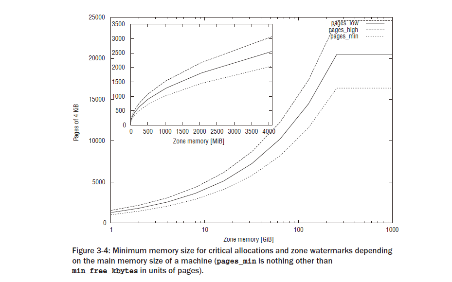

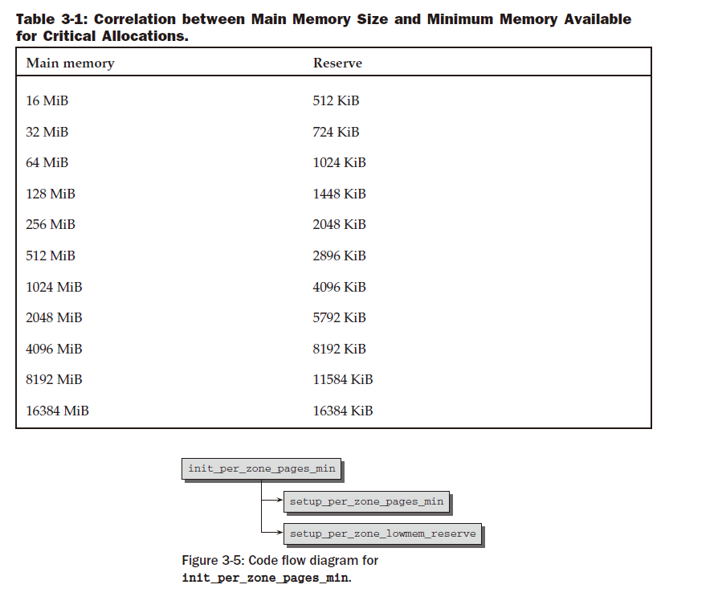

highmem  영역의  하한인  SWAP_CLUSTER_MAX는  전체  페이지에서  중요한  수량입니다. 17장에서  설명한  대로  하위  시스템을
회수합니다.
거기의  코드는  페이지  클러스터에서  배치  방식으로  작동하는  경우가  많습니다. SWAP_CLUSTER_MAX  는
이러한  클러스터의  크기를  정의합니다.
그림  3-4는  다양한  주  메모리  크기에  대한  계산  결과를  보여줍니다.
요즘에는  높은  메모리가  더  이상  중요하지  않기  때문에(대부분 대용량  RAM이  있는  컴퓨터는  64비트  CPU를  사용하므로
결과를  표시하기  위해  그래프를  제한했습니다.
일반  구역의  경우.
lowmem_reserve  계산은  setup_per_zone_lowmem_reserve  에서  수행됩니다 .
커널은  모든  것을  반복합니다.시스템의  노드를  총계로  나누어  노드의  각  구역에  대한  최소  보유량을  계산합니다.
sysctl_lowmem_reserve_ratio[zone]  으로  영역의  페이지  프레임  수 .
기본  설정은제수는  낮은  메모리의  경우  256이고  높은  메모리의  경우  32입니다.

Hot-N-Cold Pages
------------------

구조체  영역  의  페이지  세트  요소는  핫  앤  콜드  할당자를  구현하는  데  사용됩니다.  커널은  다음을  가리킨다.
CPU  캐시에  있는  경우  메모리의  페이지가  핫  하므로  해당  페이지의  데이터에  더  빠르게  액세스할  수  있습니다.
RAM에  있었어요.  반대로  콜드  페이지는  캐시에  보관되지  않습니다.
각  CPU에는  다중  프로세서  시스템에  하나  이상의  캐시가  있으므로  각  CPU에  대해  관리가  별도로  이루어져야  합니다.

영역이  특정  NUMA  노드에  속하고  따라서  특정  CPU와  연결되어  있더라도  다른  CPU의  캐시에는  이  영역의  페이지가  포함될  수  있습니다.
궁극적으로  각  프로세서는  속도는  다르지만  시스템의  모든  페이지에  액세스할  수  있습니다.
따라서  영역별  데이터  구조는  해당  영역의  NUMA  노드와  연결된  CPU뿐만  아니라  해당  영역의
다른  모든  CPU에도  적합해야  합니다.

페이지  세트  는  시스템이  수용할  수  있는  최대  CPU  수만큼  많은  항목을  보유하는  배열입니다.
<mmzone.h>
struct zone {
...
struct per_cpu_pageset pageset[NR_CPUS];
...
};

NR_CPUS  는  컴파일  타임에  정의되는  구성  가능한  전처리기  상수입니다.
이  값은  단일  프로세서  시스템에서는  항상  1이지만  SMP  시스템용으로  컴파일된  커널에서는
2에서  32  사이(또는  64비트  시스템에서는  64)일  수  있습니다.

이  값은  시스템에  실제로  존재하는  CPU  수가  아니라  커널이  지원하는  최대  CPU  수를  반영합니다.

배열  요소는  다음과  같이  정의된  per_cpu_pageset  유형입니다.

<mmzone.h>
struct per_cpu_pageset {
struct per_cpu_pages pcp[2]; /* 0: hot. 1: cold */
} ____cacheline_aligned_in_smp;

구조는  두  개의  항목이  있는  배열로  구성됩니다.
첫  번째는  핫  페이지를  관리하고  두  번째는  콜드  페이지를  관리합니다.
유용한  데이터는  per_cpu_pages에  보관됩니다

<mmzone.h>
struct per_cpu_pages {
int count; /* number of pages in the list */
int high; /* high watermark, emptying needed */
int batch; /* chunk size for buddy add/remove */
struct list_head list; /* the list of pages */
};

count는  요소와  관련된  페이지  수를  기록하는  반면  high  는  워터마크입니다.
count  값이  high를  초과  하면  목록에  페이지가  너무  많다는  의미입니다.
낮은  채우기  상태에는  명시적인  워터마크가  사용되지  않습니다.
요소가  남아  있지  않으면  목록이  다시  채워집니다.
list는  CPU당  페이지를  보유하고  커널의  표준  방법을  사용하여  처리되는  이중  연결  목록입니다.
가능하다면  CPU당  캐시는  개별  페이지로  채워지지  않고  여러  페이지  청크로  채워집니다.
배치는  단일  패스에  추가할  페이지  수에  대한  지침입니다.
그림  3-6은  듀얼  프로세서  시스템에서  CPU당  캐시의  데이터  구조가  어떻게  채워지는지  그래픽으로  보여줍니다.

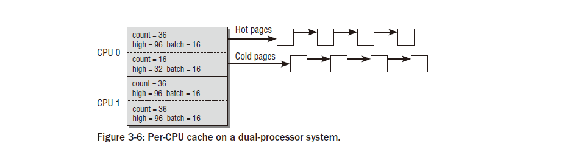

워터마크  계산  방법과  캐시  데이터  구조  초기화  방법은  섹션  3.4.2에서  자세히  설명합니다.

Page Frames
-----------------
페이지  프레임은  시스템  메모리의  가장  작은  단위를  나타내며  RAM의  각  페이지에  대해  구조체  페이지  의  인스턴스가  생성됩니다.  커널  프로그래머는  적당한  RAM  구성을  사용하더라도  시스템의  메모리가  매우  많은  수의  페이지  로  나누어지기  때문에  이  구조를  가능한  한  작게  유지하도록  주의를  기울입니다 .  예를  들어,  표준  페이지  크기  4KiB로  작동하는  IA-32  시스템은  주  메모리  크기가  384MiB인  경우  약  100,000페이지를  갖습니다.  이  메모리  크기는  확실히  오늘날의  표준에  비해  지나치게  크지는  않지만  페이지  수는  이미  상당합니다.
이것이  바로  커널이  구조체  페이지를  가능한  한  작게  유지하기  위해  많은  노력을  기울이는  이유입니다.
일반적인  시스템의  엄청난  페이지  수로  인해  구조가  조금만  변경되어도  모든  페이지  인스턴스  를  유지하는  데  필요한  물리적  메모리  양이  크게  증가합니다 .
구조를  작게  유지하는  것은  페이지의  편재성으로  인해  정확하게  단순화되지는  않습니다.
페이지는  메모리  관리의  많은  부분과  다양한  애플리케이션에  사용됩니다.
커널의  한  부분은  구조체  페이지  에서  사용할  수  있는  특정  정보에  절대적으로  의존하지만 ,
이는  다른  부분에는  쓸모가  없을  수  있습니다.
이  부분  자체는  다른  정보에  의존하고,  다른  부분에는  완전히  쓸모가  없을  수  있습니다.  에 ... .
AC  Union은  처음에  구조체  페이지  의  명확성이  향상되지  않더라도  자연스럽게  이  문제에  대한  해결책으로  활용됩니다 .
예를  들어  보겠습니다.
물리적  페이지는  여러  위치의  페이지  테이블을  통해  가상  주소  공간에  매핑될  수  있으며  커널은  페이지를  매핑하는
장소  수를  추적하려고  합니다.
이를  위해  구조체  페이지  의  카운터는  매핑  수를  계산합니다.
페이지가  슬러브에  의해  사용되는  경우 할당자(전체  페이지를  더  작은  부분으로  나누는  수단,  섹션  3.6.1  참조)는
커널에서만  사용되며  다른  곳에서는  사용되지  않도록  보장되므로  맵  개수  정보가  불필요합니다.
대신,  커널은  페이지를  세분화하여  사용  중인  작은  메모리  개체  수를  나타내기  위해  필드를  재해석할  수  있습니다.
이중  해석은  데이터  구조  정의에서  다음과  같습니다.
<mm_types.h>
struct page {
...
union {
atomic_t _mapcount; /* Count of ptes mapped in mms,
* to show when page is mapped
* & limit reverse map searches.
*/
unsigned int inuse; /* SLUB: Nr of objects */
};
...
}

atom_t  와  unsigned  int  는  두  가지  다른  데이터  유형입니다.  첫  번째는  값을  원자적으로  변경할  수  있습니다.
즉,  동시  액세스에  대해  안전하고  두  번째는  고전적인  정수입니다 .
omic_t는  32비트를  제공하며6  정수는  Linux가  지원하는  각  아키텍처에서  이만큼의  비트를  제공합니다.
이제  다음과  같이  정의를  '간단화'하고  싶은  유혹이  생길  수  있습니다.

struct page {
...
atomic_t counter;
...
}
그러나  이는  나쁜  스타일이며  커널  개발자가  완전히  받아들일  수  없는  것입니다.  슬러브  코드는  객체  카운터에
접근하기  위해  원자성이  필요하지  않으며  이는  데이터  유형에도  반영되어야  합니다.
그리고  가장  중요한  것은  코드의  가독성이  두  하위  시스템  모두에서  저하된다는  것입니다.  _mapcount  및  inuse는
요소의  내용에  대한  명확하고  간결한  설명을  제공하지만  counter  는  거의  모든  것을  의미할  수  있습니다.

Definition of page
--------------------
구조는  다음과  같이  정의됩니다.
<mm.h>
struct page {
    unsigned long flags; /* Atomic flags, some possibly
    * updated asynchronously */
    atomic_t _count; /* Usage count, see below. */
    union {
    atomic_t _mapcount; /* Count of ptes mapped in mms,
    * to show when page is mapped
    * & limit reverse map searches.
    */
     unsigned int inuse; /* SLUB: Nr of objects */
    };
    union {
    struct {
    unsigned long private; /* Mapping-private opaque data:
    * usually used for buffer_heads
    * if PagePrivate set; used for
    * swp_entry_t if PageSwapCache;
    * indicates order in the buddy
    * system if PG_buddy is set.
    */
    struct address_space *mapping; /* If low bit clear, points to
    * inode address_space, or NULL.
    * If page mapped as anonymous
    * memory, low bit is set, and
    * it points to anon_vma object:
    * see PAGE_MAPPING_ANON below.
    */
    };
    ...
    struct kmem_cache *slab; /* SLUB: Pointer to slab */
    struct page *first_page; /* Compound tail pages */
    };
    union {
    pgoff_t index; /* Our offset within mapping. */
    void *freelist; /* SLUB: freelist req. slab lock */
    };
    struct list_head lru; /* Pageout list, eg. active_list
    * protected by zone->lru_lock !
    */
    #if defined(WANT_PAGE_VIRTUAL)
    void *virtual; /* Kernel virtual address (NULL if
    not kmapped, ie. highmem) */
    #endif /* WANT_PAGE_VIRTUAL */
};

slab,  freelist  및  inuse  요소는  slub  할당자에서  사용됩니다.  우리는  이러한  특별한  배열에  관심을  가질  필요가  없으며  슬러브  할당자에  대한  지원이  커널에  컴파일되지  않으면  사용되지  않으므로  문제를  단순화하기  위해  다음  논의에서는  생략합니다.
각  페이지  프레임은  사용된  CPU  유형에  의존하지  않는  아키텍처  독립적  형식으로  이  구조로  설명됩니다.
슬러브  요소  외에도  페이지  구조에는  다른  곳에서  논의된  커널  하위  시스템의  맥락에서만  정확하게  설명될  수  있는
여러  다른  요소가  포함되어  있습니다.
그럼에도  불구하고  나는  구조의  내용에  대한  개요를  제공할  것입니다.
이는  이후  장을  참조하는  것을  의미합니다.

플래그는  페이지  속성을  설명하기  위해  아키텍처  독립적인  플래그를  저장합니다.
아래에서는  다양한  플래그  옵션에  대해  설명합니다.
count  는  커널에서  해당  페이지를  참조한  횟수를  나타내는  사용  횟수입니다.
 해당  값이  0에  도달하면  커널은  페이지인스턴스가  현재  사용  중이  아니므로  제거할  수  있음을  알게  됩니다.
 해당  값이  0보다  크면  인스턴스가  메모리에서  제거되어서는  안  됩니다.
 참조  카운터에  익숙하지  않은  경우  자세한  내용은  부록  C를  참조하세요.
 -mapcount는  해당  페이지를  가리키는  페이지  테이블의  항목  수를  나타냅니다.
 􀀁  lru는  페이지를  그룹화할  수  있는  다양한  목록에  페이지를  유지하는  데  사용되는  목록  헤드입니다.
 다양한  카테고리,  가장  중요한  것은  활성  페이지와  비활성  페이지입니다.  특히  18장의  논의는  이  목록으로  다시  돌아올  것입니다.
 커널에서는  인접한  여러  페이지를  더  큰  복합  페이지로  결합할  수  있습니다.
 첫번째 클러스터의  페이지를  헤드  페이지  라고  하고  다른  모든  페이지를  테일  페이지라고  합니다.
 모든  테일  페이지에는  first_page가  헤드  페이지를  가리키도록  설정되어  있습니다.
 매핑은  페이지  프레임이  위치하는  주소  공간을  지정합니다.
 index  는  매핑  내의  오프셋입니다.  주소  공간은  예를  들어  파일 을  메모리로  읽을  때  사용되는  매우
 일반적인  개념입니다.
 주소  공간은  파일  내용(데이터)을  내용이  읽혀지는  메모리  영역과  연결하는  데  사용됩니다.
 작은  트릭을  사용하여7  매핑은  포인터뿐  아니라  페이지가  주소  공간과  연결되지  않은
 익명  메모리  영역에  속하는지  여부에  대한  정보도  저장할  수  있습니다.
 숫자  값  1의  비트가  매핑  에  설정된  경우  포인터는  address_space  의  인스턴스를  가리키는  것이  아니라
 익명  페이지에  대한  역  매핑  구현에  중요한  다른  데이터  구조  (anon_vma)  를  가리킵니다.
 이  구조는  섹션  4.11.2에서  논의됩니다.  address_space  인스턴스는  항상  sizeof(long)  에  맞춰
 정렬되므로  포인터를  두  번  사용할  수  있습니다 .
 따라서  이  인스턴스에  대한  포인터의  최하위  비트는  Linux가  지원하는  모든  시스템에서  0입니다.
 포인터가  일반적으로  address_space의  인스턴스를  가리키는  경우  포인터를  직접  사용할  수  있습니다 .
 최하위  비트를  1로  설정하는  트릭을  사용하면  커널은  다음  작업을  통해  포인터를  복원할  수  있습니다.
 anon_vma  =  (struct  anon_vma  *)  (매핑  -  PAGE_MAPPING_ANON)
 개인은  가상  메모리  관리에서  무시되는  '개인'  데이터에  대한  포인터입니다.
 포인터는  페이지  사용량에  따라  다양한  방식으로 사용될  수  있습니다.
 이는  다음  장에서  설명하는  것처럼  페이지를  데이터  버퍼와  연결하는  데  주로  사용됩니다.

 virtual은  highmem  영역의  페이지,  즉  커널  메모리에  직접  매핑될  수  없는  페이지에  사용됩니다.
 virtual은  페이지의  가상주소를  승인합니다 .
 전처리기  문  #ifdef{WANT_PAGE_VIRTUAL}  에서  볼  수  있듯이  가상  요소는  해당  전처리기  상수가  정의된  경우
 구조체  페이지  의  일부일  뿐입니다 .
 현재  이는  Motorola  m68k,  FRV  및  Extensa와  같은  일부  아키텍처에만  해당됩니다.
다른  모든  아키텍처는  가상  페이지  주소를  지정하는  다른  방식을  채택합니다.
이것의  핵심은  모든  highmem  페이지의  주소를  찾는  데  사용되는  해시  테이블입니다.
섹션  3.5.8에서는  적절한  기술을  더  자세히  다루고  있습니다.  해시  테이블을  처리하려면  앞서
언급한  시스템에서는  느린  몇  가지  수학적  연산이  필요하므로  직접  접근  방식을  선택했습니다.

Architecture-Independent Page Flags
------------------------------------

페이지의  다양한  속성은  구조체  페이지  의  플래그  요소  에  비트로  저장된  일련의  페이지  플래그로  설명됩니다 .
플래그는  사용된  아키텍처와  독립적이므로  CPU  또는  시스템  관련  정보를  제공할  수  없습니다
(이  정보는  아래  표시된  것처럼  페이지  테이블  자체에  보관됩니다).
page-flags.h  의  전처리기의  도움으로  개별  플래그가  정의될  뿐만  아니라  플래그를  설정,
삭제  및  쿼리하기  위한  매크로도  생성됩니다.  그렇게  함으로써  커널은  보편적인  규칙을  따릅니다.
명명  체계;  예를  들어,  PG_locked  상수는  페이지가  잠겨  있는지  여부를  지정하기  위해  플래그  의  비트  위치를  정의합니다 .
비트를  조작하는  데  다음  매크로를  사용할  수  있습니다.
pageLocked는  비트가  설정되어  있는지  쿼리합니다.
􀀁  SetPageLocked는  이전  상태에  관계없이  PG_locked  비트를  설정합니다 .
􀀁  TestSetPageLocked는  비트를  설정하지만  이전  값도  반환합니다.
􀀁  ClearPageLocked는  이전  상태에  관계없이  비트를  삭제합니다.
􀀁  TestClearPageLocked는  비트를  삭제하고  이전  값을  반환합니다.
다른  페이지  플래그에  대한  적절한  비트에  표시된  작업을  수행하는  동일한  매크로  세트가  있습니다.
매크로는  원자적으로  구현됩니다.
그  중  일부는  여러  명령문으로  구성되어  있지만  마치  단일  명령문인  것처럼  작동하도록  특수  프로세서  명령이  사용됩니다.
 즉,  경쟁  조건이  발생할  수  있으므로  중단할  수  없습니다.
 (14장에서는  경쟁  조건이  어떻게  발생하고  이를  방지할  수  있는지  설명합니다.)

어떤  페이지  플래그를  사용할  수  있나요?  다음  목록에는  가장  중요한  플래그가  포함되어  있습니다
(다시  말하지만  해당  의미는  이후  장에서  명확해집니다).

PG_locked는  페이지가  잠겨  있는지  여부를  지정합니다.  비트가  설정되면  커널의  다른  부분은  활성화되지  않습니다.
페이지에  접근이  허용되었습니다.  이는  예를  들어  하드  디스크에서  페이지  프레임으로  데이터를  읽을  때  메모리  관리의  경쟁  조건을  방지합니다.

이지와  관련된  I/O  작업  중에  오류가  발생하면  PG_error  가  설정됩니다.
􀀁  PG_referenced  및  PG_active는  시스템에서  페이지를  얼마나  적극적으로  사용하는지  제어합니다.
이  정보는  교체  하위  시스템이  교체할  페이지를  선택해야  할  때  중요합니다.  두 플래그의  상호  작용은  18장에서  설명됩니다.

PG_uptodate는  블록  장치에서  페이지의  데이터를  오류  없이  읽었음을  나타냅니다.
􀀁  PG_dirty  는  하드의  데이터와  비교하여  페이지의  내용이  변경된  경우  설정됩니다.
디스크.  성능상의  이유로  각  변경  후  페이지가  즉시  다시  기록되지  않습니다.
따라서  커널은  이  플래그를  사용하여  나중에  플러시할  수  있도록  변경된  페이지를  기록합니다.
이  플래그가  설정된  페이지를  더티(dirty )라고  합니다
(일반적으로  이는  RAM의  데이터와  하드  디스크와  같은  보조  저장  매체의  데이터가  동기화되지  않았음을  의미합니다).

PG_lru는  페이지  회수  및  교환을  구현하는  데  도움이  됩니다.
커널은  활성  페이지와  비활성  페이지를  구별하기  위해  가장  최근에  사용된  두  개 의  목록8을  사용합니다.
 페이지가  이러한  목록  중  하나에  있으면  비트가  설정됩니다.
 페이지가  활성  페이지  목록에  있는  경우  설정되는  PG_active  플래그  도  있습니다 .
18장에서는  이  중요한  메커니즘에  대해  자세히  설명합니다.

PG_highmem은  페이지가  커널  메모리에  영구적으로  매핑될  수  없기  때문에  페이지가  높은  메모리에  있음을  나타냅니다.

페이지  구조  의  private  요소  값이  NULL이  아닌  경우  PG_private을  설정해야  합니다.
I/O에  사용되는  페이지는  이  필드를  사용하여  페이지를  버퍼  로  세분화  하지만(자세한  내용은  16장  참조),
커널의  다른  부분에서는  개인  데이터를  페이지에  연결하는  데  다른  용도를  찾습니다.

PG_writeback은  내용이  블록에  다시  기록되는  중인  페이지에  대해  설정됩니다.

PG_slab은  섹션  3.6에서  설명한  슬랩  할당자의  일부인  페이지에  대해  설정됩니다.
􀀁  페이지가  스왑  캐시에  있으면 PG_swapcache가  설정됩니다.
이  경우  private  에는  다음  항목이  포함됩니다.
swap_entry_t를  입력하십시오  (자세한  내용은  18장에서  제공됩니다).
􀀁  사용  가능한  메모리  양이  작아지면  커널은  주기적으로  페이지  회수 ,  즉  비활성  상태의  사용되지  않는  페이지를
제거하려고  시도합니다.  자세한 내용은  18장에서  설명합니다.
커널이  특정  페이지를  회수하기로  결정하면  PG_reclaim  플래그를  설정하여  이를  알립니다.

PG_buddy  페이지가  free이고  버디  시스템의  목록,  즉  코어에  포함되어  있으면  설정됩니다.
페이지  할당  메커니즘.
􀀁  PG_compound는  페이지가  여러  페이지로  구성된  더  큰  복합  페이지의  일부임을  나타냅니다.
인접한  일반  페이지.

페이지에  특정  비트가  설정되어  있는지  확인하거나  비트를  조작하기  위해  여러  표준  매크로가  정의되어  있습니다.
이름은  특정  패턴을  따릅니다.

PageXXX(페이지)는  페이지에  PG_XXX  비트가  설정되어  있는지  확인합니다.  예를  들어  PageDirty는  다음을  확인합니다.
PG_dirty  비트,  PageActive는  PG_active  등을  확인합니다 .
􀀁  비트가  설정되지  않은  경우  설정하고  이전  값을  반환하기  위해  SetPageXXX가  제공됩니다.  􀀁  ClearPageXXX는  특정
비트를  무조건  삭제합니다.
􀀁  TestClearPageXXX는  비트가  설정된  경우  비트
를  지우지만  이전  활성  값도  반환합니다.

이러한  작업은  원자적으로  구현됩니다.  5장에서는  이것이  무엇을  의미하는지  더  자세히  설명합니다.

페이지  상태가  변경될  때까지  기다렸다가  작업을  재개해야  하는  경우가  많습니다.
커널이  제공하는  두  가지  보조  기능이  특히  중요합니다.
<pagemap.h>
void wait_on_page_locked(struct page *page);
void wait_on_page_writeback(struct page *page)

커널의  한  부분이  잠긴  페이지가  잠금  해제될  때까지  기다리기를  원한다고  가정합니다.
wait_on_page_locked를  사용  하면  이  작업을  수행할  수  있습니다.
이것이  기술적으로  수행되는  방법은  14장에서  논의되지만,
여기서는  함수를  호출한  후  페이지가  잠기면  커널이  절전  모드로  전환된다는  점만  알아두면  충분합니다.
페이지의  잠금이  해제되면  슬리퍼는  자동으로  깨어나  작업을  계속할  수  있습니다.
wait_on_page_writeback은  비슷하게  작동하지만  페이지에  포함된  데이터가  블록  장치(예:  하드  디스크)와
동기화되는  보류  중인  쓰기  저장  작업이  완료될  때까지  기다립니다.

3.3 Page Tables
------------------
계층적으로  연결된  페이지  테이블은  대규모  주소  공간의  빠르고  효율적인  관리를  지원하는  데  사용됩니다.
이  접근  방식의  기본  원리와  선형  주소  지정과  비교하여  제공되는  이점은  1장에서  설명합니다.
여기서는  구현의  기술적  측면을  자세히  살펴보겠습니다.
페이지  테이블은  사용자  프로세스의  가상  주소  공간과  시스템의  물리적  메모리(RAM,  페이지  프레임)  간의  연관을
설정하는  데  사용됩니다.
지금까지  논의된  구조는  RAM  메모리의  구조(노드와  영역으로  분할)를  설명하고  포함된  페이지
프레임의  수와  상태(사용되거나  사용되지  않음)를  지정하는  데  사용됩니다.
페이지  테이블은  각  프로세스에서  사용할  수  있는  균일한  가상  주소  공간을  만드는  데  사용됩니다.
응용  프로그램에서는  이  공간을  연속적인  메모리  영역으로  간주합니다.
또한  테이블은  사용되는  가상  페이지를  RAM에  매핑하므로  공유  메모리(동시에  여러  프로세스에서  공유하는  메모리)
구현과  페이지를  블록  장치로  스왑  아웃하여  사용  가능한  메모리의  유효  크기를  늘릴  수  있습니다.
추가  물리적  RAM이  필요합니다.

커널  메모리  관리에서는  기본  프로세서에  해당하는지  여부에  관계없이  4단계  페이지  테이블을  가정합니다.
이  가정이  사실  이  아닌  가장  좋은  예는  IA-32  시스템입니다.
기본적으로  이  아키텍처는  PAE  확장이  사용되지  않는다고  가정하여  2단계  페이징  시스템만  사용합니다.
결과적으로  세  번째  및  네  번째  수준은  아키텍처별  코드로  에뮬레이트되어야  합니다.
페이지  테이블  관리는  두  부분,  즉  첫  번째  아키텍처  종속  부분과  두  번째  아키텍처  독립적  부분으로  나뉩니다.
흥미롭게도  모든  데이터  구조와  이를  조작하는  거의  모든  기능은  아키텍처별  파일에  정의되어  있습니다.
CPU별  구현  간에는(사용된  다양한  CPU  개념으로  인해)  큰  차이가  있기  때문에  간결성을  위해  낮은  수준의
세부  사항은  다루지  않겠습니다.
개별  프로세서에  대한  광범위한  지식도  필요하며,  각  프로세서  제품군에  대한  하드웨어  설명서는  일반적으로
여러  권의  책에  분산되어  있습니다.  부록  A에서는  IA-32  아키텍처를  더  자세히  설명합니다.
또한  최소한  요약  형식으로  Linux에서  지원하는  다른  중요한  프로세서의  아키텍처에  대해서도  설명합니다.
다음  섹션의  데이터  구조  및  기능에  대한  설명은  일반적으로  아키텍처  종속  파일에서  제공되는
인터페이스를  기반으로  합니다.
정의는  헤더  파일  include/asm-arch/page.h  및  include/asm-arch/pgtable.h  에서  찾을  수  있으며
아래에서는  축약된  형태로  page.h  및  pgtable.h  로  참조됩니다 .
AMD64와  IA-32는  하나의  아키텍처로  통합되었지만  페이지  테이블  처리와  관련하여  많
은  차이점을  나타내기  때문에  해당  정의는  두  개의  다른  파일(include/asm-x86/page_32.h  및  include /asm-x86)
에서  찾을  수  있습니다. /page_64.h,  pgtable_XX.h  와  유사합니다 .
특정  아키텍처와  관련된  측면을  논의할  때  해당  아키텍처를  명시적으로  언급합니다.
다른  모든  정보는  연관된  구조의  정의가  아키텍처별로  다르더라도  모든  아키텍처에  동일하게  유효합니다.

3.3.1 Data Structures
------------------
C에서  void*  데이터  유형은  메모리의  모든  바이트  위치에  대한  포인터를  지정하는  데  사용됩니다.
필요한  비트  수는  아키텍처에  따라  다릅니다.  모든  일반  프로세서(Linux가  실행되는  모든  프로세서  포함)는
32비트  또는  64비트를  사용합니다.
커널  소스에서는  void*  와  unsigned  long이  동일한  비트  수를  갖고  있어  정보  손실  없이  타입  변환을
통해  상호  변환될  수  있다고  가정합니다.  공식적으로  sizeof(void*)  ==  sizeof(unsigned  long)  으로  표현되는
이  가정은  물론  Linux가  지원하는  모든  아키텍처에서  적용됩니다.
메모리  관리에서는  처리  및  조작이  더  쉽기  때문에  void  포인터  대신  unsigned  long  유형의  변수를  사용하는
것을  선호합니다 .  기술적으로  둘  다  동일하게  유효합니다.

Breakdown of Addresses inMemory
------------------------------------
가상  메모리의  주소는  4단계  페이지  테이블  구조에  따라  5개  부분으로  분할됩니다
(페이지를  선택하는  4개의  테이블  항목과  페이지  내  위치를  나타내는  인덱스).
길이뿐만  아니라  주소가  분할되는  방식도  개별  아키텍처에  따라  다릅니다.
따라서  커널은  주소를  개별  구성  요소로  분해하는  매크로를  정의합니다.

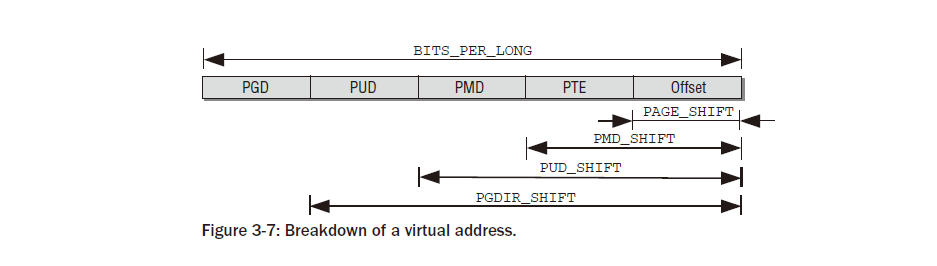

그림  3-7은  비트  이동에  의해  주소  요소의  위치가  어떻게  정의되는지  보여줍니다.
BITS_PER_LONG은  부호  없는  긴  변수  에  사용되는  비트  수를  지정하므로  가상  주소  공간에  대한  일반  포인터에도  사용됩니다.
각  포인터의  끝에는  선택한  프레임  페이지  내의  위치를  지정하는  여러  비트가  있습니다.
필요한  비트  수는  PAGE_SHIFT에  보관됩니다.
PMD_SHIFT는  페이지  와  페이지  테이블의  마지막  레벨에  있는  항목이  사용하는  총  비트  수를  지정합니다 .
이  숫자를  PAGE_SHIFT  에서  빼면  페이지  테이블의  마지막  계층  구조  수준에  있는  항목에  필요한  비트  수를  결정할  수  있습니다.
더  중요한  것은  이  값이  중간  페이지  테이블의  항목이  관리하는  부분  주소  공간의  크기,
즉  2PMD_SHIFT  바이트를  나타낸다는  사실입니다.
PUD_SHIFT는  PAGE_OFFSET  과  PMD_SHIFT  의  비트  길이를  더하는  반면 ,
PGDIR_SHIFT는  PAGE_OFFSET,  PUD_SHIFT  및  PMD_SHIFT  의  비트  길이를  페이지  중간  디렉터리  항목의
비트  번호와  결합합니다.
값은  페이지  전역  디렉터리의  항목을  통해  주소를  지정할  수  있는  부분  주소  공간  크기의  이진  로그입니다.
페이지  테이블의  다양한  디렉토리에  저장될  수  있는  포인터의  수도  매크로  정의에  의해  결정됩니다.
PTRS_PER_PGD는  페이지  전역  디렉터리의  항목  수를  지정하고,
PTRS_PER_PMD는  페이지  중간  디렉터리의  수,  PTRS_PER_PUD는  페이지  상위  디렉터리의  수,
PTRS_PER_PTE는  페이지  테이블  항목의  수를  지정합니다.

2레벨  페이지  테이블이  있는  아키텍처는  PTRS_PER_PMD  및  PTRS_PER_PUD를  1로  정의합니다.
이는  두  페이지만  사용되지만  커널의  나머지  부분이  4레벨  페이지  변환으로  작업하고  있음을  설득합니다.
페이지  중간  및  페이지  상위  디렉토리는  효과적으로  제거됩니다.  항목이  하나만  있습니다.
4단계  페이지  테이블을  사용하는  시스템은  거의  없기  때문에  커널은  헤더  파일  include/asm-generic/pgtable-nopud.h를
사용하여  네  번째  페이지  테이블의  존재를  시뮬레이션하는  데  필요한  모든  선언을  보유합니다.
헤더  파일  include/asm-generic/pgtable-nopmd.h는
2레벨  주소  변환을  사용하는  시스템에서  세  번째  페이지  테
이블  레벨의  존재를  시뮬레이션하는  데에도  사용할  수  있습니다.

n비트  길이  의  포인터로  주소를  지정할  수  있는  주소  영역의  크기는  2n  바이트입니다.
커널반복할  필요가  없도록  계산된  값을  보유할  추가  매크로  변수를  정의합니다.
몇  번이고  계산을  반복합니다.  변수는  다음과  같이  정의됩니다.
#define PAGE_SIZE (1UL << PAGE_SHIFT)
#define PUD_SIZE (1UL << PUD_SHIFT)
#define PMD_SIZE (1UL << PMD_SHIFT)
#define PGDIR_SIZE (1UL << PGDIR_SHIFT)

값  2n은  이진  시스템에서  비트  n  위치를  왼쪽으로  이동하여  쉽게  계산됩니다.위치
0.  커널은  이  '트릭'을  여러  곳에서  사용합니다.
비트  연산에  익숙하지  않은  분들은부록  C에서  관련  설명을  찾아보세요.

include/asm-x86/pgtable_64.h
#define PGDIR_SHIFT 39
#define PTRS_PER_PGD 512
#define PUD_SHIFT 30
#define PTRS_PER_PUD 512
#define PMD_SHIFT 21
#define PTRS_PER_PMD 512

매크로  PTRS_PER_XXX는  주어진  디렉토리  항목이  얼마나  많은  포인터(즉,  다른  값)를  지정할  수  있는지  지정합니다.
대표하다.  AMD64는  각  디렉토리에  9비트를  사용하므로  각각에  29  =  512개의  포인터가  맞습니다.
커널은  또한  주어진  주소에서  개별  구성  요소를  추출하는  수단이  필요합니다.
커널이를  위해  아래에  정의된  비트마스크를  사용합니다.

#define PAGE_MASK (~(PAGE_SIZE-1))
#define PUD_MASK (~(PUD_SIZE-1))
#define PMD_MASK (~(PMD_SIZE-1))
#define PGDIR_MASK (~(PGDIR_SIZE-1))

Format of Page Tables
----------------------
페이지  테이블의  항목  크기는  위  정의에  의해  설정되었지만  그렇지  않습니다.
그들의  구조.  커널은  항목을  나타내기  위해  4개의  데이터  구조( page.h에  정의됨)  를  제공합니다.
구조.
역  디렉터리  항목의  경우  pgd_t입니다 .
􀀁  pud_t는  페이지  상위  디렉토리의  항목입니다.
􀀁  페이지  중간  디렉터리의  항목에  대한  pmd_t입니다 .
􀀁  직접  페이지  테이블  항목의  경우  pte_t입니다
페이지  테이블  항목을  분석하는  표준  함수는  표  3-2에  나열되어  있습니다.
(아키텍처에  따라일부  함수는  매크로로  구현되고  다른  함수는  인라인  함수로  구현됩니다.
나는  둘  사이에  구별을  두지  않는다.아래  두  개.)

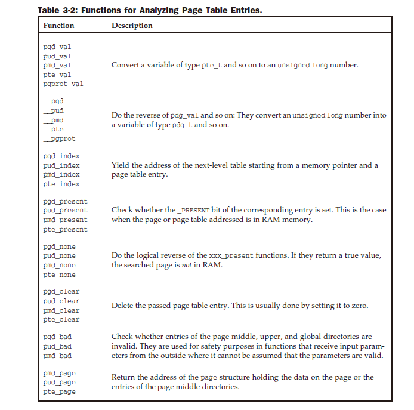

오프셋  기능은  어떻게  작동하나요?  pmd_offset을  예로  들어보겠습니다 .
페이지  전역  디렉터리  (src_pgd)  의  항목  과  메모리  주소가  매개변수로  필요합니다.
페이지  중간  디렉터리  중  하나에서  요소를  반환합니다.

src_pmd = pmd_offset(src_pgd, address);

PAGE_ALIGN은  각  아키텍처(일반적으로  page.h)  에서  정의해야  하는  또  다른  표준  매크로입니다 .
주소를  매개변수로  예상하고  주소가  정확히  다음  페이지의  시작  부분에  있도록  '반올림'합니다.
페이지  크기가  4,096인  경우  매크로는  항상  이  크기의  정수  배수를  반환합니다.
PAGE_ALIGN(6000)  =  8192  =  2×  4,096,  PAGE_ALIGN(0x84590860)  =  0x84591000  =  542,097  ×  4,096.
프로세서의  캐시  리소스를  최대한  활용하려면  페이지  경계에  대한  주소  정렬이  중요합니다.
C  구조는  페이지  테이블의  항목을  나타내는  데  사용되지만  대부분은
AMD64  아키텍처의  예에서  볼  수  있듯이  단일  요소(일반적으로  unsigned  long )로  구성됩니다.

include/asm-x86_64/page.h
typedef struct { unsigned long pte; } pte_t;
typedef struct { unsigned long pmd; } pmd_t;
typedef struct { unsigned long pud; } pud_t;
typedef struct { unsigned long pgd; } pgd_t

페이지  테이블  요소의  내용이  관련  도우미  함수에  의해서만  처리되고  직접적으로  처리되지  않도록
보장하기  위해  기본  유형  대신  구조체가  사용됩니다.
항목은  여러  기본  변수로  구성될  수도  있습니다.
이  경우  커널은  구조체를  사용해야  합니다 .

가상  주소는  익숙한  구성표에  따라  페이지  테이블의  인덱스로  사용되는  여러  부분으로  분할됩니다.
따라서  개별  부분의  길이는  사용된  아키텍처의  단어  길이에  따라  32비트  또는  64비트  미만입니다.
커널  소스에서  발췌한  내용에서  알  수  있듯이  커널(및  프로세서)은  32비트  또는  64비트  유형을  사용하여
(테이블  수준에  관계없이)  페이지  테이블의  항목을  나타냅니다.
이는  유용한  데이터,  즉  다음  테이블의  기본  주소를  저장하는  데  테이블  항목의
모든  비트가  필요한  것은  아니라는  것을  의미합니다.
불필요한  비트는  추가  정보를  저장하는  데  사용됩니다.
부록  A에서는  다양한  아키텍처의  페이지  테이블  구조를  자세히  설명합니다.

PTE-Specific Entries
---------------------
페이지  테이블의  각  최종  항목은  페이지의  메모리  위치에  대한  포인터를  생성할  뿐만  아니라  위에서  언급한
불필요한  비트의  페이지에  대한  추가  정보도  보유합니다.
이러한  데이터는  CPU별로  다르지만  일반적으로  페이지  액세스  제어에  대한  최소한의  정보를  제공합니다.
Linux  커널이  지원하는  대부분의  CPU에는  다음  요소가  있습니다.

PAGE_PRESENT는  가상  페이지가  RAM  메모리에  존재하는지  여부를  지정합니다.  그럴  필요는  없다.
1장에서  간략하게  설명한  것처럼  페이지가  스왑  영역으로  스왑  아웃될  수  있기  때문에  반드시  그런  경우가  있습니다.
페이지  테이블  항목의  구조는  일반적으로  페이지가  메모리에  없으면  메모리에서  페이지의  위치를
설명할  필요가  없기  때문에  다릅니다.
대신,  교체된  페이지를  식별하고  찾기  위한  정보가  필요합니다.

AGE_ACCESSED  는  페이지에  액세스할  때마다  CPU에  의해  자동으로  설정됩니다.  커널은  페이지가  얼마나  적극적으로
사용되는지  확인하기  위해  정기적으로  필드를  확인합니다(자주  사용되지  않는  페이지는  좋은  교환  후보입니다).
비트는  읽기  또는  쓰기  액세스  후에  설정됩니다.

AGE_DIRTY는  페이지가  '더티'인지,  즉  페이지  내용이  손상되었는지  여부를  나타냅니다.

AGE_FILE은  _PAGE_DIRTY  와  동일한  숫자값을  가지지  만,  메모리에  페이지가  존재  하지  않는  경우와는  다른  맥락
에서  사용됩니다 .  분명히  존재하지  않는  페이지는  더티일  수  없으므로  비트가  재해석될  수  있습니다.
설정되지  않은  경우  항목은  교체된  페이지의  위치를  가리킵니다(18장  참조).
섹션  4.7.3에서  논의되는  비선형  파일  매핑에  속하는  항목에는  _PAGE_FILE  세트가  필요합니다.

AGE_USER를  설정하면  사용자  공간  코드로  해당  페이지에  접근할  수  있습니다.  그렇지  않으면  커널만
이를  수행할  수  있습니다(또는  CPU가  시스템  모드에  있을  때).

AGE_READ,  _PAGE_WRITE  및  _PAGE_EXECUTE는  일반  사용자  프로세스가  페이지를  읽거나,  페이지에  쓰거
나,  페이지의  기계어  코드를  실행할  수  있는지  여부를  지정합니다.
커널  메모리의  페이지는  사용자  프로세스에  의한  쓰기로부터  보호되어야  합니다.
그러나  예를  들어  페이지에  의도적으로  또는  의도하지  않게  수정될  수  없는  실행  코드가  포함되어  있는  경우
사용자  프로세스에  속한  페이지라도  기록될  수  있다는  보장은  없습니다.
덜  세분화된  액세스  권한을  갖춘  아키텍처는  두  가지를  구별할  수  있는  추가  기준이  없는  경우  읽기  및  쓰기
액세스를  결합하여  허용하거나  허용하지  않도록  _PAGE_RW  상수를  정의합니다.

IA-32  및  AMD64는  페이지  내용에  실행  불가능으로  레이블을  지정하는  _PAGE_BIT_NX를  제공합니다  (이  보호  비트는
64GiB  메모리  주소  지정을  위한  페이지  주소  확장이  활성화된  경우  IA-32  시스템에서만  사용할  수  있습니다).
예를  들어,  악성  코드가  도입된  경우  의도적으로  유발된  버퍼  오버플로로  인해  프로그램의  보안  공백이  발생할  수
있는  스택  페이지의  코드  실행을  방지할  수  있습니다.
NX  비트는  버퍼  오버플로를  방지할  수는  없지만  프로세스가  악성  코드  실행을  거부하므로
그  영향을  억제할  수  있습니다.
물론  일부(불행히도  흔하지는  않은)  프로세서의  경우와  같이  아키텍처
자체가  메모리  페이지에  대한  적절한  액세스  권한  부여  비트  세트를  제공하는  경우에도  동일한  결과를  얻을  수  있습니다.

각  아키텍처는  메모리  관리가  pte_t  항목  의  추가  비트를  수정할  수  있도록  두  가지,
즉  추가  비트가  보관되는  데이터  유형  __pgprot  와  비트를  수정하는  pte_modify  함수를  제공해야  합니다.
위의  전처리기  기호는  적절한  항목을  선택하는  데  사용됩니다.
커널은  또한  메모리  페이지의  아키텍처  종속  상태를  쿼리하고  설정하는  다양한  기능을  정의합니다.
특정  기능에  대한  하드웨어  지원이  부족하기  때문에  모든  프로세서에서  모든  기능을  정의할  수  있는  것은  아닙니다.

pte_present는  페이지  테이블  진입점이  가리키는  페이지가  메모리에  존재하는지  확인합니다.  예를  들어  이  기능은  페이지
가  교체되었는지  감지하는  데  사용할  수  있습니다.  􀀁  pte_dirty는  페이지  테이블  항목과  관련
된  페이지가  더티(dirty),  즉  해당  내용인지  확인합니다.
지난번에  커널을  확인한  이후  수정되었습니다.  이  함수는  pte_present가  페이지를  사용할  수  있음을  확인한  경우에만  호출될  수  있습니다.
􀀁  pte_write는  커널이  페이지에  쓸  수  있는지  확인합니다.

pte_file은  파일  내용에  대한  다른  보기를  제공하는  비선형  매핑에  사용됩니다.
페이지  테이블  조작(이  메커니즘은  섹션  4.7.3에서  자세히  설명합니다).
그만큼함수는  페이지  테이블  항목이  그러한  매핑에  속하는지  확인합니다.
pte_file은  pte_present가  false를  반환하는  경우에만  호출될  수  있습니다 .
즉,  페이지  테이블  항목과  관련된  페이지가  메모리에  존재  하지  않습니다 .
일반  코드는  pte_file  에  의존하므로  아키텍처가  비선형  매핑을  지원하지  않는  경우에도  정의해야  합니다.
이  경우  함수는  항상  0을  반환합니다.

PTE  항목을  조작하기  위해  제공되는  모든  기능의  요약은  표  3-3에서  찾을  수  있습니다.

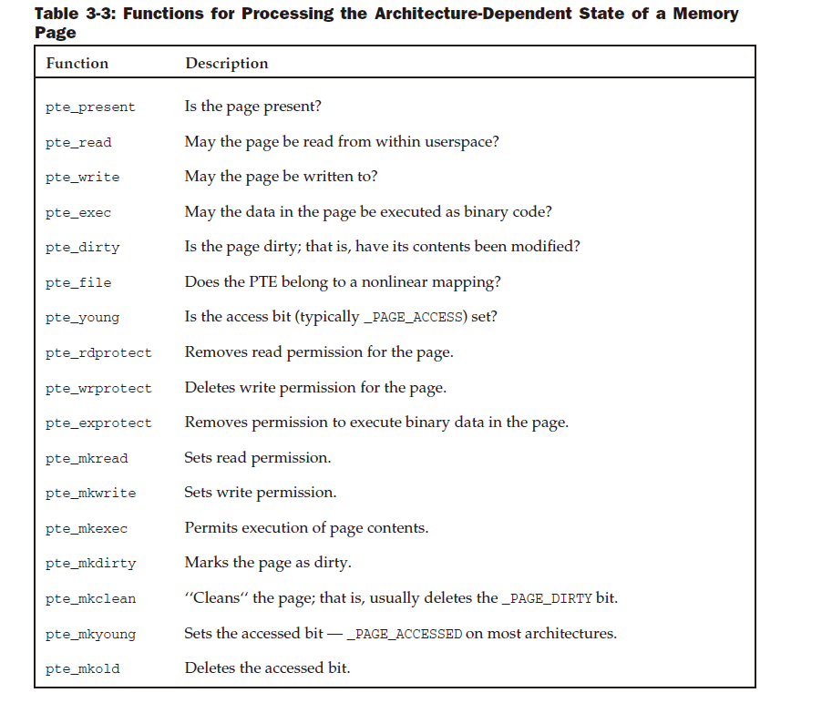

함수는  페이지에  대한  쓰기  권한과  같은  특정  속성을  설정,  삭제  및  쿼리하기  위해  세  개의
그룹으로  표시되는  경우가  많습니다.
커널은  페이지  데이터에  대한  액세스가  쓰기,  읽기  및  실행  권한을  통해  세  가지  다른  방식으로
규제될  수  있다고  가정합니다.
(실행  권한은  페이지  바이너리  데이터가  프로그램이  실행되는  것과  동일한  방식으로  기계어  코드로  실행될  수
있음을  나타냅니다.)
그러나  이  가정은  일부  CPU의  경우  너무  낙관적입니다.
IA-32  프로세서는  읽기  및  쓰기를  허용하는  두  가지  제어  모드만  지원합니다.
이  경우  아키텍처  종속  코드는  원하는  의미를  최대한  에뮬레이션하려고  시도합니다.

3.3.2 Creating and Manipulating Entries
-------------------------------------------
표  3-4에는  새  페이지  테이블  항목을  생성하는  모든  기능이  나열되어  있습니다.

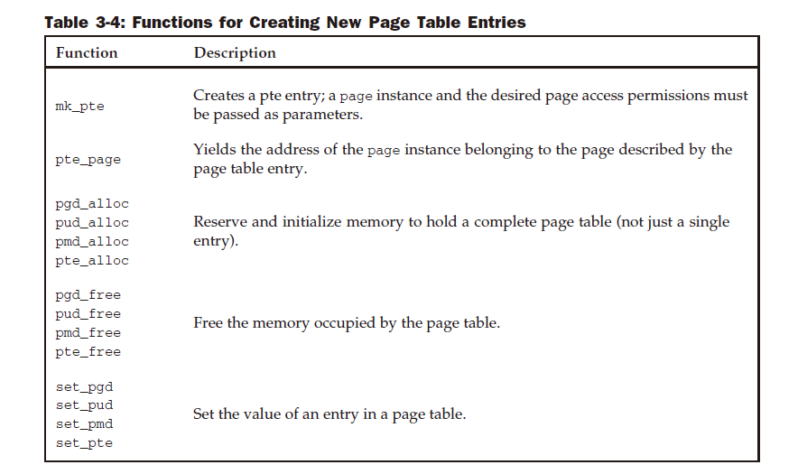

테이블의  함수는  메모리  관리  코드가  페이지  테이블을  생성하고  삭제할  수  있도록  모든  아키텍처에서  구현되어야  합니다.

3.4 Initialization of Memory Management
-------------------------------------------
메모리  관리의  맥락에서  초기화는  여러  가지  의미를  가질  수  있습니다.
많은  CPU에서는  사용  가능한  메모리를  감지하고  이를  커널에  등록하기  전에  IA-32  시스템에서  보호  모드  로
전환하는  등  Linux  커널에  적합한  메모리  모델을  명시적으로  설정해야  합니다 .
초기화  과정에서  메모리  관리  등의  데이터  구조를  설정하는  것도  필요합니다.
메모리  관리가  완전히  완료되기  전에  커널에  메모리가  필요하기  때문입니다.

초기화되면  부팅  프로세스  중에 간단한  추가  형태의  메모리  관리가  사용되며  그  후에는  삭제됩니다.
메모리  관리  초기화의  CPU  관련  부분은  커널  구조에  대한  관심을  거의  드러내지  않고  단순히  어셈블리
언어  프로그래밍의  모범  사례인  기본  아키텍처의  사소하고  미묘한  세부  사항을  많이  사용하므로  이
섹션에서는  ini에  대해서만  살펴보겠습니다.
더  높은  수준에서  작업을  수행합니다.
핵심  측면은  섹션  3.2.2에서  소개된  pg_data_t  데이터  구조(및  그  하위  구조)의  초기화입니다.
왜냐하면  이는  이미  기계  독립적이기  때문입니다.
앞서  언급한  프로세서  관련  작업의  주요  목적은  총  메모리  양을  조사하고  시스템의  개별  노드와  영역  간에
메모리를  공유하는  방법을  조사하는  것입니다.

3.4.1 Data Structure Setup
---------------------------
데이터  구조의  초기화  는  다양한  하위  시스템이  작동하도록  하기  위해  커널  로딩  후에  실행되는  start_kernel
전역  시작  루틴  내에서  시작됩니다 .
메모리  관리는  매우  중요한  커널  구성  요소이므로  메모리  감지  및  시스템  내  배포  방법  설정에  대한
기술적인  세부  사항을  담당하는  아키텍처별  설정  직후  거의  즉시  초기화됩니다(섹션  3.4.2에서  구현을  간략하게  다룹니다).
 IA-32  시스템  의  시스템  종속  초기화).  이  시점에서  각  시스템  메모리  모드에  대해  pgdat_t  인스턴스가
 생성되어  노드에  메모리가  얼마나  있는지,  노드  영역에  어떻게  분산되는지에  대한  정보를  보유합니다.
 모든  플랫폼에  구현된  아키텍처별  NODE_DATA  매크로  는  인스턴스  번호를  참조하여  NUMA  노드와  연결된
 pgdat_t  인스턴스를  쿼리하는  데  사용됩니다 .

Prerequisites
------------------
대부분의  시스템에는  메모리  노드가  하나만  있으므로  아래에서는  이러한  유형의  시스템만  검토합니다.
그러한  시스템의  상황은  어떻습니까?
메모리  관리  코드의  이식성을  보장하기  위해(UMA  및  NUMA  시스템에서  모두  사용할  수  있도록)
커널은  mm/page_alloc.c  에  pg_data_t  ( contig_page_data라고  함)  의  단일  인스턴스를  정의하여
모든  시스템  메모리를  관리합니다.
파일  경로  이름에서  알  수  있듯이  이는  CPU별  구현이  아닙니다.
실제로  대부분의  아키텍처에서  채택됩니다.  이제  NODE_DATA  구현이  더욱  간단해졌습니다.
<mmzone.h>
#define NODE_DATA(nid) (&contig_page_data)

매크로에는  NUMA  노드를  선택하기  위한  공식  매개변수가  있지만  항상  동일한  데이터가  반환됩니다.
즉,  의사  노드가  하나만  있습니다.
커널은  또한  아키텍처  종속  초기화  코드가  numnodes  변수를  시스템에  존재하는  노드  수로
설정했다는  사실에  의존할  수  있습니다.  UMA  시스템에서는  (공식)  노드가  하나만  존재하므로  이  숫자는  1입니다.
컴파일  시  전처리기  문은  특정  구성에  대한  올바른  정의를  선택합니다.

System Start
------------------
그림  3-8은  start_kernel  의  코드  흐름도를  보여줍니다 .  여기에는  메모리  관리와  관련된  시스템  초기화  기능만  포함됩니다.

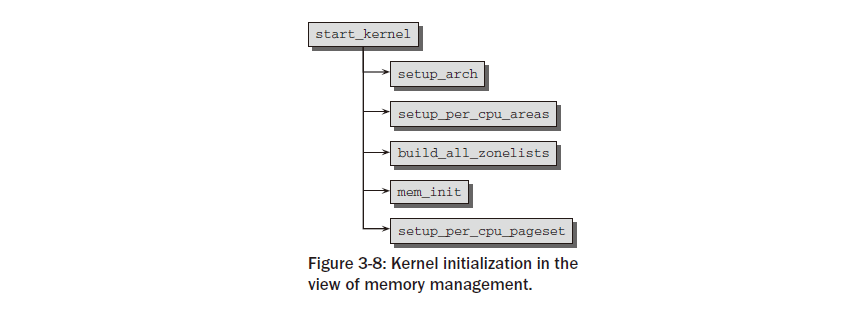

먼저  해당  작업을  다음과  같이  요약한  후  아래  섹션에서  호출되는  함수를  자세히  살펴보겠습니다.

setup_arch  는  무엇보다도  ini를  담당하는  아키텍처별  설정  함수입니다.
부팅  할당자의  초기화.
􀀁  SMP  시스템에서  setup_per_cpu_areas는  정적으로  정의된  CPU별  변수를  초기화합니다.
소스  코드에( per_cpu  매크로  사용)  시스템의  각  CPU에  대해  별도의  복사본이  있습니다.
이런  종류의  변수는  커널  바이너리의  별도  섹션에  저장됩니다.
setup_per_cpu_areas  의  목적은  각  시스템  CPU에  대해  이러한  데이터의  복사본을  생성하는  것입니다.

이  함수는  SMP가  아닌  시스템에서는  null  연산입니다.

build_all_zonelists는 는  노드  및  영역  데이터  구조를  설정합니다(아래  참조).  􀀁  mem_init는  bootmem  할당자를  비활성화하고
잠시  설명한  대로  실제  메모리  관리  기능으로의  전환을  수행하는  또  다른  아키텍처별  함수입니다.

kmem_cache_init는  작은  메모리  영역에  대한  커널  내  할당자를  초기화합니다.
􀀁  setup_per_cpu_pageset은  위에서  언급한  구조체  영역  의  페이지  집합  배열  중  첫
번째  배열  요소에  메모리를  할당합니다 . 첫  번째  배열  요소를  할당한다는  것은  즉  첫  번
째  시스템  프로세서에  대한  할당을  의미합니다.
시스템의  모든  메모리  영역이  고려됩니다.
이  함수는  또한  섹션  3.5.3에서  자세히  설명한  hot-n-cold  할당자에  대한  제한을  설정하는  역할도  합니다.
SMP  시스템에  있는  다른  CPU의  페이지  세트  배열  구성원은  활성화될  때  초기화  됩니다.

Node and Zone Initialization
-----------------------------
build_all_zonelists는  노드와  해당  영역을  관리하는  데  필요한  데이터  구조를  구축합니다.
흥미롭게도  이는  NUMA  또는  UMA  시스템에서  실행되는지  여부에  관계없이  위에  소개된  매크로  및  추상화  메커니즘을
통해  구현될  수  있습니다.  이는  실행된  기능이  NUMA  시스템용과  UMA  시스템용의  두  가지  형태로  제공되기  때문에  가능합니다.
이  작은  트릭은  커널에서  자주  사용되므로  간략하게  설명하겠습니다.  컴파일  타임  구성에  따라  특정  작업을  다르게
수행해야  한다고  가정해  보겠습니다.  한  가지  가능성은
두  가지  다른  함수를  사용하고  일부  전처리기  조건을  사용하여  호출될  때마다  적절한  함수를  선택합니다.

void do_something() {
...
#ifdef CONFIG_WORK_HARD
do_work_fast();
#else
do_work_at_your_leisure();
#endif
...
}
이렇게  하려면  함수가  호출될  때마다  전처리기를  사용해야  하므로  커널  개발자는  이  접근  방식을  나쁜  스타일로  간주합니다.
 훨씬  더  우아한  해결책은  선택한  구성에  따라  기능  자체를  다르게  정의하는  것입니다.

#ifdef CONFIG_WORK_HARD
void do_work() {
/* Get going, fast! */
...
}
#else
void do_work() {
/* Relax, take it easy */
...
}
#endif

동시에  활성화될  수  없기  때문에  두  구현  모두에  동일한  이름이  사용된다는  점에  유의하세요.
적절한  함수를  호출하는  것은  이제  일반  함수를  호출하는  것보다  더  복잡하지  않습니다.

void do_something() {
...
do_work(); /* Work hard or not, depending on configuration /*
...
}
분명히  이  변형은  훨씬  더  읽기  쉽고  커널  개발자가  항상  선호합니다(사실  첫  번째  스타일을  사용하는  패치는  메인라인  커널에  진입하는
데  매우  어려움을  겪을  것입니다).
구역  목록  설정으로  돌아가  보겠습니다.  현재  우리가  관심을  갖고  있는  build_all_zonelists  부분
(페이지  할당자에  대한  페이지  그룹  이동성  확장을  위해  수행할  작업이  더  있지만  이에  대해서는  아래에서  별도로  논의하겠습니다)
은  모든  작업을  __build_all_zonelists에  위임  합니다 .  시스템의  각  NUMA  노드에  대한  build_zonelists .

mm/page_alloc.c
static int __build_all_zonelists(void *dummy)
{
int nid;
for_each_online_node(nid) {
pg_data_t *pgdat = NODE_DATA(nid);
build_zonelists(pgdat);
...
}
return 0;
}

for_each_online_node는  시스템의  모든  활성  노드를  반복합니다.  UMA  시스템에는  노드가  하나만  있으므로  build_zonelists는
전체  메모리에  대한  영역  목록을  생성하기  위해  한  번만  호출됩니다.
NUMA  시스템은  노드  수만큼  함수를  호출해야  합니다.  각  호출은  서로  다른  노드에  대한  영역  데이터를  생성합니다.
build_zonelists는  노드  메모리  구성에  대한  모든  기존  정보를  포함하고  새로  생성된  데이터  구조를  보유하는
pgdat_t  인스턴스  에  대한  포인터를  매개변수로  기대합니다 .

UMA  시스템에서  NODE_DATA는  contig_page_data  의  주소를  반환합니다 .

이  기능의  임무는  현재  처리  중인  노드  영역과  시스템의  다른  노드  사이에  순위  순서를  설정하는  것입니다.
그런  다음  이  순서에  따라  메모리가  할당됩니다.  원하는  노드  영역에  사용  가능한  메모리가  없는  경우  이는  중요합니다.
커널이  높은  메모리를  할당하려는  예를  살펴보겠습니다.  먼저  현재  노드의  highmem  영역에서  적절한  크기의  여유  세그먼트를  찾으려고  시도합니다.
실패하면  노드의  일반  메모리  영역을  살펴봅니다.
이것도  실패하면  노드의  DMA  영역에서  할당을  시도합니다.  세  개의  로컬  영역  중  어느  곳에서도  여유  공간을  찾을  수  없으면
다른  노드를  찾습니다.  이  경우  대체  노드는  기본  노드와  최대한  가까워야  비로컬  메모리  액세스로  인한  성능  손실을  최소화할  수  있습니다.
커널은  메모리  계층  구조를  정의하고  먼저  '저렴한'  메모리  할당을  시도합니다.  이것이  실패하면  점차적으로  액세스  및  용량  측면에서
'더  비용이  많이  드는'  메모리  할당을  시도합니다.
높은  메모리(highmem)  범위는  커널의  어떤  부분도  이  영역에서  할당된  메모리에  의존하지  않기  때문에  가장  저렴합니다.
highmem  영역이  가득  차면  커널에  부정적인  영향이  없습니다.  이것이  바로  highmem  영역이  먼저  채워지는  이유입니다.
일반  메모리의  상황은  다릅니다.  많은  커널  데이터  구조가  이  영역에  보관되어야  하며  highmem에  보관할  수  없습니다.
따라서  일반  메모리가  완전히  가득  차면  커널은  심각한  상황에  직면하게  됩니다.  결과적으로  덜  중요한  highmem  영역에
사용  가능한  메모리가  없을  때까지  이  영역에서  메모리가  할당되지  않습니다.

주변기기와  시스템  간의  데이터  전송에  사용되는  DMA  영역은  가장  비용이  많이  드는  영역입니다.
따라서  이  영역의  메모리  할당은  최후의  수단입니다.
또한  커널은  현재  메모리  노드에서  볼  수  있는  대체  노드  간의  순위  순서를  정의합니다.
이는  현재  노드의  모든  영역이  가득  찼을  때  대체  노드를  결정하는  데  도움이  됩니다.
커널은  설명된  계층  구조를  데이터  구조로  표현하기  위해  pg_data_t  의  zonelist  요소  배열을  사용합니다 .

<mmzone.h>
typedef struct pglist_data {
...
struct zonelist node_zonelists[MAX_ZONELISTS];
...
} pg_data_t;
#define MAX_ZONES_PER_ZONELIST (MAX_NUMNODES * MAX_NR_ZONES)
struct zonelist {
...
struct zone *zones[MAX_ZONES_PER_ZONELIST + 1]; // NULL delimited
};

node_zonelists  배열은  가능한  모든  영역  유형  에  대해  별도의  항목을  사용할  수  있도록  합니다.
이  항목에는  구조가  아래에  설명되어  있는  zonelist  유형의  대체  목록이  포함되어  있습니다 .
대체  목록은  모든  노드의  모든  영역을  포함해야  하기  때문에  MAX_NUMNODES  항목과  목록  끝을  표시하는
null  포인터에  대한  추가  요소로  구성됩니다 .

대체  계층  구조  생성  작업은  각  NUMA  노드에  대한  데이터  구조를  생성하는  build_zonelists  에  위임됩니다.
관련  pg_data_t  인스턴스에  대한  포인터를  매개변수로  필요합니다.
코드를  자세히  논의하기  전에  위에서  언급한  내용  중  하나를  상기해  보겠습니다.
논의를  UMA  시스템으로  제한했는데  왜  여러  NUMA  노드를  고려해야  합니까?  실제로  아래  표시된  코드는  CONFIG_NUMA가  설정된  경우
커널에  의해  다른  변형으로  대체됩니다 .
그러나  아키텍처가  UMA  시스템에서  불연속  또는  희소  메모리  옵션을  선택할  수도  있습니다.
이는  주소  공간에  큰  구멍이  있는  경우  유용할  수  있습니다.  이러한  구멍으로  인해  생성된  메모리  '블록'은  NUMA에서
제공하는  데이터  구조를  사용하여  가장  잘  처리할  수  있습니다.  이것이  바로  우리가  여기서  그들을  다루어야  하는  이유입니다.
대규모  외부  루프는  먼저  모든  노드  영역을  반복합니다.  각  루프  패스는  대체  목록이  보관되어  있는  zonelist
배열  에서  i번째  영역  에  대한  영역  항목을  찾습니다 .

mm/page_alloc.c
static void __init build_zonelists(pg_data_t *pgdat)
{
int node, local_node;
enum zone_type i,j;
local_node = pgdat->node_id;
for (i = 0; i < MAX_NR_ZONES; i++) {
struct zonelist *zonelist;
zonelist = pgdat->node_zonelists + i;
j = build_zonelists_node(pgdat, zonelist, 0, j);
...
}

node_zonelists  의  배열  요소는  C에서  완전히  합법적인  관행인  포인터  조작을  통해  처리됩니다.
실제  작업은  build_zonelist_node에  위임됩니다.  호출되면  먼저  로컬  노드  내에서  대체  순서를  생성합니다.

mm/page_alloc.c
static int __init build_zonelists_node(pg_data_t *pgdat, struct zonelist *zonelist,
int nr_zones, enum zone_type zone_type)
{
struct zone *zone;
do {
zone = pgdat->node_zones + zone_type;
if (populated_zone(zone)) {
zonelist->zones[nr_zones++] = zone;
}
zone_type--;
} while (zone_type >= 0);
return nr_zones;
}

대체  목록  항목은  영역을  지정하는  zone_type  매개변수를  통해  정렬됩니다.어떤  메모리가  가장  잘  사용되며  표시된  대로
maximum_zone을  사용하여  계산됩니다 .  하나를  가질  수  있다는  것을  기억하십시오
다음  값  중  하나:  ZONE_HIGHMEM,  ZONE_NORMAL,  ZONE_DMA  또는  ZONE_DMA32.  nr_zone  은
새  항목  채우기가  시작되는  대체  목록의  위치입니다.  발신자가  없기  때문에  0을  전달했습니다.
아직  목록에  항목이  없습니다.
그런  다음  커널은  비용이  많이  드는  영역부터  비용이  저렴한  영역까지  모든  영역을  반복합니다.  각  단계에서  populated_zone은  다음을  보장합니다 .
선택한  영역에  대해  zone->present_pages가  0보다  큽니다 .  즉,존.  그렇다면  이전에  결정된  영역  인스턴스에  대한  포인터가
내의  현재  위치에  추가됩니다.
구역  목록  zonelist->zones.  구역  목록의  현재  위치는  nr_zone에  보관됩니다.
각  단계가  끝나면  영역  유형이  1씩  감소합니다.  즉,  더  비용이  많이  드는  영역으로  설정됩니다.유형.
예를  들어  시작  영역이  ZONE_HIGHMEM  인  경우  1씩  감소하면  다음  영역  유형이  보장됩니다.
사용된  값은  ZONE_NORMAL입니다 .
ZONE_HIGHMEM,  ZONE_NORMAL  및  ZONE_DMA  영역이  있는  시스템을  고려해  보세요 .
첫  번째  실행에서는 build_zonelists_node에는  다음이  할당됩니다.

zonelist->zones[0] = ZONE_HIGHMEM;
zonelist->zones[1] = ZONE_NORMAL;
zonelist->zones[2] = ZONE_DMA;

그림  3-9는  시스템의  노드  2에  대한  대체  목록이  연속적으로  채워지는  경우를  보여줍니다.
시스템에는  총  4개의  노드가  있습니다  (numnodes  =  4).  k  =  ZONE_HIGHMEM  도  적용됩니다.

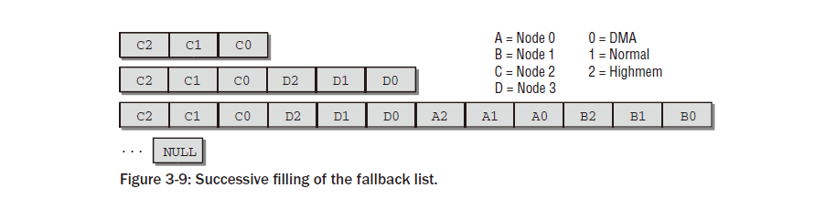

첫  번째  단계  이후  목록의  할당  대상은  highmem,  일반  메모리,  마지막으로  두  번째  노드의  DMA  영역입니다.

그런  다음  커널은  시스템에  있는  다른  노드의  영역이  대체  대상으로  사용되는  순서를  설정해야  합니다.

mm/page_alloc.c
static void __init build_zonelists(pg_data_t *pgdat)
{
...
for (node = local_node + 1; node < MAX_NUMNODES; node++) {
j = build_zonelists_node(NODE_DATA(node), zonelist, j, i);
}
for (node = 0; node < local_node; node++) {
j = build_zonelists_node(NODE_DATA(node), zonelist, j, i);
}
zonelist->zones[j] = NULL;
}
}
}

첫  번째  루프는  처리  중인  노드보다  번호가  높은  모든  노드를  연속적으로  반복합니다.
이  예에는  0,  1,  2,  3이라는  번호가  붙은  4개의  노드가  있으므로  노드  번호  3만  남습니다.
build_zonelists_node  에  의해  대체  목록에  새  항목이  추가됩니다 .  여기서  j  의  의미  가  작용합니다.
로컬  노드에서  대체  대상을  찾은  후  변수  값은  3이었습니다.  이는  새  항목의  시작  위치로  사용됩니다.
3번  노드도  3개의  zone으로  구성된  경우  build_zonelists  호출  후의  상황은  그림  3-9의  두  번째  단계와  같습니다.
그런  다음  두  번째  for  루프는  현재  노드보다  숫자가  낮은  모든  노드에  대한  항목을  생성합니다 .
이  예에서  이러한  노드에는  숫자  0과  1이  있습니다.  이  노드에도  3개의  영역이  있는  경우  대체  목록  상황은  그림  3-9의  하단과  같습니다.
영역  구성은  시스템의  다양한  노드에서  다를  수  있으므로  대체  목록의  항목  수는  정확히  알  수  없습니다.
따라서  마지막  항목에는  목록의  끝을  명시적으로  표시하기  위해  널  포인터가  할당됩니다.
총  N  개  노드  중  임의의  노드  m  에  대해  커널은  항상  폴백  노드에  대해  m,  m  +  1,  m  +  2, ... ,  N,  0,  1, ... ,  m
􀀁  1  순서를  선택합니다.  이는  어떤  노드도  과도하게  사용되지  않도록  보장합니다(예를  들어  m과  관계없이  변경되지  않는  대체  목록과  비교할  때 ).
그림  3-10은  4개의  노드가  있는  시스템의  세  번째  노드에  대해  구축된  대체  목록을  보여줍니다.

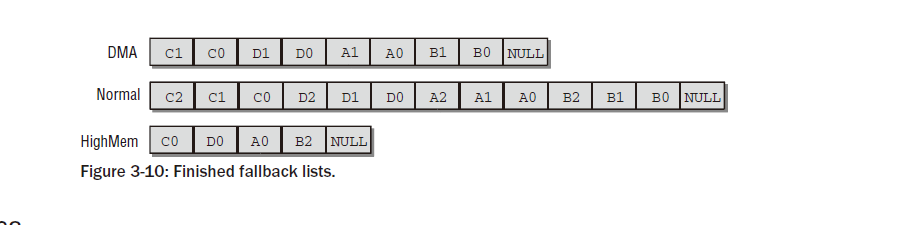

3.4.2 Architecture-Specific Setup
--------------------------------------

IA-32  시스템에서  메모리  관리  초기화는  어떤  측면에서는  프로세서  아키텍처와  관련된  몇  가지  역사적  장애물을  극복해야  하는  매우  미묘한  작업입니다.
예를  들어,  여기에는  프로세서를  일반  모드에서  보호  모드  로  전환  하여  32비트  환경에  대한  CPU  액세스  권한을  부여하는  것이  포함됩니다.
이는  16비트  8086  프로세서와의  호환성이  중요했던  시절의  유산입니다.
마찬가지로  페이징은  기본적으로  활성화되지  않으며  수동으로  활성화해야  합니다.
예를  들어  프로세서의  cr0  레지스터를  조작해야  합니다 .
그러나  이러한  미묘함은  우리에게  관심이  없습니다.  해당  참조  설명서가  참조됩니다.
IA-32  아키텍처에  초점을  맞춘다고  해서  다음에  설명된  내용이  커널에서  지원하는  다른  모든  아키텍처와  완전히  분리된다는  의미는  아닙니다.
정반대의  경우가  있습니다.  많은  세부  사항이  IA-32  아키텍처에  고유하더라도  많은  다른  아키텍처가  유사한  방식으로  작업을  수행합니다.
예를  들어  하나의  특정  아키텍처를  선택하기만  하면  됩니다.  IA-32는  꽤  오랫동안  사용되었을  뿐만  아니라  Linux에서  처음
지원하는  아키텍처이기도  하므로  이는  커널의  일반  설계에  반영됩니다.  커널이  64비트  플랫폼을  지향하는  경향이  분명하지만  많은  측면이
여전히  IA-32  루트로  추적될  수  있습니다.
IA-32  아키텍처를  예로  선택한  또  다른  이유는  실용적인  목적을  위한  것입니다.  주소  공간은  4GiB에  불과하므로
모든  주소는  비교적  간결한  16진수  숫자로  설명할  수  있습니다.  64비트  아키텍처에  필요한  긴  값.
흥미롭게도  IA-32  아키텍처는  더  이상  커널  2.6.24부터  별도의  아키텍처로  존재하지  않습니다!
이는  AMD64  아키텍처와  병합되어  새로운  통합  x86  아키텍처를  형성했습니다.
이제  둘  다  단일  아키텍처별  디렉터리인  Arch/x86  으로  제한되지만  여전히  많은  차이점이  남아  있습니다.
이것이  바로  많은  파일이  IA-32의  경우  file_32.c ,  AMD64의  경우  file_64.c라는  두  가지  변형으로  제공되는  이유입니다 .
각  하위  아키텍처에  대해  서로  다른  두  개의  파일이  존재한다는  것은  일시적으로만  힘든  일입니다.
향후  개발에서는  최종적으로  단일  파일에  두  아키텍처  모두에  대한  코드가  포함되도록  보장할  것입니다.
통합  아키텍처는  AMD64  아키텍처(그  이상)를  커널이  지원하는  가장  중요한  아키텍처  중  하나로  승격시키기
때문에  IA-32와  비교하여  AMD64의  아키텍처별  세부  사항이  어떻게  다른지도  고려할  것입니다.
커널이  지원하는  아키텍처의  수가  많기  때문에  여기서  모든  아키텍처에  대한  구체적인  세부  사항을  논의하는  것은  불가능합니다.
그러나  다음에서  하나의  32비트  아키텍처와  하나의  64비트  아키텍처를  고려하면  Linux가  두  세계에서  작업을  수행하는  방식을
맛보고  다른  아키텍처의  접근  방식을  이해하기  위한  기초를  마련할  수  있습니다.

Arrangement of the Kernel in Memory
-------------------------------------

개별  메모리  초기화  작업을  논의하기  전에  부트  로더가  커널을  메모리에  복사하고  초기화  루틴의  어셈블러  부분이  완료된  후
RAM의  상황을  조사해야  합니다.
나는  커널이  컴파일  시간에  결정되는  물리적  RAM의  고정  위치에  로드되는  기본  사례에  집중합니다.
크래시  덤프  메커니즘이  활성화된  경우  물리적  RAM에서  커널  바이너리의  초기  위치를  구성하는  것도  가능합니다.
또한  일부  임베디드  시스템에는  이  기능이  필요합니다.  구성
이  경우  PHYSICAL_START  옵션은  PHYSICAL_ALIGN  구성  옵션에  의해  지정된  물리적  정렬에  따라  RAM의  위치를  결정합니다.

또한  커널은  재배치  가능한  바이너리  로  구축될  수  있으며  이  경우  컴파일  타임에  제공된  물리적  시작  주소는  완전히  무시됩니다.
부트로더는  커널을  어디에  넣을지  결정할  수  있습니다.
두  옵션  모두  특수한  경우에만  필요하거나  여전히  실험적인  것으로  간주되므로  더  이상  논의하지  않겠습니다.

그림  3-11은  커널  이미지의  다양한  부분이  상주하는  최소  메가바이트의  물리적  RAM  메모리를  보여줍니다.

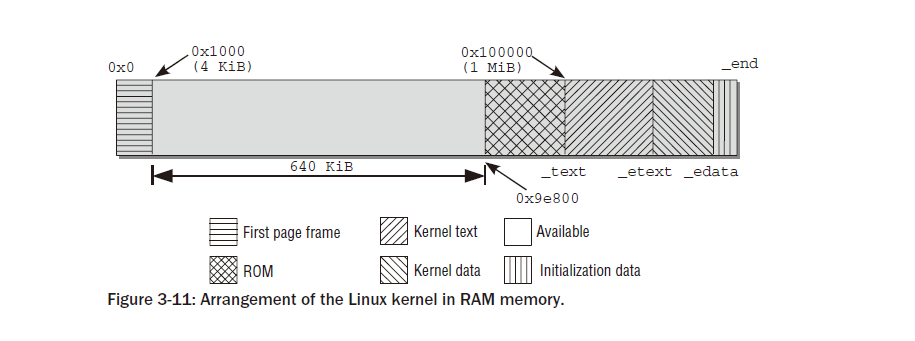

그림은  물리적  메모리의  첫  번째  메가바이트를  보여줍니다.  정확히  필요한  양은  커널  바이너리의  크기에  따라  다릅니다.
처음  4,096KiB(첫  번째  페이지  프레임)는  BIOS용으로  예약되는  경우가  많기  때문에  생략됩니다.
다음  640KiB는  원칙적으로  사용할  수  있지만  커널  로딩에는  다시  사용되지  않습니다.
그  이유는  이  영역  바로  뒤에  다양한  ROM  범위가  매핑되는  시스템(일반적으로  시스템  BIOS  및  그래픽  카드  ROM)용으로
예약된  영역이  있기  때문입니다.  이  영역에는  쓸  수  없습니다.  그러나  커널은  항상  연속적인  메모리  범위에  로드되어야  하며,
이는  RAM  메모리의  시작  주소가  커널  이미지의  시작  위치로  사용된  경우  640KiB보다  작은  커널에서만  가능합니다.
이러한  문제를  해결하기  위해  IA-32  커널은  0x100000을  시작  주소로  사용합니다.
이는  RAM  메모리의  첫  번째  메가바이트  시작에  해당합니다.
이  시점에서는  전체  커널을  보유할  만큼  충분한  연속  메모리가  있습니다.
커널이  차지하는  메모리는  여러  섹션으로  분할되며  그  경계는  변수에  보관됩니다.
ext  및  _etext  는  컴파일된  텍스트가  포함된  텍스트  섹션의  시작  및  끝  주소입니다.
커널  코드.
􀀁  대부분의  커널  변수가  보관되는  데이터  섹션은  _etext  와  _edata  사이에  위치합니다.
􀀁  커널  부팅  프로세스가  완료된  후  더  이상  필요하지  않은  초기화  데이터(예:  0으로  초기화된  모든  정적  전역  변수를  포함하는
 BSS  세그먼트)는  _edata  에서  _end  까지  확장되는  마지막  섹션에  보관됩니다 .  커널  초기화가  완료되면  대부분의  데이터가
 메모리에서  제거되어  애플리케이션을  위한  더  많은  공간을  확보할  수  있습니다.  간격이  나누어져  있습니다
제거할  수  있는  것과  제거할  수  없는  것을  제어하기  위해  더  작은  하위  간격으로  분할하지만  이는  현재  우리의  목적에  중요하지  않습니다.

섹션  경계를  정의하는  데  사용되는  변수는  커널  소스  코드  (arch/x86/kernel/setup_32.c)  에  정의되어  있지만
이  시점에서는  변수에  할당된  값이  없습니다.  이것은  단순히  불가능합니다.
컴파일러는  컴파일  타임에  커널의  크기를  어떻게  알  수  있습니까?  정확한  값은  개체  파일이  링크될  때만  설정되며,
그런  다음  바이너리  파일에  패치됩니다.  이  작업은  커널  메모리  레이아웃도  정의되는  arch/arch/vmlinux.ld.S
(IA-32의  경우  파일은  arch/x86/vmlinux_32.ld.S)  에  의해  제어됩니다 .

각  구성에는  커널의  활성화된  부분과  사용되지  않는  부분에  따라  다양한  크기의  텍스트  및  데이터  섹션이  있으므로  정확한  값은
커널  구성에  따라  다릅니다.  시작  주소  (_text)  만  항상  동일합니다.

커널이  컴파일될  때마다  System.map  이라는  파일이  생성되어  소스  기본  디렉터리에  저장됩니다.  커널에  정의된  다른  모든  (전역)  변수,
프로시저  및  함수의  주소  외에도  이  파일에는  그림  3-11에  표시된  상수  값도  포함됩니다.

wolfgang@meitner> cat System.map
...
c0100000 A _text
...
c0381ecd A _etext
...
c04704e0 A _edata
...
c04c3f44 A _end

모든  값  에는  사용자  주소  공간과  커널  주소  공간  간의  표준  3:1  분할이  선택된  경우  커널  세그먼트의  시작  주소인  오프셋
0xC0000000  이  있습니다.
RAM  메모리는  이  주소에서  시작하는  선형  매핑으로  가상  주소  공간에  매핑되므로  주소는  가상  주소입니다.
해당  물리적  주소는  0xC0000000에서  빼서  얻습니다.

/proc/iomem은  RAM  메모리가  구분되는  섹션에  대한  정보도  제공합니다.

wolfgang@meitner> cat /proc/iomem
00000000-0009e7ff : System RAM
0009e800-0009ffff : reserved
000a0000-000bffff : Video RAM area
000c0000-000c7fff : Video ROM
000f0000-000fffff : System ROM
00100000-17ceffff : System RAM
00100000-00381ecc : Kernel code
00381ecd-004704df : Kernel data
...

커널  이미지는  첫  번째  메가바이트  (0x00100000)  위에서  시작됩니다.
코드  크기는  약  2.5MiB이고,  데이터  섹션은  약  0.9MiB를  차지합니다.

AMD64  시스템에도  동일한  정보가  제공됩니다.
여기서  커널은  첫  번째  페이지  프레임  이후  2MiB에서  시작하고  실제  메모리는  0xffffffff80000000  부터  가상  주소  공간에  매핑됩니다 .
System.map  의  관련  항목은  다음과  같습니다.

wolfgang@meitner> cat System.map
ffffffff80200000 A _text
...
ffffffff8041fc6f A _etext
...
ffffffff8056c060 A _edata
...
ffffffff8077548c A _end

이  정보는  실행  중인  커널에  대한 /proc/iomem  에도  포함되어  있습니다 .

root@meitner # cat /proc/iomem
...
00100000-cff7ffff : System RAM
00200000-0041fc6e : Kernel code
0041fc6f-0056c05f : Kernel data
006b6000-0077548b : Kernel bss
...

Initialization Steps
----------------------
커널이  메모리에  로드되고  어셈블러  초기화  부분이  완료된  후  커널이  수행해야  하는  시스템별  단계는  무엇입니까?
그림  3-12는  개별  작업의  코드  흐름도를  보여줍니다.

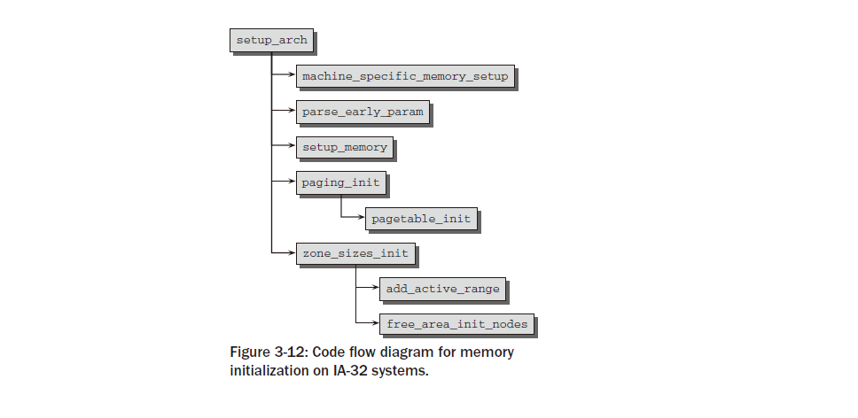

그림에는  메모리  관리와  관련된  함수  호출만  포함되어  있습니다.
다른  모든  내용은  이  문맥에서  중요하지  않으므로  생략합니다.
섹션  3.4.1에서  이미  언급한  대로  setup_arch가  start_kernel  내에서  호출된다는  점을  기억하세요 .
machine_special_memory_setup  은  먼저  시스템이  차지하는  메모리  영역과  사용  가능한  메모리  영역이  포함된  목록을  생성하기  위해  호출됩니다.
이  정보를  얻는  방법은  IA-32  제품군의  '하위  아키텍처''  간에  약간  다르기  때문에11  커널은  include/asm-x86/mach-type/setup에
정의된  시스템별  기능을  제공합니다.  씨.  type은  default,  voyager  또는  visws를  나타낼  수  있습니다 .
나는  기본  상황만을  논의한다.
이  경우  BIOS에서  제공하고  개별  메모리  영역을  표시하는  맵이  사용됩니다.

이는  NUMA  개념과  동일한  영역이  아니지만  시스템  ROM(예:  ACPI  기능)이  차지하는  영역입니다.

시스템이  부팅되면  발견된  영역이  커널  함수  print_memory_map에  의해  표시됩니다.

wolfgang@meitner> dmesg
...
BIOS-provided physical RAM map:
BIOS-e820: 0000000000000000 - 000000000009e800 (usable)
BIOS-e820: 000000000009e800 - 00000000000a0000 (reserved)
BIOS-e820: 00000000000c0000 - 00000000000cc000 (reserved)
BIOS-e820: 00000000000d8000 - 0000000000100000 (reserved)
BIOS-e820: 0000000000100000 - 0000000017cf0000 (usable)
BIOS-e820: 0000000017cf0000 - 0000000017cff000 (ACPI data)
BIOS-e820: 0000000017cff000 - 0000000017d00000 (ACPI NVS)
BIOS-e820: 0000000017d00000 - 0000000017e80000 (usable)
BIOS-e820: 0000000017e80000 - 0000000018000000 (reserved)
BIOS-e820: 00000000ff800000 - 00000000ffc00000 (reserved)
BIOS-e820: 00000000fff00000 - 0000000100000000 (reserved)
...

BIOS에서  이  정보를  제공하지  않는  경우(일부  이전  시스템의  경우일  수  있음)  커널  자체는  0~640KiB  및  1MiBend
범위의  메모리를  사용  가능한  것으로  표시하는  테이블을  생성  합니다 .
그런  다음  커널은  mem=XXX[KkmM],  highmem=XXX[kKmM]  또는  memmap=XXX[KkmM]""@XXX[KkmM]  인수와  같은
인수에  집중하여  parse_cmdline_early  를  사용하여  명령줄을  분석합니다 .
커널이  잘못된  값을  계산하거나  BIOS에서  잘못된  값을  제공하는  경우  관리자는  사용  가능한  메모리  크기를  덮어쓰거나
메모리  영역을  수동으로  정의할  수  있습니다.  이  옵션은  구형  컴퓨터에만  적용됩니다.  highmem=은  감지된  highmem  크기
 값을  덮어쓸  수  있도록  허용합니다.
RAM  구성이  매우  큰  시스템에서  사용  가능한  RAM  크기를  제한하는  데  사용할  수  있습니다.  때로는  성능이  향상되기  때문입니다.

다음  주요  단계는  두  가지  버전이  있는  setup_memory  에서  수행됩니다.
하나는  연속  메모리가  있는  시스템용( arch/x86/kernel/setup_32.c)  이고  다른  하나는  연속되지  않은  메모리가  있는
시스템용( arch/x86/mm/discontig_32.c)입니다.  구현은  다르지만  둘  다  동일한  효과를  갖습니다.

노드당  사용  가능한  물리적  페이지  수가  결정됩니다.  􀀁  bootmem  할당자가  초기화됩니다(섹션  3.4.3에서는  할당자의  구현을  설명합니다).
상세히).
􀀁  그런  다음  첫  번째  사용자  공간  프로세스를  실행할  때  필요한  초기  RAM  디스크  등을  위해  다양한  메모리  영역이  예약됩니다.

paging_init는  커널  페이지  테이블을  초기화하고  페이징을  활성화합니다.  IA-32  시스템에서는  기본적으로  활성화되어  있지  않기  때문입니다.
12  실행  비활성화  보호는  프로세서에서  지원되고  커널이  PAE  지원으로  컴파일된  경우에도  활성화됩니다.
안타깝게도  이  기능을  다른  방법으로는  사용할  수  없습니다.  또한  이  함수는  pagetable_init를  호출하여  물리적
메모리를  커널  주소  공간으로  직접  매핑하는  것이  초기화되도록  보장합니다.  낮은  메모리의  모든  페이지  프레임은  PAGE_OFFSET
위의  가상  메모리  영역에  직접  매핑됩니다 .  이를  통해  커널은  더  이상  페이지  테이블을  처리하지  않고도  사용  가능한
메모리의  상당  부분을  처리할  수  있습니다.  paging_init  및  그  뒤에  있는  전체  메커니즘  에  대한  자세한  내용은  아래에서  설명합니다.
zone_sizes_init를  호출하면  시스템의  모든  노드의  pgdat_t  인스턴스가  초기화됩니다 .  먼저  add_active_range를
사용하여  비교적  간단한  사용  가능한  물리적  메모리  목록을  준비합니다 .
그런  다음  아키텍처  독립적인  함수  free_are_init_nodes는  이  정보를  사용하여  본격적인  커널  데이터  구조를  준비합니다.
이는  커널이  런타임에  페이지  프레임을  관리하는  방법에  대해  많은  영향을  미치는  매우  중요한  단계이므로  섹션  3.5.3에서  자세히  설명합니다.
그림  3-13의  코드  흐름도에서  볼  수  있듯이  메모리  관련  초기화  순서는  AMD64  시스템에서  매우  유사합니다.
기본  메모리  설정에는  머신  유형별  처리가  필요하지  않지만  언제든지  setup_memory_region을  사용하여  수행할  수  있습니다.
사용  가능한  RAM에  대한  정보는  BIOS에서  제공되는  소위  E820  맵을  통해  제공됩니다.
초기  부팅  프로세스와  관련된  명령줄  옵션을  구문  분석한  후  e820_register_active_region  에서  호출된  add_active  에  의해  사용
가능한  메모리의  간단한  목록이  생성됩니다 .  이는  차례로  위의  E820  맵을  구문  분석하여  제공된  정보를  살펴봅니다.
그런  다음  커널은  init_memory_mapping을  호출하여  사용  가능한  물리적  메모리를  PAGE_OFFSET부터  시작하는  커널의
가상  주소  공간  부분에  직접  매핑합니다 .  contig_initmem_init는  bootmem  할당자를  활성화하는  역할을  담당합니다.
목록의  마지막  함수인  paging_init는  실제로  잘못된  이름입니다.  이  함수는  페이징을  초기화하지  않지만  우리  목적에  적합하지
않은  희소  메모리  시스템에  대한  일부  설정  루틴을  처리해야  합니다.
그러나  중요한  점은  이  함수가  IA-32  사례에서처럼  커널이  물리적  페이지  프레임을  관리하는  데  필요한  데이터  구조를
초기화하는  free_area_init_nodes  도  호출한다는  것입니다.  이는  아키텍처  독립적인  함수이며  위에서  언급한
add_active_range가  제공하는  정보에  의존한다는  점을  기억하세요 .
free_area_init_nodes가  메모리를  설정하는  방법에  대한  자세한  설명은  섹션  3.5.3에  나와  있습니다.

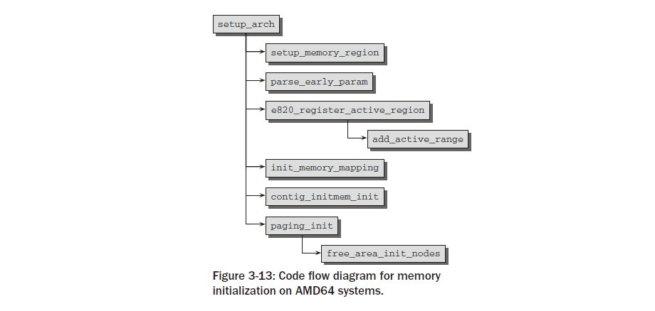

Initialization of Paging
----------------------------
paging_init는  커널에서만  사용할  수  있고  사용자  공간에서는  액세스할  수  없는  페이지  테이블을  설정하는  일을  담당합니다.
이는  일반  응용  프로그램과  커널  자체  사이에서  메모리에  대한  액세스를  규제하는  방식에  광범위한  영향을  미칩니다.
따라서  구현을  자세히  살펴보기  전에  함수의  목적을  설명하는  것이  중요합니다.
1장에서  설명한  대로  IA-32  시스템에서  커널은  일반적으로  사용  가능한  총  가상  주소  공간인  4GiB를  3:1의  비율로  나눕니다.
하위  3GiB는  사용자  모드  응용  프로그램에  사용할  수  있으며  상위  기가바이트는  예약되어  있습니다.
커널  전용입니다.  커널의  가상  주소  공간을  할당할  때  현재  시스템  컨텍스트는  관련이  없지만  각  프로세스에는  고유한
특정  주소  공간이  있습니다.
이  분할의  주요  이유는  다음과  같습니다.
사용자  응용  프로그램  실행이  커널  모드로  전환되면(시스템  호출이  사용되거나  주기적인  타이머  인터럽트가  생성되는  경우
항상  발생함)  커널은  안정적인  환경에  내장되어야  합니다.  따라서  주소  공간의  일부를  커널에만  할당하는  것이  중요합니다.

물리적  페이지는  커널  주소  공간의  시작  부분에  매핑되므로  커널은  복잡한  페이지  테이블  작업  없이  직접  액세스할  수  있습
니다.
모든  물리적  페이지가  사용자  공간  프로세스에  액세스할  수  있는  주소  공간에  매핑된  경우  시스템에서  여러  응용
프로그램이  실행되고  있으면  심각한  보안  문제가  발생할  수  있습니다.
그러면  각  애플리케이션은  물리적  RAM에  있는  다른  프로세스의  메모리  영역을  읽고  수정할  수  있습니다.
분명히  이것은  어떤  대가를  치르더라도  방지되어야  합니다.
사용자  영역  프로세스에  사용되는  가상  주소  부분은  모든  작업  전환에  따라  변경되지만  커널  부분은  항상  동일합니다.
상황은  그림  3-14에  요약되어  있다.

Division of Address Space
----------------------------
3:1  비율의  주소  공간  분할은  커널  주소  공간  자체가  다양한  섹션으로  분할되므로
커널의  상황을  대략적으로  반영한  것일  뿐입니다.  그림  3-15에서는  상황을  그래픽으로  보여줍니다.

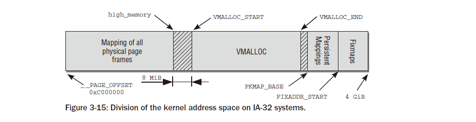

그림은  4GB의  가상  주소  공간을  관리하는  데  사용되는  페이지  테이블  항목의  구조를  보여줍니다.
이는  가상  주소  공간  의  각  영역의  목적을  나타내며  물리적  RAM  할당과는  아무런  관련이  없습니다.

주소  공간의  첫  번째  섹션은  시스템의  모든  물리적  페이지를  커널의  가상  주소  공간에  매핑하는  데  사용됩니다.
이  주소  공간은  0xC0000000  (자주  언급되는  3GiB)  의  오프셋에서  시작하기  때문에  각  가상  주소  x는  물리적  주소  x
 􀀁  0xC0000000  에  해당하므로  단순한  선형  이동입니다.
그림에서  볼  수  있듯이  직접  매핑  영역은  0xC0000000  에서  곧  설명할  정확한  값의  high_memory  주소  까지  확장됩니다 .
1장에서  설명한  것처럼  이  방식에는  문제가  있습니다.  커널의  가상  주소  공간은  1GiB로만  구성되므로  최대  1GiB의  RAM
메모리를  매핑할  수  있습니다.  IA-32  시스템(PAE  제외)의  최대  메모리  구성이  최대  4GiB일  수  있다는  사실은  남은
메모리를  어떻게  처리할지에  대한  의문을  제기합니다.
여기에  나쁜  소식이  있습니다.  896MiB보다  크면  커널은  전체  물리적  메모리를  한  번에  매핑할  수  없습니다.
13  이  값은  앞서  언급한  최대  제한인  1GiB보다  훨씬  작습니다.

커널은  곧  설명할  다른  목적을  위해  주소  공간의  마지막  128MiB를  예약해야  합니다.
896MiB의  직접  RAM  매핑에  이러한  128MiB를  추가하면  총  가상  커널  주소  공간은  1,024MiB  =  1GiB가  됩니다.
커널은  자주  사용되는  두  가지  약어  'normal'과  'highmem'을  사용하여  직접  매핑할  수  있는  페이지와  매핑할  수  없는
페이지를  구별합니다.
커널  포트는  가상  커널  메모리의  ID  매핑  부분에서  물리적  주소와  가상  주소  간을  변환하기  위해
각  아키텍처에  대해  두  개의  매크로를  제공해야  합니다(결국  이는  플랫폼에  따른  작업입니다).
__pa(vaddr)는  가상  주소  vaddr과  연결된  물리적  주소를  반환합니다 .
􀀁  __va(paddr)은  물리적  주소  paddr에  해당하는  가상  주소를  생성합니다.

두  함수  모두  void  포인터와  unsigned  long  으로  작동합니다 .
두  데이터  유형  모두  메모리  주소  표현에  동일하게  유효하기  때문입니다.
주의:  이  함수는  가상  주소  공간의  임의  주소를  처리하는  데  유효  하지  않으며  ID  매핑  부분  에만  작동합니다!
이것이  바로  이들이  일반적으로  간단한  선형  변환으로  구현될  수  있고  페이지  테이블을  우회할  필요가  없는  이유입니다.

IA-32는  페이지  프레임을  PAGE_OFFSET  에서  시작하는  가상  주소  공간에  매핑하며  이에  따라  다음과  같은  간단한  변환으로  충분합니다.

include/asm-x86/page_32.h
#define __pa(x) ((unsigned long)(x)-PAGE_OFFSET)
#define __va(x) ((void *)((unsigned long)(x)+PAGE_OFFSET))

커널은  주소  공간의  마지막  128MiB를  어떤  목적으로  사용합니까?
그림  3-15에서  볼  수  있듯이  세  가지  용도로  사용됩니다.

1.물리적  메모리에서는  연속되지  않은  가상적으로  연속된  메모리  영역을  vmalloc  영역  에  예약할  수  있습니다 .
이  메커니즘은  일반적으로  사용자  프로세스에서  사용되지만  커널  자체는  가능한  한  연속되지  않은  물리적  주소를  피하려고  합니다.
RAM이  아직  조각화되지  않은  경우  부팅  시  대부분의  대형  메모리  블록이  커널에  할당되기  때문에  일반적으로  성공합니다.
그러나  장기간  실행된  시스템에서는  커널에  물리적  메모리가  필요하지만  사용  가능한  공간이  연속되지  않는  상황이  발생할  수  있습니다.
이러한  상황의  대표적인  예는  모듈이  동적으로  로드되는  경우입니다.

2.영구  매핑은  highmem  영역의  비영구  페이지를 핵심.  섹션  3.5.8에서는  이  주제를  자세히  살펴봅니다.

3.Fixmap은  물리적  주소  공간에서  고정되었지만  자유롭게  선택할  수  있는  페이지와  연관된  가상  주소  공간  항목입니다.
고정된  공식을  통해  RAM  메모리와  연결된  직접  매핑된  페이지와  달리  가상  수정  맵  주소와  RAM  메모리  위치  간의
연결은  자유롭게  정의할  수  있으며  항상  커널에서  관찰됩니다.

이  컨텍스트에서는  두  개의  전처리기  기호가  중요합니다.  __VMALLOC_RESERVE는  vmalloc  영역  의  크기를  설정  하고
MAXMEM은  커널에서  직접  주소를  지정할  수  있는  물리적  RAM의  가능한  최대  크기를  나타냅니다.

개별  영역으로의  메모리  분할은  그림  3-15에  표시된  상수를  통해  제어됩니다.
상수는  커널  및  시스템  구성에  따라  다른  값을  가질  수  있습니다.  직접  매핑의  경계는  high_memory로  지정됩니다.

arch/x86/kernel/setup_32.c
static unsigned long __init setup_memory(void)
{
...
#ifdef CONFIG_HIGHMEM
high_memory = (void *) __va(highstart_pfn * PAGE_SIZE - 1) + 1;
#else
high_memory = (void *) __va(max_low_pfn * PAGE_SIZE - 1) + 1;
#endif
...
}

max_low_pfn은  896MiB  미만인  시스템에  존재하는  메모리  페이지  수를  지정합니다.
또한  값은  896MiB에  맞는  최대  페이지  수로  제한됩니다(정확한  계산은  find_max_low_pfn에  제공됨).
highmem  지원이  활성화된  경우  high_memory는  항상  896MiB인  두  메모리  영역  사이의  경계를  나타냅니다.
모든  RAM  페이지의  직접  매핑과  비연속  할당  영역  사이에는  최소  크기  VMALLOC_OFFSET  의  간격이  있습니다 .

include/asm-x86/pgtable_32.h
#define VMALLOC_OFFSET (8*1024*1024)

이  간격은  커널  결함에  대한  보호  장치  역할을  합니다.
범위를  벗어난  주소에  액세스하는  경우  (더  이상  물리적으로  존재하지  않는  메모리  영역에  대한  의도하지  않은  액세스)
액세스가  실패하고  오류를  보고하기  위해  예외가  생성됩니다.  vmalloc  영역이  직접  매핑  바로  뒤에  오면  액세스가
성공하고  오류가  발견되지  않습니다.  안정적인  작동에서는  이러한  추가  보호  조치가  필요하지  않지만  아직  성숙되지
않은  새로운  커널  기능을  개발할  때  유용합니다.
VMALLOC_START  및  VMALLOC_END는  물리적으로  연속되지  않은  커널  매핑에  사용되는  vmalloc  영역의  시작과  끝을  정의합니다.
 값은  상수로  직접  정의되지  않고  여러  매개변수에  따라  달라집니다.

include/asm-x86/pgtable_32.h
#define VMALLOC_START (((unsigned long) high_memory + \
2*VMALLOC_OFFSET-1) & ~(VMALLOC_OFFSET-1))
#ifdef CONFIG_HIGHMEM
# define VMALLOC_END (PKMAP_BASE-2*PAGE_SIZE)
#else
# define VMALLOC_END (FIXADDR_START-2*PAGE_SIZE)
#endif
vmalloc  영역의  시작  주소는  가상  주소  공간  메모리가  얼마나  사용되는지에  따라  달라집니다.
RAM의  직접  매핑(따라서  위에  정의된  high_memory  변수에  대한)  커널도두  영역  사이에  최소한
VMALLOC_OFFSET  의  간격이  있다는  사실  과vmalloc  영역은  VMALLOC_OFFSET으로  나누어지는  주소에서  시작됩니다 .
결과적으로  오프셋  값이  표시됩니다.
128MiB에서  135MiB  사이의  다양한  메모리  구성  수준은  표  3-5에  나와  있습니다.  오프셋이  새로  시작됩니다136MiB로  순환합니다.

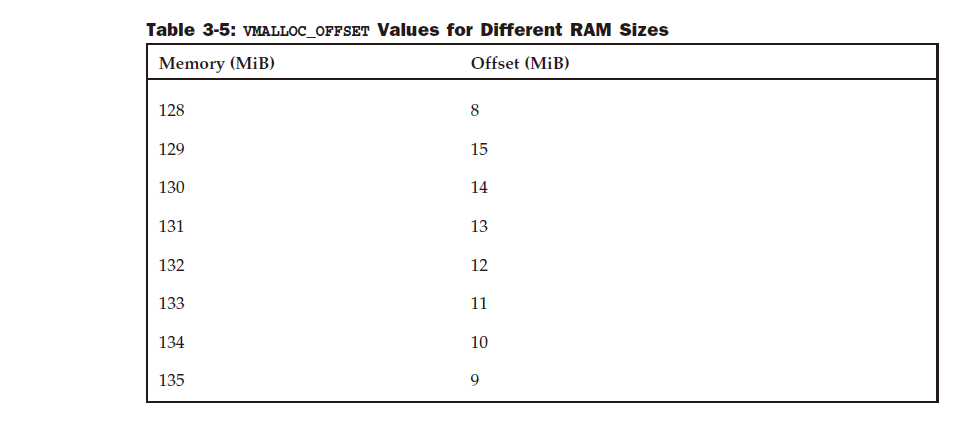

vmalloc  영역이  끝나는  위치는  highmem  지원  활성화  여부에  따라  달라집니다.
그렇지  않으면  공간이  없습니다. RAM  메모리  전체가  영구적으로  매핑될  수  있기  때문에  지속적인  커널  매핑에  필요합니다.
따라서  구성에  따라  해당  영역은  영구  커널  매핑이  시작될  때  끝납니다.또는  Fixmap  영역의  시작  부분에  있습니다.
두  페이지는  항상  vmalloc  영역에  대한  안전  공백으로  남겨집니다.
영구  커널  매핑의  시작과  끝은  다음과  같이  정의됩니다.

include/asm-x86/highmem.h
#define LAST_PKMAP 1024
#define PKMAP_BASE ( (FIXADDR_BOOT_START - PAGE_SIZE*(LAST_PKMAP + 1)) & PMD_MASK )

PKMAP_BASE는  시작  주소를  정의합니다(계산은  일부를  사용하여  수정맵  영역을  기준으로  수행됩니다).
곧  논의되는  상수).  LAST_PKMAP은  데이터를  보관하는  데  사용되는  페이지  수를  정의합니다.
매핑.
마지막  메모리  섹션은  고정  매핑이  차지합니다.  임의의  위치를  가리키는  주소입니다. RAM  메모리에.
네  번째  기가바이트  시작  부분의  선형  매핑과  달리RAM  메모리의  가상  주소와  위치는  이러한  유형의  매핑으로  미리  결정되지는
않지만  가능합니다.나중에  변경할  수  없더라도  자유롭게  정의할  수  있습니다.
Fixmap  영역은  가상  주소  공간을  채웁니다.바로  꼭대기까지요.

include/asm-x86/fixmap_32.h
#define __FIXADDR_TOP 0xfffff000
#define FIXADDR_TOP ((unsigned long)__FIXADDR_TOP)
#define __FIXADDR_SIZE (__end_of_permanent_fixed_addresses << PAGE_SHIFT)
#define FIXADDR_START (FIXADDR_TOP - __FIXADDR_SIZE)

Fixmap  주소의  장점은  컴파일  시  주소가  커널  부팅  시  물리적  주소가  할당되는  상수처럼  작동한다는  것입니다.
이런  종류의  주소는  일반  포인터를  사용할  때보다  더  빠르게  역참조될  수  있습니다.
커널은  또한  컨텍스트  전환  중에  픽스맵의  페이지  테이블  항목이  TLB에서  플러시되지  않도록  보장하여
액세스가  항상  빠른  캐시  메모리를  통해  이루어지도록  합니다.
각  픽스맵  주소에  대해  상수가  생성되며  고정  주소  라는  열거형  목록에  나타나야  합니다 .
include/asm-x86/fixmap_32.h
enum fixed_addresses {
FIX_HOLE,
FIX_VDSO,
FIX_DBGP_BASE,
FIX_EARLYCON_MEM_BASE,
#ifdef CONFIG_X86_LOCAL_APIC
FIX_APIC_BASE, /* local (CPU) APIC) — required for SMP or not */
#endif
...
#ifdef CONFIG_HIGHMEM
FIX_KMAP_BEGIN, /* reserved pte’s for temporary kernel mappings */
FIX_KMAP_END = FIX_KMAP_BEGIN+(KM_TYPE_NR*NR_CPUS)-1,
#endif
...
FIX_WP_TEST,
__end_of_fixed_addresses
};

커널은  fixmap  상수의  가상  주소를  계산하기  위해  fix_to_virt  함수를  제공합니다.

include/asm-x86/fixmap_32.h
static __always_inline unsigned long fix_to_virt(const unsigned int idx)
{
if (idx >= __end_of_fixed_addresses)
__this_fixmap_does_not_exist();
return __fix_to_virt(idx);
}

if  쿼리는  컴파일러  최적화  메커니즘에  의해  완전히  제거됩니다.
이는  함수가  인라인  함수  로  정의되고  쿼리에  상수만  사용되기  때문에  가능합니다.
그렇지  않으면  수정맵  주소가  일반  포인터보다  나을  것이  없기  때문에  이러한  최적화가  필요합니다.
필요한  Fixmap  주소가  유효한  영역에  있는지  확인하기  위해  공식적인  검사가  수행됩니다.
__end_of_fixed_adresses  는  fixed_addresses  의  마지막  요소  이며  가능한  최대  수를  정의합니다.
커널이  유효하지  않은  주소에  액세스하는  경우  의사  함수  __this_fixmap_does_not_exist  (정의가  존재하지  않음)가  호출됩니다.
 커널이  링크되면  정의되지  않은  기호로  인해  이미지를  생성할  수  없다는  오류  메시지가  나타납니다.
 결과적으로  이러한  종류의  커널  오류는  커널이  실행  중일  때가  아니라  컴파일  시간에  감지됩니다.

 유효한  Fixmap  주소가  참조되면  if  쿼리의  비교  결과  양수  값이  생성됩니다.
 두  비교  개체는  모두  상수이므로  쿼리를  실행할  필요가  없으므로  제거됩니다.
__fix_to_virt  는  매크로로  정의됩니다.  fix_to_virt  의  인라인  속성  으로  인해  코드에서  fixmap  주소  쿼리가  실행되는
지점에  직접  복사됩니다.
이  매크로는  다음과  같이  정의됩니다.
include/asm-x86/fixmap_32.h
#define __fix_to_virt(x) (FIXADDR_TOP - ((x) << PAGE_SHIFT))

커널은  맨  위에서  시작하여  (보통  맨  아래에서  시작하지  않음)  n  번째  픽스맵  항목  의  가상  주소를  결정하기
위해  n  페이지  뒤로  이동합니다.
다시  한번  강조하지만  이  계산에는  상수만  사용되므로  컴파일러는  컴파일  타임에  결과를  계산할  수  있습니다.
해당  가상  주소가  위치한  RAM의  주소는  위의  메모리  분할  결과  아직  점유되지  않았습니다.
Fixmap  주소와  메모리의  물리적  페이지  사이의  연관은  set_fixmap(fixmap,  page_nr)  및  set_fixmap_nocache
(구현에  대해서는  논의되지  않음)에  의해  설정됩니다.그들은  단순히  페이지  테이블의  해당  항목을  RAM의  페이지와  연관시킵니다.
set_fixmap  과  달리  set_fixmap_nocache는  때때로  필요하므로  관련  페이지에  대한  하드웨어  캐싱을  비활성화합니다.
AMD64를  포함한  일부  다른  아키텍처도  수정  맵을  제공합니다.

Alternative Division
-----------------------
가상  주소  공간을  3:1  비율로  나누는  것이  유일한  옵션은  아닙니다.
모든  경계가  소스의  상수로  정의되므로  다른  구분을  선택하는  데  상대적으로  노력이  거의  필요하지  않습니다.
어떤  목적의  경우  주소  공간을  사용자  주소  공간에  2GiB,  커널  주소  공간에  2GiB로  대칭적으로  분할하는  것이  더  나을  수도  있습니다.
그런  다음  __PAGE_OFFSET을  일반적인  기본값인  0xC0000000  대신  0x80000000  으로  설정해야  합니다 .
이  분할은  시스템이  커널에는  많은  양의  메모리가  필요하지만  사용자  프로세스에는  적은  양의  메모리가  필요한  작업(이러한  작업은  드뭅니다)을
수행할  때  유용합니다.  메모리  분할  방법을  변경하려면  모든  사용자  공간  애플리케이션을  다시  컴파일해야  하므로  구성
명령문에는  원칙적으로는  쉽지만  메모리를  다르게  분할하는  옵션이  포함되어  있지  않습니다.
기본적으로  커널  소스를  수동으로  수정하여  메모리를  분할하는  것이  가능하지만  커널은  몇  가지  기본  분할  비율을  제공합니다.
 __PAGE_OFFSET  은  다음과  같이  정의됩니다.

include/asm-x86/page_32.h
#define __PAGE_OFFSET # ((unsigned long)CONFIG_PAGE_OFFSET)

표  3-6은  가상  주소  공간을  분할할  수  있는  모든  가능성과  매핑할  수  있는  최대  RAM  크기를  수집합니다
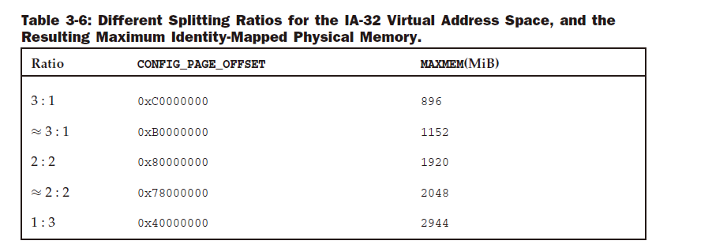
커널을  3:1이  아닌  비율로  분할하는  것은  특정  시나리오(예:  주로  커널에서  코드를  실행하는  시스템의  경우)에  적합할  수  있습니다.
네트워크  라우터를  생각해  보세요.  그러나  일반적인  경우에는  3:1  비율이  가장  좋습니다.

Splitting the Virtual Address Space
--------------------------------------
paging_init는  위에서  설명한  대로  가상  주소  공간을  분할하기  위해  부팅  프로세스  중에  IA-32  시스템에서  호출됩니다.
코드  흐름  다이어그램은  그림  3-16에  나와  있습니다.

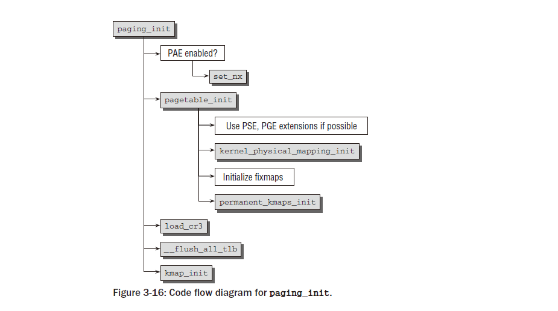

pagetable_init는  먼저  swapper_pg_dir을  기본으로  사용하여  시스템의  페이지  테이블을  초기화합니다  (이것은변수는  이전에  임시  데이터를  보유하는  데  사용되었습니다).  모든  최신  버전에서  두  가지  확장  기능  사용  가능그런  다음  IA-32  변형이  활성화됩니다(매우  오래된  Pentium  구현  중  일부만이  이를  지원하지  않습니다).
􀀁  대용량  메모리  페이지를  지원합니다.  특별히  표시된  페이지의  크기는  일반적인  페이지  대신  4MiB입니다.
4KiB.  이  옵션은  커널  페이지가  교체되지  않기  때문에  커널  페이지에  사용됩니다.
증가페이지  크기는  더  적은  수의  페이지  테이블  항목이  필요하다는  것을  의미하며  이는  페이지  테이블에  긍정적인  영향을
미칩니다. TLB(변환  참조  버퍼)는  커널  데이터의  부담을  줄여줍니다.

가능하다면  커널  페이지에는  추가  속성  (_PAGE_GLOBAL)  이  제공됩니다 .
__PAGE_GLOBAL  비트는  __PAGE_KERNEL  및  __PAGE_KERNEL_EXEC  변수  에서  활성화됩니다 .  이것들
변수는  페이지가  할당될  때  커널  자체에  대해  설정된  플래그를  지정합니다.  따라서  이러한  설정은  자동으로  커널  페이지로  전송됩니다.
_PAGE_GLOBAL  비트  가  설정된  페이지의  TLB  항목은  컨텍스트  전환  중에  TLB에서  플러시되지  않습니다.
커널은  항상  가상  주소  공간의  동일한  위치에  존재하므로  시스템  성능이  향상되고  커널  데이터를  가능한  한  빨리  사용할  수
있어야  한다는  점에서  반가운  효과가  있습니다.

PAGE_OFFSET  기준으로  물리적  페이지(또는  위에서  설명한  첫  번째  896MiB)를  가상  주소  공간으로  매핑하는  것은
kernel_physical_mapping_init  의  도움으로  수행됩니다 .
커널은  다양한  페이지  디렉토리의  모든  관련  항목을  연속적으로  검색하고  포인터를  올바른  값으로  설정합니다.
그런  다음  수정  맵  항목과  영구  커널  매핑을  위한  영역이  설정됩니다.
다시  말하지만  이는  페이지  테이블을  적절한  값으로  채우는  것과  같습니다.
pagetable_init  를  사용한  페이지  테이블  초기화가  완료  되면  cr3  레지스터에는  사용된  페이지  전역  디렉터리  (swapper_pg_dir)에
대한  포인터가  제공됩니다.
이는  새  페이지  테이블을  활성화하는  데  필요합니다.  cr3  레지스터를  재할당하면  IA-32  시스템에  정확히  이러한  효과가  있습니다.
TLB  항목도  여전히  부팅  메모리  할당  데이터를  포함하고  있으므로  플러시되어야  합니다.  __flush_all_tlb는  필요한  작업을  수행합니다.
컨텍스트  전환  중  TLB  플러시와  달리  _PAGE_GLOBAL  비트가  있는  페이지도  플러시됩니다.

kmap_init는  전역  변수  kmap_pte를  초기화합니다.
커널은  이  변수를  사용하여  나중에  highmem  영역의  페이지를  커널  주소  공간에  매핑하는  데  사용되는  영역에  대한  페이지  테이블
항목을  저장합니다.
게다가  highmem  커널  매핑을  위한  첫  번째  Fixmap  영역의  주소는  전역  변수  kmem_vstart에  저장됩니다.

Initialization of the Hot-n-Cold Cache
--------------------------------------
섹션  3.2.2에서  이미  CPU당(또는  hot-n-cold)  캐시에  대해  언급했습니다.
여기서는  관련  데이터  구조의  초기화와  캐시  채우기를  제어하는  데  사용되는  '워터마크'  계산을  다룹니다.  행동
zone_pcp_init  는  캐시  초기화를  담당합니다.
커널은  free_area_init_nodes  에서  함수를  호출하며 ,  이  함수는  IA-32  및  AMD64  모두에서  부팅하는  동안  호출됩니다.

mm/page_alloc.c
static __devinit void zone_pcp_init(struct zone *zone)
{
int cpu;
unsigned long batch = zone_batchsize(zone);
for (cpu = 0; cpu < NR_CPUS; cpu++) {
setup_pageset(zone_pcp(zone,cpu), batch);
}
if (zone->present_pages)
printk(KERN_DEBUG " %s zone: %lu pages, LIFO batch:%lu\n",
zone->name, zone->present_pages, batch);
}

zone_batchsize를  사용하여  배치  크기(최소  및  최대  채우기  수준  계산의  기초)가  결정되면  코드는  시스템의  모든  CPU를  반복하고
setup_pageset을  호출하여  각  per_cpu_pageset  인스턴스  의  상수를  채웁니다 .
이  함수가  호출될  때  사용되는  zone_pcp  매크로  는  현재  검사  중인  CPU와  연관된  영역의  페이지  세트  인스턴스를  선택합니다.

워터마크가  어떻게  계산되는지  자세히  살펴보겠습니다.

mm/page_alloc.c
inline void setup_pageset(struct per_cpu_pageset *p, unsigned long batch)
{
struct per_cpu_pages *pcp;
memset(p, 0, sizeof(*p));
pcp = &p->pcp[0]; /* hot */
pcp->count = 0;
pcp->high = 6 * batch;
pcp->batch = max(1UL, 1 * batch);
INIT_LIST_HEAD(&pcp->list);
pcp = &p->pcp[1]; /* cold*/
pcp->count = 0;
pcp->high = 2 * batch;
pcp->batch = max(1UL, batch/2);
INIT_LIST_HEAD(&pcp->list);
}

코드는  해당  영역에  있는  페이지의  약  1,000분의  25%에  해당하도록  배치를  계산합니다.  또한  시프트  연산은  계산된  값이  2n
􀀁  1  형식을  갖도록  보장합니다.  왜냐하면  이것이  대부분의  시스템  로드에  대한  캐시  앨리어싱  효과를  최소화한다는  것이  경험적으로
확립되었기  때문입니다.  fls  는  값의  마지막  세트  비트를  생성하는  시스템별  작업입니다.  이  정렬로  인해  결과  값이  영역
페이지의  1/1000  25%에서  벗어나게  됩니다.  배치  =  22  인  경우  최대  편차가  발생합니다.  22  +  11
􀀁  1  =  32이므로  fls는  비트  5를  숫자의  마지막  세트  비트로  찾고  1  <<  5  -  1  =  31을  찾습니다 .
왜냐하면  편차는  일반적으로  더  작기  때문입니다. ,  모든  실제적인  목적을  위해  무시될  수  있습니다.
영역의  메모리가  512MiB를  초과하면  배치  크기가  증가하지  않습니다.  예를  들어  페이지  크기가  4,096KiB인
시스템의  경우  페이지가  131,072개  이상이면  이  제한에  도달합니다.  그림  3-17은  영역에  존재하는  페이지  수에  따라  배치  크기가  어떻게  변화하는지  보여줍니다.
배치  값은  배치가  캐시  제한을  계산하는  데  사용되는  방법을  고려할  때  의미가  있습니다.

mm/page_alloc.c
inline void setup_pageset(struct per_cpu_pageset *p, unsigned long batch)
{
struct per_cpu_pages *pcp;
memset(p, 0, sizeof(*p));
pcp = &p->pcp[0]; /* hot */
pcp->count = 0;
pcp->high = 6 * batch;
pcp->batch = max(1UL, 1 * batch);
INIT_LIST_HEAD(&pcp->list);
pcp = &p->pcp[1]; /* cold*/
pcp->count = 0;
pcp->high = 2 * batch;
pcp->batch = max(1UL, batch/2);
INIT_LIST_HEAD(&pcp->list);
}

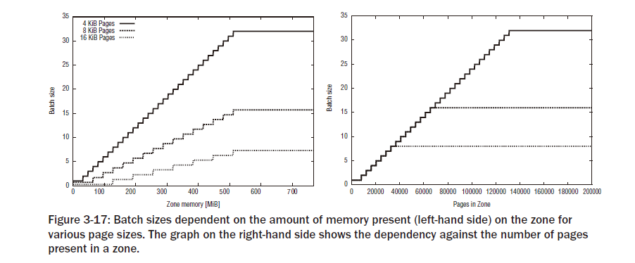

그림  3-17:  다양한  페이지  크기에  대해  영역에  존재하는  메모리  양(왼쪽)에  따라  달라지는  배치  크기.
오른쪽  그래프는  영역에  있는  페이지  수에  대한  종속성을  보여줍니다.
핫  페이지에  사용되는  하한은  0이고  상한은  6*배치  이므로  커널이  캐시를  너무  많이  소모하지  않도록  하기  때문에  캐시의  평균
페이지  수는  약  4*배치  입니다.  그러나  배치*4는  전체  영역  페이지  수의  1/1000에  해당합니다.
이는  zone_batchsize가  전체  페이지의  1/1000에  대해  배치  크기를
25%로  최적화하려고  시도한  이유이기도  합니다.  IA-32  프로세서의  L2  캐시  크기는  0.25~2MiB  범위이므로  이  공간에  맞는
것보다  더  많은  메모리를  핫  앤  콜드  캐시에  보관하는  것은  의미가  없습니다.  경험상  캐시  크기는  주  메모리  크기의  1/1000입니다.
현재  시스템에는  CPU당  1~2GiB의  RAM이  장착되어  있으므로  규칙이  합리적이라는  점을  고려하세요.  따라서  계산된  배치  크기는
핫  앤  콜드  캐시의  페이지가  CPU의  L2  캐시에  맞도록  허용할  가능성이  높습니다.
캐시에  보관되지  않은  콜드  페이지는  성능에  중요  하지  않은  작업(물론  이러한  작업은  커널에서  소수임)에만  사용되기  때문에
콜드  목록의  워터마크는  약간  낮습니다.
배치  값  의  두  배만  상한값으로  사용됩니다.
pcp-  >배치  크기는  목록을  다시  채워야  할  때  한  번에  사용되는  페이지  수를  결정합니다.
성능상의  이유로  단일  페이지가  아닌  전체  페이지  청크가  목록에  추가됩니다.
각  영역의  페이지  수는  부팅  로그에  표시된  대로  계산된  배치  크기와  함께
zone_pcp_init  끝에  출력됩니다  (아래  예에서  RAM이  4GiB인  시스템의  경우).

root@meitner # dmesg | grep LIFO
DMA zone: 2530 pages, LIFO batch:0
DMA32 zone: 833464 pages, LIFO batch:31
Normal zone: 193920 pages, LIFO batch:31

Registering Active Memory Regions
------------------------------------

위에서  구역  구조의  초기화는  광범위한  작업이라는  점을  언급했습니다.
다행히  이  작업은  모든  아키텍처에서  동일합니다.  2.6.19  이전의  커널  버전은  아키텍처별로  필요한  데이터  구조를  설정해야  했지만
그  동안  접근  방식은  더욱  모듈화되었습니다.  개별  아키텍처는  모든  활성  메모리  영역과  일반에  대한  매우  간단한  맵만  등록하면  됩니다.
그런  다음  코드는  이  정보로부터  기본  데이터  구조를  생성합니다.
개별  아키텍처는  커널에서  제공하는  일반  프레임워크에  의존하지  않고  자체적으로  모든  데이터  구조를  설정하기로  결정할  수  있습니다.
IA-32와  AMD64  모두  커널이  어려운  작업을  수행하도록  하므로  이  가능성에  대해서는  더  이상  논의하지  않겠습니다.
일반  프레임워크가  제공하는  가능성을  활용하려는  아키텍처는  ARCH_POPULATES_NODE_MAP  구성  옵션을  설정해야  합니다.
모든  활성  메모리  영역이  등록된  후  나머지  작업은  일반  커널  코드에  의해  수행됩니다.
활성  메모리  영역은  단순히  홀이  포함되지  않은  메모리  영역입니다.  전역  변수  early_node_map에  지역을  등록하려면
add_active_range를  사용해야  합니다 .

mm/page_alloc.c
static struct node_active_region __meminitdata early_node_map[MAX_ACTIVE_REGIONS];
static int __meminitdata nr_nodemap_entries;

현재  등록된  지역의  수는  nr_nodemap_entries로  표시됩니다.
개별  지역의  최대  수는  MAX_ACTIVE_REGIONS로  지정됩니다.
값은  CONFIG_MAX_ACTIVE_REGIONS를  사용하여  아키텍처별  코드로  설정할  수  있습니다 .
그렇지  않은  경우  커널은  기본적으로  256개의  활성  영역(또는  32개  이상의  노드가  있는  시스템에서  실행  중인
경우  NUMA  노드당  50개의  영역)  등록을  허용합니다.  각  지역은  다음  데이터  구조로  설명됩니다.

<mmzone.h>
struct node_active_region {
unsigned long start_pfn;
unsigned long end_pfn;
int nid;
};
start_pfn  과  end_pfn은  연속된  영역의  첫  번째와  마지막  페이지  프레임을  나타내며,
nid  는  메모리가  속한  노드의  NUMA  ID입니다.  UMA  시스템은  자연스럽게  이를  0으로  설정합니다.
활성  메모리  영역은  add_active_range에  등록됩니다.

mm/page_alloc.c
void __init add_active_range(unsigned int nid, unsigned long start_pfn,
unsigned long end_pfn)

인접한  두  지역이  등록되면  add_active_regions를  사용하여  두  지역이  하나로  병합되도록  합니다.
게다가  이  기능은  전혀  놀라운  일이  아닙니다.
그림  3-12  및  3-13에서  이  함수는  IA-32  시스템의  zone_sizes_init  와  AMD64  시스템의  e820_register_active_regions  에서
호출된다는  점을  상기해  보세요 .
따라서  이러한  기능에  대해  간략하게  설명하겠습니다.

Registering Regions on IA-32
------------------------------
add_active_range  호출  외에도  zone_sizes_init  함수는  페이지  프레임  측면에서  다양한  메모리  영역의  경계를  저장합니다.

arch/x86/kernel/setup_32.c
void __init zone_sizes_init(void)
{
unsigned long max_zone_pfns[MAX_NR_ZONES];
memset(max_zone_pfns, 0, sizeof(max_zone_pfns));
max_zone_pfns[ZONE_DMA] =
virt_to_phys((char *)MAX_DMA_ADDRESS) >> PAGE_SHIFT;
max_zone_pfns[ZONE_NORMAL] = max_low_pfn;
#ifdef CONFIG_HIGHMEM
max_zone_pfns[ZONE_HIGHMEM] = highend_pfn;
add_active_range(0, 0, highend_pfn);
#else
add_active_range(0, 0, max_low_pfn);
#endif
free_area_init_nodes(max_zone_pfns);
}

MAX_DMA_ADDRESS는  DMA  작업에  가장  적합한  메모리  주소입니다.
상수는  PAGE_OFFSET+0x1000000으로  선언됩니다.  물리적  페이지는  PAGE_OFFSET  부터  시작하여  가상  페이지에  매핑되며
처음  16MiB(16진수  0x1000000 )가  DMA  작업에  적합하다는  점을  기억하세요.  virt_to_phys를  사용한  변환은  물리적
메모리의  주소를  생성하고  PAGE_SHIFT  비트만큼  오른쪽으로  이동하면  이  수치를  페이지  크기로  효과적으로  나누고  DMA에
사용할  수  있는  페이지  수를  생성합니다.  당연히  IA-32는  4KiB의  페이지를  사용하므로  결과는  4,096입니다.
max_low_pfn  및  highend_pfn은  이전에  채워졌던  낮은(3:1  주소  공간  분할이  사용되는  경우  일반적으로  896MiB  이하)  및
높은  메모리  범위에서  가장  높은  페이지  번호를  지정하는  전역  상수입니다.
free_area_init_nodes  는  early_mem_map  과  max_zone_pfns  의  정보를  결합합니다 .
각  메모리  영역의  활성  범위가  선택되고  아키텍처  독립적인  데이터  구조가  구성됩니다.

Registering Regions on AMD64
------------------------------

사용  가능한  메모리  등록은  AMD64에서  두  가지  기능으로  분할됩니다.  활성  메모리  영역은  다음과  같이  등록됩니다.

arch/x86/kernel/e820_64.c
e820_register_active_regions(int nid, unsigned long start_pfn,
unsigned long end_pfn)
{
unsigned long ei_startpfn;
unsigned long ei_endpfn;
int i;

for (i = 0; i < e820.nr_map; i++)
if (e820_find_active_region(&e820.map[i],
start_pfn, end_pfn,
&ei_startpfn, &ei_endpfn))
add_active_range(nid, ei_startpfn, ei_endpfn);
}

기본적으로  코드는  BIOS에서  제공하는  모든  지역을  반복하고  각  항목에  대한  활성  지역을  찾습니다.
이는  IA-32  변형과  달리  add_active_range가  여러  번  호출될  수  있다는  점에서  흥미롭습니다.
max_zone_pfns  채우기는  paging_init  에  의해  처리됩니다 .

arch/x86/mm/init_64.c
void __init paging_init(void)
{
unsigned long max_zone_pfns[MAX_NR_ZONES];
memset(max_zone_pfns, 0, sizeof(max_zone_pfns));
max_zone_pfns[ZONE_DMA] = MAX_DMA_PFN;
max_zone_pfns[ZONE_DMA32] = MAX_DMA32_PFN;
max_zone_pfns[ZONE_NORMAL] = end_pfn;
...
free_area_init_nodes(max_zone_pfns);
}

16비트  및  32비트  DMA  영역에  대한  페이지  프레임  경계는  16MiB  및  4GiB  범위를  페이지  프레임으로  변환하는  전처리기  기호에  저장됩니다.
include/asm-x86/dms_64.h
/* 16MB ISA DMA zone */
#define MAX_DMA_PFN ((16*1024*1024) >> PAGE_SHIFT)
/* 4GB broken PCI/AGP hardware bus master zone */
#define MAX_DMA32_PFN ((4UL*1024*1024*1024) >> PAGE_SHIFT)

end_pfn은  감지된  가장  큰  페이지  프레임  번호입니다.
AMD64에는  높은  메모리가  필요하지  않으므로  max_zone_pfns  의  해당  항목은  NULL  로  유지됩니다 .

Address Space Setup on AMD64
-----------------------------

AMD64  시스템의  주소  공간  설정은  어떤  측면에서는  IA-32보다  쉽지만  불행히도  다른  측면에서는  더  어렵습니다.
 64비트  가상  주소  공간을  사용하면  높은  메모리와  같은  이상한  현상을  피할  수  있지만  또  다른  요인으로  인해  상황이  복잡해집니다.
즉,  64비트로  확장된  주소  공간이  너무  커서  현재  이를  필요로  하는  애플리케이션이  없습니다.
따라서  현재  구현에서는  폭이  48비트에  불과한  더  작은  물리적  주소  공간을  구현합니다.
이를  통해  유연성을  잃지  않고  주소  변환을  단순화하고  속도를  높일  수  있습니다.
248  비트는  여전히  256TiB  또는  256  ×  1,024GiB의  주소  지정을  허용합니다.  이는  Firefox에도  충분합니다!
물리적  주소  공간은  48비트로  제한되어  있지만  가상  주소  공간의  주소  지정은  여전히  64비트  포인터로  수행되므로
공간은  공식적으로  64비트에  걸쳐  있어야  합니다.  하지만  이로  인해  문제가  발생합니다.  가상  주소  공간의  일부  부분은
실제로  48비트만  처리할  수  있기  때문에  주소를  지정할  수  없습니다.

향후  하드웨어  구현에서는  더  큰  물리적  주소  공간을  지원할  수  있으므로  주소  공간의  다른  하위  집합에  주소를  지정할  수
없는  하위  집합을  단순히  다시  매핑하는  것은  불가능합니다.  모든  프로그램이  일반  주소  공간의  일부로  다시  매핑되기  위해  구현되지
않은  주소  공간에  대한  포인터에  의존한다고  가정합니다.  더  많은  물리적  주소  비트를  구현하는  차세대  프로세서는  다른  동작으로
이어져  기존  코드를  모두  손상시킵니다.
분명히  구현되지  않은  영역에  액세스하는  것은  프로세서에  의해  방해되어야  합니다.  이를  시행할  수  있는  한  가지  방법은  실제  주소
공간보다  큰  모든  가상  주소의  사용을  금지하는  것입니다.  그러나  이는  하드웨어  설계자가  선택한  접근  방식이  아닙니다.
그들의  솔루션은  그림  3-18에  설명된  기호  확장  접근  방식을  기반으로  합니다 .
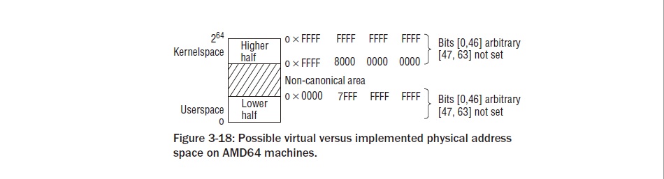

가상  주소의  처음  47비트,  즉  [0,  46]은  임의로  설정될  수  있다.
그러나  [47,  63]  범위의  비트는  항상  동일한  값을  가져야  합니다.  모두  0이거나  모두  1입니다.  이러한  주소를  표준이라고  합니다 .
그들은  전체  주소  공간을  하위  절반,  상위  절반,  그  사이의  금지  영역의  세  부분으로  나눕니다.
두  부분이  합쳐져  정확히  248  비트  에  달하는  주소  공간을  형성합니다 .
아래쪽  절반의  주소  공간은  [0x0,  0x0000  7FFF  FFFF  FFFF]  이고  위쪽  절반의  하위  집합은
[0xFFF  800  0000  0000,  0xFFFF  FFFF  FFFF  FFFF]입니다.  0x0000  7FFF  FFFF  FFFF  는  하위  47비트가  1로  설정되고
다른  비트는  모두  설정되지  않은  이진수이므로  주소  지정이  불가능한  영역  앞의  마지막  주소입니다.  마찬가지로  0xFFFF  8000  0000  0000에는
비트  [48,  63]이  설정되어  있으므로  상위  절반의  첫  번째  유효한  주소입니다.
가상  주소  공간을  두  부분으로  분할하는  것은  커널이  두려워하는  것이  아닙니다.
이는  실제로  대부분의  아키텍처에서  주소  공간을  커널과  사용자  부분으로  분리하는  데  의존합니다.
15  따라서  AMD64에  의해  시행된  분리는  자연스럽게  분리를  구현하는  데  적합합니다 .
사용자와  커널  주소  공간  사이.  그림  3-19는  Linux  커널이  AMD64  시스템에서  가상  주소  공간을  배치하는  방법을  보여줍니다.16
액세스  가능한  주소  공간의  전체  아래쪽  절반은  사용자  공간으로  사용되고  전체  위쪽  절반은  커널용으로  예약됩니다.
두  공간  모두  거대하기  때문에  분할  비율  등을  조작할  필요가  없습니다.
커널  주소  공간은  프로세서에  의해  일반  보호  예외가  발생하는  주소  공간의  비정규  부분에  대한  우발적인  액세스를  방지하기
위해  가드  구멍으로  시작됩니다.
물리적  페이지는  PAGE_OFFSET부터  커널  공간으로  ID  매핑됩니다 .  246  비트( MAXMEM  에서  지정 )  는
물리적  페이지  프레임용으로  예약되어  있습니다.  이는  16TiB의  메모리에  해당합니다.

include/asm-x86/pgtable_64.h
#define __AC(X,Y) (X##Y)
#define _AC(X,Y) __AC(X,Y)
#define __PAGE_OFFSET _AC(0xffff810000000000, UL)
#define PAGE_OFFSET __PAGE_OFFSET
#define MAXMEM _AC(0x3fffffffffff, UL)

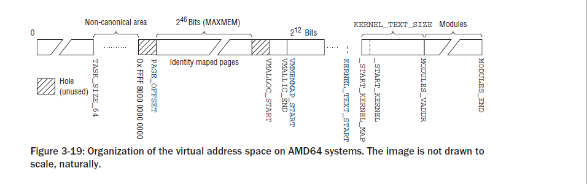

_AC는  주어진  상수에  접미사를  표시하는  데  사용됩니다.  예를  들어  _AC(17,UL)  은  (17UL)  이  되며 ,
이는  상수를  unsigned  long으로  만듭니다.  이는  C  코드에서  유용할  수  있지만  _AC  매크로가  접미사  없이  주어진  값을
직접  확인  하는  어셈블러  코드에서는  허용되지  않습니다 .
ID  매핑된  영역과  VMALLOC_START  와  VMALLOC_END  사이에  있는  vmalloc  영역  영역  사이에  또  다른  가드  홀이  배치됩니다.

include/asm-x86/pgtable_64.h
#define VMALLOC_START _AC(0xffffc20000000000, UL)
#define VMALLOC_END _AC(0xffffe1ffffffffff, UL)

vmalloc  영역  바로  뒤에  있는  VMM(가상  메모리  맵)  영역  의  크기  는  1TiB입니다.
희소  메모리  모델을  사용하는  커널에서만  유용합니다.
pfn_to_page  및  page_to_pfn을  통해  가상  페이지  프레임  번호와  실제  페이지  프레임  번호  간  변환은  물리적  주소  공간의  모든
홀을  고려해야  하기  때문에  이러한  시스템에서는  비용이  많이  들  수  있습니다.
커널  2.6.24부터  mm/sparse-memmap.c의  일반  코드로  더  간단한  솔루션이  제공됩니다.
VMM  영역의  페이지  테이블은  물리적  메모리에  있는  모든  구조체  페이지  인스턴스가  해당  영역에  매핑되지  않도록  설정됩니다.
어떤  구멍.  이는  활성  메모리  영역만  포함되는  사실상  연속적인  영역을  제공합니다.  따라서  MMU는  더  이상  구멍을  고려할  필요가
없는  가상  숫자와  실제  숫자  간의  변환을  자동으로  지원합니다.  이로  인해  작업이  상당히  가속화됩니다.
실제  페이지  번호와  가상  페이지  번호  간의  변환을  단순화하는  것  외에도  이  기술은  필요한  계산도  마찬가지로  단순화되므로
보조  기능  virt_to_page  및  page_address를  구현하는  데  이점이  있습니다 .
커널  텍스트는  CONFIG_PHYSICAL_START  에서  제공하는  컴파일  시간  구성  가능  오프셋을  사용하여  __START_KERNEL_MAP
에서  시작하는  영역에  매핑됩니다 .  재배치  가능한  커널에는  오프셋  설정이  필요합니다.

그러나  결과  주소  __START_KERNEL이  __KERNEL_ALIGN  과  일치하는지  확인됩니다 .
지역커널  바이너리용으로  예약된  KERNEL_TEXT_SIZE  는  현재  40MiB로  정의되어  있습니다.

include/asm-x86/page_64.h
#define __PHYSICAL_START CONFIG_PHYSICAL_START
#define __KERNEL_ALIGN 0x200000
#define __START_KERNEL (__START_KERNEL_map + __PHYSICAL_START)
#define __START_KERNEL_map _AC(0xffffffff80000000, UL)
#define KERNEL_TEXT_SIZE (40*1024*1024)
#define KERNEL_TEXT_START _AC(0xffffffff80000000, UL)

마지막으로  모듈을  매핑할  공간이  제공되어야  하며  이는  MODULES_VADDR  영역에  있습니다. MODULES_END  로 :

include/asm-x86/pgtable_64.h
#define MODULES_VADDR _AC(0xffffffff88000000, UL)
#define MODULES_END _AC(0xfffffffffff00000, UL)
#define MODULES_LEN (MODULES_END - MODULES_VADDR)

사용  가능한  메모리  양은  MODULES_LEN에서  계산됩니다.  현재  이는  대략적으로1,920MiB.

3.4.3 Memory Management during the Boot Process
------------------------------------------------
메모리  관리가  아직  초기화되지  않았지만  커널은  초기화  중에  메모리를  예약해야  합니다.
다양한  데이터  구조를  생성할  수  있도록  부팅  프로세스를  수행합니다.
메모리를  할당하는  bootmem  할당자이를  위해  초기  부팅  단계가  사용됩니다.
분명히  필요한  것은  성능과  보편성보다는  단순성에  초점을  맞춘  시스템입니다.
따라서  커널  개발자는  가장  간단한  방법으로  첫  번째  적합  할당자를  구현하기로  결정했습니다.
부팅  단계에서  메모리를  관리하는  방법.
시스템에  존재하는  물리적  페이지  수만큼의  비트가  포함된  비트맵을  사용하여  관리합니다.
페이지.  비트  값  1은  사용된  페이지를  나타내고  0은  사용  가능한  페이지를  나타냅니다.
메모리를  예약해야  할  때  할당자는  충분한  수의  연속  페이지를  보유할  수  있을  만큼  큰  위치(말  그대로  첫  번째  최선  또는  첫  번째  적합)를
찾을  때까지  비트맵을  비트  단위로  스캔합니다.
위치.
이  절차는  각  비트  체인을  처음부터  바로  스캔해야  하기  때문에  매우  효율적이지  않습니다.배당.
따라서  커널이  완전히  초기화되면  메모리  관리에  사용할  수  없습니다.슬랩,  슬러브  또는  슬롭  할당자와  함께
사용되는  버디  시스템은  다음과  같이  훨씬  더  나은  대안입니다.
섹션  3.5.5에서  논의되었습니다.

Data Structures
------------------

첫  번째  할당자라도  일부  데이터를  관리해야  합니다.  커널은  bootmem_data  의  인스턴스를  제공합니다.
이  목적을  위한  구조(시스템의  각  노드에  대한)입니다.
물론  구조에  필요한  메모리는  동적으로  예약할  수  없지만  컴파일  시  이미  커널에  할당되어야  합니다.

예약은  UMA  시스템에서  CPU  독립적인  방식으로  구현됩니다(NUMA  시스템은  아키텍처별  솔루션을  사용함).
bootmem_data  구조는  다음  과  같이  정의됩니다:
<bootmem.h>
typedef struct bootmem_data {
unsigned long node_boot_start;
unsigned long node_low_pfn;
void *node_bootmem_map;
unsigned long last_offset;
unsigned long last_pos;
unsigned long last_success;
struct list_head list;
} bootmem_data_t;

아래에서  페이지라는  용어를  사용할  때는  항상  실제  페이지  프레임을  의미합니다.
node_boot_start는  시스템의  첫  번째  페이지  번호를  보유합니다.  대부분의  Architec에서는  0입니다.
tures.
􀀁  node_low_pfn  은  관리할  수  있는  물리  주소  공간의  마지막  페이지  번호
곧장;  즉,  ZONE_NORMAL의  끝입니다.
􀀁  node_bootmem_map은  할당  비트맵이  저장되는  메모리  영역에  대한  포인터이다.  IA-32  시스템에서는  커널  이미지  바로
뒤의  메모리  영역이  이  목적으로  사용됩니다.  해당  주소는  연결  중에  커널  이미지에  자동으로  패치되는  _end  변수에  보관됩니다.

last_pos  는  마지막으로  할당된  페이지  번호입니다.  last_offset은  페이지  메모리  전체가  요청되지  않은  경우  페이지  내
오프셋으로  사용됩니다.  이를  통해  bootmem  할당자는  전체  페이지보다  작은  메모리  영역을  할당할  수  있습니다(버디  시스템은  이를  수행할  수  없습니다).  􀀁  last_success는  할당이  마지막으로  성공한  비트맵의  지점을  지정하며
신규  예약의  출발점으로  사용됩니다.  이로  인해  최초  적합  알고리즘이  조금  더  빨라지긴  하지만  여전히  더  정교한  기술을  대체할  수는  없습니다.

연속  메모리가  있는  시스템에는  둘  이상의  bootmem  할당자가  필요할  수  있습니다.  이는  일반적으로  노드당  하나의
bootmem  할당자를  등록하는  NUMA  시스템의  경우이지만,  예를  들어  물리적  주소  공간이  구멍으로  산재되어  있는  시스템의  각  연속  메모리  영역에  대해  하나의  bootmem  할당자를  등록하는  것도  가능합니다.
새로운  부팅  할당자는  init_bootmem_core에  등록되고,  등록된  모든  할당자의  목록은  전역  변수  bdata_list로  시작됩니다.

UMA  시스템에서  필요한  단일  bootmem_t  인스턴스는  contig_bootmem_data라고  합니다 .
이는  bdata  요소  를  통해  contig_page_data  와  연결됩니다 .
mm/page_alloc.c
static bootmem_data_t contig_bootmem_data;
struct pglist_data contig_page_data = { .bdata = &contig_bootmem_data };

Initialization
-------------------
bootmem  할당자를  초기화하는  것은  해당  머신의  메모리  레이아웃에  추가로  의존하는  아키텍처별  프로세스입니다.
위에서  설명한  것처럼  IA-32는  setup_memory를  사용합니다.

bootmem  할당자를  초기화하기  위해  setup_bootmem_allocator를  호출하는  반면,  AMD64는  contig_initmem_init를  사용합니다.

그림  3-20의  코드  흐름  다이어그램은  IA-32  시스템에서  bootmem  할당자의  초기화와  관련된  개별  단계를  보여  주며,
AMD64에  대한  해당  다이어그램은  그림  3-21에  표시되어  있습니다.

.. image:: ./img/fig3_20.png

Initialization for IA-32
-------------------------
setup_memory는  감지된  메모리  영역을  분석하여  낮은  메모리  영역에서  최대  페이지  프레임  수를  찾습니다.
높은  메모리는  처리하기가  너무  복잡하기  때문에  bootmem  할당자에는  쓸모가  없습니다.
전역  변수  max_low_pfn은  매핑  가능한  가장  높은  페이지  번호를  보유합니다.  커널은  부팅  로그에서  발견된  메모리  양을  보고합니다.
wolfgang@meitner> dmesg
...
0MB HIGHMEM available.
511MB LOWMEM available.
...

이  정보를  기반으로  setup_bootmem_allocator는  bootmem  할당자를  초기화하는  데  필요한  모든  단계를  시작하는  역할을  담당합니다.
먼저  init_bootmem_core  의  프런트  엔드인  일반  함수  init_bootmem을  호출합니다.
init_bootmem_core  의  목적은  bootmem  할당자의  첫  번째  초기화  단계를  수행하는  것입니다.
이전에  감지된  메모리  부족  페이지  프레임  범위는  담당  bootmem_data_t  인스턴스(이  경우  contig_bootmem_data )에  입력됩니다 .
모든  페이지는  처음에  contig_bootmemdata->node_bootmem_map  비트맵에서  사용된  것으로  표시됩니다 .
init_bootmem_core  는  아키텍처  독립적인  함수이기  때문에  어떤  페이지를  사용할  수  있고  어떤  페이지를  사용할  수  없는지  아직  알  수  없습니다.
  일부는  아키텍처상의  이유로  특별한  처리가  필요합니다(예:  IA-32  시스템의  0페이지).
  예를  들어  일부는  커널  이미지에서  이미  사용되었습니다.  실제로  사용할  수  있는  페이지는  아키텍처  종속  코드로  명시적으로  표시되어야  합니다.
이  표시는  두  가지  아키텍처별  함수로  수행됩니다.  Register_bootmem_low_pages는  페이지가  사용되지  않은  것으로  표시되도록  비트맵의  해당
비트를  0으로  설정하여  잠재적으로  사용  가능한  모든  메모리  페이지를  해제합니다.
IA-32  시스템은  초기화  중  초기  시점에  사용  가능한  모든  메모리  영역  목록(e820  맵)을  커널에  제공하는  BIOS에  의해  이  작업에서  지원됩니다.
bootmem  할당자는  예약  비트맵을  관리하기  위해  일부  메모리  페이지를  필요로  하므로,  Reserve_bootmem을  호출하여  먼저  이를  예약해야  합니다.

그러나  이미  사용  중인  지역이  더  많으므로  이에  따라  표시해야  합니다.
이를  위해  Reserve_bootmem은  이벤트  이후에  해당  페이지를  등록합니다.
등록해야  하는  정확한  영역  수는  커널  구성에  따라  크게  달라집니다.  예를  들어,  이  페이지는  일부  시스템  관련  기능이  제대로  작동하는  데  필요한  많은  시스템의  특수  BIOS  페이지이기  때문에  0번째  페이지를  예약해야  합니다.  예를  들어  다른  Reserve_bootmem  호출은  ACPI  데이터  또는  SMP  부팅  시간  구성을  위해  구성  종속  메모리  영역을  예약합니
다.

Initialization for AMD64
-----------------------------
bootmem  초기화의  기술적  세부  사항은  AMD64에서  다르지만  일반적인  구조는  IA-32의  경우와  유사합니다.  이번에는  contig_initmem이  책임  디스패처입니다.
우선,  bootmem_bootmap_bitmap은  bootmem  비트맵에  필요한  페이지  수를  계산합니다.
e820  맵의  BIOS에서  제공하는  정보를  사용하면  IA  32에서와  같이  적절한  RAM  페이지로  채워지는
적절한  크기의  연속  메모리  영역을  찾을  수  있습니다.
그런  다음  이  정보는  init_bootmem을  사용하여  아키텍처  독립적인  bootmem  데이터  구조에  채워집니다 .
이전과  마찬가지로  함수는  모든  페이지를  예약된  것으로  표시하므로  이제  사용  가능한  페이지를  선택해야  합니다.
free_bootmem_with_active_regions는  e820  맵의  정보를  다시  한  번  사용하여  BIOS에서  사용  가능한  것으로  보고
된  모든  메모리  영역을  해제할  수  있습니다.  마지막으로,  Reserve_bootmem을  한  번만  호출하면
bootmem  할당  비트맵에  필요한  공간을  등록하는  데  충분합니다. IA-32와  달리  메모리의  마법적인  위치에
대한  레거시  정보를  위한  공간을  예약할  필요가  없습니다.

Interface to the Kernel
Allocating Memory
------------------------
커널은  초기화  중에  메모리를  예약하기  위한  다양한  기능을  제공합니다.  UMA  시스템에서는  다음  기능을  사용할  수  있습니다.

alloc_bootmem(size)  및  alloc_bootmem_pages(size)는  크기가  다음과  같은  메모리를  예약합니다.
ZONE_NORMAL  의  크기  로  표현됩니다 .  메모리가  L1  캐시의  이상적인  위치나  페이지  경계에서  시작되도록  데이터가  정렬됩니다.

alloc_bootmem_pages  라는  이름은  필요한  크기가  페이지  단위로  지정됨을  암시  하지만  _pages는  데이터  정렬  만을  나타냅니다 .

alloc_bootmem_low  및  alloc_bootmem_low_pages는  위  함수와  동일한  방식으로  작동하지만  DMA  작업에
적합한  ZONE_DMA  영역을  소스로  사용합니다.  따라서  이  기능은  DMA  메모리가  필요할  때만  사용해야  합니다.

기본적으로  동일한  API가  NUMA  시스템에  적용되지만  접미사  _node가  함수  이름에  추가됩니다.  UMA  기능과  비교하여
메모리  예약에  사용할  노드를  지정하려면  추가  매개변수가  필요합니다.
이러한  함수는  모두  실제  작업을  __alloc_bootmem_nopanic에  위임하는  __alloc_bootmem  의  프런트  엔드입니다 .
둘  이상의  bootmem  할당자를  등록할  수  있으므로(모두  전역  목록에  보관된다는  점을  기억하세요)  __alloc_bootmem_core는  하나가
성공할  때까지  모든  할당자를  반복합니다.
NUMA  시스템에서는  __alloc_bootmem_node가  API  기능을  구현하는  데  사용됩니다.
먼저  작업이  __alloc_bootmem_core  로  전달되어  노드의  특정  bootmem  할당자에  대한  할당을  시도합니다.
이것이  실패하면  함수는  모든  노드를  시도하는  __alloc_bootmem  으로  대체됩니다 .

mm/bootmem.c
void * __init __alloc_bootmem(unsigned long size, unsigned long align,
unsigned long goal)

__alloc_bootmem에는  요청을  설명하는  세  가지  매개변수가  필요합니다.
size  는  원하는  메모리  영역의  크기이고,  align은  데이터  정렬을  나타내며,
goal은  적합한  여유  영역  검색이  시작될  시작  주소를  지정합니다.  프런트엔드는  다음과  같은  기능을  사용합니다.

<bootmem.h>
#define alloc_bootmem(x) \
__alloc_bootmem((x), SMP_CACHE_BYTES, __pa(MAX_DMA_ADDRESS))
#define alloc_bootmem_low(x) \
__alloc_bootmem((x), SMP_CACHE_BYTES, 0)
#define alloc_bootmem_pages(x) \
__alloc_bootmem((x), PAGE_SIZE, __pa(MAX_DMA_ADDRESS))
#define alloc_bootmem_low_pages(x) \
__alloc_bootmem((x), PAGE_SIZE, 0)

원하는  할당  크기  (x)  는  변경되지  않고  __alloc_bootmem  으로  전달되지만  메모리  정렬에는  두  가지  옵션이  있습니다.
 SMP_CACHE_BYTES는  대부분의  아키텍처에서  데이터가  L1  캐시에  이상적으로  배치되도록  정렬합니다(물론  상수라는  이름에도  불구하고). ,
 단일  프로세서  시스템에서도  정의됨)  PAGE_SIZE는  페이지  경계에  데이터를  정렬합니다.
 후자  정렬은  하나  이상의  전체  페이지를  할당하는  데  이상적이지만  전자는  페이지의  일부를  할당할  때  더  나은  결과를  생성합니다.
시작  주소를  통해  낮은  메모리와  일반  메모리를  구분합니다.  DMA  적합  메모리  검색은  주소  0에서  시작되는
반면  RAM이  있는  일반  메모리에  대한  요청은  MAX_DMA_ADDRESS  부터  위쪽  으로  처리됩니다  (__pa는  메모리  주소를  페이지  번호로  변환합니다).
__alloc_bootmem_core  는  상대적으로  광범위한  기능(부팅  중에  효율성이  필요하지  않음)이지만  주요
작업은  이미  설명한  첫  번째  적합  알고리즘을  구현하는  것이기  때문에  자세히  설명하지  않겠습니다.
그러나  전체  메모리  페이지뿐만  아니라  그보다  작은  부분도  예약할  수  있도록  할당자가  향상되었습니다.
이  함수는  다음(개요)  작업을  수행합니다.
1.  목표  부터  시작하여  할당  요청을  만족시키기  위해  여유  영역을  찾기  위해  페이지  비트맵을  스캔합니다.

2.  발견된  페이지가  bootmem_data->  last_pos  에  보관된  마지막  할당  페이지  바로  뒤에  오는  경우  커널은
bootmem_data->last_offset을  참조하여  필요한  메모리(데이터  정렬에  필요한  공간  포함)를  마지막  페이지에  할당할  수  있는지  확인합니다.
아니면  적어도  거기에서  시작할  수  있습니다.

3.  블록  비트맵에서  새로  할당된  페이지의  비트는  1로  설정됩니다.  할당된  마지막  페이지의  번호도  bootmem_data
>last_pos에  저장됩니다.
페이지가  완전히  할당되지  않은  경우  bootmem_data->last_offset에  적절한  오프셋이  보관됩니다.
그렇지  않으면  이  값은  0으로  설정됩니다.

Releasing Memory
------------------
커널은  메모리를  확보하기  위해  free_bootmem  함수를  제공합니다.  시작  주소와  해제할  영역의  크기라는  두  가지  매개변수가  필요합니다.
NUMA  시스템에서  해당  기능의  이름은  놀랍게도  free_bootmem_node입니다.  적절한  노드를  정의하려면  추가  매개변수가  필요합니다.

<bootmem.h>
void free_bootmem(unsigned long addr, unsigned long size);
void free_bootmem_node(pg_data_t *pgdat,
unsigned long addr,
unsigned long size);

두  버전  모두  작업을  __free_bootmem_core에  위임합니다.  bootmem  할당자는  페이지  분할에  대한  정보를  보관하지  않으므로
전체  페이지만  해제할  수  있습니다.
커널은  __free_bootmem_core를  사용하여  먼저  해제할  영역에  콘텐츠가  완전히  보관된  페이지를  계산합니다 .
이  영역의  일부  내용만  포함된  페이지는  무시됩니다.  페이지  비트맵의  해당  항목은  0으로  설정되어  페이지  해제를  완료합니다.
이  절차는  연속적인  요청에서  페이지  내용의  일부가  반환되는  경우  페이지가  해제되지  않을  위험을  숨깁니다.
페이지의  첫  번째  절반과  나중에  같은  페이지의  두  번째  절반이  해제되면  할당자는  전체  페이지가  더  이상  사용되지  않으므로
해제될  수  있다는  것을  알  수  없습니다.
사실은  아니지만  페이지는  단순히  '사용  중'으로  남아  있습니다.  그럼에도  불구하고  free_bootmem은  거의  사용되지  않으므로
이는  큰  문제가  되지  않습니다 .
시스템  초기화  중에  할당된  대부분의  메모리  영역은 커널  런타임  전체에  걸쳐  필요한  기본  데이터  구조를  위해  고안되었으므로  결코  포기되지  않습니다.

Disabling the Bootmem Allocator
-------------------------------

버디  시스템  할당자가  메모리  관리를  담당할  수  있도록  시스템  초기화가  진행된  후에는  bootmem  할당자를  비활성화해야  합니다.
결국  두  할당자가  동시에  메모리를  관리할  수는  없습니다.  비활성화는  UMA  시스템의  free_all_bootmem  과
NUMA  시스템의  free_all_bootmem_node를  통해  수행됩니다 .  둘  다  버디  시스템이  설정된  후  아키텍처별  초기화  코드에  의해  호출되어야  합니다.
bootmem  할당자의  페이지  비트맵이  먼저  스캔되고  사용되지  않은  모든  페이지가  해제됩니다.  버디  시스템에  대한  인터페이스는
해제된  각  페이지에  대해  호출되는  __free_pages_bootmem  함수입니다.  이  함수는  내부적으로  표준  함수  __free_page에  의존합니다.
페이지를  버디  시스템의  데이터  구조에  통합하여  무료  페이지로  관리하고  할당할  수  있습니다.
페이지  비트맵이  완전히  스캔되면  해당  비트맵이  차지하는  메모리  공간도  제거되어야  합니다.이후에는  버디  시스템만  메모리  할당에  사용할
수  있습니다.

Releasing Initialization Data
-------------------------------

많은  커널  코드  청크와  데이터  테이블은  시스템  초기화  단계에서만  필요합니다.
예를  들어,  영구적으로  연결된  드라이버의  경우  커널  메모리에  데이터  구조  초기화  루틴을  유지할  필요가  없습니다.
일단  구조가  설정되면  더  이상  필요하지  않습니다.
마찬가지로,  관련  장치가  식별되면  운전자가  장치를  감지하는  데  필요한  하드웨어  데이터베이스는  더  이상  필요하지  않습니다.

커널은  초기화  함수와  데이터에  레이블을  지정하기  위해  두  가지  '속성' (__init  및  __initcall)  을  제공합니다.
이는  함수  또는  데이터  선언  앞에  배치되어야  합니다.
예를  들어,  (가상의 ...)  네트워크  카드  HyperHopper2000의  프로빙  루틴은  시스템이  초기화되면  더  이상  사용되지  않습니다.

int __init hyper_hopper_probe(struct net_device *dev)

__init  속성은  함수  선언의  반환  유형과  이름  사이에  삽입됩니다 .
마찬가지로  데이터  섹션에는  초기화  데이터로  레이블이  지정될  수  있습니다.
예를  들어  가상  네트워크  카드  드라이버에는  시스템  초기화  단계에서만  몇  가지  문자열이  필요합니다.
그  이후에는  문자열을  삭제할  수  있습니다.
static char search_msg[] __initdata = "%s: Desperately looking for HyperHopper at address %x...";
static char stilllooking_msg[] __initdata = "still searching...";
static char found_msg[] __initdata = "found.\n";
static char notfound_msg[] __initdata = "not found (reason = %d)\n";
static char couldnot_msg[] __initdata = "%s: HyperHopper not found\n";

__init  및  __initdata는  일반적인  C  수단을  사용하여  구현할  수
없으므로  커널은  다시  한  번  특수  GNU  C  컴파일러  문에  의존해야  합니다.  구현  뒤에  숨은  일반적인  아이디어
초기화  기능은  커널  이미지의  특정  부분에  데이터를  완전히  보관하는  것입니다.
부팅이  완료되면  메모리에서  제거됩니다.  다음  매크로는  이것으로  정의됩니다염두에 :

<init.h>
#define __init __attribute__ ((__section__ (".init.text"))) __cold
#define __initdata __attribute__ ((__section__ (".init.data")))

__attribute__  는  속성  사용을  허용하는  특수  GNU  C  키워드입니다.
__section__  속성은  다음  과  같습니다.후속  데이터나  함수를  각각의 .init.data  에  쓰도록  컴파일러에  지시하는  데  사용됩니다 .
바이너리  파일의 .init.text  섹션(ELF  파일  구조에  익숙하지  않은  사용자는  참조)부록  E).
접두사  __cold는  또한  함수로  이어지는  경로가  다음과  같이  될  것임을  컴파일러에  지시합니다.
즉,  함수가  자주  호출되지  않을  가능성이  높습니다.  이는  일반적으로  초기화의  경우입니다.
기능.
readelf  도구를  사용하여  커널  이미지의  개별  섹션을  표시할  수  있습니다 .

wolfgang@meitner> readelf — sections vmlinux
There are 53 section headers, starting at offset 0x2c304c8:
Section Headers:
[Nr] Name Type Address Offset
Size EntSize Flags Link Info Align
[ 0] NULL 0000000000000000 00000000
0000000000000000 0000000000000000 0 0 0
[ 1] .text PROGBITS ffffffff80200000 00200000
000000000021fc6f 0000000000000000 AX 0 0 4096
[ 2] __ex_table PROGBITS ffffffff8041fc70 0041fc70
0000000000003e50 0000000000000000 A 0 0 8
[ 3] .notes NOTE ffffffff80423ac0 00423ac0
0000000000000024 0000000000000000 AX 0 0 4
...
[28] .init.text PROGBITS ffffffff8067b000 0087b000
000000000002026e 0000000000000000 AX 0 0 1
[29] .init.data PROGBITS ffffffff8069b270 0089b270
000000000000c02e 0000000000000000 WA 0 0 16
...

메모리에서  초기화  데이터를  해제하기  위해  커널이  초기화  데이터의  특성을  알  필요는  없습니다.
데이터  —  어떤  데이터와  기능이  메모리에  저장되어  있으며  어떤  목적으로  사용되는지는  전혀  관련이  없습니다.
관련된  유일한  정보는  데이터와  기능이  시작되는  메모리의  주소입니다.
그리고  끝.
이  정보는  컴파일  시  사용할  수  없으므로  커널이  링크될  때  패치됩니다.
나는  이  장의  다른  부분에서  이미  이  기술을  언급했습니다.
이를  지원하기  위해  커널은  다음을  정의합니다.변수  쌍  __init_begin  및  __init_end,  이름에서  의미를  알  수  있습니다.
free_initmem은  초기화  목적으로  정의된  메모리  영역을  해제하고  페이지를  버디  시스템에  반환하는  일을  담당합니다.
이  함수는  부팅  프로세스가  끝나면  즉시  호출됩니다.
init가  시스템의  첫  번째  프로세스를  시작  하기  전에 .
부팅  로그에는  얼마나  많은  양을  나타내는  메시지가  포함되어  있습니다.메모리가  해제되었습니다.

wolfgang@meitner> dmesg
...
Freeing unused kernel memory: 308k freed
...
오늘날의  일반적인  주  메모리  크기와  비교할  때  약  300KiB의  여유  공간은  크지는  않지만  상당한  기여를  합니다.
초기화  데이터를  제거하는  것은  특히  본질적으로  메모리가  거의  없는  휴대용  시스템이나  내장형  시스템에서  중요합니다.

3.5 Management of Physical Memory
-----------------------------------
커널  초기화가  완료되면  버디  시스템이  메모리  관리  책임을  맡습니다.
버디  시스템은  거의  40년  동안  우리와  함께해온  상대적으로  단순하지만  그럼에도  불구하고  놀랍도록  강력한  알고리즘을  기반으로  합니다.
이는  좋은  메모리  할당자의  두  가지  주요  특성인  속도와  효율성을  결합합니다.

3.5.1 Structure of the Buddy System
--------------------------------------

구조체  페이지  의  인스턴스는  시스템에  있는  메모리의  각  물리적  페이지(페이지  프레임)에  대해  사용할  수  있습니다.
각  메모리  영역은  친구  데이터를  관리하기  위한  중앙  배열을  보유하는  구조체  영역  의  인스턴스와  연결됩니다 .
<mmzone.h>
struct zone {
...
/*
* free areas of different sizes
*/
struct free_area free_area[MAX_ORDER];
...
};

free_area  는  아직  만나보지  못한  보조  데이터  구조입니다.  이는  다음과  같이  정의됩니다:

<mmzone.h>
struct free_area {
struct list_head free_list[MIGRATE_TYPES];
unsigned long nr_free;
};

nr_free는  현재  영역의  사용  가능한  페이지  블록  수를  지정합니다(0번째  영역의  경우  페이지  단위로  계산되고,
순서  1의  경우  두  페이지  쌍으로,  순서  2의  경우  네  페이지  세트로  계산됩니다).  free_list는  페이지  목록을  연결하는  데  사용됩니다.
1장에서  설명한  것처럼  페이지  목록에는  동일한  크기의  연속적인  메모리  영역이  포함되어  있습니다.
정의에서는  두  개  이상의  페이지  목록을  제공하지만  이  사실을  잠시  무시하고  아래에  다른  목록이  있는  이유를  다시  설명합니다.

순서  는  버디  시스템에서  매우  중요한  용어입니다.  메모리를  할당할  수  있는  수량화된  단위를  설명합니다.
메모리  블록의  크기는  2order이며,  order  는  0에서  MAX_ORDER까지  확장될  수  있습니다.

<mmzone.h>
#ifndef CONFIG_FORCE_MAX_ZONEORDER
#define MAX_ORDER 11
#else
#define MAX_ORDER CONFIG_FORCE_MAX_ZONEORDER
#endif
#define MAX_ORDER_NR_PAGES (1 << (MAX_ORDER - 1))

이  상수의  일반적인  값은  11이며,  이는  단일  할당에서  요청할  수  있는  최대  페이지  수는  211  =  2,048임을  의미합니다.
그러나  아키텍처에서  FORCE_MAX_ZONEORDER  구성  옵션을  설정한  경우  이  값을  수동으로  변경할  수  있습니다.
-특정  코드.  예를  들어,  IA-64  시스템의  거대한  주소  공간은  MAX_ORDER  =  18  로  작업할  수  있는  반면  ARM  또는  v850
시스템은  8  또는  9와  같은  더  작은  값을  사용합니다.  그러나  이는  반드시  시스템에서  지원하는  메모리가  적기  때문에  발생하는  것은  아닙니다.
이지만  메모리  정렬  요구  사항  때문일  수도  있습니다.  또는  V850  아키텍처의  Kconfig  구성  파일에  따르면  다음과  같습니다.

arch/v850/Kconfig
# The crappy-ass zone allocator requires that the start of allocatable
# memory be aligned to the largest possible allocation.
config FORCE_MAX_ZONEORDER
int
default 8 if V850E2_SIM85E2C || V850E2_FPGA85E2C

free_area[]  배열  의  개별  요소  인덱스  도  순서  매개변수로  해석되며  공유  목록의  연속  영역에  존재하는  페이지  수를  지정합니다.
0번째  배열  요소는  한  페이지(20  =  1)로  구성된  섹션을  나열하고,
첫  번째  배열  요소는  페이지  쌍을  나열하고(21  =  2),  세  번째는  4페이지  세트를  관리하는  식입니다.
페이지  영역은  어떻게  연결되어  있나요?  블록  의  첫  번째  페이지에  있는  목록  요소  는  블록을  목록에  유지하는  데  사용됩니다.
결과적으로  물리적으로  인접한  그룹  페이지에  새로운  데이터  구조를  도입할  필요가  없습니다.  그렇지  않으면  페이지가  블록에  포함되지  않습니다.
 그림  3-22에서는  상황을  그래픽으로  보여줍니다.

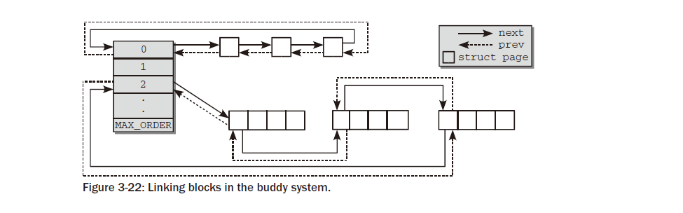

친구는  서로  연결될  필요가  없습니다 .  할당  중에  블록이  절반  크기의  두  블록으로  분할되면  커널은  사용되지  않은  절반을  다음  더
작은  블록  목록에  자동으로  추가합니다.
메모리가  해제된  후  향후  어느  시점에  두  블록이  모두  사용되지  않으면  해당  주소를  참조하여  자동으로  친구인지  여부를  확인할  수  있습니다.
이러한  최소한의  관리  노력은  버디  시스템의  주요  장점입니다.

버디  시스템  기반의  메모리  관리는  노드의  단일  메모리  영역에  집중되어  있으며,예를  들어  DMA  또는  대용량  메모리  영역이  있습니다.
그러나  모든  존과  노드의  버디  시스템은할당  대체  목록을  통해  연결됩니다.  그림  3-23은  이  관계를  보여줍니다.
선호하는  영역이나  노드에서  메모리  요청을  충족할  수  없는  경우  먼저  해당  영역의  다른  영역을동일한  노드를  선택하고  요청을
이행하기  위해  다른  노드를  선택합니다.

.. image:: ./img/fig3_23.png

마지막으로,  버디  시스템의  현재  상태에  대한  정보는  다음에서  확인할  수  있습니다.

wolfgang@meitner> cat /proc/buddyinfo
Node 0, zone DMA 3 5 7 4 6 3 3 3 1 1 1
Node 0, zone DMA32 130 546 695 271 107 38 2 2 1 4 479
Node 0, zone Normal 23 6 6 8 1 4 3 0 0 0 0

구역별로  할당  순서별  무료  입장  횟수가  인쇄되며,  왼쪽부터  순서가  늘어납니다.오른쪽으로.
위에  표시된  정보는  4GiB  RAM을  갖춘  AMD64  시스템에서  가져온  것입니다.

3.5.2 Avoiding Fragmentation
-----------------------------

소개에  주어진  단순화된  설명에서는  하나의  이중  연결  리스트가  모든  것을  만족시키기에  충분했습니다.
친구  시스템의  필요성.  이것은  실제로  커널  2.6.23까지의  상황이었습니다.
그러나  커널  2.6.24를  개발하는  동안  버디  시스템에서는  패치  통합에  대한  논란이  있었습니다.
비정상적으로  오랜  시간  동안  커널  개발자들  사이에  있었습니다.
친구  시스템  중  하나이기  때문에커널의  가장  존경받는  구성  요소이므로  변경  사항을  가볍게  받아들이지  않습니다.

Grouping Pages byMobility
--------------------------
버디  시스템의  기본  원리는  서론에서  논의되었으며,  그  방식은  다음과  같다.실제로  지난  몇  년  동안  매우  잘  작동했습니다.
그러나  한  가지  문제가  발생했습니다. Linux  메모리  관리의  오랜  문제:  시스템이  오랫동안  실행된  후시간이  길어질수록  실제
메모리는  조각화되는  경향이  있습니다.
상황은  그림  3-24에  묘사되어  있습니다.

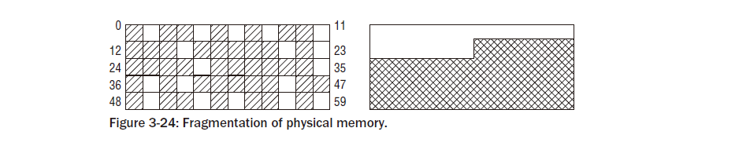

메모리가  60페이지로  구성되어  있다고  가정합니다.
이는  분명히  다음  슈퍼컴퓨터의  핵심  구성  요소는  아니지만  예를  들기에는  충분합니다.
사용  가능한  페이지는  왼쪽의  주소  공간에  분산되어  있습니다.
실제  메모리의  약  25%가  아직  할당되지  않았지만  가장  큰  연속  여유  공간은  단일  페이지에  불과합니다.
이는  사용자  공간  응용  프로그램에는  문제가  되지  않습니다.
메모리가  페이지  테이블에  매핑되기  때문에  사용  가능한  페이지가  실제  메모리에  어떻게  배포되는지에  관계없이  항상  연속적으로  나타납니다.
오른쪽은  사용된  페이지와  사용  가능한  페이지  수가  동일하지만  모든  사용  가능한  페이지가  연속  영역에  있는  상황을  보여줍니다.
그러나  조각화는  커널에  문제가  됩니다.
(대부분의)  RAM은  주소  공간의  커널  부분에  ID  매핑되므로  이  시나리오에서는  단일  페이지보다  큰  영역을  매핑할  수  없습니다.
많은  커널  할당은  작지만  단일  페이지  이상을  할당해야  하는  경우도  있습니다.
분명히  모든  예약된  페이지와  사용  가능한  페이지가  연속적인  영역에  있는  오른쪽의  상황이  더  바람직할  것입니다.
흥미롭게도  조각화  문제는  대부분의  메모리가  아직  할당되지  않은  경우  이미  발생할  수  있습니다.
그림  3-25의  상황을  생각해  보십시오.
4페이지만  예약되어  있지만  버디  시스템은  2의  거듭제곱인  할당  범위에서만  작동할  수  있으므로  할당할  수  있는  가장  큰
연속  영역은  8페이지입니다.

메모리  조각화는  커널에만  관련된다고  언급했지만  이는  부분적으로만  사실입니다.
대부분의  최신  CPU는  일반  페이지보다  페이지  크기가  훨씬  큰  거대한  페이지에  대한  작업  가능성을  제공합니다.
이는  메모리  집약적인  애플리케이션에  이점이  있습니다.  더  큰  페이지가  사용되면  변환  참조  버퍼는  더  적은  수의  항목을  처리해야
 하며  TLB  캐시  누락  가능성이  줄어듭니다.
그러나  거대한  페이지를  할당하려면  물리적  RAM의  무료  연속  영역이  필요합니다!
실제로  물리적  메모리의  조각화는  유난히  오랜  기간  동안  Linux의  약점  중  하나였습니다.
많은  접근  방식이  제안되었지만  다른  접근  방식에  너무  큰  영향을  주지  않으면서  Linux가  직면해야  하는  수많은  작업
부하의  까다로운  요구  사항을  충족할  수  있는  방법은  없습니다.
커널  2.6.24를  개발하는  동안  조각화를  방지하는  수단이  마침내  커널에  도입되었습니다.  그들의  전략을  논의하기  전에  한  가지
사항을  명확히  해야  합니다.  조각화는  파일  시스템에서도  알려져  있으며  이  영역에서  문제는  일반적으로  조각  모음  도구로  해결됩니다.
조각  모음  도구는  파일  시스템을  분석하고  더  큰  연속  영역이  발생하도록  할당된  블록을  재배열합니다.
이  접근  방식은  원칙적으로  RAM에도  가능하지만  많은  물리적  페이지가  있다는  사실로  인해  복잡해집니다.

임의의  위치로  이동할  수  없습니다.  따라서  커널의  접근  방식은  조각화  방지입니다.  처음부터  조각화를  방지하도록  노력하십시오.

조각화  방지는  어떻게  작동하나요?  접근  방식을  이해하려면  커널이  세  가지  유형의  예약  페이지를  구별한다는  점을  알아야  합니다.

동할  수  없는  페이지는  메모리에서  고정된  위치를  가지며  다른  곳으로  이동할  수  없습니다.  최대
코어  커널의  할당이  이  범주에  속합니다.
􀀁  회수  가능  페이지는  직접  이동할  수  없지만  일부  소스에서  삭제하고  내용을  다시  생성할  수  있습니다.  예를  들어,  파일에
서  매핑된  데이터가  이  범주에  속합니다.
회수  가능한  페이지는  액세스  빈도에  따라  kswapd  데몬  에  의해  주기적으로  해제됩니다 .
이는  페이지  회수에  대해  자세히  설명하는  18장에서  자체적으로  자세히  논의할  가치가  있는  복잡한  프로세스입니다.
그동안  RAM을  너무  많이  사용하기  시작하면  회수  가능한  페이지를  커널이  제거할  것이라는  점만  알아도  충분합니다.
메모리가  급격히  부족할  때,  즉  할당이  실패한  경우  페이지  회수를  시작하는  것도  가능합니다.
커널이  필요하다고  판단하는  경우  아래에서  추가  내용을  볼  수  있습니다.

이동 가능한  페이지는  원하는  대로  이동할  수  있습니다.  사용자  공간  애플리케이션에  속하는  페이지가  이  범주에  속합니다.

페이지  테이블을  통해  매핑됩니다.
새  위치에  복사되면  페이지  테이블  항목이  그에  따라  업데이트될  수  있으며  애플리케이션은  아무  것도  알아차리지  못합니다.

페이지는  세  가지  범주  중  어느  범주에  속하는지에  따라  특정  이동성을  갖습니다.
커널에서  사용하는  조각화  방지  기술은  이동성이  동일한  페이지를  그룹화하는  아이디어를  기반으로  합니다.
이  접근  방식이  조각화를  줄이는  데  도움이  되는  이유는  무엇입니까?
그림  3-25에서  다른  곳으로  이동할  수  없는  페이지는  거의  완전히  비어  있는  RAM  영역에서  지속적인  할당을  방해할  수  있다는  점을  상기해  보세요.  이동성에  따라  페이지를  다른  목록에  배포하면  이러한  상황이  방지됩니다.  예를  들어,  이동  불가능한  페이지는  이동  가능한  페이지  블록의  중간에  위치할  수  없으며  블록의  더  큰  부분이  사용되는  것을  효과적으로  방지할  수  있습니다.
그림  3-25의  사용  가능한  페이지  대부분은  회수  가능  범주에  속하고  예약된  페이지는  이동할  수  없다고  상상해  보십시오.
그러나  페이지가  두  개의  서로  다른  목록에  수집된  경우  상황은  그림  3-26과  같을  수  있습니다.
이동할  수  없는  페이지의  경우  크고  연속적인  여유  공간을  찾는  것은  여전히  어렵지만  회수  가능한  페이지의  경우  훨씬  쉽습니다.

그러나  메모리는  처음부터  서로  다른  이동성  영역으로  분할되지는  않습니다.
런타임  시  채워집니다.  커널의  두  번째  접근  방식은  메모리를  이동  가능한  할당과  그렇지  않은  할당을  위한  영역으로  분할  하며
이것이  어떻게  작동하는지  아래에서  설명하겠습니다.
그러나  이러한  분할은  여기에  설명된  접근  방식에  필수적인  것은  아닙니다.

Data Structures
------------------

커널에서  사용하는  조각화  방지  기술은  매우  효과적이지만  버디  할당자의  코드  및  데이터  구조에는  놀랍게도  거의  영향을  미치지  않습니다.
커널은  다양한  마이그레이션  유형을  나타내는  몇  가지  매크로를  정의합니다.

<mmzone.h>
#define MIGRATE_UNMOVABLE 0
#define MIGRATE_RECLAIMABLE 1
#define MIGRATE_MOVABLE 2
#define MIGRATE_RESERVE 3
#define MIGRATE_ISOLATE 4 /* can’t allocate from here */
#define MIGRATE_TYPES 5

MIGRATE_UNMOVABLE,  MIGRATE_RECLAIMABLE  및  MIGRATE_MOVABLE  유형이  이미  도입되었습니다.
MIGRATE_RESERVE는  이동성  관련  목록에서  할당  요청을  이행할  수  없는  경우  비상  메모리  예약을
제공합니다(이는  setup_zone_  migration_reserve  를  사용하여  메모리  하위  시스템을  초기화하는  동안  채워지지만  이에  대해서는
자세히  설명하지  않겠습니다).  MIGRATE_ISOLATE  는  NUMA  노드에서  물리적  페이지를  이동하는  데  필요한  특수  가상  영역입니다.
대규모  시스템에서는  물리적  페이지를  가장  많이  사용하는  CPU에  더  가깝게  가져오는  것이  유리할  수  있습니다.
마지막으로  MIGRATE_TYPES  도  영역이  아니며  단지  마이그레이션  유형의  수를  나타냅니다.
버디  시스템  데이터  구조의  핵심  조정은  사용  가능한  목록이  MIGRATE_TYPE  수의  목록으로  분할된다는  것입니다.

<mmzone.h>
struct free_area {
struct list_head free_list[MIGRATE_TYPES];
unsigned long nr_free;
};

nr_free는  모든  목록  의  사용  가능한  페이지  수를  계산  하지만  각  마이그레이션  유형에  대해  특정  사용  가능한  목록이  제공됩니다.
for_each_  migrationtype_order(order,  type)  매크로를  사용하여  모든  할당  순서의  마이그레이션  유형을  반복할  수  있습니다.
커널이  특정  마이그레이션  유형에  대한  할당  요청을  이행할  수  없으면  어떻게  됩니까?  유사한  문제는  이전에도  이미  발생했습니다.
즉,  특정  NUMA  영역에서  할당을  이행할  수  없는  경우  어떤  일이  발생하는지  고려할  때  발생했습니다.
커널은  원하는  목록에서  요청을  이행할  수  없는  경우  다음에  사용해야  하는  마이그레이션  유형을  규제하는  대체  목록을  제공하여
이  경우와  유사하게  진행합니다.
mm/page_alloc.c
/*
* This array describes the order lists are fallen back to when
* the free lists for the desirable migrate type are depleted
*/
static int fallbacks[MIGRATE_TYPES][MIGRATE_TYPES-1] = {
[MIGRATE_UNMOVABLE] = { MIGRATE_RECLAIMABLE, MIGRATE_MOVABLE, MIGRATE_RESERVE },
[MIGRATE_RECLAIMABLE] = { MIGRATE_UNMOVABLE, MIGRATE_MOVABLE, MIGRATE_RESERVE },
[MIGRATE_MOVABLE] = { MIGRATE_RECLAIMABLE, MIGRATE_UNMOVABLE, MIGRATE_RESERVE },
[MIGRATE_RESERVE] = { MIGRATE_RESERVE, MIGRATE_RESERVE, MIGRATE_RESERVE },
/* Never used */
};

데이터  구조는  대부분  자체적으로  설명됩니다.
커널이  이동할  수  없는  페이지를  할당하려고  하지만  해당  목록이  비어  있으면  회수  가능한  페이지로  폴백한  다음  이동  가능한  페이지로,
마지막으로  비상  예비로  폴백합니다.

Global Variables and Auxiliary Functions
--------------------------------------------
페이지  이동성  그룹화는  항상  커널로  컴파일되지만  여러  마이그레이션  목록에  분산될  수  있는  충분한  메모리가  시스템에  있는  경우에만
의미가  있습니다.  각  마이그레이션  목록에는  적절한  양의  메모리가  있어야  하므로  커널에는  '적합'이라는  개념이  필요합니다.
이는  두  개의  전역  변수  pageblock_order  및  pageblock_nr_pages에  의해  제공됩니다.  첫  번째는  '대형'으로  간주되는
할당  순서를  나타내며,  pageblock_nr_pages는  이  할당  순서에  해당하는  페이지  수를  나타냅니다.  일반적으로  페이지  순서는
아키텍처에서  제공하는  경우  거대한  페이지의  순서로  선택됩니다.

<pageblock-flags.h>
#define pageblock_order HUGETLB_PAGE_ORDER

IA-32  아키텍처에서  거대  페이지  크기는  4MiB이므로  각  거대  페이지는  1,024개의  일반  페이지로  구성되며
HUGETLB_PAGE_ORDER  는  10으로  정의됩니다.  이와  대조적으로  IA-64  아키텍처에서는  다양한  일반  페이지  크기와  거대
페이지  크기를  허용하므로  HUGETLB_PAGE_ORDER  값은  커널  구성에  따라  다릅니다.
아키텍처가  대용량  페이지를  지원하지  않는  경우  두  번째로  높은  할당  순서가  대량  주문으로  간주됩니다.

<pageblock-flags.h>
#define pageblock_order (MAX_ORDER-1)

각  마이그레이션  유형에  최소한  하나의  대형  페이지  블록을  장착할  수  없는  경우  페이지  마이그레이션은  어떤  이점도  제공하지  않으므로
사용  가능한  메모리가  너무  적으면  커널에  의해  기능이  꺼집니다.  이는  영역  목록을  초기화하는  데  사용되는  build_all_zonelists
함수에서  확인됩니다 .  사용  가능한  메모리가  충분하지  않으면  전역  변수  page_group_by_mobility가  0으로  설정되고,
그렇지  않으면  1.18  로  설정됩니다.
커널은  주어진  할당이  어떤  마이그레이션  유형에  속하는지  어떻게  알  수  있습니까?  섹션  3.5.4에서  볼  수  있듯이  각  메모리  할당에
대한  세부  정보는  할당  마스크로  지정됩니다.  커널은  할당된  메모리가  이동  가능  (__GFP_MOVABLE)  또는  회수  가능  (__GFP_RECLAIMABLE)임을
알리는  두  개의  플래그를  제공합니다.  이러한  플래그  중  어느  것도  지정되지  않으면  할당은  이동할  수  없는  것으로  간주됩니다.
다음  보조  기능은  할당  플래그와  해당  마이그레이션  유형  간을  변환합니다.

<gfp.h>
static inline int allocflags_to_migratetype(gfp_t gfp_flags)
{
if (unlikely(page_group_by_mobility_disabled))
return MIGRATE_UNMOVABLE;
/* Group based on mobility */
return (((gfp_flags & __GFP_MOVABLE) != 0) << 1) |
((gfp_flags & __GFP_RECLAIMABLE) != 0);
}

페이지  이동성이  비활성화된  경우  모든  페이지는  이동할  수  없는  영역에  유지됩니다.
그렇지  않으면  함수의  반환  값을  free_area.free_list의  배열  인덱스로  직접  사용할  수  있습니다.
마지막으로,  각  메모리  영역은  pageblock_nr_pages  페이지로  페이지  블록의  속성을  추적할  수  있는  특수  필드를  제공합니다.
이는  현재  페이지  이동  코드에서만  사용되므로  이전에는  이  기능을  도입하지  않았습니다.
<mmzone.h>
struct zone {
...
unsigned long *pageblock_flags;
...
}

초기화  중에  커널은  영역의  각  페이지  블록  그룹에  대해  pageblock_flags  에  NR_PAGEBLOCK_BITS  비트를  저장할  수  있는
충분한  공간이  있는지  자동으로  확인합니다.
현재  페이지  범위의  마이그레이션  유형을  나타내려면  3비트가  필요합니다.
<pageblock-flags.h>
/* Macro to aid the definition of ranges of bits */
#define PB_range(name, required_bits) \
name, name ## _end = (name + required_bits) - 1
/* Bit indices that affect a whole block of pages */
enum pageblock_bits {
PB_range(PB_migrate, 3), /* 3 bits required for migrate types */
NR_PAGEBLOCK_BITS
};
set_pageblock_  migrationtype은  페이지  로  제목이  지정된  페이지  블록에  대한  마이그레이션  유형을  설정하는  역할을  담당합니다 .

mm/page_alloc.c
void set_pageblock_migratetype(struct page *page, int migratetype)

migrationtype  인수는  위에서  소개한  보조  함수  allocflags_to_  migrationtype  으로  구성할  수  있습니다 .
페이지의  마이그레이션  유형은  페이지가  버디  시스템에  있을  때만  사용할  수  있는  것이  아니라  항상  보존되어야  한다는  점에  유의하세요.
메모리가  해제되면  페이지를  적절한  마이그레이션  목록에  다시  넣어야  하며  이는  get_pageblock_  migrationtype을  사용하여  필요한
정보를  얻을  수  있기  때문에  가능합니다.
마지막으로,  마이그레이션  목록  전체에  걸친  페이지  배포의  현재  상태는 /proc/pagetypeinfo  에서  확인할  수  있습니다 .

Wolfgang@meitner>  고양이
/proc/pagetypeinfo페이지
블록  순서:  9
블록당  페이지:  512

Free pages count per migrate type at order 0 1 2 3 4 5 6 7 8 9 10
Node 0, zone DMA, type Unmovable 0 0 1 1 1 1 1 1 1 1 0
Node 0, zone DMA, type Reclaimable 0 0 0 0 0 0 0 0 0 0 0
Node 0, zone DMA, type Movable 3 5 6 3 5 2 2 2 0 0 0
Node 0, zone DMA, type Reserve 0 0 0 0 0 0 0 0 0 0 1
Node 0, zone DMA, type <NULL> 0 0 0 0 0 0 0 0 0 0 0
Node 0, zone DMA32, type Unmovable 44 37 29 1 2 0 1 1 0 1 0
Node 0, zone DMA32, type Reclaimable 18 29 3 4 1 0 0 0 1 1 0
Node 0, zone DMA32, type Movable 0 0 191 111 68 26 21 13 7 1 500
Node 0, zone DMA32, type Reserve 0 0 0 0 0 0 0 0 0 1 2
Node 0, zone DMA32, type <NULL> 0 0 0 0 0 0 0 0 0 0 0
Node 0, zone Normal, type Unmovable 1 5 1 0 0 0 0 0 0 0 0
Node 0, zone Normal, type Reclaimable 0 0 0 0 0 0 0 0 0 0 0
Node 0, zone Normal, type Movable 1 4 0 0 0 0 0 0 0 0 0
Node 0, zone Normal, type Reserve 11 13 7 8 3 4 2 0 0 0 0
Node 0, zone Normal, type <NULL> 0 0 0 0 0 0 0 0 0 0 0
Number of blocks type Unmovable Reclaimable Movable Reserve <NULL>
Node 0, zone DMA 1 0 6 1 0
Node 0, zone DMA32 13 18 2005 4 0
Node 0, zone Normal 22 10 351 1 0

Initializing Mobility-Based Grouping
--------------------------------------
메모리  하위  시스템을  초기화하는  동안  memmap_init_zone은  페이지  처리를  담당합니다.메모리  영역의  인스턴스.
이  함수는  별로  흥미롭지  않은  몇  가지  표준  초기화를  수행합니다.
그러나  한  가지는  필수적입니다.  모든  페이지는  처음에  이동  가능하도록  표시되어  있습니다!

mm/page_alloc.c
void __meminit memmap_init_zone(unsigned long size, int nid, unsigned long zone,
unsigned long start_pfn, enum memmap_context context)
{
struct page *page;
unsigned long end_pfn = start_pfn + size;
unsigned long pfn;
for (pfn = start_pfn; pfn < end_pfn; pfn++) {
...
if ((pfn & (pageblock_nr_pages-1)))
set_pageblock_migratetype(page, MIGRATE_MOVABLE);
...
}

섹션  3.5.4에서  설명한  것처럼  커널은  페이지를  '도난'해야  할  때  큰  페이지  그룹을  선호합니다.
할당하려는  영역과  다른  마이그레이션  영역.
모든  페이지는  처음에이동  가능한  영역에서는  정기적이고  이동할  수  없는  커널  할당이  수행될  때  페이지를  훔쳐야  합니다.

당연히  부팅  중에  이동  가능한  할당이  너무  많이  수행되지  않으므로  할당자가  최대  크기의  블록을  선택하여  이동  가능한  목록에서
이동  불가능한  목록으로  전송할  가능성이  높습니다.
블록의  크기가  최대이므로  이동  가능한  영역에  조각화가  발생하지  않습니다!
전체적으로  이는  부팅  중에  수행되는(종종  전체  시스템  가동  시간  동안  지속되는)  커널  할당이  물리적  RAM에  분산되어  다른  할당
유형이  단편화되는  상황을  방지합니다.
이는  커널  할당의  가장  중요한  목표  중  하나입니다.  페이지  이동성  그룹화  프레임워크.

The Virtual Movable Zone
------------------------------

이동  순서에  따라  페이지를  그룹화하는  것은  물리적  메모리의  조각화를  방지하는  한  가지  가능한  방법이지만  커널은
이  문제를  해결하기  위한  또  다른  방법인  가상  영역  ZONE_MOVABLE을  추가로  제공합니다 .
이  메커니즘은  이동성  그룹화  프레임워크가  병합되기  전  릴리스인  커널  2.6.23  개발  중에  커널에  도입되었습니다.
이동성  그룹화와  달리  ZONE_MOVABLE  기능은  관리자가  명시적으로  활성화해야  합니다.
기본  아이디어는  간단합니다.  사용  가능한  실제  메모리는  이동  가능한  할당에  사용되는  영역과  이동  불가능한  할당에  사용되는  영역으로  분할됩니다.
이렇게  하면  이동  불가능한  페이지로  인해  이동  가능한  영역에  조각화가  발생하는  것을  자동으로  방지할  수  있습니다.
이는  커널이  두  경쟁자  사이에  사용  가능한  메모리를  분배하는  방법을  어떻게  결정해야  하는지에  대한  의문을  즉시  제기합니다.
분명히  이것은  열악한  커널에  너무  많은  것을  요구하므로  시스템  관리자가  결정을  내려야  합니다.
결국,  인간은  기계가  어떤  시나리오를  처리할지,  그리고  다양한  유형에  대한  예상  할당  분포가  무엇인지  훨씬  더  잘  예측할  수  있습니다.

Data Structures
-------------------
kernelcore  매개변수를  사용하면  이동  불가능한  할당,  즉  회수나  마이그레이션이  불가능한  할당에  사용  되는  메모리  양을  지정할  수  있습니다.
남은  메모리는  이동  가능한  할당에  사용됩니다.  매개변수를  구문  분석한  후  결과는  전역  변수  필수_kernelcore에  저장됩니다.
이동식  메모리에  사용되는  메모리  양을  제어하기  위해  movablecore  매개변수를  사용하는  것도  가능합니다 .
이에  따라  필수_kernelcore  의  크기가  계산됩니다.
두  매개변수를  동시에  지정하면  커널은  이전과  같이  필수_kernelcore를  계산하고  계산된  값과  지정된  값  중  더  큰  값을  사용합니다.
아키텍처  및  커널  구성에  따라  새  영역  ZONE_MOVABLE은  고성능  메모리  또는  일반  메모리  영역  위에  위치합니다.

<mmzone.h>
enum zone_type {
...
ZONE_NORMAL
#ifdef CONFIG_HIGHMEM
ZONE_HIGHMEM,
#endif
ZONE_MOVABLE,
MAX_NR_ZONES
};

시스템의  다른  모든  영역과  달리  ZONE_MOVABLE은  하드웨어에  중요한  메모리  범위와  연관되지  않습니다.
실제로  영역은  highmem  또는  일반  영역에서  가져온  메모리로  채워져  있으므로  다음에서는  ZONE_MOVABLE을  가상  영역  이라고  부릅니다 .
보조  함수  find_zone_movable_pfns_for_nodes는  ZONE_MOVABLE  에  들어가는  메모리  양을  계산하는  데  사용됩니다 .
kernelcore  와  movablecore  매개변수가  모두  지정되지  않은  경우
find_zone_movable_pfns_for_nodes는  ZONE_MOVABLE을  비워  두고  메커니즘이  활성화되지  않습니다.
물리적  영역에서  가져와  ZONE_MOVABLE에  사용되는  페이지  수와  관련하여  두  가지  사항을  고려해야  합니다

이동  불가능한  할당을  위한  메모리는  모든  메모리  노드에  균등하게  분산됩니다.
􀀁  가장  높은  영역의  메모리만  사용됩니다.  메모리가  많은  32비트  시스템에서는  일반적으로  ZONE_HIGHMEM  이  사용되지만 ,  64비트  시스템에서는
ZONE_NORMAL  또는  ZONE_DMA32가  사용됩니다.

실제  계산은  다소  길지만  그다지  흥미롭지는  않으므로  자세히  고려하지는  않습니다.  중요한  것은  결과입니다.

가상  영역  ZONE_MOVABLE  에  대한  페이지를  가져오는  물리적  영역은 전역  변수  movable_zone.

각 노드에  대해  이후  메모리가  속한  이동  가능  영역의  페이지  프레임 ZONE_MOVABLE은  zone_movable_pfn[node_id]  에  있습니다 .

mm/page_alloc.c
unsigned long __meminitdata zone_movable_pfn[MAX_NUMNODES];

커널은  이러한  페이지가  다음의  책임에  속하는  할당을  충족하는  데  사용되도록  보장합니다.ZONE_MOVABLE.

Implementation
-------------------

지금까지  설명한  데이터  구조는  어떻게  사용됩니까?  페이지  마이그레이션  접근  방식과  마찬가지로  할당  플래그는  중요한  역할을  합니다.
이에  대해서는  아래  섹션  3.5.4에서  더  자세히  논의됩니다.
여기서는  모든  이동  가능한  할당이  __GFP_HIGHMEM  및  __GFP_MOVABLE  을  모두  지정해야  한다고만  말하면  충분합니다 .
커널은  할당  플래그에  의해  할당이  충족되는  영역을  결정하므로  해당  플래그가  설정되면  ZONE_MOVABLE을  선택할  수  있습니다.
이는  ZONE_MOVABLE을  버디  시스템에  통합하는  데  필요한  유일한  변경  사항입니다 !
나머지는  아래에서  설명하는  모든  영역에서  작동하는  일반  루틴에  의해  수행됩니다.

3.5.3 Initializing the Zone and Node Data Structures
--------------------------------------------------------

지금까지  우리는  커널이  아키텍처별  코드에서  시스템의  사용  가능한  메모리를  감지하는  방법만  살펴보았습니다.
더  높은  수준의  구조(영역  및  노드)와의  연결은  다음을  수행해야  합니다.

이  정보를  바탕으로  구성됩니다.  부팅  중에  다음  정보를  설정하려면  아키텍처가  필요하다는  점을  기억하세요.

max_zone_pfn  에  저장된  시스템  내  다양한  영역의  페이지  프레임  경계
정렬.
􀀁  전역  변수  early_node_map에  저장된  노드  전체의  페이지  프레임  분포입니다 .

Managing Data Structure Creation
-----------------------------------

커널  2.6.10부터  이  정보를  버디  시스템이  예상하는  노드  및  영역  데이터  구조로  전송하기  위한  일반  프레임워크가  제공되었습니다.  이전에는  각  아키텍처가  자체적으로  구조를  설정해야  했습니다.  오늘은  앞서  언급한  간단한  구조를  설정하고  어려운  작업을  free_area_init_nodes에  맡기는  것으로  충분합니다.
그림  3-27은  프로세스  개요를  보여주고,  그림  3-28은  free_area_init_nodes에  대한  코드  흐름도를  보여줍니다.

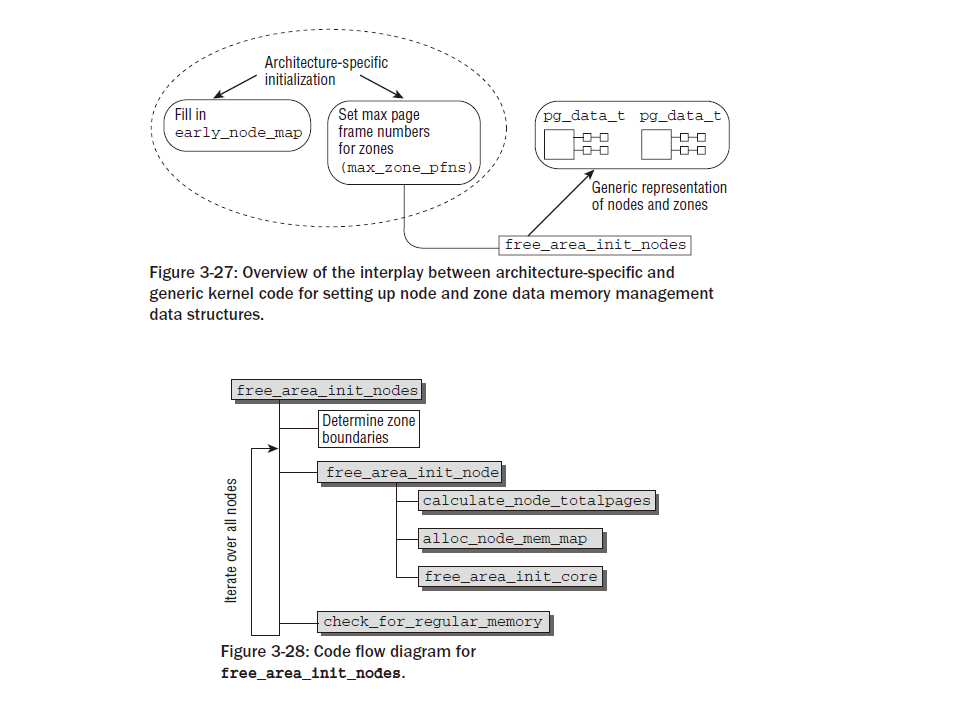

free_area_init_nodes는  먼저  아키텍처별  코드에서  제공하는  정보를  분석하고  다시  작성해야  합니다.
무엇보다도  zone_max_pfn  및  zone_min_pfn  에  지정된  기본  경계와  달리  사용할  수  있는  가장  낮은  페이지  프레임  수와
가장  높은  페이지  프레임  수  를  각  영역에  대해  얻어야  합니다.  정보를  저장하는  데  두  개의  전역  배열이  사용됩니다.
mm/page_alloc.c
static unsigned long __meminitdata arch_zone_lowest_possible_pfn[MAX_NR_ZONES];
static unsigned long __meminitdata arch_zone_highest_possible_pfn[MAX_NR_ZONES]

그러나  우선  free_area_init_nodes는  early_node_map  의  항목을  첫  번째  페이지  프레임을  기준으로  정렬합니다.
start_pfn.

mm/page_alloc.c
void __init free_area_init_nodes(unsigned long *max_zone_pfn)
{
unsigned long nid;
enum zone_type i;
/* Sort early_node_map as initialisation assumes it is sorted */
sort_node_map();
...

항목을  정렬하면  다음  작업이  더  쉬워지지만  특별히  복잡하지는  않으므로  sort_node_map을  추가로  검사할  필요가  없습니다.
커널은  함수에  사용되는  lib/sort.c  의  일반  힙  정렬  구현을  제공한다는  점에  유의하세요.
max_zone_pfn  의  free_area_init_nodes  에  전달된  정보는  각  영역에  포함될  수  있는  최대  페이지  프레임  수를  기록합니다.
free_area_init_nodes는  앞서  언급한  전역  변수의  각  영역에  대해  [low,  high]  형식의  페이지  프레임  간격을  제공하여  이  정보를
보다  편리하게  표현하도록  준비합니다(0바이트로  이러한  변수의  초기화를  생략함).
mm/page_alloc.c
arch_zone_lowest_possible_pfn[0] = find_min_pfn_with_active_regions();
arch_zone_highest_possible_pfn[0] = max_zone_pfn[0];
for (i = 1; i < MAX_NR_ZONES; i++) {
if (i == ZONE_MOVABLE)
continue;
arch_zone_lowest_possible_pfn[i] =
arch_zone_highest_possible_pfn[i-1];
arch_zone_highest_possible_pfn[i] =
max(max_zone_pfn[i], arch_zone_lowest_possible_pfn[i]);
}

보조  함수  find_min_pfn_with_active_regions는  가장  낮은  등록  영역에  대해  등록된  가장  작은  사용
가능한  페이지  프레임을  찾는  데  사용됩니다.
이는  반드시  ZONE_DMA  일  필요는  없지만 ,  예를  들어  머신에  DMA  메모리가  필요하지  않은  경우  ZONE_NORMAL  일  수도  있습니다 .
가장  작은  영역의  최대  페이지  프레임은  max_zone_pfn에서  제공하는  정보에서  직접  가져올  수  있습니다 .

그런  다음  다른  영역에  대한  간격은  간단한  방식으로  구성됩니다.
n번째  영역  에  대한  가장  작은  페이지  프레임  은  이전  (n  􀀁  1)  영역의  가장  큰  페이지  프레임입니다 .
현재  영역의  가장  큰  페이지  프레임은  max_zone_pfn에서  이미  사용  가능합니다.

mm/page_alloc.c
arch_zone_lowest_possible_pfn[ZONE_MOVABLE] = 0;
arch_zone_highest_possible_pfn[ZONE_MOVABLE] = 0;
/* Find the PFNs that ZONE_MOVABLE begins at in each node */
...
find_zone_movable_pfns_for_nodes(zone_movable_pfn);

ZONE_MOVABLE  은  가상  영역이고  실제  하드웨어  영역과  연결되지  않으므로  영역  경계는  항상  0으로  설정됩니다.
커널  명령줄  매개변수  kernelcore  또는  movablecore  중  하나라도  지정된  경우에만  존재한다는  점을  위에서  기억하세요 .
각  노드의  이동  가능  영역은  각  노드의  특정  영역의  특정  페이지  프레임  번호  이상에서  시작됩니다.
해당  숫자는  find_zone_movable_pfns_for_nodes에서  계산됩니다.
결정된  페이지  프레임  간격에  대한  일부  정보가  사용자에게  자랑스럽게  표시됩니다.
예를  들어  여기에는  다음이  포함됩니다(출력은  4GiB  RAM이  있는  AMD64  시스템에서  수행됨).

root@meitner # dmesg
...
Zone PFN ranges:
DMA 0 -> 4096
DMA32 4096 -> 1048576
Normal 1048576 -> 1245184

free_area_init_nodes  의  나머지  부분은  모든  노드를  반복하여  각각에  대한  데이터  구조를  설정합니다.

mm/page_alloc.c
/* Print information about zones */
...
/* Initialise every node */
for_each_online_node(nid) {
pg_data_t *pgdat = NODE_DATA(nid);
free_area_init_node(nid, pgdat, NULL,
find_min_pfn_for_node(nid), NULL);
/* Any memory on that node */
if (pgdat->node_present_pages)
node_set_state(nid, N_HIGH_MEMORY);
check_for_regular_memory(pgdat);
}
}

그러나  우선  free_area_init_nodes는  early_node_map  의  항목을  첫  번째  페이지  프레임을  기준으로  정렬합니다.
start_pfn.

mm/page_alloc.c
void __init free_area_init_nodes(unsigned long *max_zone_pfn)
{
unsigned long nid;
enum zone_type i;
/* Sort early_node_map as initialisation assumes it is sorted */
sort_node_map();
...

항목을  정렬하면  다음  작업이  더  쉬워지지만  특별히  복잡하지는  않으므로  sort_node_map을  추가로  검사할  필요가  없습니다.
커널은  함수에  사용되는  lib/sort.c  의  일반  힙  정렬  구현을  제공한다는  점에  유의하세요.
max_zone_pfn  의  free_area_init_nodes  에  전달된  정보는  각  영역에  포함될  수  있는  최대  페이지  프레임  수를  기록합니다.
free_area_init_nodes는  앞서  언급한  전역  변수의  각  영역에  대해  [low,  high]  형식의  페이지  프레임  간격을  제공하여
이  정보를  보다  편리하게  표현하도록  준비합니다(0바이트로  이러한  변수의  초기화를  생략함).

mm/page_alloc.c
arch_zone_lowest_possible_pfn[0] = find_min_pfn_with_active_regions();
arch_zone_highest_possible_pfn[0] = max_zone_pfn[0];
for (i = 1; i < MAX_NR_ZONES; i++) {
if (i == ZONE_MOVABLE)
continue;
arch_zone_lowest_possible_pfn[i] =
arch_zone_highest_possible_pfn[i-1];
arch_zone_highest_possible_pfn[i] =
max(max_zone_pfn[i], arch_zone_lowest_possible_pfn[i]);
}

보조  함수  find_min_pfn_with_active_regions는  가장  낮은  등록  영역에  대해  등록된  가장  작은  사용  가능한  페이지  프레임을  찾는  데  사용됩니다.  이는  반드시  ZONE_DMA  일  필요는  없지만 ,  예를  들어  머신에  DMA  메모리가  필요하지  않은  경우  ZONE_NORMAL  일  수도  있습니다 .
가장  작은  영역의  최대  페이지  프레임은  max_zone_pfn에서  제공하는  정보에서  직접  가져올  수  있습니다 .

그런  다음  다른  영역에  대한  간격은  간단한  방식으로  구성됩니다.  n번째  영역  에  대한  가장  작은  페이지  프레임  은  이전  (n  􀀁  1)
영역의  가장  큰  페이지  프레임입니다 .
현재  영역의  가장  큰  페이지  프레임은  max_zone_pfn에서  이미  사용  가능합니다.

mm/page_alloc.c
arch_zone_lowest_possible_pfn[ZONE_MOVABLE] = 0;
arch_zone_highest_possible_pfn[ZONE_MOVABLE] = 0;
/* Find the PFNs that ZONE_MOVABLE begins at in each node */
...
find_zone_movable_pfns_for_nodes(zone_movable_pfn);

ZONE_MOVABLE  은  가상  영역이고  실제  하드웨어  영역과  연결되지  않으므로  영역  경계는  항상  0으로  설정됩니다.
커널  명령줄  매개변수  kernelcore  또는  movablecore  중  하나라도  지정된  경우에만  존재한다는  점을  위에서  기억하세요 .
각  노드의  이동  가능  영역은  각  노드의  특정  영역의  특정  페이지  프레임  번호  이상에서  시작됩니다.
해당  숫자는  find_zone_movable_pfns_for_nodes에서  계산됩니다.
결정된  페이지  프레임  간격에  대한  일부  정보가  사용자에게  자랑스럽게  표시됩니다.
예를  들어  여기에는  다음이  포함됩니다(출력은  4GiB  RAM이  있는  AMD64  시스템에서  수행됨).

root@meitner # dmesg
...
Zone PFN ranges:
DMA 0 -> 4096
DMA32 4096 -> 1048576
Normal 1048576 -> 1245184
...

free_area_init_nodes  의  나머지  부분은  모든  노드를  반복하여  각각에  대한  데이터  구조를  설정합니다.

mm/page_alloc.c
/* Print information about zones */
...
/* Initialise every node */
for_each_online_node(nid) {
pg_data_t *pgdat = NODE_DATA(nid);
free_area_init_node(nid, pgdat, NULL,
find_min_pfn_for_node(nid), NULL);
/* Any memory on that node */
if (pgdat->node_present_pages)
node_set_state(nid, N_HIGH_MEMORY);
check_for_regular_memory(pgdat);
}
}

코드는  모든  활성  노드를  반복하고  각  노드에  대한  데이터  구조  설정을  free_area_init_node에  위임합니다.
이  함수에는  사용  가능한  첫  번째  페이지  프레임이  매개변수로  필요하며  find_min_pfn_for_node는  early_node_map  배열
에서  이  정보를  추출합니다 .

Creating and Manipulating Entries
-----------------------------------

3.3 Initialization ofMemoryManagement
=======================================

Data Structure Setup
----------------------

Architecture-Specific Setup
----------------------------

3.4 Memory Management during the Boot Process
================================================

3.5 Management of Physical Memory
================================

Structure of the Buddy System
--------------------------------

Avoiding Fragmentation
---------------------------

Initializing the Zone and Node Data Structures
------------------------------------------------

Allocator API
------------------

Reserving Pages
---------------------

Freeing Pages
--------------------

Allocation of Discontiguous Pages in the Kernel
--------------------------------------------------

Kernel Mappings
---------------------

3.6 The Slab Allocator
=========================

Alternative Allocators
---------------------------

Memory Management in the Kernel
--------------------------------

The Principle of Slab Allocation
---------------------------------

Implementation
------------------------

General Caches
-----------------------

3.7 Processor Cache and TLB Control
==================================

Summary
===========